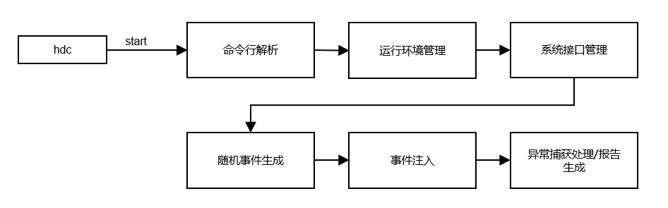

# wukong稳定性工具使用指导

## 功能介绍

wukong是系统自带的一种命令行工具，支持Ability的随机事件注入、控件注入、异常捕获、报告生成和对Ability数据遍历截图等特性。通过模拟用户行为，对系统或应用进行稳定性压力测试。wukong分为随机测试、专项测试和专注测试。

随机测试是指随机测试界面内容，支持的能力包括：shell启动、拉起整机应用、多种注入方式、设置随机种子、打印运行日志和生成报告。

专项测试主要提供对指定应用控件进行测试，支持的能力包括：shell启动、顺序遍历及截图、测试休眠睡醒、录制回放、打印运行日志和生成报告。

专注测试主要提供对指定控件的注入测试，支持的能力包括：shell启动、拉起整机应用、多种注入方式、设置随机种子、设置专注控件类型、设置注入控件次数、打印运行日志和生成报告。

## 实现原理

wukong部件架构图以及部件内子模块职责如下所述。  


- 命令行解析：支持命令行获取参数并解析命令行参数。
- 运行环境管理：根据命令行初始化wukong整体运行环境。
- 系统接口管理：检查并获取指定的mgr，注册controller和dfx的faultlog的回调函数。
- 随机事件生成：通过random函数生成指定种子数的随机序列，生成事件。
- 事件注入：根据支持的事件类型向系统注入事件，依赖窗口、多模、安全等子系统。
- 异常捕获处理/报告生成：通过DFX子系统获取运行中的异常信息并记录log，生成报告。

## 约束与限制

1. wukong测试工具在API 9版本开始预置使用。

2. 在低于API 9版本，不能随版本编译，使用时需自行编译后推送至被检测设备，具体步骤如下。

   ```bash
   // 构建方式
   ./build.sh --product-name rk3568 --build-target wukong

   // 推送方式
   hdc shell mount -o rw,remount /
   hdc file send wukong /
   hdc shell chmod a+x /wukong
   hdc shell mv /wukong /bin/
   ```

3. PC被检测设备连接后，才可执行命令行，支持单个和多个设备。

4. 所有命令行执行前需要先进入shell模式

## 功能特性及命令说明

| 命令           | 说明                                           |
| -------------- | ---------------------------------------------- |
| version | 获取wukong版本信息。                             |
| help    | 获取wukong帮助信息。                             |
| appinfo | 查询支持拉起应用bundleName和对应的mainAbility名。 |
| special | wukong专项测试。                                   |
| exec    | wukong随机测试。                                   |
| focus   | wukong专注测试。                                   |

### 执行命令

- 进入shell模式

  ```bash
  #若为单设备，则直接输入如下命令进入shell模式
  C:\Users>hdc shell
  #

  #若为多设备，则需先获取sn号，先输入hdc list targets获取sn号，然后进入shell模式
  C:\Users>hdc list targets
  15xxx424axxxx345209d94xxxx8fxx900
  C:\Users>hdc -t 15xxx424axxxx345209d94xxxx8fxx900 shell
  #
  ```

- 获取应用的bundle name和ability name

  ```bash
  # wukong appinfo
  BundleName:  com.ohos.adminprovisioning
  AbilityName:  com.ohos.adminprovisioning.MainAbility
  BundleName:  com.ohos.callui
  AbilityName:  com.ohos.callui.MainAbility
  ```
- 执行查看帮助命令

  ```bash
  C:\Users>hdc shell
  # wukong --help        //wukong帮助菜单
  wukong: '--help' is not a valid wukong command. See 'wukong help'.
  usage: wukong <command> [<arguments>]
  These are common wukong command list:
    help                       wukong help information
    -v/--version               wukong version
    exec                       run random test
    special                    run special test
    focus                      run focus test
    appinfo                    show all app information
  # wukong exec -help   //wukong随机测试帮助菜单
  usage: wukong exec [<arguments>]
  These are wukong exec arguments list:
    -h, --help                 random test help
    -a, --appswitch            appswitch event percent
    -b, --bundle               the bundle name of allowlist
    -p, --prohibit             the bundle name of blocklist
    -d, --page                 block page list
    -t, --touch                touch event percent
    -c, --count                test count
    -i, --interval             interval
    -s, --seed                 random seed
    -m, --mouse                mouse event percent
    -k, --keyboard             keyboard event percent
    -H, --hardkey              hardkey event percent
    -S, --swap                 swap event percent
    -T, --time                 test time
    -C, --component            component event percent
    -r, --rotate               rotate event percent
    -e, --allow ability        the ability name of allowlist
    -E, --block ability        the ability name of blocklist
    -Y, --blockCompId          the id list of block component
    -y, --blockCompType        the type list of block component
    -I, --screenshot           get screenshot(only in random input)
    -B, --checkBWScreen        black and white screen detection
    -U, --Uri                  set Uri pages
    -x, --Uri-type             set Uri-type
  # wukong special -help    //wukong专项测试帮助菜单
  usage: wukong special [<arguments>]
  These are wukong special arguments list:
    -h, --help                 special test help
    -t, --touch[x,y]           touch event
    -c, --count                total count of test
    -i, --interval             interval
    -S, --swap[option]         swap event
                                option is -s| -e| -b
                                -s, --start: the start point of swap
                                -e, --end: the end point of swap
                                -b, --bilateral: swap go and back
    -k, --spec_insomnia        power on/off event
    -T, --time                 total time of test
    -C, --component            component event
    -p, --screenshot           get screenshot(only in componment input)
    -r, --record               record user operation
    -R, --replay               replay user operation
    -u, --uitest               uitest dumpLayout
  ```

## 随机测试

### 命令参数

| 命令            | 功能                                 | 必选 | 说明                                     |
| --------------- | ------------------------------------ | ---- | ---------------------------------------- |
| -h,--help       | 获取当前测试的帮助信息。               | 否   |  -                        |
| -c,--count      | 设置执行次数，与测试总时间-T冲突。二者取其一。   | 否   | 单位次数，默认10次。                       |
| -i,--interval   | 设置执行间隔。                         | 否   | 单位ms，默认1500ms。                       |
| -s,--seed       | 设置随机种子。                         | 否   | 配置相同随机种子，会生成相同随机事件序列。 |
| -b,--bundle[bundlename,……,bundlename]     | 设置本次测试的允许应用名单，与-p冲突。 | 否   | 默认测试当前设备所有应用(应用名称用英文逗号隔开)。                 |
| -p,--prohibit[bundlename,……,bundlename]   | 设置本次测试的禁止应用名单，与-b冲突。 | 否   | 默认不禁止任何应用(应用名称用英文逗号隔开)。                       |
| -d,--page[page,……,page]                   | 设置本次测试的禁止页面名单。 | 否  | 系统默认禁止pages/system页面(页面名称用逗号隔开)。 |
| -a,--appswitch  | 设置应用随机拉起测试比例。             | 否   | 默认10%。                                  |
| -t,--touch      | 设置屏幕随机触摸测试比例。            | 否   | 默认10%。                                  |
| -S,--swap       | 设置屏幕随机移动测试比例。             | 否   | 默认3%。                                   |
| -m,--mouse      | 设置屏幕随机鼠标测试比例。            | 否   | 默认1%。                                   |
| -k,--keyboard   | 设置屏幕随机键盘操作测试比例。         | 否   | 默认2%。                                   |
| -H,--hardkey    | 设置随机物理按键测试比例。              | 否   | 默认2%。                                   |
| -r,--rotate     | 设置随机屏幕旋转测试比例。               | 否   | 默认2%。                                   |
| -C, --component | 设置随机控件测试比例。                 | 否   | 默认70%。                                  |
| -I, --screenshot | 控件测试截图。                 | 否   | - |
| -T,--time       | 设置测试总时间，与设置执行次数-c冲突。二者取其一。 | 否   | 单位分钟，默认10分钟。         |
| -e, --allow ability   |  设置允许测试的ability | 否 | - |
| -E, --block ability   |  设置禁止测试的ability | 否 | - |
| -Y, --blockCompId     |  设置不进行注入的CompId | 否 | - |
| -y, --blockCompType   |  设置不进行注入的CompType | 否 | - |
| -B, --checkBWScreen   |  设置启用黑白屏检测 | 否 | - |
| -U, -uri              |  设置应用拉起页面uri | 否 | - |
| -x, -uriType          |  设置应用拉起页面uriType | 否 | - |

### 使用示例

- 设置100次事件注入

  ```bash
  # wukong exec -s 10 -i 1000 -a 0.28 -t 0.72 -c 100
  ```

  命令中各参数含义：
  | 命令           | 参数值      |说明        |
  | -------------- | -------------- | -------------- |
  | wukong exec | -           | 主命令。                |
  | -s     | 10           | 参数设置随机种子，10为种子值。  |
  | -i  | 1000           | 参数设置应用拉起间隔为1000ms。 |
  | -a  | 0.28          | 参数设置应用随机拉起测试比例28%。    |
  | -t  | 0.72           | 参数设置屏幕随机touch测试比例为72%。    |
  | -c  | 100           | 参数设置执行次数为100次。         |

- 指定页面压测

  ```bash
  > 显示启动
  > hdc_std shell
  # wukong exec -b bundlename -a abilityname -U uri

  > 隐式启动
  > hdc_std shell
  # wukong exec -b bundlename -U uri -x uriType
  ```

- 设置允许测试和禁止测试的ability
  ```bash
  # wukong exec -b com.ohos.settings -e com.ohos.settings.MainAbility -E com.ohos.settings.AppInfoAbility
  ```
  >  **说明** 
  >
  > 若配置-e、-E则须配置-b来指定应用。

## 专项测试

### 命令参数

| 命令                | 功能                   | 必选 | 说明                |
| :------------------ | ---------------------- | ---- | :------------------ |
| -h, --help          | 获取当前专项测试的帮助信息。 | 否   |  -    |
| -k, --spec_insomnia | 休眠唤醒专项测试。       | 否   | -                   |
| -c, --count         | 设置执行次数。           | 否   | 单位次数，默认10次。          |
| -i, --interval      | 设置执行间隔。           | 否   | 单位ms，默认1500ms。  |
| -S, --swap          | 滑动测试。               | 否   | -                   |
| -s, --start[x,y]    | 设置滑动测试起点坐标。   | 否   | 坐标均为正值。           |
| -e, --end[x,y]      | 设置滑动测试终点坐标。   | 否   | 坐标均为正值。          |
| -b, --bilateral     | 设置往返滑动。           | 否   | 默认不往返滑动。      |
| -t, --touch[x,y]    | 点击测试。               | 否   | -                   |
| -T, --time          | 设置测试总时间。         | 否   | 单位分钟，默认10分钟。 |
| -C, --component     | 控件顺序遍历测试。       | 否   | 需要设置测试应用名称。 |
| -r, --record     | 录制。       | 否   | 需要指定录制文件。 |
| -R, --replay    |  回放。      | 否   | 需要指定回放文件。 |
| -p, --screenshot    |  控件测试截图。      | 否   | - |

### 测试命令

```bash
# wukong special -C [bundlename] -p
```

## 专注测试

### 命令参数

| 命令            | 功能                                 | 必选 | 说明                                     |
| --------------- | ------------------------------------ | ---- | ---------------------------------------- |
| -n,--numberfocus       | 设置每个控件注入的次数。               | 否   | 单位次数。                 |
| -f, --focustypes       | 设置需要专注的控件类型。               | 否   | 以英文逗号隔开。                         |
| -h,--help       | 获取当前测试的帮助信息。               | 否   |                          |
| -c,--count      | 设置执行次数，与设置执行时间-T冲突。二者取其一。   | 否   | 单位次数，默认10次。                       |
| -i,--interval   | 设置执行间隔。                         | 否   | 单位ms，默认1500ms。                       |
| -s,--seed       | 设置随机种子。                         | 否   | 配置相同随机种子，会生成相同随机事件序列。 |
| -b,--bundle[bundlename,……,bundlename]     | 设置本次测试的允许应用名单，与-p冲突。 | 否   | 默认测试当前设备所有应用(应用名称用英文逗号隔开)。                 |
| -p,--prohibit[bundlename,……,bundlename]   | 设置本次测试的禁止应用名单，与-b冲突。 | 否   | 默认不禁止任何应用(应用名称用英文逗号隔开)。                       |
| -d,--page[page,……,page]                   | 设置本次测试的禁止页面名单。 | 否  | 系统默认禁止pages/system页面(页面名称用逗号隔开)。 |
| -a,--appswitch  | 设置应用随机拉起测试比例。             | 否   | 默认10%。                                  |
| -t,--touch      | 设置屏幕随机触摸测试比例。            | 否   | 默认10%。                                  |
| -S,--swap       | 设置屏幕随机移动测试比例。             | 否   | 默认3%。                                   |
| -m,--mouse      | 设置屏幕随机鼠标测试比例。            | 否   | 默认1%。                                   |
| -k,--keyboard   | 设置屏幕随机键盘操作测试比例。         | 否   | 默认2%。                                   |
| -H,--hardkey    | 设置随机物理按键测试比例。              | 否   | 默认2%。                                   |
| -r,--rotate     | 设置随机屏幕旋转测试比例。               | 否   | 默认2%。                                   |
| -C, --component | 设置随机控件测试比例。                 | 否   | 默认70%。                                  |
| -I, --screenshot | 控件测试截图。                 | 否   | - |
| -T,--time       | 设置测试总时间，与设置执行次数-c冲突。二者取其一。 | 否   | 单位分钟，默认10分钟。         |
| -e, --allow ability   |  设置允许测试的ability | 否 | - |
| -E, --block ability   |  设置禁止测试的ability | 否 | - |
| -Y, --blockCompId     |  设置不进行注入的CompId | 否 | - |
| -y, --blockCompType   |  设置不进行注入的CompType | 否 | - |
| -B, --checkBWScreen   |  设置启用黑白屏检测 | 否 | - |

### 使用示例

```bash
# wukong focus -s 10 -i 1000 -a 0.28 -t 0.72 -c 100
```

命令中各参数含义：
| 命令           | 参数值      |说明        |
| -------------- | -------------- | -------------- |
| wukong focus | -           | 主命令。                |
| -s     | 10           | 参数设置随机种子，10为种子值。  |
| -i  | 1000           | 参数设置应用拉起间隔为1000ms。 |
| -a  | 0.28          | 参数设置应用随机拉起测试比例28%。    |
| -t  | 0.72           | 参数设置屏幕随机touch测试比例为72%。    |
| -c  | 100           | 参数设置执行次数为100次。         |


## 查看测试结果

### 测试结果输出路径

执行完测试指令后，会自动生成测试结果，测试结果输出根路径如下：

- 2022/9/22之前的IDE版本，结果存放路径为：/data/local/wukong/report/xxxxxxxx_xxxxxx/
- 2022/9/22之后的IDE版本，结果存放路径为：/data/local/tmp/wukong/report/xxxxxxxx_xxxxxx/

### 测试报告文件目录

| 类型                                 | 描述               |
| ------------------------------------ | ------------------ |
| exception/                           | 存放本次测试产生的异常文件。 |
| screenshot/                          | 存放测试遍历的截图。  |
| wukong_report.csv                    | 测试报告统计汇总。       |
| wukong.log                | 测试操作历程。       |

### 查看操作日志

wukong支持通过hdc命令将日志获取到本地，查看操作历程。

```bash
// wukong.log文件对应路径如下
/data/local/tmp/wukong/report/xxxxxxxx_xxxxxx/wukong.log

// 查看wukong测试报告文件目录操作如下
# cd /data/local/tmp/wukong/report/20170805_170053
# ls
data.js  exception  wukong.log  wukong_report.csv

// 开启shell窗口，用hdc file recv获取wukong日志
C:\Users\xxx>hdc file recv /data/local/tmp/wukong/report/20170805_170053/wukong.log C:\Users\xxx\Desktop\log
[I][2024-01-03 20:08:02] HdcFile::TransferSummary success
FileTransfer finish, Size:76492, File count = 1, time:16ms rate:4780.75kB/s
```