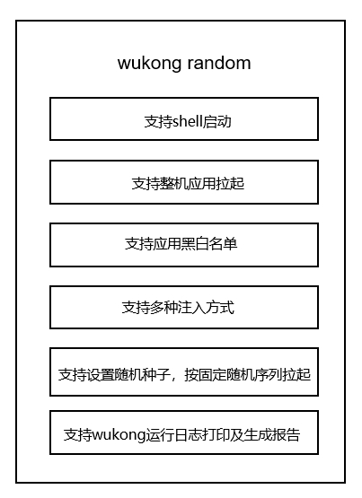
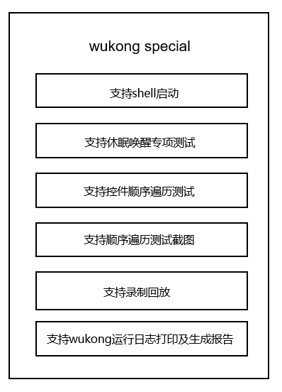

# wukong稳定性工具使用指导


## 概述

为支撑OpenHarmony操作系统或者单应用稳定性、健壮性的测试，我们向用户提供了符合功能需求并且可靠、易用的稳定性测试工具。支持开发者针对应用进行相应的稳定性测试。

本指南重点介绍wukong稳定性工具的主要功能，同时介绍wukong命令行的使用方法。

## 简介

OpenHarmony稳定性测试工具wukong，作为OpenHarmony工具集的重要组成部分，实现了Ability的随机事件注入、控件注入、异常捕获、报告生成以及对Ability的数据遍历截图等应用稳定性测试基础能力。

## 实现原理

工具主要分为两大部分：随机测试和专项测试。

- 随机测试

  随机测试是wukong稳定性工具的主要部分，提供了最基本的启动、运行及结果汇总的能力。主要功能如下图所示：

  

  随机测试的基础运行流程如下图所示，依赖hdc命令

  

- 专项测试

  专项测试主要提供了对指定应用的控件顺序遍历以及录制回放、休眠睡醒等测试能力。

  专项测试的主要功能如下图所示：

  

随机测试、专项测试相关命令可具体参考[对应使用说明。](https://gitee.com/openharmony/ostest_wukong/blob/master/README_zh.md)

## 约束与限制

1. wukong在3.2系统版本后开始预置使用。

2. wukong在3.2系统版本之前的版本不随版本编译，使用时需自行编译后推送至被测OpenHarmony设备，步骤如下：        
    构建方式
    ```
    ./build.sh --product-name rk3568 --build-target wukong
    ```
    推送方式
    ```
    hdc_std shell mount -o rw,remount /
    hdc_std file send wukong /
    hdc_std shell chmod a+x /wukong
    hdc_std shell mv /wukong /bin/
    ```

## 环境准备

命令行执行需要PC连接OpenHarmony设备，如RK3568开发板等。

## 执行稳定性测试

**wukong exec 随机测试使用示例**

进入shell，执行随机测试命令：
```
# wukong exec -s 10 -i 1000 -a 0.28 -t 0.72 -c 100
```
随机测试示例解析：
| 命令           | 参数值           | 说明                                           |
| -------------- | -------------- | ---------------------------------------------- |
| wukong exec | -           | 主命令。                             |
| -s     | 10           | 参数设置随机种子，10为种子值。            |
| -i  | 1000           | 参数设置应用拉起间隔为1000ms。 |
| -a  | 0.28          | 参数设置应用随机拉起测试比例28%。          |
| -t  | 0.72           | 参数设置屏幕随机touch测试比例为72%。    |
| -c  | 100           | 参数设置执行次数为100次。                |

**wukong special 专项测试使用示例**

进入shell，执行专项顺序遍历测试命令：
```bash
# wukong special -C [bundlename] -p
```
专项测试示例解析：
| 命令           | 参数值           | 说明                                           |
| -------------- |-------------- | ---------------------------------------------- |
| wukong special | -  | 主命令。                             |
| -C [bundlename]    |[bundlename] | 控件顺序遍历测试参数设置，bundlename为测试应用名称。            |
| -p | -  | 表示截图。                             |

## 查看测试结果

当执行完测试指令，会自动生成测试结果。

**测试结果输出根路径如下：**
```
2022/9/22之前的版本报告存放路径：/data/local/wukong/report/xxxxxxxx_xxxxxx/
2022/9/22之后的版本报告存放路径：/data/local/tmp/wukong/report/xxxxxxxx_xxxxxx/
```
>**说明：** 测试报告文件目录将自动生成。

该目录中包含以下几类结果：
| 类型                                 | 描述               |
| ------------------------------------ | ------------------ |
| exception/                           | 存放本次测试产生的异常文件 |
| screenshot/                          | 存放专项测试顺序遍历的截图  |
| wukong_report.csv                    | 测试报告统计汇总       |

**wukong执行日志**
```
reports/xxxxxxxx_xxxxxx/wukong.log
```