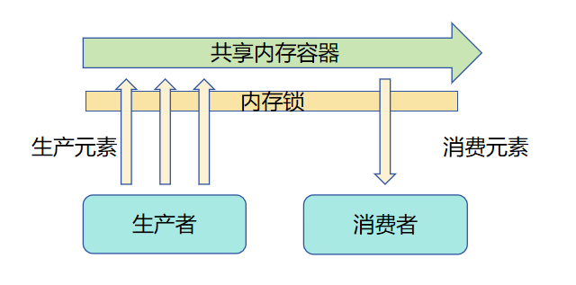
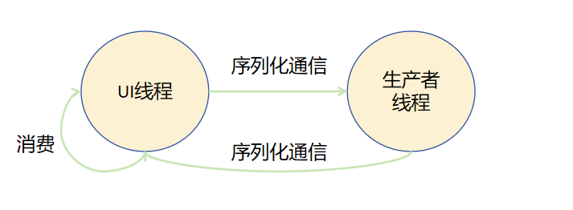

# Actor并发模型对比内存共享并发模型

内存共享并发模型指多线程同时执行复数任务，这些线程依赖同一内存并且都有权限访问，线程访问内存前需要抢占并锁定内存的使用权，没有抢占到内存的线程需要等待其他线程释放使用权再执行。

Actor并发模型每一个线程都是一个独立Actor，每个Actor有自己独立的内存，Actor之间通过消息传递机制触发对方Actor的行为，不同Actor之间不能直接访问对方的内存空间。

Actor并发模型对比内存共享并发模型的优势在于不同线程间内存隔离，不会产生不同线程竞争同一内存资源的问题。开发者不需要考虑对内存上锁导致的一系列功能、性能问题，提升了开发效率。

由于Actor并发模型线程之间不共享内存，需要通过线程间通信机制传输并发任务和任务结果。

本文以经典的生产者消费者问题为例，对比呈现这两种模型在解决具体问题时的差异。

## 内存共享模型
以下示例伪代码和示意图展示了如何使用内存共享模型解决生产者消费者问题。



为了避免不同生产者或消费者同时访问一块共享内存的容器时产生的脏读，脏写现象，同一时间只能有一个生产者或消费者访问该容器，也就是不同生产者和消费者争夺使用容器的锁。当一个角色获取锁之后其他角色需要等待该角色释放锁之后才能重新尝试获取锁以访问该容器。

```
// 此段示例为伪代码仅作为逻辑示意，便于开发者理解使用内存共享模型和Actor模型的区别
BufferQueue {
    Queue queue
    Mutex mutex
    add(value) {
        // 尝试获取锁
        if (mutex.lock()) {
            queue.push(value)
            mutex.unlock()
        }
    }

    take() {
        // 尝试获取锁
        if (mutex.lock()) {
            if (queue.empty()) {
                return null
            }
            let res = queue.pop(value)
            mutex.unlock()
            return res
        }
    }
}

// 构造一段全局共享的内存
let g_bufferQueue = new BufferQueue()

Producer {
    run() {
        let value = random()
        // 跨线程访问bufferQueue对象
        g_bufferQueue.add(value)
    }
}

Consumer {
    run() {
        // 跨线程访问bufferQueue对象
        let res = g_bufferQueue.take()
        if (res != null) {
            // 添加消费逻辑
        }
    }
}

Main() {
    let consumer = new Consumer()
    let producer = new Producer()
    // 多线程执行生产任务
    for 0 in 10 :
        let thread = new Thread()
        thread.run(producer.run())
        consumer.run()
}
```

## Actor模型
以下示例简单展示了如何使用基于Actor模型的TaskPool并发能力来解决生产者消费者问题。



Actor模型不同角色之间并不共享内存，生产者线程和UI线程都有自己独占的内存。生产者生产出结果后通过序列化通信将结果发送给UI线程，UI线程消费结果后再发送新的生产任务给生产者线程。

```ts
import { taskpool } from '@kit.ArkTS';
// 跨线程并发任务
@Concurrent
async function produce(): Promise<number>{
  // 添加生产相关逻辑
  console.log("producing...");
  return Math.random();
}

class Consumer {
  public consume(value : Object) {
    // 添加消费相关逻辑
    console.log("consuming value: " + value);
  }
}

@Entry
@Component
struct Index {
  @State message: string = 'Hello World'

  build() {
    Row() {
      Column() {
        Text(this.message)
          .fontSize(50)
          .fontWeight(FontWeight.Bold)
        Button() {
          Text("start")
        }.onClick(() => {
          let produceTask: taskpool.Task = new taskpool.Task(produce);
          let consumer: Consumer = new Consumer();
          for (let index: number = 0; index < 10; index++) {
            // 执行生产异步并发任务
            taskpool.execute(produceTask).then((res : Object) => {
              consumer.consume(res);
            }).catch((e : Error) => {
              console.error(e.message);
            })
          }
        })
        .width('20%')
        .height('20%')
      }
      .width('100%')
    }
    .height('100%')
  }
}
```
