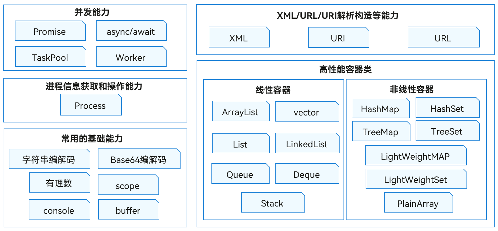

# ArkTS简介

ArkTS是OpenHarmony优选的应用高级开发语言。ArkTS提供了声明式UI范式、状态管理支持等相应的能力，让开发者可以以更简洁、更自然的方式开发应用。

同时，它在保持TypeScript基本语法风格的基础上，进一步通过规范强化静态检查和分析，使得在程序运行之前的开发期能检测更多错误，提升代码健壮性，并实现更好的运行性能。详见[初识ArkTS语言](../quick-start/arkts-get-started.md)。

ArkTS提供了标准内置对象，例如`Array`、`Map`、`TypedArray`、`Math`等，供开发者直接使用。另外，ArkTS也提供了语言基础类库，为应用开发者提供常用的基础能力，主要包含能力如下图所示。

**图1** ArkTS语言基础类库能力示意图  

- 提供[异步并发和多线程并发](concurrency-overview.md)的能力。
  - 支持Promise和async/await等标准的JS异步并发能力。
  - TaskPool为应用程序提供一个多线程的运行环境，降低整体资源的消耗、提高系统的整体性能，开发者无需关心线程实例的生命周期。
  - Worker支持多线程并发，支持Worker线程和宿主线程之间进行通信，开发者需要主动创建和关闭Worker线程。

- 提供常见的[容器类库增、删、改、查](container-overview.md)的能力。

- 提供XML、URL、URI构造和解析的能力。
  - XML被设计用来传输和存储数据，是一种可扩展标记语言。语言基础类库提供了[XML生成、解析与转换](xml-overview.md)的能力。
  - URL、URI构造和解析能力：其中[URI](../reference/apis-arkts/js-apis-uri.md)是统一资源标识符，可以唯一标识一个资源。[URL](../reference/apis-arkts/js-apis-url.md)为统一资源定位符，可以提供找到该资源的路径。

- 提供常见的[字符串和二进制数据处理](../reference/apis-arkts/js-apis-util.md)的能力，以及[控制台打印](../reference/common/js-apis-logs.md)的相关能力。
  - 字符串编解码功能。
  - 基于Base64的字节编码和解码功能。
  - 提供常见的有理数操作支持，包括有理数的比较、获取分子分母等功能。
  - 提供Scope接口用于描述一个字段的有效范围。
  - 提供二进制数据处理的能力，常见于TCP流或文件系统操作等场景中用于处理二进制数据流。
  - Console提供控制台打印的能力。

- 提供[获取进程信息和操作进程](../reference/apis-arkts/js-apis-process.md)的能力。

## 相关实例

针对语言基础类库的开发，有以下相关实例可供参考：

- [语言基础类库（ArkTS）(API10)](https://gitee.com/openharmony/applications_app_samples/tree/master/code/LaunguageBaseClassLibrary/LanguageBaseClassLibrary)
