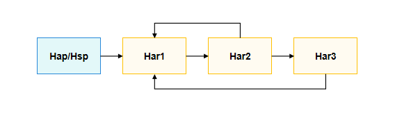
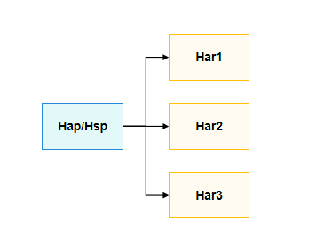

# 动态加载

<!--Kit: ArkTS-->
<!--Subsystem: ArkCompiler-->
<!--Owner: @jokerxd-liu; @zmw1-->
<!--Designer: @huyunhui1; @zmw1-->
<!--Tester: @kirl75; @zsw_zhushiwei-->
<!--Adviser: @k1ngqaquuu-->

动态import支持条件延迟加载，支持部分反射功能，可以提升页面的加载速度；动态import支持加载HSP模块/HAR模块/ohpm包/Native库等，并且HAR模块之间可通过变量动态import来访问彼此导出的内容，可避免编译期强依赖，实现模块解耦。

## 技术适用场景介绍
应用开发的有些场景中，如果希望根据条件导入模块或者按需导入模块，可以使用动态import代替[静态import](../quick-start/introduction-to-arkts.md#导入)。下面是可能会需要动态import的场景：

* 当静态import的模块明显降低了代码的加载速度且很少被使用，或者并不需要马上使用它。
* 当静态import的模块明显占用了大量的系统内存且很少被使用。
* 当被导入的模块，在加载时并不存在，需要异步获取。
* 当需要动态构建模块说明符时，应使用动态import。静态import仅支持静态说明符。
* 当导入的模块存在副作用（即模块中包含直接运行的代码），这些副作用仅在满足特定条件时才需要。

## 业务扩展场景介绍
动态import在业务上除了能实现条件延迟加载，还可以实现部分反射功能。实例如下，HAP动态import HAR包harlibrary，并调用类Calc的静态成员函数staticAdd()、成员函数instanceAdd()，以及全局方法addHarLibrary()。

<!-- @[dynamic_call_add](https://gitcode.com/openharmony/applications_app_samples/blob/master/code/DocsSample/ArkTS/ArkTSRuntime/ArkTSModule/DynamicImport/harlibrary/src/main/ets/utils/Calc.ets) -->

``` TypeScript
// harlibrary's src/main/ets/utils/Calc.ets
export class Calc {
  public static staticAdd(a: number, b: number): number {
    let c = a + b;
    console.info('DynamicImport I am harlibrary in staticAdd, %d + %d = %d', a, b, c);
    return c;
  }

  public instanceAdd(a: number, b: number): number {
    let c = a + b;
    console.info('DynamicImport I am harlibrary in instanceAdd, %d + %d = %d', a, b, c);
    return c;
  }
}

export function addHarLibrary(a: number, b: number): number {
  let c = a + b;
  console.info('DynamicImport I am harlibrary in addHarLibrary, %d + %d = %d', a, b, c);
  return c;
}
```

<!-- @[module_members_export](https://gitcode.com/openharmony/applications_app_samples/blob/master/code/DocsSample/ArkTS/ArkTSRuntime/ArkTSModule/DynamicImport/harlibrary/Index.ets) -->

``` TypeScript
// harlibrary's Index.ets
export { Calc, addHarLibrary } from './src/main/ets/utils/Calc'
```

<!-- @[dynamic_call_add_dependencies](https://gitcode.com/openharmony/applications_app_samples/blob/master/code/DocsSample/ArkTS/ArkTSRuntime/ArkTSModule/DynamicImport/entry/oh-package.json5) -->

``` JSON5
// HAP's oh-package.json5
"dependencies": {
  "harlibrary": "file:../harlibrary",
  // ...
}
```

<!-- @[dynamic_load_har_module_reflect_call](https://gitcode.com/openharmony/applications_app_samples/blob/master/code/DocsSample/ArkTS/ArkTSRuntime/ArkTSModule/DynamicImport/entry/src/main/ets/pages/Index.ets) -->

``` TypeScript
// HAP's src/main/ets/pages/Index.ets
import('harlibrary').then((ns: ESObject) => {
  ns.Calc.staticAdd(8, 9); // 调用静态成员函数staticAdd()
  let calc: ESObject = new ns.Calc(); // 实例化类Calc
  calc.instanceAdd(10, 11); // 调用成员函数instanceAdd()
  ns.addHarLibrary(6, 7); // 调用全局方法addHarLibrary()

  // 使用类、成员函数和方法的字符串名字进行反射调用
  let className = 'Calc';
  let methodName = 'instanceAdd';
  let staticMethod = 'staticAdd';
  let functionName = 'addHarLibrary';
  ns[className][staticMethod](12, 13); // 调用静态成员函数staticAdd()
  let calc1: ESObject = new ns[className](); // 实例化类Calc
  calc1[methodName](14, 15); // 调用成员函数instanceAdd()
  ns[functionName](16, 17); // 调用全局方法addHarLibrary()
})
```

## 动态import实现方案介绍

动态import根据入参是常量或变量，分为动态import常量表达式和动态import变量表达式两大特性规格。

以下是动态import支持的规格列表：

| 动态import场景 | 动态import详细分类             | 说明                                                     |
| :------------- | :----------------------------- | :------------------------------------------------------- |
| 本地工程模块   | 动态import模块内文件路径       | 要求路径以./或../开头。                                    |
| 本地工程模块   | 动态import HSP模块名           | -                                                        |
| 本地工程模块   | 动态import HSP模块文件路径     | -                                                        |
| 本地工程模块   | 动态import HAR模块名           | -                                                        |
| 本地工程模块   | 动态import HAR模块文件路径     | -                                                        |
| 远程包         | 动态import远程HAR模块名        | -                                                        |
| 远程包         | 动态import ohpm包名            | -                                                        |
| API            | 动态import @system.*           | -                                                        |
| API            | 动态import @ohos.*             | -                                                        |
| API            | 动态import @arkui-x.*          | -                                                        |
| 模块Native库   | 动态import libNativeLibrary.so | -                                                        |

>**说明：**
> 
> 1.当前所有import中使用的模块名都是依赖方oh-package.json5文件中dependencies项的别名。</br>
> 2.本地模块在依赖方的dependencies中配置的别名建议与moduleName以及packageName三者一致。moduleName指的是被依赖的HSP/HAR的module.json5中配置的名字，packageName指的是被依赖的HSP/HAR的oh-package.json5中配置的名字。</br>
> 3.import一个模块名，实际的行为是import该模块的入口文件，一般为Index.ets/ts。

## 动态import实现中的关键点

### 动态import常量表达式

动态import常量表达式是指动态import的入参为常量的场景。下面以HAP引用其他模块的API的示例来说明典型用法。

本文示例代码中的路径，如Index.ets，是根据当前DevEco Studio的模块配置设置的。如果后续有变化，请调整文件的位置和相对路径。

- **HAP常量动态import HAR模块名**
<!-- @[const_dynamic_import_har](https://gitcode.com/openharmony/applications_app_samples/blob/master/code/DocsSample/ArkTS/ArkTSRuntime/ArkTSModule/DynamicImport/myHar/Index.ets) -->

``` TypeScript
// HAR's Index.ets
export function add(a: number, b: number): number {
  let c = a + b;
  console.info('DynamicImport I am a HAR, %d + %d = %d', a, b, c);
  return c;
}
```

<!-- @[const_dynamic_import_har_name](https://gitcode.com/openharmony/applications_app_samples/blob/master/code/DocsSample/ArkTS/ArkTSRuntime/ArkTSModule/DynamicImport/entry/src/main/ets/pages/Index.ets) -->

``` TypeScript
// HAP's src/main/ets/pages/Index.ets
import('myhar').then((ns: ESObject) => {
  console.info('DynamicImport ns.add(3, 5) = %d', ns.add(3, 5));
})
```

<!-- @[await_for_dynamic_import](https://gitcode.com/openharmony/applications_app_samples/blob/master/code/DocsSample/ArkTS/ArkTSRuntime/ArkTSModule/DynamicImport/entry/src/main/ets/pages/Index.ets) -->

``` TypeScript
// 可使用 await 处理动态import (必须在 async 函数内使用)
async function asyncDynamicImport() {
  let ns = await import('myhar');
  console.info('DynamicImport ns.add(3, 5) = %d', ns.add(3, 5));
}
```

<!-- @[const_dynamic_import_har_dependencies](https://gitcode.com/openharmony/applications_app_samples/blob/master/code/DocsSample/ArkTS/ArkTSRuntime/ArkTSModule/DynamicImport/entry/oh-package.json5) -->

``` JSON5
// HAP's oh-package.json5
"dependencies": {
  // ...
  "myhar": "file:../myHar",
  // ...
}
```

- **HAP常量动态import HAR模块文件路径**
<!-- @[const_dynamic_import_har](https://gitcode.com/openharmony/applications_app_samples/blob/master/code/DocsSample/ArkTS/ArkTSRuntime/ArkTSModule/DynamicImport/myHar/Index.ets) -->

``` TypeScript
// HAR's Index.ets
export function add(a: number, b: number): number {
  let c = a + b;
  console.info('DynamicImport I am a HAR, %d + %d = %d', a, b, c);
  return c;
}
```

<!-- @[const_dynamic_import_har_path](https://gitcode.com/openharmony/applications_app_samples/blob/master/code/DocsSample/ArkTS/ArkTSRuntime/ArkTSModule/DynamicImport/entry/src/main/ets/pages/Index.ets) -->

``` TypeScript
// HAP's src/main/ets/pages/Index.ets
import('myhar/Index').then((ns: ESObject) => {
  console.info('DynamicImport ns.add(3, 5) = %d', ns.add(3, 5));
});
```

<!-- @[const_dynamic_import_har_dependencies](https://gitcode.com/openharmony/applications_app_samples/blob/master/code/DocsSample/ArkTS/ArkTSRuntime/ArkTSModule/DynamicImport/entry/oh-package.json5) -->

``` JSON5
// HAP's oh-package.json5
"dependencies": {
  // ...
  "myhar": "file:../myHar",
  // ...
}
```

- **HAP常量动态import HSP模块名**
<!-- @[const_dynamic_import_hsp](https://gitcode.com/openharmony/applications_app_samples/blob/master/code/DocsSample/ArkTS/ArkTSRuntime/ArkTSModule/DynamicImport/myHsp/Index.ets) -->

``` TypeScript
// HSP's Index.ets
export function add(a: number, b: number): number {
  let c = a + b;
  console.info('DynamicImport I am a HSP, %d + %d = %d', a, b, c);
  return c;
}
```

<!-- @[const_dynamic_import_hsp_name](https://gitcode.com/openharmony/applications_app_samples/blob/master/code/DocsSample/ArkTS/ArkTSRuntime/ArkTSModule/DynamicImport/entry/src/main/ets/pages/Index.ets) -->

``` TypeScript
// HAP's src/main/ets/pages/Index.ets
import('myhsp').then((ns: ESObject) => {
  console.info('DynamicImport ns.add(3, 5) = %d', ns.add(3, 5));
});
```

<!-- @[const_dynamic_import_hsp_dependencies](https://gitcode.com/openharmony/applications_app_samples/blob/master/code/DocsSample/ArkTS/ArkTSRuntime/ArkTSModule/DynamicImport/entry/oh-package.json5) -->

``` JSON5
// HAP's oh-package.json5
"dependencies": {
  // ...
  "myhsp": "file:../myHsp",
  // ...
}
```

- **HAP常量动态import HSP模块名文件路径**
<!-- @[const_dynamic_import_hsp](https://gitcode.com/openharmony/applications_app_samples/blob/master/code/DocsSample/ArkTS/ArkTSRuntime/ArkTSModule/DynamicImport/myHsp/Index.ets) -->

``` TypeScript
// HSP's Index.ets
export function add(a: number, b: number): number {
  let c = a + b;
  console.info('DynamicImport I am a HSP, %d + %d = %d', a, b, c);
  return c;
}
```

<!-- @[const_dynamic_import_hsp_path](https://gitcode.com/openharmony/applications_app_samples/blob/master/code/DocsSample/ArkTS/ArkTSRuntime/ArkTSModule/DynamicImport/entry/src/main/ets/pages/Index.ets) -->

``` TypeScript
// HAP's src/main/ets/pages/Index.ets
import('myhsp/Index').then((ns: ESObject) => {
  console.info('DynamicImport ns.add(3, 5) = %d', ns.add(3, 5));
});
```

<!-- @[const_dynamic_import_hsp_dependencies](https://gitcode.com/openharmony/applications_app_samples/blob/master/code/DocsSample/ArkTS/ArkTSRuntime/ArkTSModule/DynamicImport/entry/oh-package.json5) -->

``` JSON5
// HAP's oh-package.json5
"dependencies": {
  // ...
  "myhsp": "file:../myHsp",
  // ...
}
```

- **HAP常量动态import远程HAR模块名**
<!-- @[const_dynamic_import_crypto](https://gitcode.com/openharmony/applications_app_samples/blob/master/code/DocsSample/ArkTS/ArkTSRuntime/ArkTSModule/DynamicImport/entry/src/main/ets/pages/Index.ets) -->

``` TypeScript
// HAP's src/main/ets/pages/Index.ets
import('@ohos/crypto-js').then((ns: ESObject) => {
  console.info('DynamicImport @ohos/crypto-js: ' + ns.CryptoJS.src);
});
```

<!-- @[const_dynamic_import_crypto_dependencies](https://gitcode.com/openharmony/applications_app_samples/blob/master/code/DocsSample/ArkTS/ArkTSRuntime/ArkTSModule/DynamicImport/entry/oh-package.json5) -->

``` JSON5
// HAP's oh-package.json5
"dependencies": {
  // ...
  "@ohos/crypto-js": "2.0.3-rc.0",
  // ...
}
```

- **HAP常量动态import ohpm包**
<!-- @[const_dynamic_import_ohpm](https://gitcode.com/openharmony/applications_app_samples/blob/master/code/DocsSample/ArkTS/ArkTSRuntime/ArkTSModule/DynamicImport/entry/src/main/ets/pages/Index.ets) -->

``` TypeScript
// HAP's src/main/ets/pages/Index.ets
import('@ohos/hypium').then((ns: ESObject) => {
  console.info('DynamicImport @ohos/hypium: ', ns.TestType.FUNCTION.toString());
});
```

<!-- @[const_dynamic_import_ohpm_dependencies](https://gitcode.com/openharmony/applications_app_samples/blob/master/code/DocsSample/ArkTS/ArkTSRuntime/ArkTSModule/DynamicImport/entry/oh-package.json5) -->

``` JSON5
// HAP's oh-package.json5
"dependencies": {
  // ...
  "@ohos/hypium": "1.0.19",
  // ...
}
```

- **HAP常量动态import自己的单文件**
<!-- @[hap_const_dynamic_import_add](https://gitcode.com/openharmony/applications_app_samples/blob/master/code/DocsSample/ArkTS/ArkTSRuntime/ArkTSModule/DynamicImport/entry/src/main/ets/Calc.ets) -->

``` TypeScript
// HAP's src/main/ets/Calc.ets
export function add(a: number, b: number): number {
  let c = a + b;
  console.info('DynamicImport I am a HAP, %d + %d = %d', a, b, c);
  return c;
}
```

<!-- @[hap_const_dynamic_import](https://gitcode.com/openharmony/applications_app_samples/blob/master/code/DocsSample/ArkTS/ArkTSRuntime/ArkTSModule/DynamicImport/entry/src/main/ets/pages/Index.ets) -->

``` TypeScript
// HAP's src/main/ets/pages/Index.ets
import('../Calc').then((ns: ESObject) => {
  console.info('DynamicImport ns.add(3, 5) = %d', ns.add(3, 5));
})
```

- **HAP常量动态import自己的Native库**

<!-- @[hap_const_dynamic_import_native](https://gitcode.com/openharmony/applications_app_samples/blob/master/code/DocsSample/ArkTS/ArkTSRuntime/ArkTSModule/DynamicImport/entry/src/main/cpp/types/libentry/index.d.ts) -->

``` TypeScript
// libentry.so's index.d.ts
export const add: (a: number, b: number) => number;
```

<!-- @[hap_const_dynamic_import_native_index](https://gitcode.com/openharmony/applications_app_samples/blob/master/code/DocsSample/ArkTS/ArkTSRuntime/ArkTSModule/DynamicImport/entry/src/main/ets/pages/Index.ets) -->

``` TypeScript
// HAP's src/main/ets/pages/Index.ets
import('libentry.so').then((ns: ESObject) => {
  console.info('DynamicImport libentry.so: ' + ns.default.add(2, 3));
});
```

<!-- @[hap_const_dynamic_import_native_dependencies](https://gitcode.com/openharmony/applications_app_samples/blob/master/code/DocsSample/ArkTS/ArkTSRuntime/ArkTSModule/DynamicImport/entry/oh-package.json5) -->

``` JSON5
// HAP's oh-package.json5
"dependencies": {
  // ...
  "libentry.so": "file:./src/main/cpp/types/libentry",
  // ...
}
```

- **HAP常量动态import加载API**

<!-- @[hap_const_dynamic_import_api](https://gitcode.com/openharmony/applications_app_samples/blob/master/code/DocsSample/ArkTS/ArkTSRuntime/ArkTSModule/DynamicImport/entry/src/main/ets/pages/Index.ets) -->

``` TypeScript
// HAP's src/main/ets/pages/Index.ets
import('@system.app').then((ns: ESObject) => {
  ns.default.getInfo();
});
// ...
import('@ohos.curves').then((ns: ESObject) => {
  ns.default.springMotion(0.555, 0.75, 0.001).interpolate(1);
});
// ...
import('@ohos.matrix4').then((ns: ESObject) => {
  ns.default.identity().transformPoint([1, 2])[0];
});
// ...
import('@ohos.hilog').then((ns: ESObject) => {
  ns.default.info(0x0000, 'testTag', '%{public}s', 'DynamicImport @ohos.hilog.');
  hilog.info(0x000, 'testTag', '%{public}s', ns.default.LogLevel.DEBUG);
});
```

### 动态import变量表达式

DevEco Studio中模块间的依赖关系通过oh-package.json5中的dependencies字段进行配置。dependencies列表中所有的模块默认都会进行安装（本地模块）或下载（远程模块），但是不会默认参与编译。HAP/HSP编译时会以入口文件（一般为Index.ets/Index.ts）开始搜索依赖关系，搜索到的模块或文件才会加入编译。

在编译期，静态import和常量动态import可以被打包工具rollup及其插件识别解析，加入依赖树中，参与编译流程，最终生成方舟字节码。但是，如果是变量动态import，该变量值可能需要进行运算或外部传入才能得到，在编译态无法解析其内容，也就无法加入编译。为了将这部分模块/文件加入编译，还需要额外增加一个runtimeOnly的buildOption配置，用于指定动态import的变量实际的模块名或文件路径。

**1. runtimeOnly字段schema配置格式**

在HAP/HSP/HAR的build-profile.json5中的buildOption中增加runtimeOnly配置项，仅在通过变量动态import时配置，静态import和常量动态import无需配置；并且，通过变量动态import加载API时也无需配置runtimeOnly。如下实例说明如何配置通过变量动态import其他模块，以及变量动态import本模块自己的单文件：

<!-- @[variable_dynamic_import](https://gitcode.com/openharmony/applications_app_samples/blob/master/code/DocsSample/ArkTS/ArkTSRuntime/ArkTSModule/DynamicImport/entry/src/main/ets/pages/Index.ets) -->

``` TypeScript
// HAP's src/main/ets/pages/Index.ets
// 变量动态import其他模块myHar
let harName = 'myhar';
import(harName).then((ns: ESObject) => {
  console.info('DynamicImport ns.add(3, 5) = %d', ns.add(3, 5));
});
// ...

// 变量动态import本模块自己的单文件
let filePath = '../utils/Calc';
import(filePath).then((ns: ESObject) => {
  console.info('DynamicImport ns.add(3, 5) = %d', ns.add(3, 5));
});
```

对应的runtimeOnly配置：

```json
"buildOption": {
  "arkOptions": {
    "runtimeOnly": {
      "packages": [ "myhar" ],
      "sources": [ "./src/main/ets/utils/Calc.ets" ]
    }
  }
}
```

"runtimeOnly"的"packages"：用于配置本模块变量动态import其他模块名，要求与dependencies中配置的名字一致。

"runtimeOnly"的"sources"：用于配置本模块变量动态import自己的文件路径，路径相对于当前build-profile.json5文件。

**2. 使用实例**

- **HAP变量动态import HAR模块名**

<!-- @[const_dynamic_import_har](https://gitcode.com/openharmony/applications_app_samples/blob/master/code/DocsSample/ArkTS/ArkTSRuntime/ArkTSModule/DynamicImport/myHar/Index.ets) -->

``` TypeScript
// HAR's Index.ets
export function add(a: number, b: number): number {
  let c = a + b;
  console.info('DynamicImport I am a HAR, %d + %d = %d', a, b, c);
  return c;
}
```

<!-- @[hap_variable_dynamic_import_har](https://gitcode.com/openharmony/applications_app_samples/blob/master/code/DocsSample/ArkTS/ArkTSRuntime/ArkTSModule/DynamicImport/entry/src/main/ets/pages/Index.ets) -->

``` TypeScript
// HAP's src/main/ets/pages/Index.ets
let harPackageName = 'myhar';
import(harPackageName).then((ns: ESObject) => {
  console.info('DynamicImport ns.add(3, 5) = %d', ns.add(3, 5));
});
```

<!-- @[const_dynamic_import_har_dependencies](https://gitcode.com/openharmony/applications_app_samples/blob/master/code/DocsSample/ArkTS/ArkTSRuntime/ArkTSModule/DynamicImport/entry/oh-package.json5) -->

``` JSON5
// HAP's oh-package.json5
"dependencies": {
  // ...
  "myhar": "file:../myHar",
  // ...
}
```

<!-- @[hap_variable_dynamic_import_har_runtimeOnly](https://gitcode.com/openharmony/applications_app_samples/blob/master/code/DocsSample/ArkTS/ArkTSRuntime/ArkTSModule/DynamicImport/entry/build-profile.json5) -->

``` JSON5
// HAP's build-profile.json5
"buildOption": {
  "arkOptions": {
    "runtimeOnly": {
      "packages": [
        "myhar",
        // 仅用于使用变量动态import其他模块名场景，静态import或常量动态import无需配置。
        // ...
      ],
      // ...
    }
  },
  // ...
},
```

- **HAP变量动态import HSP模块名**

<!-- @[const_dynamic_import_hsp](https://gitcode.com/openharmony/applications_app_samples/blob/master/code/DocsSample/ArkTS/ArkTSRuntime/ArkTSModule/DynamicImport/myHsp/Index.ets) -->

``` TypeScript
// HSP's Index.ets
export function add(a: number, b: number): number {
  let c = a + b;
  console.info('DynamicImport I am a HSP, %d + %d = %d', a, b, c);
  return c;
}
```

<!-- @[hap_variable_dynamic_import_hsp](https://gitcode.com/openharmony/applications_app_samples/blob/master/code/DocsSample/ArkTS/ArkTSRuntime/ArkTSModule/DynamicImport/entry/src/main/ets/pages/Index.ets) -->

``` TypeScript
// HAP's src/main/ets/pages/Index.ets
let hspPackageName = 'myhsp';
import(hspPackageName).then((ns: ESObject) => {
  console.info('DynamicImport ns.add(3, 5) = %d', ns.add(3, 5));
});
```

<!-- @[const_dynamic_import_hsp_dependencies](https://gitcode.com/openharmony/applications_app_samples/blob/master/code/DocsSample/ArkTS/ArkTSRuntime/ArkTSModule/DynamicImport/entry/oh-package.json5) -->

``` JSON5
// HAP's oh-package.json5
"dependencies": {
  // ...
  "myhsp": "file:../myHsp",
  // ...
}
```

<!-- @[hap_variable_dynamic_import_hsp_runtimeOnly](https://gitcode.com/openharmony/applications_app_samples/blob/master/code/DocsSample/ArkTS/ArkTSRuntime/ArkTSModule/DynamicImport/entry/build-profile.json5) -->

``` JSON5
// HAP's build-profile.json5
"buildOption": {
  "arkOptions": {
    "runtimeOnly": {
      "packages": [
        // ...
        "myhsp",
        // 仅用于使用变量动态import其他模块名场景，静态import或常量动态import无需配置。
        // ...
      ],
      // ...
    }
  },
  // ...
},
```

- **HAP变量动态import远程HAR模块名**

<!-- @[hap_variable_dynamic_import_har_crypto](https://gitcode.com/openharmony/applications_app_samples/blob/master/code/DocsSample/ArkTS/ArkTSRuntime/ArkTSModule/DynamicImport/entry/src/main/ets/pages/Index.ets) -->

``` TypeScript
// HAP's src/main/ets/pages/Index.ets
let remoteHarPackageName = '@ohos/crypto-js';
import(remoteHarPackageName).then((ns: ESObject) => {
  console.info('DynamicImport @ohos/crypto-js: ' + ns.CryptoJS.src);
});
```

<!-- @[const_dynamic_import_crypto_dependencies](https://gitcode.com/openharmony/applications_app_samples/blob/master/code/DocsSample/ArkTS/ArkTSRuntime/ArkTSModule/DynamicImport/entry/oh-package.json5) -->

``` JSON5
// HAP's oh-package.json5
"dependencies": {
  // ...
  "@ohos/crypto-js": "2.0.3-rc.0",
  // ...
}
```

<!-- @[hap_variable_dynamic_import_har_crypto_runtimeOnly](https://gitcode.com/openharmony/applications_app_samples/blob/master/code/DocsSample/ArkTS/ArkTSRuntime/ArkTSModule/DynamicImport/entry/build-profile.json5) -->

``` JSON5
// HAP's build-profile.json5
"buildOption": {
  "arkOptions": {
    "runtimeOnly": {
      "packages": [
        // ...
        "@ohos/crypto-js",
        // ...
      ],
      // ...
    }
  },
  // ...
},
```

- **HAP变量动态import ohpm包**

<!-- @[hap_variable_dynamic_import_ohpm](https://gitcode.com/openharmony/applications_app_samples/blob/master/code/DocsSample/ArkTS/ArkTSRuntime/ArkTSModule/DynamicImport/entry/src/main/ets/pages/Index.ets) -->

``` TypeScript
// HAP's src/main/ets/pages/Index.ets
let ohpmPackageName = '@ohos/hypium';
import(ohpmPackageName).then((ns: ESObject) => {
  console.info('DynamicImport @ohos/hypium: ', ns.TestType.FUNCTION.toString());
});
```

<!-- @[const_dynamic_import_ohpm_dependencies](https://gitcode.com/openharmony/applications_app_samples/blob/master/code/DocsSample/ArkTS/ArkTSRuntime/ArkTSModule/DynamicImport/entry/oh-package.json5) -->

``` JSON5
// HAP's oh-package.json5
"dependencies": {
  // ...
  "@ohos/hypium": "1.0.19",
  // ...
}
```

<!-- @[hap_variable_dynamic_import_ohpm_runtimeOnly](https://gitcode.com/openharmony/applications_app_samples/blob/master/code/DocsSample/ArkTS/ArkTSRuntime/ArkTSModule/DynamicImport/entry/build-profile.json5) -->

``` JSON5
// HAP's build-profile.json5
"buildOption": {
  "arkOptions": {
    "runtimeOnly": {
      "packages": [
        // ...
        "@ohos/hypium",
        // ...
      ],
      // ...
    }
  },
  // ...
},
```

- **HAP变量动态import自己的单文件**

<!-- @[hap_const_dynamic_import_add](https://gitcode.com/openharmony/applications_app_samples/blob/master/code/DocsSample/ArkTS/ArkTSRuntime/ArkTSModule/DynamicImport/entry/src/main/ets/Calc.ets) -->

``` TypeScript
// HAP's src/main/ets/Calc.ets
export function add(a: number, b: number): number {
  let c = a + b;
  console.info('DynamicImport I am a HAP, %d + %d = %d', a, b, c);
  return c;
}
```

<!-- @[hap_variable_dynamic_import_calc](https://gitcode.com/openharmony/applications_app_samples/blob/master/code/DocsSample/ArkTS/ArkTSRuntime/ArkTSModule/DynamicImport/entry/src/main/ets/pages/Index.ets) -->

``` TypeScript
// HAP's src/main/ets/pages/Index.ets
let calcFilePath = '../Calc';
import(calcFilePath).then((ns: ESObject) => {
  console.info('DynamicImport ns.add(3, 5) = %d', ns.add(3, 5));
});
```

<!-- @[hap_variable_dynamic_import_calc_runtimeOnly](https://gitcode.com/openharmony/applications_app_samples/blob/master/code/DocsSample/ArkTS/ArkTSRuntime/ArkTSModule/DynamicImport/entry/build-profile.json5) -->

``` JSON5
// HAP's build-profile.json5
"buildOption": {
  "arkOptions": {
    "runtimeOnly": {
      // ...
      "sources": [
        // ...
        "./src/main/ets/Calc.ets"
      ]
    }
  },
  // ...
},
```

- **HAP变量动态import自己的Native库**

<!-- @[hap_const_dynamic_import_native](https://gitcode.com/openharmony/applications_app_samples/blob/master/code/DocsSample/ArkTS/ArkTSRuntime/ArkTSModule/DynamicImport/entry/src/main/cpp/types/libentry/index.d.ts) -->

``` TypeScript
// libentry.so's index.d.ts
export const add: (a: number, b: number) => number;
```

<!-- @[hap_variable_dynamic_import_native](https://gitcode.com/openharmony/applications_app_samples/blob/master/code/DocsSample/ArkTS/ArkTSRuntime/ArkTSModule/DynamicImport/entry/src/main/ets/pages/Index.ets) -->

``` TypeScript
// HAP's src/main/ets/pages/Index.ets
let soName = 'libentry.so';
import(soName).then((ns: ESObject) => {
  console.info('DynamicImport libentry.so: ' + ns.default.add(2, 3));
});
```

<!-- @[hap_const_dynamic_import_native_dependencies](https://gitcode.com/openharmony/applications_app_samples/blob/master/code/DocsSample/ArkTS/ArkTSRuntime/ArkTSModule/DynamicImport/entry/oh-package.json5) -->

``` JSON5
// HAP's oh-package.json5
"dependencies": {
  // ...
  "libentry.so": "file:./src/main/cpp/types/libentry",
  // ...
}
```

<!-- @[hap_variable_dynamic_import_native_runtimeOnly](https://gitcode.com/openharmony/applications_app_samples/blob/master/code/DocsSample/ArkTS/ArkTSRuntime/ArkTSModule/DynamicImport/entry/build-profile.json5) -->

``` JSON5
// HAP's build-profile.json5
"buildOption": {
  "arkOptions": {
    "runtimeOnly": {
      "packages": [
        // ...
        "libentry.so",
        // ...
      ],
      // ...
    }
  },
  // ...
},
```

- **HAP变量动态import加载API**

<!-- @[hap_variable_dynamic_import_api](https://gitcode.com/openharmony/applications_app_samples/blob/master/code/DocsSample/ArkTS/ArkTSRuntime/ArkTSModule/DynamicImport/entry/src/main/ets/pages/Index.ets) -->

``` TypeScript
// HAP's src/main/ets/pages/Index.ets
let packageName = '@system.app';
import(packageName).then((ns: ESObject) => {
  ns.default.getInfo();
});
// ...
let packageName = '@ohos.curves';
import(packageName).then((ns: ESObject) => {
  ns.default.springMotion(0.555, 0.75, 0.001).interpolate(1);
});
// ...
let packageName = '@ohos.matrix4';
import(packageName).then((ns: ESObject) => {
  ns.default.identity().transformPoint([1, 2])[0];
});
// ...
let packageName = '@ohos.hilog';
import(packageName).then((ns: ESObject) => {
  ns.default.info(0x0000, 'testTag', '%{public}s', 'DynamicImport @ohos.hilog.');
})
```
通过变量动态import加载API时无需配置runtimeOnly。

### HAR模块间动态import依赖解耦
当应用包含多个HAR包，HAR包之间的依赖关系比较复杂。在DevEco Studio中配置依赖关系时，可能会形成循环依赖。这时，如果HAR之间的依赖关系中仅有变量动态import，可以将HAR包之间直接依赖关系转移到HAP/HSP中配置，HAR包之间无需配置依赖关系，从而达到HAR包间依赖解耦的目的。如下示意图：



HAR之间的依赖关系转移至HAP/HSP后：




**使用限制**
- 仅限在本地源码HAR包之间存在循环依赖时，使用该规避方案。
- 被转移依赖的HAR之间只能通过变量动态import，不能有静态import或常量动态import。
- 转移依赖时，需同时转移**dependencies**和**runtimeOnly**依赖配置。
- HSP不支持转移依赖。即：HAP->HSP1->HSP2->HSP3，这里的HSP2和HSP3不能转移到HAP上面。
- 转移依赖的整个链路上只能有HAR包，不能跨越HSP转移。即：HAP->HAR1->HAR2->HSP->HAR3->HAR4，HAR1对HAR2的依赖可以转移到HAP上，HAR3对HAR4的依赖可以转移到HSP上。但是，不能将HAR3或HAR4转移到HAP上。
- 如果引用了其他工程模块、远程包或集成HSP，需确保在[工程级build-profile.json5文件](https://developer.huawei.com/consumer/cn/doc/harmonyos-guides/ide-hvigor-build-profile-app)中的**useNormalizedOHMUrl**配置一致，同时设置为true或false，否则可能导致运行错误：**Cannot find dynamic-import module library**。


**使用实例**

下面的实例通过在单向依赖HAP->HAR1->HAR2->HAR3之上增加依赖HAR2->HAR1、HAR3->HAR1，形成了循环依赖。


<!-- @[hap_variable_dynamic_import_har1](https://gitcode.com/openharmony/applications_app_samples/blob/master/code/DocsSample/ArkTS/ArkTSRuntime/ArkTSModule/DynamicImport/entry/src/main/ets/pages/Index.ets) -->

``` TypeScript
// HAP's src/main/ets/pages/Index.ets
let harName = 'har1'
import(harName).then((ns: ESObject) => {
  console.info('[DynamicImport] hap -> har1, 0 + 1 = ' + ns.ClassHar1.add(0, 1));
})
```

<!-- @[har1_class_calc](https://gitcode.com/openharmony/applications_app_samples/blob/master/code/DocsSample/ArkTS/ArkTSRuntime/ArkTSModule/DynamicImport/har1/src/main/ets/utils/Calc.ets) -->

``` TypeScript
// HAR1's src/main/ets/utils/Calc.ets
export class ClassHar1 {
  public static isImportedHar2: boolean = false;

  static add(a: number, b: number): number {
    const c = a + b;
    console.info('[DynamicImport] ClassHar1.add(), %d + %d = %d', a, b, c);

    if (!ClassHar1.isImportedHar2) {
      const harName = 'har2';
      import(harName).then((ns: ESObject) => {
        ClassHar1.isImportedHar2 = true;
        console.info('[DynamicImport] har1 -> har2, 1 + 2 = ' + ns.ClassHar2.add(1, 2));
      })
    }

    return c;
  }
}
```

<!-- @[har1_export](https://gitcode.com/openharmony/applications_app_samples/blob/master/code/DocsSample/ArkTS/ArkTSRuntime/ArkTSModule/DynamicImport/har1/Index.ets) -->

``` TypeScript
// HAR1's Index.ets
export { ClassHar1 } from './src/main/ets/utils/Calc';
```

<!-- @[har2_class_calc](https://gitcode.com/openharmony/applications_app_samples/blob/master/code/DocsSample/ArkTS/ArkTSRuntime/ArkTSModule/DynamicImport/har2/src/main/ets/utils/Calc.ets) -->

``` TypeScript
// HAR2's src/main/ets/utils/Calc.ets
export class ClassHar2 {
  public static isImportedHar1: boolean = false;
  public static isImportedHar3: boolean = false;

  static add(a: number, b: number): number {
    const c = a + b;
    console.info('[DynamicImport] ClassHar2.add(), %d + %d = %d', a, b, c);

    if (!ClassHar2.isImportedHar1) {
      const harName = 'har1';
      import(harName).then((ns: ESObject) => {
        ClassHar2.isImportedHar1 = true;
        console.info('[DynamicImport] har2 -> har1, 2 + 1 = ' + ns.ClassHar1.add(2, 1));
      })
    }

    if (!ClassHar2.isImportedHar3) {
      const harName = 'har3';
      import(harName).then((ns: ESObject) => {
        ClassHar2.isImportedHar3 = true;
        console.info('[DynamicImport] har2 -> har3, 2 + 3 = ' + ns.ClassHar3.add(2, 3));
      })
    }

    return c;
  }
}
```

<!-- @[har2_export](https://gitcode.com/openharmony/applications_app_samples/blob/master/code/DocsSample/ArkTS/ArkTSRuntime/ArkTSModule/DynamicImport/har2/Index.ets) -->

``` TypeScript
// HAR2's Index.ets
export { ClassHar2 } from './src/main/ets/utils/Calc';
```

<!-- @[har3_class_calc](https://gitcode.com/openharmony/applications_app_samples/blob/master/code/DocsSample/ArkTS/ArkTSRuntime/ArkTSModule/DynamicImport/har3/src/main/ets/utils/Calc.ets) -->

``` TypeScript
// HAR3's src/main/ets/utils/Calc.ets
export class ClassHar3 {
  public static isImportedHar1: boolean = false;

  static add(a: number, b: number): number {
    const c = a + b;
    console.info('[DynamicImport] ClassHar3.add(), %d + %d = %d', a, b, c);

    if (!ClassHar3.isImportedHar1) {
      const harName = 'har1';
      import(harName).then((ns: ESObject) => {
        ClassHar3.isImportedHar1 = true;
        console.info('[DynamicImport] har3 -> har1, 3 + 1 = ' + ns.ClassHar1.add(3, 1));
      })
    }

    return c;
  }
}
```

<!-- @[har3_export](https://gitcode.com/openharmony/applications_app_samples/blob/master/code/DocsSample/ArkTS/ArkTSRuntime/ArkTSModule/DynamicImport/har3/Index.ets) -->

``` TypeScript
// HAR3's Index.ets
export { ClassHar3 } from './src/main/ets/utils/Calc';
```

若未对HAR之间的**dependencies**和**runtimeOnly**配置进行依赖解耦，ohpm无法解决循环依赖，依赖安装失败。

``` JSON5
// HAP's oh-package.json5
"dependencies": {
  "har1": "file:../har1"
}
// HAP's build-profile.json5
"buildOption": {
  "arkOptions": {
    "runtimeOnly": {
      "packages": [
        "har1"
      ]
    }
  }
}

// HAR1's oh-package.json5
"dependencies": {
  "har2": "file:../har2"
}
// HAR1's build-profile.json5
"buildOption": {
  "arkOptions": {
    "runtimeOnly": {
      "packages": [
        "har2"
      ]
    }
  }
}

// HAR2's oh-package.json5
"dependencies": {
  "har1": "file:../har1",
  "har3": "file:../har3"
}
// HAR2's build-profile.json5
"buildOption": {
  "arkOptions": {
    "runtimeOnly": {
      "packages": [
        "har1",
        "har3"
      ]
    }
  }
}

// HAR3's oh-package.json5
"dependencies": {
  "har1": "file:../har1"
}
// HAR3's build-profile.json5
"buildOption": {
  "arkOptions": {
    "runtimeOnly": {
      "packages": [
        "har1"
      ]
    }
  }
}
```

**对应的报错信息如下：**

```text
ohpm ERROR: Run install command failed 
Error: 00618005 Invalid Dependency
Error Message: Invalid dependency har2@~\Coupled\har2 -> har2@1.0.0.

Try the following:
The name of an indirect dependency cannot be the same as the module name.
```

将HAR之间的**dependencies**和**runtimeOnly**配置转移到HAP中，解耦了包间循环依赖，程序能够正确运行。

<!-- @[hap_decoupled_dependencies](https://gitcode.com/openharmony/applications_app_samples/blob/master/code/DocsSample/ArkTS/ArkTSRuntime/ArkTSModule/DynamicImport/entry/oh-package.json5) -->

``` JSON5
// HAP's oh-package.json5
"har1": "file:../har1",
"har2": "file:../har2",
"har3": "file:../har3"
```

<!-- @[hap_decoupled_runtimeOnly](https://gitcode.com/openharmony/applications_app_samples/blob/master/code/DocsSample/ArkTS/ArkTSRuntime/ArkTSModule/DynamicImport/entry/build-profile.json5) -->

``` JSON5
// HAP's build-profile.json5
"buildOption": {
  "arkOptions": {
    "runtimeOnly": {
      "packages": [
        // ...
        "har1",
        "har2",
        "har3"
      ],
      // ...
    }
  },
  // ...
},
```

<!-- @[har1_decoupled_dependencies](https://gitcode.com/openharmony/applications_app_samples/blob/master/code/DocsSample/ArkTS/ArkTSRuntime/ArkTSModule/DynamicImport/har1/oh-package.json5) -->

``` JSON5
// HAR1's oh-package.json5
"dependencies": {}
```

<!-- @[har1_decoupled_buildOption](https://gitcode.com/openharmony/applications_app_samples/blob/master/code/DocsSample/ArkTS/ArkTSRuntime/ArkTSModule/DynamicImport/har1/build-profile.json5) -->

``` JSON5
// HAR1's build-profile.json5
"buildOption": {
},
```

<!-- @[har2_decoupled_dependencies](https://gitcode.com/openharmony/applications_app_samples/blob/master/code/DocsSample/ArkTS/ArkTSRuntime/ArkTSModule/DynamicImport/har2/oh-package.json5) -->

``` JSON5
// HAR2's oh-package.json5
"dependencies": {}
```

<!-- @[har2_decoupled_buildOption](https://gitcode.com/openharmony/applications_app_samples/blob/master/code/DocsSample/ArkTS/ArkTSRuntime/ArkTSModule/DynamicImport/har2/build-profile.json5) -->

``` JSON5
// HAR2's build-profile.json5
"buildOption": {
},
```

<!-- @[har3_decoupled_dependencies](https://gitcode.com/openharmony/applications_app_samples/blob/master/code/DocsSample/ArkTS/ArkTSRuntime/ArkTSModule/DynamicImport/har3/oh-package.json5) -->

``` JSON5
// HAR3's oh-package.json5
"dependencies": {}
```

<!-- @[har3_decoupled_buildOption](https://gitcode.com/openharmony/applications_app_samples/blob/master/code/DocsSample/ArkTS/ArkTSRuntime/ArkTSModule/DynamicImport/har3/build-profile.json5) -->

``` JSON5
// HAR3's build-profile.json5
"buildOption": {
},
```

**对应的运行日志如下：**

```text
[DynamicImport] ClassHar1.add(), 0 + 1 = 1
[DynamicImport] hap -> har1, 0 + 1 = 1
[DynamicImport] ClassHar2.add(), 1 + 2 = 3
[DynamicImport] har1 -> har2, 1 + 2 = 3
[DynamicImport] ClassHar1.add(), 2 + 1 = 3
[DynamicImport] har2 -> har1, 2 + 1 = 3
[DynamicImport] ClassHar3.add(), 2 + 3 = 5
[DynamicImport] har2 -> har3, 2 + 3 = 5
[DynamicImport] ClassHar1.add(), 3 + 1 = 4
[DynamicImport] har3 -> har1, 3 + 1 = 4
```
