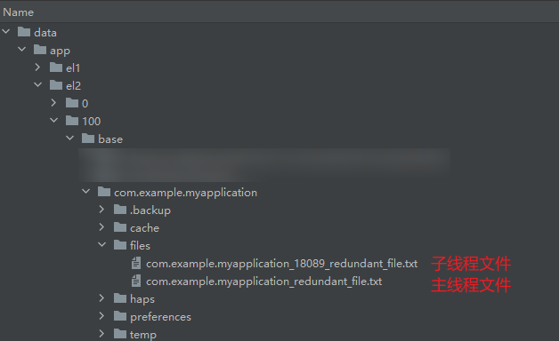
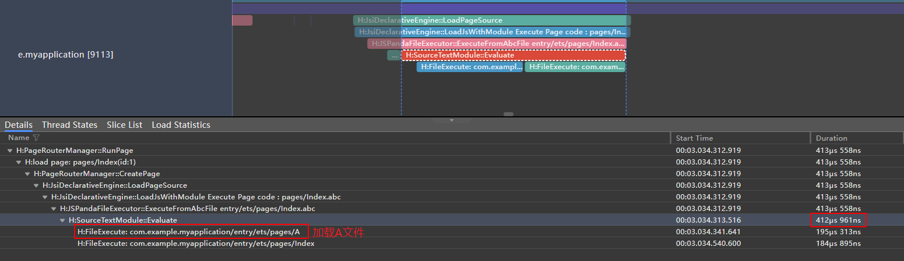
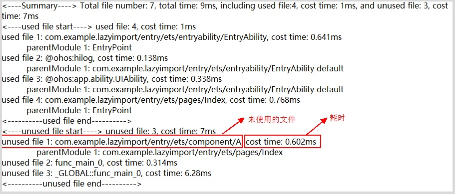
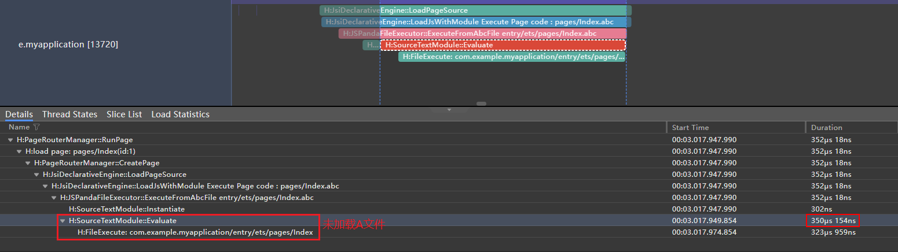

# 延迟加载（lazy import）
<!--Kit: ArkTS-->
<!--Subsystem: arkcompiler-->
<!--Owner: @DaiHuina1997-->
<!--SE: @yao_dashuai-->
<!--TSE: @kirl75;@zsw_zhushiwei-->

随着应用程序功能的扩展，冷启动时间显著增加，主要是因为启动初期加载了大量未实际执行的模块。这不仅延长了应用的初始化时间，还浪费了资源。需要精简加载流程，剔除非必需的文件执行，优化冷启动性能，确保用户体验流畅。

> **说明：**
>
> - 延迟加载特性在API 12版本开始支持。
>
> - 开发者如需在API 12上使用lazy import语法，需在工程中配置"compatibleSdkVersionStage": "beta3"，否则将无法通过编译。参考[DevEco Studio build-profile.json5配置文件说明](https://developer.huawei.com/consumer/cn/doc/harmonyos-guides-V5/ide-hvigor-build-profile-V5#section511142752919)。
> - 针对API version大于12的工程，开发者可直接使用lazy import语法，无需再进行其他配置。

## 功能特性

延迟加载特性使文件在冷启动阶段不被加载，而是在程序运行时按需加载，从而缩短冷启动时间。

## 使用方式

开发者可以利用[可延迟加载文件检测](#可延迟加载文件检测)、<!--Del-->[<!--DelEnd-->Trace<!--Del-->](../performance/common-trace-using-instructions.md)<!--DelEnd-->工具或日志记录等手段，识别冷启动期间未被实际调用的文件<!--RP1-->，分析方法可参考[可延迟加载文件检测](#可延迟加载文件检测)<!--RP1End-->。通过对这些数据的分析，开发者可以精准定位启动阶段不必预先加载的文件列表，并在这些文件的调用点增加lazy标识。但需要注意，后续执行的加载是同步加载，可能阻塞任务执行（如单击任务，触发了延迟加载，那么运行时会去执行冷启动未加载的文件，从而增加耗时），因此是否使用lazy需要开发者自行评估。

> **说明：**
>
> 不建议盲目增加lazy，这会增加编译和运行时的识别开销。

## 场景行为解析

- 使用lazy-import延迟加载。

```typescript
// main.ets   
import lazy { a } from "./mod1";    // "mod1" 未执行
import { c } from "./mod2";         // "mod2" 执行
        
// ...
        
console.info("main executed");
while (false) {
    let xx = a;
}
        
// mod1.ets
export let a = "mod1 executed"
console.info(a);
        
// mod2.ets
export let c = "mod2 executed"
console.info(c);

```

执行结果为：

```typescript
mod2 executed
main executed
```

- 同时对同一模块引用lazy-import与import。

```typescript
// main.ets   
import lazy { a } from "./mod1";    // "mod1" 未执行
import { c } from "./mod2";         // "mod2" 执行
import { b } from "./mod1";         // "mod1" 执行
        
// ...
        
console.info("main executed");
while (false) {
    let xx = a;
}
        
// mod1.ets
export let a = "mod1 a executed"
console.info(a);
        
export let b = "mod1 b executed"
console.info(b);
        
// mod2.ets
export let c = "mod2 c executed"
console.info(c);

```

执行结果为：

```typescript  
mod2 c executed
mod1 a executed
mod1 b executed
main executed
```

如果在main.ets内删除lazy关键字，执行顺序如下：

```typescript  
mod1 a executed
mod1 b executed
mod2 c executed
main executed
```

## lazy-import与动态加载的区别

lazy-import与[动态加载](./arkts-dynamic-import.md)都可以延后特定文件的执行时间，帮助设备分摊性能消耗，缓解特定时段的性能压力。

| 区别项       | 动态加载                                         | lazy-import                                                 |
|-----------|----------------------------------------------|-------------------------------------------------------------|
| 语法示例      | let A = await import("./A");                 | import lazy { A } from "./A";                               |
| 性能开销      | 1.创建异步任务开销。</br>2.执行到动态加载时，触发依赖模块的模块解析+源码执行。 | 1.lazy-import的模块解析在冷启动依旧会触发遍历。</br>2.导入的变量A被使用到时，触发模块的源码执行。 |
| 使用位置      | 代码块/运行逻辑中使用                                  | 需要写在源码开头                                                    |
| 是否可以运行时拼接 | 是                                            | 否                                                           |
| 加载时序      | 异步                                           | 同步                                                          |

lazy-import 相较于动态加载的优势：

1. 在使用动态加载时，开发者需要将静态加载的代码（即同步导入）改写为动态加载语法（即异步导入），这可能涉及较大的代码修改量。
2. 如果希望在冷启动阶段通过动态加载实现优化，开发者需要明确感知到被动态加载的文件在冷启动时不会被执行，否则会增加冷启动开销（放入异步队列等）。
3. 相较于动态加载，使用 lazy-import 延迟加载，开发者只需在 import 语句中添加 lazy 关键字即可实现延迟加载，使用更加便捷。

## 语法规格及起始支持版本

- lazy-import支持如下指令实现：

| 语法                                            | ModuleRequest  | ImportName | LocalName   | 开始支持的API版本 |
|:----------------------------------------------|:---------------|:-----------|:------------|:-----------|
| import lazy { x } from "mod";                 | "mod"          | "x"        | "x"         | API 12      |
| import lazy { x as v } from "mod";            | "mod"          | "x"        | "v"         | API 12      |
| import lazy x from "mod";                     | "mod"          | "default"  | "x"         | API 18      |
| import lazy { KitClass } from "@kit.SomeKit"; | "@kit.SomeKit" | "KitClass" | "KitClass"  | API 18      |

- 延迟加载共享模块或依赖路径内包含共享模块。
    延迟加载对于共享模块依旧生效，使用限制参考[共享模块开发指导](../arkts-utils/arkts-sendable-module.md)。

### 错误示例

以下写法将引起编译报错。

```typescript
export lazy var v;                    // 编译器提示报错：应用编译报错
export lazy default function f(){};   // 编译器提示报错：应用编译报错
export lazy default function(){};     // 编译器提示报错：应用编译报错
export lazy default 42;               // 编译器提示报错：应用编译报错
export lazy { x };                    // 编译器提示报错：应用编译报错
export lazy { x as v };               // 编译器提示报错：应用编译报错
export lazy { x } from "mod";         // 编译器提示报错：应用编译报错
export lazy { x as v } from "mod";    // 编译器提示报错：应用编译报错
export lazy * from "mod";             // 编译器提示报错：应用编译报错

import lazy * as ns from "mod";            // 编译器提示报错：应用编译报错
import lazy KitClass from "@kit.SomeKit"   // 编译器提示报错：应用编译报错
impott lazy * as MyKit from "@kit.SomeKit" // 编译器提示报错：应用编译报错
```

与type关键词同时使用会导致编译报错。

```typescript
import lazy type { obj } from "./mod";    // 不支持，编译器、应用编译报错
import type lazy { obj } from "./mod";    // 不支持，编译器、应用编译报错
```

### 不推荐用法 

- 在同一个ets文件中，期望延迟加载的依赖模块标记不完全。

标记不完全将导致延迟加载失效，并且增加识别延迟加载的开销。

```typescript
// main.ets   
import lazy { a } from "./mod1";    // 从"mod1"内获取a对象，标记为延迟加载
import { c } from "./mod2";
import { b } from "./mod1";         // 再次获取"mod1"内属性，未标记lazy，"mod1"默认执行
        
// ...
```

- 在同一ets文件中，未使用延迟加载变量并再次导出，不支持延迟加载变量被re-export导出，可以通过打开工程级build-profile.json5文件中的reExportCheckMode开关进行扫描排查。

```typescript
// build-profile.json5
"arkOptions":{
    "reExportCheckMode":"compatible"
}
```

> **说明：**
>
> - 针对以下场景，编译时是否进行拦截报错：使用lazy import导入的变量，在同文件中被再次导出。
> - noCheck（缺省默认值）：不检查，不报错。
> - compatible：兼容模式，报Warning。
> - strict：严格模式，报Error。
> - 该字段从DevEco Studio 5.0.13.200版本开始支持。

这种方式导出的变量c未在B.ets中使用，因此B.ets不会触发执行。在A.ets中使用变量c时，由于该变量未被初始化，将会抛出JavaScript异常。

```typescript
// A.ets
import { c } from "./B";
console.info(c);

// B.ets
import lazy { c } from "./C";    // 从"C"内获取c对象，标记为延迟加载
export { c }

// C.ets
let c = "c";
export { c }
```

执行结果：

```typescript
ReferenceError: c is not initialized
    at func_main_0 (A.ets:2:13)
```

```typescript
// A_ns.ets
import * as ns from "./B";
console.info(ns.c);

// B.ets
import lazy { c } from "./C";    // 从"C"内获取c对象，标记为延迟加载
export { c }

// C.ets
let c = "c";
export { c }
```

执行结果：

```typescript
ReferenceError: module environment is undefined
    at func_main_0 (A_ns.js:2:13)
```

### 注意事项

- 不依赖该模块执行的副作用（如初始化全局变量，挂载globalThis等）。可参考：[模块加载副作用及优化](./arkts-module-side-effects.md)。
- 使用导出对象时，触发延迟加载的耗时可能导致对应特性的功能劣化。由于lazy-import的后续加载是同步加载，可能在某些场景阻塞任务执行（比如在点击业务时触发了懒加载，那么运行时会执行冷启动为加载的文件，增加执行耗时，存在掉帧风险），是否使用延迟加载仍需要开发者自行评估。
- 使用lazy特性可能导致模块未执行，从而引发bug。
- 已经被动态加载的文件同时使用lazy-import时，这些文件会执行lazy标识，在动态加载的then逻辑中同步加载。

## 可延迟加载文件检测

本工具用于本地检测应用冷启动时的文件加载情况，可打印应用启动后固定时间段内使用和未使用的文件名，帮助开发者筛选可延迟加载的文件。

> **说明：**
>
> 可延迟加载文件检测从API 20版本开始支持。

### 检测步骤

1. 打开工具：获取[hdc工具](../dfx/hdc.md#环境准备)，连接设备，在终端直接输入下方命令执行。

    ```shell
    hdc shell param set persist.ark.properties 0x200105c
    ```

2. 可选项：设置抓取应用启动阶段的时间，单位为ms，范围为[100-30000]，默认为2s。设置范围外的数字无法保证工具的计时准确性。

    ```shell
    hdc shell param set persist.ark.importDuration 1000
    ```

3. 清除应用后台进程后，重新启动应用进程，等待抓取时间结束，会在应用沙箱下（data/app/el2/100/base/${bundlename}/files/）生成主/子线程对应文件。  

    > **注意：**
    >
    > 1. 该工具仅支持本地安装的应用。
    > 2. 生成文件的操作需要在当前进程存活时执行。
    > 3. 如果抓取过程中进程退出，那么不会生成对应的文件。

4. 关闭工具  
工具常开会损耗性能，使用后应及时关闭。  

    ```shell
    hdc shell param set persist.ark.properties 0x000105c
    ```

### 生成文件介绍

工具会根据设置的抓取时间，分别记录主线程和子线程在该时间内的文件加载情况。各线程独立计时。  
例如，设置时间为1秒，工具将记录主线程和子线程各自启动后1秒内的文件执行情况。  

文件生成路径：`data/app/el2/100/base/${bundleName}/files`
主线程文件名：`${bundleName}_redundant_file.txt`
子线程文件名：`${bundleName}_${tId}_redundant_file.txt`

> **说明：**
>
> 1. 主线程文件名不含线程号信息，因此写入文件时会发生覆盖。
> 2. 子线程文件名包含线程号tId，且每个tId唯一，确保每个子线程对应一个单独的文件。若需查找对应线程文件，可依据日志中的线程号或使用trace工具查看线程号进行匹配。

**示例**
当前测试应用bundleName为com.example.myapplication，应用内创建了一个子线程，线程号为18089（随机）。  
文件生成路径：data/app/el2/100/base/com.example.myapplication/files  
主线程文件名：data/app/el2/100/base/com.example.myapplication/files/com.example.myapplication_redundant_file.txt  
子线程文件名：data/app/el2/100/base/com.example.myapplication/files/com.example.myapplication_18089_redundant_file.txt  


### 检测原理

如下例所示，A文件和B文件同时被Index文件依赖，那么A、B会随着Index文件的加载被直接加载执行。
A文件执行过程完成了变量定义赋值并进行导出，对应A文件的耗时。B文件定义了一个函数并导出，对应B文件的耗时。
在Index文件执行时，B文件的导出函数func被顶层执行，因此B文件的导出是无法优化的，在工具侧就会显示used。但是A文件的导出变量a在Index文件的myFunc函数被调用时才使用，如果冷启动阶段没有其他文件调用myFunc函数，那么A文件在工具侧就会显示unused，即可以延迟加载。

 ```ts
// Index.ets
import { a } from './A';
import { func } from './B';
func(); // 使用B文件变量
export function myFunc() {
    return a; // a变量未被使用
} 
// A.ets
export let a = 10;

// B.ets
export function func() {
    return 20;
}
```

### 加载情况总结

总结加载时间内所有文件及其耗时，包括已使用的文件及其耗时和未使用的文件及其耗时。
例：

```text
<----Summary----> Total file number: 13, total time: 2ms, including used file:12, cost time: 1ms, and unused file: 1, cost time: 1ms
```

上述信息表示应用当前线程在冷启动抓取时间段内加载了13个文件，共耗时2ms。其中，12个文件导出内容被其他文件加载使用，执行这12个文件共耗时1ms；1个文件执行完成，但是其导出内容没有被其他文件在冷启阶段用到，耗时1ms。

### 被使用文件

在冷启动阶段，导出内容被其他文件使用的文件称为used file。  

- 场景1：通过静态加载加载的文件，其父文件（parentModule）代表该文件的引入方。

    ```text
    used file 1: &entry/src/main/ets/pages/1&, cost time: 0.248ms
        parentModule 1: &entry/src/main/ets/pages/outter& a
    ```  

    对应写法示例：

    ```ts
    // entry/src/main/ets/pages/outter.ets
    import { a } from './1' // outter文件从1文件中加载了a变量
    console.info("example ", a); // a变量在outter文件执行时就被使用
    ```  

- 场景2：通过静态加载加载的文件，存在多个父文件。  

    ```text
    // 说明：显示顺序不代表父文件的加载顺序。
    used file 1: &entry/src/main/ets/pages/1&, cost time: 0.248ms
       parentModule 1: &entry/src/main/ets/pages/outter& a
       parentModule 2: &entry/src/main/ets/pages/innerinner& a
    ```

    对应写法示例：

    ```ts
    // entry/src/main/ets/pages/outter.ets
    import { a } from './1' // outter文件从1文件中加载了a变量
    console.info("example ", a); // a变量在outter文件执行时就被使用

    // entry/src/main/ets/pages/innerinner.ets
    import { a } from './1' // innerinner文件从1文件中加载了a变量
    console.info("example ", a); // a变量在innerinner文件执行时就被使用
    ```  

- 场景3：通过静态加载加载的文件，存在多个导出，但是只显示了一部分。

    ```text
    used file 1: &entry/src/main/ets/pages/1&, cost time: 0.248ms
       parentModule 1: &entry/src/main/ets/pages/outter& a
    ```

    对应写法示例：

    ```ts
    // entry/src/main/ets/pages/outter.ets
    import { a , b } from './1' // 加载1文件的多个变量
    console.info("example ", a); // a被使用
    export function myFunc() {
     return b; // b未被使用
    }
    // entry/src/main/ets/pages/1.ets
    export let a = 10;
    export let b = 100;
    ```  

- 场景4：动态加载或使用napi接口加载时，暂未支持父文件打印，因此不会显示父文件。

    ```text
    unused file 1: &entry/src/main/ets/pages/1&, cost time: 0.07ms
    ```

    对应写法示例：

    ```ts
    import("./1").then((ns:ESObject) => {
        console.info('import file 1 success');
    });
    ```

- 场景5：通过loadContent、pushUrl等接口加载的文件，其父文件（parentModule）统一显示为EntryPoint。

    ```text
    used file 1: &entry/src/main/ets/pages/Index&, cost time: 0.545ms
    parentModule 1: EntryPoint
    ```

### 未被使用文件

在冷启动阶段，导出内容没有被其他文件使用的文件称为未使用的文件，代表可以延迟加载。
场景与被使用文件场景一致，但未被使用文件没有变量被使用的信息。

- 场景：文件被这些父文件引用，但变量未被使用。可在引入未使用文件处（父文件）使用延迟加载方式加载该文件。

    ```text
    unused file 1: &entry/src/main/ets/pages/under1&, cost time: 0.001ms
        parentModule 1: &entry/src/main/ets/pages/1&
    ```

    对应写法示例：

    ```ts
    // entry/src/main/ets/pages/1.ets
    import { a } from './under1' // 加载under1文件的变量
    export function myFunc() {
     return a; // a未被使用
    }
    ```  

    可使用延迟加载：

    ```ts
    // entry/src/main/ets/pages/1.ets
    import lazy { a } from './under1' // 不在此处触发under1文件的加载
    export function myFunc() {
     return a; // 此时触发under1文件的加载
    }
    ```

### 使用示例

**使用场景**

下述例子中A文件被引用，在应用启动到点击按钮的这段时间里，A文件并没有被实际执行，在冷启动阶段加载A文件的行为属于冗余。

```javascript
// A为任意可以被引入的ets文件
import { A } from "./A";

@Entry
@Component
struct Index {
  build() {
    RelativeContainer() {
      Button('点击执行A文件')
        .onClick(() => {
          // 点击后触发A文件的执行
          console.log("执行A文件", A);
        })
    }
    // ...
  }
}
```



通过抓取Trace图查看调用栈，可以发现应用在冷启动时加载了A文件。

**使用工具分析**

1. 连接设备，在终端直接输入下方命令执行。

    ```shell
    hdc shell param set persist.ark.properties 0x200105c
    ```

2. 启动应用，启动结束后关闭应用。
3. 下载文件到本地，其中`${bundleName}`为应用名。

    ```shell
    hdc file recv data/app/el2/100/base/${bundleName}/files/${bundleName}_redundant_file.txt D:\
    ```

4. 对上述示例代码获取到的文件进行分析。

   

**修改方式**

工具筛选出冗余文件后，开发者可在引入时添加`lazy`关键字，标记文件可延迟加载。

```javascript
// 此处添加lazy关键字，标记该文件可延迟加载
import lazy { A } from "./A";

@Entry
@Component
struct Index {
  build() {
    RelativeContainer() {
      Button('点击执行A文件')
        .onClick(() => {
          // 点击后触发A文件的执行
          console.log("执行A文件", A);
        })
    }
    // ...
  }
}
```



通过抓取Trace图查看调用栈可以发现，使用lazy-import标识后，应用在冷启动时不再加载A文件。

**优化效果**

|     | 加载文件耗时（微秒μs） |
|-----|--------------|
| 优化前 | 412us        |
| 优化后 | 350us        |

根据上述优化前后案例Trace图对比分析，使用延迟加载后应用冷启动时不再加载A文件，在资源加载阶段减少因加载冗余文件产生的耗时约15%，提高了应用冷启动性能。（由于案例仅演示场景，优化数据仅做参考，在实际业务中随着引用文件的复杂度提高，引用文件数量增多，优化效果也会随之提升。）
