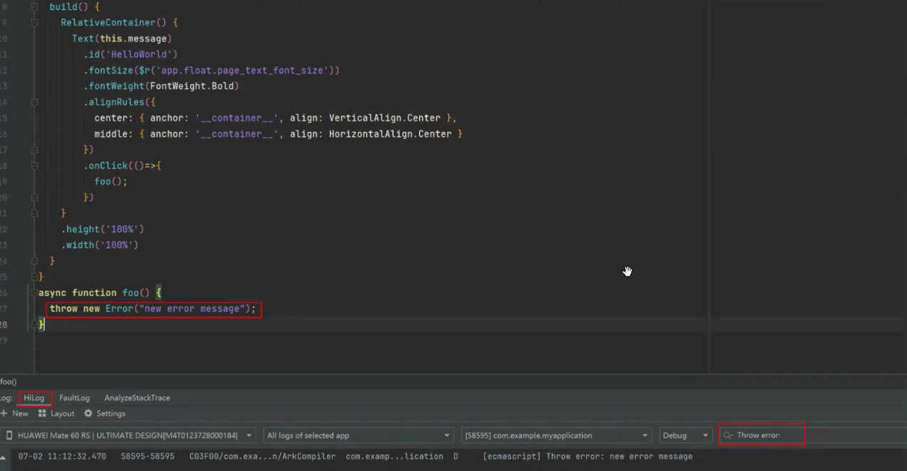

# ArkTS运行时常见问题
<!--Kit: ArkTS-->
<!--Subsystem: ArkCompiler-->
<!--Owner: @DaiHuina1997-->
<!--Designer: @yao_dashuai-->
<!--Tester: @kirl75; @zsw_zhushiwei-->
<!--Adviser: @foryourself-->

## 方舟正则运算与预期输出结果不一致场景

如果使用方舟正则运算时结果与期望不符，请检查以下场景。

### 方舟正则运算对于\b处理与预期不一致

   ```ts
   let str = "\u2642";
   let res = str.replace(/\b/g, "/");
   console.info("res = " + res);
   // 期望输出: res = ♂
   // 实际输出: res = /♂/
   ```

   规避方案：暂无。
   > **说明：**
   > 
   > 正则匹配\b（单词边界）遇到某些ASCII编码之外的字符时，会将其当成ASCII字符来处理，从而将不是单词边界匹配识别成单词边界。

### 方舟正则运算对于先行断言((?=pattern)或(?!pattern)) 嵌套在后行断言((?<=pattern)或(?<!pattern))内部的场景与预期不一致

   ```ts
   console.info(`res:${"abcdef".match(/(?<=ab(?=c)cd)ef/)}`);
   // 期望输出: res:ef
   // 实际输出: res:null
   ```

   规避方案：使用/(?<=abcd)ef/代替/(?<=ab(?=c)cd)ef/。

### 方舟正则运算对于大小写的处理与预期不一致

   ```ts
   let res = /\u{10400}/ui.test("\u{10428}");
   console.info("res = " + res);
   // 期望输出: res = true
   // 实际输出: res = false
   ```

   规避方案：暂无。

### 方舟正则运算/()/ug匹配时lastIndex与预期不一致

   ```ts
   let L = "\ud800";
   let T = "\udc00";
   let u = /()/ug;
   u.lastIndex = 1;
   u.exec(L + T + L + T);
   console.info("u.lastIndex = " + u.lastIndex);
   // 期望输出: u.lastIndex = 0
   // 实际输出: u.lastIndex = 1
   ```

   规避方案：暂无。

### 方舟正则运算[]内部使用'-'与预期不一致

   ```ts
   let str =  "a-b";
   let reg = /[+-\s]/;
   console.info("reg.exec(str) = " + reg.exec(str));
   // 期望输出: reg.exec(str) = -
   // 实际输出: reg.exec(str) = null
   ```

   规避方案：使用转义后的"-"。
   ```ts
   let str =  "a-b";
   let reg = /[+\-\s]/;
   console.info("reg.exec(str) = " + reg.exec(str));
   ```

### 方舟正则运算具名捕获组获取与预期不一致

   ```ts
   let reg = new RegExp("(a)(?<b>b)");
   let res = reg.exec("ab");
   console.info("JSON.stringify(res?.groups) = " + JSON.stringify(res?.groups));
   // 期望输出: JSON.stringify(res?.groups) = {"b":"b"}
   // 实际输出: JSON.stringify(res?.groups) = {"b":"a"}
   ```

   规避方案：计算具名捕获组位置获取具名捕获组匹配的内容。

   ```ts
   let reg = new RegExp("(a)(?<b>b)");
   let res = reg.exec("ab") as Array<string>;
   console.info("JSON.stringify(res?.groups) = {\"b\":" + JSON.stringify(res[2]) + "}");
   ```

### 方舟正则匹配使用'|'与预期不一致

   在使用正则匹配时，如果'|'前是一个空匹配，会导致'|'后的匹配不成功。

   ```ts
   let reg = /a(?:|x)$/;
   let res = reg.exec("ax");
   console.info("JSON.stringify(res) = " + JSON.stringify(res));
   // 期望输出: JSON.stringify(res) = ["ax"]
   // 实际输出: JSON.stringify(res) = null
   ```

   规避方案：使用reg2或reg3替换reg1。

   ```ts
   let reg1 = /a(?:|x)$/;
   let reg2 = /a(?:x)?$/;
   let reg3 = /a(?:x){0,1}$/;
   ```

### 方舟字符串 `replace` 接口对于第一个参数为空字符串的场景与预期不一致

   在使用字符串replace接口时，如果第一个参数是空字符串，则直接返回原始字符串。

   ```ts
   let str = "dddd"
   let res = str.replace("", "abc");
   console.info("res = " + res);
   // 期望输出: res = abcdddd
   // 实际输出: res = dddd
   ```

   规避方案：使用正则表达式 `/^/` 表示字符串起始符，作为第一个参数。

   ```ts
   let str = "dddd"
   let res = str.replace(/^/, "abc");
   ```

## Async函数内部异常的处理机制

**场景**

如果在Async函数内部产生了异常，且没有使用catch捕获该异常，在ArkTS中不会导致进程退出。其本质是Async函数返回了一个rejected状态的Promise对象，没有被处理，使得Promise的rejected状态没有被捕获。Async函数内部的异常会变成 unhandledRejection，表现为异常未抛出。

**Async函数内部异常的捕获方式**

1. 使用[errorManager.on()](../reference/apis-ability-kit/js-apis-app-ability-errorManager.md#errormanageronerror)捕获到Async函数产生的unhandledrejection事件，再通过编写errorManager.on()注册的回调函数，来进行异常处理操作。

   ```ts
      errorManager.on("unhandledRejection", (a:ESObject, b:Promise<ESObject>) => {
         console.info("Async test", a);
      })
   ```

2. 在Async函数内部，针对可能发生异常的代码块添加try-catch逻辑，直接捕获可能出现的异常。

> **注意：**
> 
> 注意必须在Async函数内部，外部无法捕获Async函数内部的异常，外部只能通过errorManager.on()监听。


**查看Async函数内部是否有异常的方式**

若开发者仅需要查看Async函数内部是否产生异常，首先需要在DevEco Studio终端执行以下hilog命令开启debug级别日志打印：

```shell
   hilog -b D
```

然后点击DevEco Studio下方HiLog选项卡，输入过滤条件“Throw error:”，即可查看到Async函数内产生的异常信息。


## 方舟Array.flatMap()接口常见问题

Array.flatMap()接口在处理包含Proxy的Array时，未正确展平嵌套的Proxy Array，导致返回结果与预期不一致。

### ArkTS使用场景

```ts
let arr1 = [0, 1];
let arr2 = [2, 3];
const emptyHandler = new Object() as ProxyHandler<number[]>;
let proxy1 = new Proxy(arr1, emptyHandler);
let proxy2 = new Proxy(arr2, emptyHandler);
let arr3 = [proxy1, proxy2];
let res = arr3.flatMap(x => x);

console.log("res length:", res.length.toString());
// 期望输出: res length: 4
// 实际输出: res length: 2
console.log("res[0] is: ", res[0].toString());
// 期望输出: res[0] is: 0
// 实际输出: res[0] is: 0,1
```

### ArkUI使用场景

ArkUI状态管理框架会为使用状态变量装饰器（如@State、@Trace、@Local）装饰的Array添加一层代理，用于观测API调用产生的变化。如果状态修饰器与Array组合，并且调用Array.flatMap，会出现如下问题。

以状态管理V2为例：

```ts
@Entry
@ComponentV2
struct Index {
   @Local p: number[] = [0, 1];
   @Local q: number[] = [2, 3];
   c: number[][] = [this.p, this.q];
   d: number[] = [];

   aboutToAppear(): void {
      this.d = this.c.flatMap(it => it);
   }

   build() {
      Column() {
         Text(`${this.d[0]}`); // 预期显示：0; 实际显示：0,1
      }
   }
}
```

### Array.flatMap规避方案

避免使用Array.flatMap()接口，改为调用Array.map()接口后再调用深度为1的Array.flat()接口。以上文ArkTS使用场景为例：

```ts
// 使用规避方案前
let res = arr3.flatMap(x => x);
// 使用规避方案后
let res = arr3.map(x => x).flat();
```