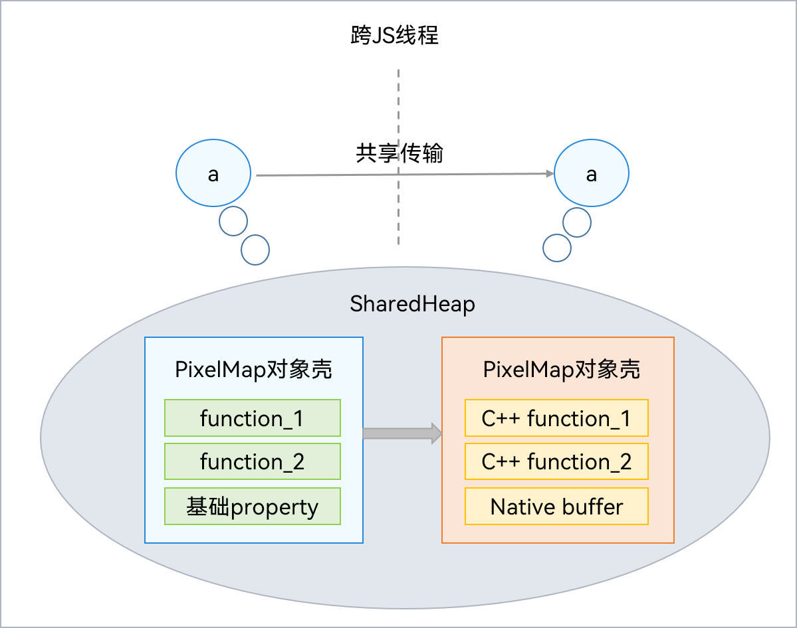
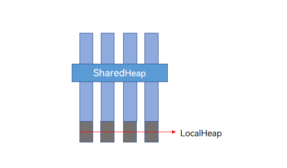

# Sendable对象简介


在传统JS引擎中，优化对象的并发通信开销的唯一方法是将实现下沉到Native侧，通过[Transferable对象](transferabled-object.md)的转移或共享来降低并发通信开销。但开发者仍有大量对象并发通信的需求，这个问题在业界JS引擎中未得到解决。

ArkTS提供了Sendable对象类型，在并发通信时支持通过引用传递来解决上述问题。

Sendable对象为可共享的，其跨线程前后指向同一个JS对象。如果包含JS或Native内容，可以直接共享。如果底层是Native实现，则需要考虑线程安全性。通信过程如下图所示：



与其它ArkTS数据对象不同，符合Sendable协议的数据对象在运行时应为类型固定的对象。

当多个并发实例尝试同时更新Sendable数据时，会发生数据竞争，例如[ArkTS共享容器](arkts-collections-introduction.md)的多线程操作。因此，ArkTS提供[异步锁](arkts-async-lock-introduction.md)机制来避免不同并发实例间的数据竞争，并提供了[异步等待](arkts-condition-variable-introduction.md)机制来控制多线程处理数据的时序。同时，还可以通过[对象冻结接口](sendable-freeze.md)将对象冻结为只读，从而避免数据竞争问题。

Sendable对象提供了并发实例间高效的通信能力，即引用传递，适用于开发者自定义大对象需要线程间通信的场景，例如子线程读取数据库数据并返回给宿主线程，具体代码实现可参考[跨并发实例传输大数据场景](sendable-guide.md#跨并发实例传输大数据场景)。
## 基础概念

### Sendable协议

Sendable协议定义了ArkTS的可共享对象体系及其规格约束。符合Sendable协议的数据（以下简称Sendable对象）可以在ArkTS并发实例间传递。

默认情况下，Sendable数据在ArkTS并发实例间（包括UI主线程、TaskPool线程、Worker线程）传递的行为是引用传递。同时，ArkTS也支持Sendable数据在这些实例间拷贝传递。

### ISendable

在ArkTS语言基础库[@arkts.lang](../reference/apis-arkts/js-apis-arkts-lang.md)中引入了interface ISendable，没有任何必须的方法或属性。ISendable是所有Sendable类型（除了null和undefined）的父类型。ISendable主要用在开发者自定义Sendable数据结构的场景中。类装饰器[@Sendable装饰器](#sendable装饰器)是implement ISendable的语法糖。

### Sendable class

> **说明：**
>
> 从API version 11开始，支持使用\@Sendable装饰器校验Sendable class。

Sendable class需同时满足以下两个规则：

1. 当且仅当被标注了[@Sendable装饰器](#sendable装饰器)。

2. 需满足Sendable约束，详情可查[Sendable使用规则](sendable-constraints.md)。

### Sendable function

> **说明：**
>
> - 从API version 12开始，支持使用\@Sendable装饰器校验Sendable function。
>
> - 针对API version 12的工程，开发者使用\@Sendable装饰器校验Sendable function时，需在工程中配置"compatibleSdkVersionStage": "beta3"，否则其Sendable特性将不生效。参考[build-profile.json5配置文件说明](https://developer.huawei.com/consumer/cn/doc/harmonyos-guides-V5/ide-hvigor-build-profile-V5)。
>
> - 针对API version大于12的工程，开发者可直接使用\@Sendable装饰器校验Sendable function，无需再进行其他配置。

Sendable function需同时满足以下两个规则：

1. 当且仅当被标注了[@Sendable装饰器](#sendable装饰器)。

2. 需满足Sendable约束，详情可查[Sendable使用规则](sendable-constraints.md)。

### Sendable interface

Sendable interface需同时满足以下两个规则：

1. 当且仅当是[ISendable](#isendable)或者继承了ISendable。

2. 需满足Sendable约束，详情可查[Sendable使用规则](sendable-constraints.md)。

### Sendable支持的数据类型

- ArkTS基本数据类型：boolean、number、string、bigint、null、undefined。

- ArkTS语言标准库中定义的[容器类型数据](arkts-collections-introduction.md)（须显式引入[@arkts.collections](../reference/apis-arkts/js-apis-arkts-collections.md)）。

- ArkTS语言标准库中定义的[异步锁对象](arkts-async-lock-introduction.md)（须显式引入[@arkts.utils](../reference/apis-arkts/js-apis-arkts-utils.md)）。

- ArkTS语言标准库中定义的[异步等待对象](arkts-condition-variable-introduction.md)（须显式引入[@arkts.utils](../reference/apis-arkts/js-apis-arkts-utils.md)）。

- 继承了[ISendable](#isendable)的interface。

- 标注了[@Sendable装饰器](#sendable装饰器)的class。

- 标注了[@Sendable装饰器](#sendable装饰器)的function。

- 接入Sendable的系统对象。
  - [共享用户首选项](../reference/apis-arkdata/js-apis-data-sendablePreferences.md)
  - [可共享的色彩管理](../reference/apis-arkgraphics2d/js-apis-sendableColorSpaceManager.md)
  - [基于Sendable对象的图片处理](../reference/apis-image-kit/js-apis-sendableImage.md)
  - [资源管理](../reference/apis-localization-kit/js-apis-sendable-resource-manager.md)
  - [SendableContext对象管理](../reference/apis-ability-kit/js-apis-app-ability-sendableContextManager.md)

- 元素均为Sendable类型的union type数据。

- 开发者自定义的Native Sendable对象。详情可参考[自定义Native Sendable对象的多线程操作场景](napi-define-sendable-object.md)。

> **说明：**
>
> - JS内置对象在并发实例间的传递遵循结构化克隆算法，跨线程行为是拷贝传递。因此，JS内置对象的实例不是Sendable类型。
>
> - 对象字面量、数组字面量在并发实例间的传递遵循结构化克隆算法，跨线程行为是拷贝传递。因此，对象字面量和数组字面量不是Sendable类型。


## Sendable的实现原理

为了实现[Sendable数据](#sendable支持的数据类型)在不同并发实例间的引用传递，Sendable共享对象分配在共享堆中，实现跨并发实例的内存共享。


共享堆（SharedHeap）是进程级别的堆空间，与虚拟机本地堆（LocalHeap）不同的是，LocalHeap只能被单个并发实例访问，而SharedHeap可以被所有线程访问。一个Sendable对象的跨线程行为是引用传递。因此，一个Sendable对象可能被多个并发实例引用，判断该Sendable对象是否存活，取决于所有并发实例是否存在对此Sendable对象的引用。

**SharedHeap与LocalHeap关系图**



各个并发实例的LocalHeap是隔离的，SharedHeap是进程级别的堆，可以被所有并发实例引用，但SharedHeap不能引用LocalHeap中的对象。


## \@Sendable装饰器

声明并校验Sendable class以及Sendable function。

| \@Sendable装饰器 | 说明 |
| -------- | -------- |
| 装饰器参数 | 无。 |
| 使用场景限制 | 仅支持在Stage模型的.ets文件中使用。 |
| 装饰的函数类型限制 | 仅支持装饰普通function和Async function类型。 |
| 装饰的类继承关系限制 | Sendable class只能继承Sendable class，普通Class不可以继承Sendable class。 |
| 装饰的对象内的属性类型限制 | 1. 支持string、number、boolean、bigint、null、undefined、Sendable class、collections容器集、ArkTSUtils.locks.AsyncLock、ArkTSUtils.SendableLruCache以及自定义的Sendable函数类型。<br/>2. 禁止使用闭包变量，定义在顶层的Sendable class和Sendable function除外。<br/>3. 不支持通过\#定义私有属性，需用private。<br/>4. 不支持计算属性。 |
| 装饰的对象内的属性的其他限制 | 1. 成员属性必须显式初始化，不能使用感叹号。<br/>2. 不支持增加或删除属性，允许修改属性，修改前后属性的类型必须一致，不支持修改方法。|
| 装饰的函数或类对象内的方法参数限制 | 允许使用local变量、入参和通过import引入的变量。禁止使用闭包变量，定义在顶层的Sendable class和Sendable function除外。从API version 18开始，支持访问本文件导出的变量。 |
| 适用场景 | 1. 在TaskPool或Worker中使用类方法/Sendable函数。<br/>2. 传输对象数据量较大的使用场景。序列化耗时会随着数据量增大而增大，使用Sendable对数据改造后传输100KB数据时效率提升约20倍，传输1M数据时效率提升约100倍。 |

**装饰器修饰Class使用示例：**

```ts
@Sendable
class SendableTestClass {
  desc: string = "sendable: this is SendableTestClass ";
  num: number = 5;
  printName() {
    console.info("sendable: SendableTestClass desc is: " + this.desc);
  }
  get getNum(): number {
    return this.num;
  }
}
```
<!-- @[example_modify_class](https://gitee.com/openharmony/applications_app_samples/blob/master/code/DocsSample/ArkTS/ArkTsConcurrent/ConcurrentThreadCommunication/InterThreadCommunicationObjects/SendableObject/SendableObjectIntroduction/class/Index.ets) -->

**装饰器修饰Function使用示例：**

```ts
@Sendable
type SendableFuncType = () => void;

@Sendable
class TopLevelSendableClass {
  num: number = 1;
  PrintNum() {
    console.info("Top level sendable class");
  }
}

@Sendable
function TopLevelSendableFunction() {
  console.info("Top level sendable function");
}

@Sendable
function SendableTestFunction() {
  const topClass = new TopLevelSendableClass(); // 顶层sendable class
  topClass.PrintNum();
  TopLevelSendableFunction(); // 顶层sendable function
  console.info("Sendable test function");
}

@Sendable
class SendableTestClass {
  constructor(func: SendableFuncType) {
    this.callback = func;
  }
  callback: SendableFuncType; // 顶层sendable function

  CallSendableFunc() {
    SendableTestFunction(); // 顶层sendable function
  }
}

let sendableClass = new SendableTestClass(SendableTestFunction);
sendableClass.callback();
sendableClass.CallSendableFunc();
```
<!-- @[example_modify_function](https://gitee.com/openharmony/applications_app_samples/blob/master/code/DocsSample/ArkTS/ArkTsConcurrent/ConcurrentThreadCommunication/InterThreadCommunicationObjects/SendableObject/SendableObjectIntroduction/entry/src/main/ets/managers/functionusage.ets) -->