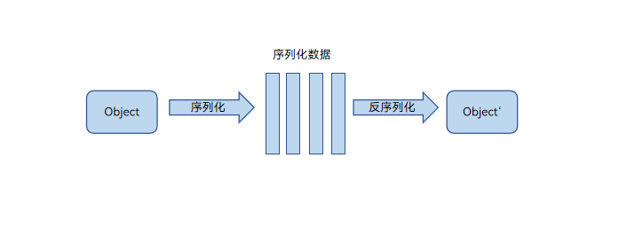

# Sendable开发指导

## 基础概念

### Sendable协议

Sendable协议定义了ArkTS的可共享对象体系及其规格约束。符合Sendable协议的数据（以下简称[Sendable数据](#sendable支持的数据类型)）可以在ArkTS并发实例间传递。

默认情况下，Sendable数据在ArkTS并发实例间（包括主线程、TaskPool&Worker工作线程）传递的行为是引用传递，被分配在共享堆SharedHeap中；非Sendable数据分配在私有堆LocalHeap中，如Sendable与SharedHeap示意图所示。同时，ArkTS支持Sendable数据在ArkTS并发实例间的拷贝传递，如序列化拷贝原理图所示。

当多个并发实例尝试同时更新可变Sendable数据时，会发生数据竞争。ArkTS提供了异步锁的机制来避免不同并发实例间的数据竞争。

**图1** Sendable与SharedHeap示意图


**图2** 序列化拷贝原理图



**示例：**

```ts
import { taskpool, worker } from '@kit.ArkTS';

@Sendable
class A {}

let a: A = new A();

@Concurrent
function foo(a: A) {}
let task: taskpool.Task = new taskpool.Task(foo, a)

let w = new worker.ThreadWorker("entry/ets/workers/Worker.ets")

// 1. TaskPool 共享传输实现方式
taskpool.execute(task).then(() => {})

// 2. Worker 共享传输实现方式
w.postMessageWithSharedSendable(a)

// 3. TaskPool 拷贝传输实现方式
task.setCloneList([a])
taskpool.execute(task).then(() => {})

// 4. Worker 拷贝传输实现方式
w.postMessage(a)
```


### Sendable class

> **说明：**
>
> 从API version 11开始，支持使用@Sendable装饰器校验Sendable class。

Sendable class需同时满足以下两个规则：
1. 当且仅当被标注了[@Sendable装饰器](#sendable装饰器声明并校验sendable-class)。
2. 需满足Sendable约束，详情可查[Sendable使用规则](#sendable使用规则)。

### Sendable function

> **说明：**
>
> 从API version 12开始，支持使用@Sendable装饰器校验Sendable function。
>
> 开发者如需在API12上使用Sendable function，需在工程中配置"compatibleSdkVersionStage": "beta3"，否则其Sendable特性将不生效。参考[build-profile.json5配置文件说明](https://developer.huawei.com/consumer/cn/doc/harmonyos-guides-V5/ide-hvigor-build-profile-V5)。

Sendable function需同时满足以下两个规则：
1. 当且仅当被标注了[@Sendable装饰器](#sendable装饰器声明并校验sendable-function)。
2. 需满足Sendable约束，详情可查[Sendable使用规则](#sendable使用规则)。

### Sendable interface
Sendable interface需同时满足以下两个规则：
1. 当且仅当是[ISendable](#isendable)或者继承了ISendable。
2. 需满足Sendable约束，详情可查[Sendable使用规则](#sendable使用规则)。


### Sendable支持的数据类型

- 所有的ArkTS基本数据类型：boolean, number, string, bigint, null, undefined。
- ArkTS语言标准库中定义的容器类型数据（须显式引入[@arkts.collections](../reference/apis-arkts/js-apis-arkts-collections.md)）。
- ArkTS语言标准库中定义的AsyncLock对象（须显式引入[@arkts.utils](../reference/apis-arkts/js-apis-arkts-utils.md)）。
- 继承了[ISendable](#isendable)的interface。
- 标注了[@Sendable装饰器](#sendable装饰器声明并校验sendable-class)的class。
- 标注了[@Sendable装饰器](#sendable装饰器声明并校验sendable-function)的function。
- 接入Sendable的系统对象类型（详见[Sendable系统对象](arkts-sendable-system-object-list.md)）。
- 元素均为Sendable类型的union type数据。

> **说明：**
>
> - JS内置对象在并发实例间的传递遵循结构化克隆算法，语义为拷贝传递。因此JS内置对象的实例不是Sendable类型。
>
> - 对象字面量、数组字面量在并发实例间的传递遵循结构化克隆算法，语义为拷贝传递。因此，对象字面量和数组字面量不是Sendable类型。
>
> - ArkTS容器集与原生API行为差异具体参考[行为差异汇总](arkts-collections-vs-native-api-comparison.md)。


### ISendable

在ArkTS语言基础库[@arkts.lang](../reference/apis-arkts/js-apis-arkts-lang.md)中引入interface ISendable {}，没有任何必须的方法或属性。ISendable是所有Sendable类型（除了null和undefined）的父类型。ISendable主要用在开发者自定义Sendable数据结构的场景中。类装饰器[@Sendable](#sendable装饰器声明并校验sendable类)是implement ISendable的语法糖。


## \@Sendable装饰器：声明并校验Sendable class

### 装饰器说明
| \@Sendable类装饰器         | 说明                                                                   |
| ------------------------- | ---------------------------------------------------------------------- |
| 装饰器参数                 | 无。                                                                   |
| 使用场景限制               | 仅支持在Stage模型的工程中使用。仅支持在.ets文件中使用。                    |
| 装饰的类继承关系限制        | Sendable class只能继承Sendable class，普通Class不可以继承Sendable class。  |
| 装饰的对象内的属性类型限制  | 1. 支持string、number、boolean、bigint、null、undefined、Sendable class、collections.Array、collections.Map、collections.Set。<br/>2. 禁止使用闭包变量。<br/>3. 不支持#定义私有属性，需用private。<br/>4. 不支持计算属性。           |
| 装饰的对象内的属性的其他限制 | 成员属性必须显式声明类型、必须显式初始化。成员属性不能跟感叹号。|
| 装饰的对象内的方法参数限制  | 允许使用local变量、入参和通过import引入的变量。禁止使用闭包变量。           |
| Sendable Class的限制      | 不支持增加属性、不支持删除属性、允许修改属性，修改前后属性的类型必须一致、不支持修改方法。   |
| 适用场景                  | 1. 在TaskPool或Worker中使用类方法。<br/>2. 传输对象数据量较大的使用场景。<br/>3. 与[makeObserved接口](../quick-start/arkts-new-makeObserved.md)配合使用，可以观察[@Sendable](#sendable装饰器声明并校验sendable类)类的数据变化，具体使用请参考[makeObserved和@Sendable装饰的class配合使用](../quick-start/arkts-new-makeObserved.md#makeobserved和sendable装饰的class配合使用)。         |


### 装饰器使用示例

```ts
@Sendable
class SendableTestClass {
  desc: string = "sendable: this is SendableTestClass ";
  num: number = 5;
  printName() {
    console.info("sendable: SendableTestClass desc is: " + this.desc);
  }
  get getNum(): number {
    return this.num;
  }
}
```

## \@Sendable装饰器：声明并校验Sendable function

### 装饰器说明
| \@Sendable类装饰器         | 说明                                                                   |
| ------------------------- | ---------------------------------------------------------------------- |
| 装饰器参数                 | 无。                                                                   |
| 使用场景限制               | 仅支持在Stage模型的工程中使用。仅支持在.ets文件中使用。                    |
| 装饰的函数类型限制          | 仅支持装饰普通function和Async function类型。  |
| 装饰的函数体限制            | 禁止使用闭包变量，定义在顶层的Sendable class和Sendable function除外。|
| Sendable Function的限制    | 不支持增加、删除、修改属性。   |
| 适用场景                  | 1. 在TaskPool或Worker中使用Sendable函数。<br/>2. 传输对象数据量较大的使用场景。 |


### 装饰器使用示例

```ts
@Sendable
type SendableFuncType = () => void;

@Sendable
class TopLevelSendableClass {
  num: number = 1;
  PrintNum() {
    console.info("Top level sendable class");
  }
}

@Sendable
function TopLevelSendableFunction() {
  console.info("Top level sendable function");
}

@Sendable
function SendableTestFunction() {
  const topClass = new TopLevelSendableClass(); // 顶层sendable class
  topClass.PrintNum();
  TopLevelSendableFunction(); // 顶层sendable function
  console.info("Sendable test function");
}

@Sendable
class SendableTestClass {
  constructor(func: SendableFuncType) {
    this.callback = func;
  }
  callback: SendableFuncType; // 顶层sendable function

  CallSendableFunc() {
    SendableTestFunction(); // 顶层sendable function
  }
}

let sendableClass = new SendableTestClass(SendableTestFunction);
sendableClass.callback();
sendableClass.CallSendableFunc();
```

## Sendable使用规则

### 1. Sendable class只能继承自Sendable class

> **说明：**
>
> 这里的class不包括变量。Sendable class不能继承自变量。

**正例：**
```ts
@Sendable
class A {
  constructor() {
  }
}

@Sendable
class B extends A {
  constructor() {
    super()
  }
}
```

**反例：**
```ts
class A {
  constructor() {
  }
}

@Sendable
class B extends A {
  constructor() {
    super()
  }
}
```

### 2. 非Sendable class只能继承自非Sendable class

**正例：**
```ts
class A {
  constructor() {
  }
}

class B extends A {
  constructor() {
    super()
  }
}
```

**反例：**
```ts
@Sendable
class A {
  constructor() {
  }
}

class B extends A {
  constructor() {
    super()
  }
}
```

### 3. 非Sendable class只能实现非Sendable interface

**正例：**
```ts
interface I {};

class B implements I {};
```

**反例：**
```ts
import { lang } from '@kit.ArkTS';

type ISendable = lang.ISendable;

interface I extends ISendable {};

class B implements I {};
```

### 4. Sendable class/interface成员变量必须是Sendable支持的数据类型

**正例：**
```ts
@Sendable
class A {
  constructor() {
  }
  a: number = 0;
}
```

**反例：**
```ts
@Sendable
class A {
  constructor() {
  }
  b: Array<number> = [1, 2, 3] // 需使用collections.Array
}
```

### 5. Sendable class/interface的成员变量不支持使用!断言

**正例：**
```ts
@Sendable
class A {
  constructor() {
  }
  a: number = 0;
}
```

**反例：**
```ts
@Sendable
class A {
  constructor() {
  }
  a!: number;
}
```

### 6. Sendable class/interface的成员变量不支持使用计算属性名

**正例：**
```ts
@Sendable
class A {
    num1: number = 1;
    num2: number = 2;
    add(): number {
      return this.num1 + this.num2;
    }
}
```

**反例：**
```ts
enum B {
    b1 = "bbb"
}
@Sendable
class A {
    ["aaa"]: number = 1; // ["aaa"] is allowed in other classes in ets files
    [B.b1]: number = 2; // [B.b1] is allowed in other classes in ets files
}
```

### 7. 泛型类中的Sendable class，collections.Array，collections.Map，collections.Set的模板类型必须是Sendable类型

**正例：**
```ts
import { collections } from '@kit.ArkTS';

try {
  let arr1: collections.Array<number> = new collections.Array<number>();
  let num: number = 1;
  arr1.push(num)
} catch (e) {
  console.error(`taskpool execute: Code: ${e.code}, message: ${e.message}`);
}
```

**反例：**
```ts
import { collections } from '@kit.ArkTS';

try {
  let arr1: collections.Array<Array<number>> = new collections.Array<Array<number>>();
  let arr2: Array<number> = new Array<number>()
  arr2.push(1)
  arr1.push(arr2)
} catch (e) {
  console.error(`taskpool execute: Code: ${e.code}, message: ${e.message}`);
}
```

### 8. Sendable class的内部不允许使用当前模块内上下文环境中定义的变量

由于Sendable对象在不同并发实例间的上下文环境不同，如果直接访问会有非预期行为。不支持Sendable对象使用当前模块内上下文环境中定义的变量，如果违反，编译阶段会报错。

> **说明：**
>
> 从API version 12开始，sendable class的内部支持使用top level的sendable class对象。

**正例：**
```ts
import { lang } from '@kit.ArkTS';

type ISendable = lang.ISendable;

interface I extends ISendable {}

@Sendable
class B implements I {
  static o: number = 1;
  static bar(): B {
    return new B();
  }
}

@Sendable
class C {
  v: I = new B();
  u: number = B.o;

  foo() {
    return B.bar();
  }
}
```

**反例：**
```ts
import { lang } from '@kit.ArkTS';

type ISendable = lang.ISendable;

interface I extends ISendable {}

@Sendable
class B implements I {}

function bar(): B {
  return new B();
}

let b = new B();

{
  @Sendable
  class A implements I {}

  @Sendable
  class C {
    u: I = bar(); // bar不是sendable class对象，编译报错
    v: I = new A(); // A不是定义在top level中，编译报错

    foo() {
      return b; // b不是sendable class对象，而是sendable class的实例，编译报错
    }
  }
}

```

### 9. Sendable class和Sendable function不能使用除了@Sendable的其它装饰器

如果类装饰器定义在ts文件中，产生修改类的布局的行为，那么会造成运行时的错误。

**正例：**
```ts
@Sendable
class A {
  num: number = 1;
}
```

**反例：**
```ts
@Sendable
@Observed
class C {
  num: number = 1;
}
```

### 10. 不能使用对象字面量/数组字面量初始化Sendable类型

Sendable数据类型只能通过Sendable类型的new表达式创建。

**正例：**
```ts
import { collections } from '@kit.ArkTS';

let arr1: collections.Array<number> = new collections.Array<number>(1, 2, 3); // 是Sendable类型
```

**反例：**
```ts
import { collections } from '@kit.ArkTS';

let arr2: collections.Array<number> = [1, 2, 3]; // 不是Sendable类型，编译报错
let arr3: number[] = [1, 2, 3]; // 不是Sendable类型，正例，不报错
let arr4: number[] = new collections.Array<number>(1, 2, 3); // 编译报错
```

### 11. 非Sendable类型不可以as成Sendable类型

> **说明：**
>
> Sendable类型在不违反Sendable规则的前提下需要和非Sendable类型行为兼容，因此Sendable类型可以as成非Sendable类型。

**正例：**
```ts
class A {
  state: number = 0;
}

@Sendable
class SendableA {
  state: number = 0;
}

let a1: A = new SendableA() as A;
```

**反例：**
```ts
class A {
  state: number = 0;
}

@Sendable
class SendableA {
  state: number = 0;
}

let a2: SendableA = new A() as SendableA;
```

### 12. 箭头函数不支持共享
箭头函数不支持使用Sendable装饰器。

**正例：**
```ts
@Sendable
type SendableFuncType = () => void;

@Sendable
function SendableFunc() {
  console.info("Sendable func");
}

@Sendable
class SendableClass {
  constructor(f: SendableFuncType) {
    this.func = f;
  }
  func: SendableFuncType;
}

let sendableClass = new SendableClass(SendableFunc)
```

**反例：**
```ts
@Sendable
type SendableFuncType = () => void;
let func: SendableFuncType = () => {}; // 编译报错

@Sendable
class SendableClass {
  func: SendableFuncType = () => {}; // 编译报错
}
```

### 13. Sendable装饰器修饰类型时仅支持修饰函数类型
Sendable装饰器修饰类型时仅支持修饰函数类型。

**正例：**
```ts
@Sendable
type SendableFuncType = () => void;
```

**反例：**
```ts
@Sendable
type A = number; // 编译报错

@Sendable
class C {}

@Sendable
type D = C; // 编译报错
```

## 注意事项

### 在HAR中使用Sendable时，需开启编译生成TS文件的配置

详情请查[编译生成TS文件](../quick-start/har-package.md#编译生成ts文件)。


## 与TS/JS交互的规则

### ArkTS通用规则（目前只针对Sendable对象）

| 规则        |
| ----------- |
| Sendable对象传入TS/JS的接口中，禁止操作其对象布局（增、删属性，改变属性类型）。 |
| Sendable对象设置到TS/JS的对象上，TS中获取到这个Sendable对象后，禁止操作其对象布局（增、删属性，改变属性类型）。 |
| Sendable对象放入TS/JS的容器中，TS中获取到这个Sendable对象后，禁止操作其对象布局（增、删属性，改变属性类型）。 |

> **说明：**
>
> 此处改变属性类型不包括Sendable对象类型的改变，比如从Sendable class A 变为Sendable class B。


### NAPI规则（目前只针对Sendable对象）

| 规则        |
| ----------- |
| 禁止删除属性，不能使用的接口有：napi_delete_property。 |
| 禁止新增属性，不能使用的接口有：napi_set_property、napi_set_named_property、napi_define_properties。	|
| 禁止修改属性类型，不能使用的接口有：napi_set_property、napi_set_named_property、napi_define_properties。 |
| 不支持Symbol相关接口和类型，不能使用的接口有：napi_create_symbol、napi_is_symbol_object、napi_symbol。 |


## 使用场景

Sendable对象可以在不同并发实例间通过引用传递。通过引用传递方式传输对象相比序列化方式更加高效，同时不丢失class上携带的成员方法，因此，Sendable主要可以解决两个场景的问题：
1. 跨并发实例传输大数据（例如可能达到100KB以上）。
2. 跨并发实例传递带方法的class实例对象。

### 跨并发实例传输大数据场景开发指导

由于跨并发实例序列化的开销随着数据量线性增长，因此当传输数据量较大时（100KB数据大约1ms传输耗时），跨并发实例的拷贝开销大，影响并行化的性能。引用传递方式传输对象可提升性能。

**示例：**
```ts
// index.ets
import { taskpool } from '@kit.ArkTS';
import { testTypeA, testTypeB, Test } from './sendable'

// 在并发函数中模拟数据处理
@Concurrent
async function taskFunc(obj: Test) {
  console.info("test task res1 is: " + obj.data1.name + " res2 is: " + obj.data2.name);
}

async function test() {
  // 使用taskpool传递数据
  let a: testTypeA = new testTypeA("testTypeA");
  let b: testTypeB = new testTypeB("testTypeB");
  let obj: Test = new Test(a, b);
  let task: taskpool.Task = new taskpool.Task(taskFunc, obj);
  await taskpool.execute(task);
}

test();
```

```ts
// sendable.ets
// 将数据量较大的数据在Sendable class中组装
@Sendable
export class testTypeA {
  name: string = "A";
  constructor(name: string) {
    this.name = name;
  }
}

@Sendable
export class testTypeB {
  name: string = "B";
  constructor(name: string) {
    this.name = name;
  }
}

@Sendable
export class Test {
  data1: testTypeA;
  data2: testTypeB;
  constructor(arg1: testTypeA, arg2: testTypeB) {
    this.data1 = arg1;
    this.data2 = arg2;
  }
}
```


### 跨并发实例传递带方法的class实例对象

由于序列化传输实例对象时会丢失方法，在必须调用实例方法的场景中，需使用引用传递方式进行开发。在数据处理过程中有需要解析的数据，可使用[ASON工具](../reference/apis-arkts/js-apis-arkts-utils.md#arktsutilsason)进行数据解析。

**示例：**
```ts
// Index.ets
import { taskpool, ArkTSUtils } from '@kit.ArkTS'
import { SendableTestClass, ISendable } from './sendable'

// 在并发函数中模拟数据处理
@Concurrent
async function taskFunc(sendableObj: SendableTestClass) {
  console.info("SendableTestClass: name is: " + sendableObj.printName() + ", age is: " + sendableObj.printAge() + ", sex is: " + sendableObj.printSex());
  sendableObj.setAge(28);
  console.info("SendableTestClass: age is: " + sendableObj.printAge());

  // 解析sendableObj.arr数据生成JSON字符串
  let str = ArkTSUtils.ASON.stringify(sendableObj.arr);
  console.info("SendableTestClass: str is: " + str);

  // 解析该数据并生成ISendable数据
  let jsonStr = '{"name": "Alexa", "age": 23, "sex": "female"}';
  let obj = ArkTSUtils.ASON.parse(jsonStr) as ISendable;
  console.info("SendableTestClass: type is: " + typeof obj);
  console.info("SendableTestClass: name is: " + (obj as object)?.["name"]); // 输出: 'Alexa'
  console.info("SendableTestClass: age is: " + (obj as object)?.["age"]); // 输出: 23
  console.info("SendableTestClass: sex is: " + (obj as object)?.["sex"]); // 输出: 'female'
}
async function test() {
  // 使用taskpool传递数据
  let obj: SendableTestClass = new SendableTestClass();
  let task: taskpool.Task = new taskpool.Task(taskFunc, obj);
  await taskpool.execute(task);
}

test();
```

```ts
// sendable.ets
// 定义模拟类Test，模仿开发过程中需传递带方法的class
import { lang, collections  } from '@kit.ArkTS'

export type ISendable = lang.ISendable;

@Sendable
export class SendableTestClass {
  name: string = 'John';
  age: number = 20;
  sex: string = "man";
  arr: collections.Array<number> = new collections.Array<number>(1, 2, 3);
  constructor() {
  }
  setAge(age: number) : void {
    this.age = age;
  }

  printName(): string {
    return this.name;
  }

  printAge(): number {
    return this.age;
  }

  printSex(): string {
    return this.sex;
  }
}
```