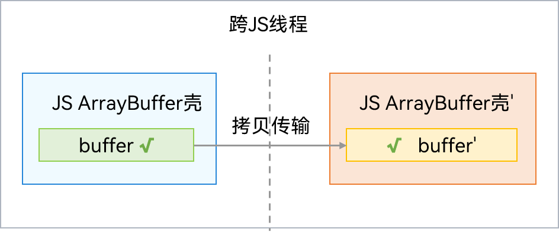
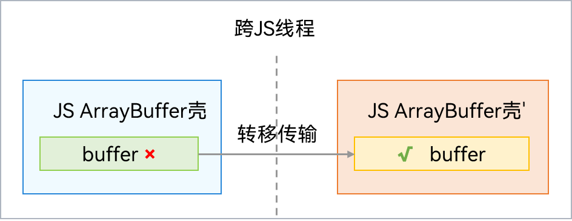

# ArrayBuffer对象

ArrayBuffer内部包含一块Native内存。其JS对象壳与普通对象一样，需要经过序列化与反序列化拷贝传递，但是Native内存有两种传输方式：拷贝和转移。

传输时采用拷贝的话，需要经过深拷贝（递归遍历），传输后两个线程都可以独立访问ArrayBuffer。通信过程如下图所示：



如果采用转移的方式，则原线程无法使用此ArrayBuffer对象，跨线程时只需重建JS壳，Native内存无需拷贝，效率更高。通信过程如下图所示：



ArrayBuffer可以用来表示图片等资源，在应用开发中，会遇到需要进行图片处理的场景（比如需要调整一张图片的亮度、饱和度、大小等），为了避免阻塞主线程，可以将图片传递到子线程中执行这些操作。转移方式性能更高，但是原线程不能再访问ArrayBuffer对象，如果两个线程都需要访问，则需要采用拷贝方式，否则建议采用转移方式，提升性能。

下面将分别通过拷贝和转移的方式，将图片传递到子线程中。

## ArrayBuffer拷贝传输方式

在ArkTS中，TaskPool传递ArrayBuffer数据时，默认使用转移的方式，通过调用setTransferList()接口，指定对应的部分数据传递方式为转移方式，其余部分数据可以切换成拷贝的方式。

首先，实现一个需要在Task中执行的用于处理ArrayBuffer的接口。

然后，通过拷贝的方式将ArrayBuffer数据传递到Task中，并在Task中处理ArrayBuffer。

最后，主线程接收到Task执行完毕后返回的ArrayBuffer数据，拼接数据展示。

```ts
// Index.ets
import { taskpool } from '@kit.ArkTS';
import { BusinessError } from '@kit.BasicServicesKit';

@Concurrent
function adjustImageValue(arrayBuffer: ArrayBuffer): ArrayBuffer {
  // 对arrayBuffer进行操作
  return arrayBuffer;  // 返回值默认转移
}

function createImageTask(arrayBuffer: ArrayBuffer, isParamsByTransfer: boolean): taskpool.Task {
  let task: taskpool.Task = new taskpool.Task(adjustImageValue, arrayBuffer);
  if (!isParamsByTransfer) { // 是否使用转移方式
    // 传递空数组[]，全部arrayBuffer参数传递均采用拷贝方式
    task.setTransferList([]);
  }
  return task;
}

@Entry
@Component
struct Index {
  @State message: string = 'Hello World';

  build() {
    RelativeContainer() {
      Text(this.message)
        .id('HelloWorld')
        .fontSize(50)
        .fontWeight(FontWeight.Bold)
        .alignRules({
          center: { anchor: '__container__', align: VerticalAlign.Center },
          middle: { anchor: '__container__', align: HorizontalAlign.Center }
        })
        .onClick(() => {
          let taskNum = 4;
          let arrayBuffer = new ArrayBuffer(1024 * 1024);
          let taskPoolGroup = new taskpool.TaskGroup();
          // 创建taskNum个Task
          for (let i: number = 0; i < taskNum; i++) {
            let arrayBufferSlice: ArrayBuffer = arrayBuffer.slice(arrayBuffer.byteLength / taskNum * i, arrayBuffer.byteLength / taskNum * (i + 1));
            // 使用拷贝方式传入ArrayBuffer，所以isParamsByTransfer为false
            taskPoolGroup.addTask(createImageTask(arrayBufferSlice, false));
          }
          // 执行Task
          taskpool.execute(taskPoolGroup).then((data) => {
            // 返回结果，对数组拼接，获得最终结果
          }).catch((e: BusinessError) => {
            console.error(e.message);
          })
        })
    }
    .height('100%')
    .width('100%')
  }
}
```

## ArrayBuffer转移传输方式

在TaskPool中，传递ArrayBuffer数据，默认使用转移方式，原线程不能再使用传输给子线程的ArrayBuffer。所以在上文示例的基础上，去除task.setTransferList接口就可以实现，即createImageTask第二个参数传入true。
