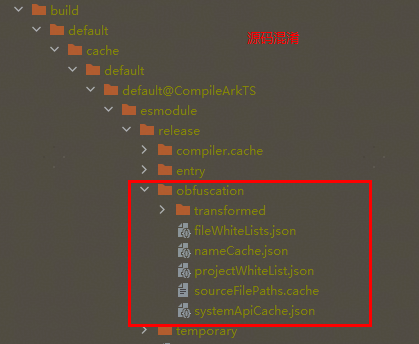
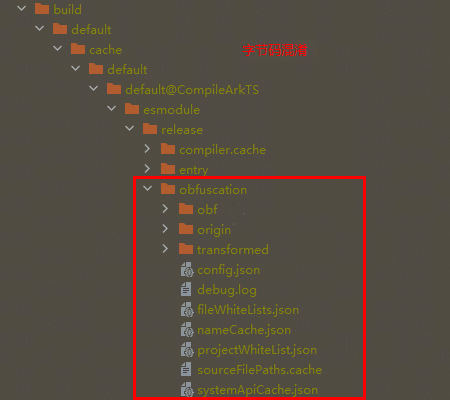
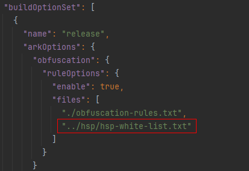
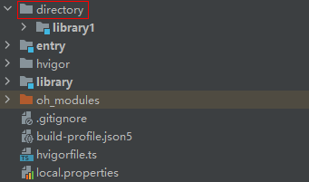

# ArkGuard字节码混淆常见问题

## 字节码混淆与源码混淆差异

### 混淆范围差异

**json文件**
字节码混淆在开启`-enable-filename-obfuscation`混淆项后，json文件名会参与混淆。

### 混淆选项差异

1. 字节码混淆开关，默认关闭，在[开启混淆功能](bytecode-obfuscation-guide.md#开启混淆步骤)后，需要额外在模块目录下`obfuscation-rules.txt`文件中配置`-enable-bytecode-obfuscation` 、`-enable-bytecode-obfuscation-debugging`。
2. 字节码混淆，不支持以下混淆项`-remove-comments`。

### 混淆后文件结构差异

#### 目录差异

 

字节码混淆后，obfuscation目录中多了obf、origin文件夹和config.json文件，具体详见[混淆效果](bytecode-obfuscation-guide.md#查看混淆效果)。

#### 文件内容差异

nameCache.json文件：

源码混淆后：

```txt
{
  "entry/src/main/ets/entryability/EntryAbility.ets": {
    "IdentifierCache": {
      "#UIAbility": "UIAbility",
       ......
      "#testObject": "i",
      "#EntryAbility": "j"
    },
    "MemberMethodCache": {
        ....
    },
    "obfName": "entry/src/main/ets/entryability/EntryAbility.ets"
  },
     ......
  },
  "compileSdkVersion": "5.0.0.70",
  "entryPackageInfo": "entry|1.0.0",
  "PropertyCache": {
      ......
  },
  "FileNameCache": {
      ......
  }
}
```

字节码混淆后：

```json
{
  "entry/src/main/ets/entryability/EntryAbility.ets": {
    "IdentifierCache": {
      "#EntryAbility": "a",
      "#testObject": "c"
    },
    "MemberMethodCache": {
      "EntryAbility:0:0": "a",
     ......
    },
    "obfName": "entry/src/main/ets/entryability/EntryAbility.ets",
    "OriSourceFile": "entry|entry|1.0.0|src/main/ets/entryability/EntryAbility.ts",
    "ObfSourceFile": "entry|entry|1.0.0|src/main/ets/entryability/EntryAbility.ts"
  },
 ......
  "entryPackageInfo": "entry|1.0.0",
  "compileSdkVersion": "5.0.0.70",
  "PropertyCache": {
   ......
  },
  "FileNameCache": {
   ......
  }
}
```

1. IdentifierCache中，字节码混淆时差异：
    1. 不涉及函数参数名混淆。
    2. 无匿名函数混淆名称映射。
2. 在开启`-enable-filename-obfuscation`混淆项时，字节码混淆比源码混淆，多了`OriSourceFile（混淆前源文件路径）`和`ObfSourceFile（混淆后源文件路径）`字段。

### 切换注意点

#### UI混淆差异

字节码混淆不提供UI混淆的能力。
由于字节码中UI组件存在大量字符串的形式绑定属性、方法、类、变量等，字节码混淆已通过系统白名单扫描的机制，保证功能正常。

#### 以字符串的形式作为函数参数绑定属性

源码：

```ts
@Component
export struct MainPage {
   @State messageStr: string = 'Hello World';
   ...
}
```

中间文件：

```abc
this.__messageStr = new ObservedPropertySimplePU('Hello World', this, "messageStr");
```

在中间文件转换过程中，message以字面量形式进行了绑定；此时，存在messageStr这个属性被混淆了，但是这个方法的字符串参数没有混淆，导致UI失效。

**解决办法**：收集struct里所有成员，加入白名单，不参与混淆。目前由于字节码混淆不提供UI混淆能力，系统会自动识别添加到白名单，不需要开发者配置。

#### 字节码中通过字符串绑定属性

源码：

```ts
class Info {
    @Trace sample: Sample = new Sample();
}
```

字节码文件：

```abc
tryldglobalbyname 0x136, Trace
sta v2
lda v0
ldobjbyname 0x137, prototype
sta v3
lda.str sample
sta v4
lda v2
callargs2 0x2c, v3, v4
lda v0
ldobjbyname 0x139, prototype
sta v2
lda.str sample
sta v3
lda v1
callargs2 0x2e, v2, v3
```

字节码层面存在一个global对象Trace，再通过字符串sample绑定属性。

**解决办法**：字节码混淆需要收集扫描到的所有decorator节点，并且识别到Trace修饰的参数就自动加入白名单，不需要开发者配置。

## 如何排查功能异常

**排查功能异常步骤**

1. 先在obfuscation-rules.txt配置-disable-obfuscation选项用于关闭混淆，确认问题是否由混淆引起。
2. 若确认是开启混淆后功能出现的异常，请先阅读文档了解[混淆规则](bytecode-obfuscation.md#混淆选项)的能力以及哪些语法场景需要[配置白名单](bytecode-obfuscation.md#已有保留选项汇总)来保证应用功能正常。
3. 参考本文已有的问题，若是相似场景可参考对应的解决方法快速解决。
4. 若常见案例中未找到相似案例，建议依据各项配置功能正向定位（若不需要相应功能，可删除对应配置项）。
5. 应用运行时崩溃分析方法：
    a.打开应用运行日志或者点击DevEco Studio中出现的Crash弹窗，找到运行时崩溃栈。
    b.应用运行时崩溃栈中的行号为编译产物的行号，方法名也可能为混淆后名称；因此排查时建议直接根据崩溃栈查看编译产物，进而分析哪些名称不能被混淆，然后将其配置进白名单中。
6. 应用在运行时未崩溃但出现功能异常的分析方法（比如白屏）：
    a.打开应用运行日志：选择HiLog，检索与功能异常直接相关的日志，定位问题发生的上下文。
    b.定位异常代码段：通过分析日志，找到导致功能异常的具体代码块。
    c.增强日志输出：在疑似异常的功能代码中，对处理的数据字段增加日志记录。
    d.分析并确定关键字段：通过对新增日志输出的分析，识别是否由于混淆导致该字段的数据异常。
    e.配置白名单保护关键字段：将确认在混淆后对应用功能产生直接影响的关键字段添加到白名单中。

## 常规配置问题处理

### 开启enable-bytecode-obfuscation-debugging，没有生成pa文件如何处理

首先确保Build Mode设置为release，查看根目录下的build-profile.json5中，设置 "compatibleSdkVersionStage": "beta3"，再检查每个module中obfuscation-rules.txt文件里，开启字节码。

### 混淆如何查看混淆效果

在混淆结束后会将中间产物落盘，因此可以在编译产物build目录中找到混淆后的中间产物以查看混淆效果，同时可以找到混淆生成的名称映射表及系统API白名单文件。
· 混淆后的文件目录：build/default/[...]/release/obfuscation/obf。
· 混淆名称映射表及系统API白名单目录：build/default/[...]/release/obfuscation。


· 名称映射表文件：nameCache.json，该文件记录了源码名称混淆的映射关系。
· 系统API白名单文件：systemApiCache.json，该文件记录了SDK中的接口与属性名称，与其重名的源码不会被混淆。


## 编译报错处理

### 案例一：报错内容为 ERROR: [Class]get different name for method.

**问题现象**：使用@CustomDialog，自定义对话框，内部再弹出另一个对话框，开启字节码混淆后，执行build失败，报错信息为：
Error message: ArkTSCompilerError: ArkTS:ERROR Failed to execute ByteCode Obfuscate.
Error message: [Class]get different name for method:&entry/src/main/ets/pages/XXXX&.#~@0>#setController^1.

```ts
//代码1
@CustomDialog
export default struct TmsDialog {
  controller?: CustomDialogController
  dialogController:CustomDialogController;
}
//代码2
@CustomDialog
struct Index{
   controller?: CustomDialogController
   dialogController?:CustomDialogController
}
```

**问题原因**：

在这个示例中，在自定义的对话框中，再弹一个对话框；如上示例中代码1，或在一个UI中定义两个CustomDialogController对象，执行时，ets代码转ts后，会生成两个相同的setController函数，从而导致字节码混淆时报错。

**解决方案**：

```ts
dialogController:CustomDialogController|null = null;
```

示例代码1中，在运行时，是无法正常弹出dialogController的，只需要在定义时改为解决方案中的代码，就可以正常弹出dialogController，同时字节码混淆功能正常；
示例代码2中，由于我们只是使用CustomDialogController，因此不需要@CustomDialog，直接删除@CustomDialog即可，删除后功能正常，字节码混淆功能正常。

## 运行异常处理

### 开启-enable-property-obfuscation选项可能出现的问题

#### 案例一：报错内容为 Cannot read property 'xxx' of undefined

```ts
// 示例JSON文件结构（test.json）：
/*
{
  "jsonObj": {
    "jsonProperty": "value"
  }
}
*/

// 混淆前
import jsonData from "./testjson";
let jsonProp = jsonData.jsonObj.jsonProperty;

// 混淆后
import jsonData from "./test.json";
let jsonProp = jsonData.i.j;
```

开启属性混淆后，"jsonProperty"被混淆成随机字符"j"，但json文件中为原始名称，从而导致值为undefined。
**解决方案**：使用-keep-property-name选项将json文件里的字段配置到白名单。

#### 案例二：使用了数据库相关的字段，开启属性混淆后，出现报错

报错内容为table Account has no column named a23 in 'INSERT INTO Account(a23)'。
代码里使用了数据库字段，混淆时该SQL语句中字段名称被混淆，但数据库中字段为原始名称，从而导致报错。
**解决方案**：使用-keep-property-name选项将使用到的数据库字段配置到白名单。

#### 案例三：使用Record<string, Object>作为对象的类型时，该对象里的属性被混淆，导致功能异常

**问题现象**：
parameters的类型为Record<string, Object>，在开启属性混淆后，parameters对象中的属性linkSource被混淆，进而导致功能异常。示例如下：

```ts
// 混淆前
import { Want } from '@ohos:app.ability.Want';
let petalMapWant: Want = {
  bundleName: 'com.example.myapplication',
  uri: 'maps://',
  parameters: {
    linkSource: 'com.other.app'
  }
}
// 混淆后
import type Want from "@ohos:app.ability.Want";
let petalMapWant: Want = {
    bundleName: 'com.example.myapplication',
    uri: 'maps://',
    parameters: {
        i: 'com.other.app'
    }
};
```

**问题原因**：

在这个示例中，所创建的对象的内容需要传递给系统来加载某个页面，因此对象中的属性名称不能被混淆，否则会造成功能异常。示例中parameters的类型为Record<string, Object>，这只是一个表示以字符串为键的对象的泛型定义，并没有详细描述其内部结构和属性类型。因此，混淆工具无法识别该对象内部哪些属性不应被混淆，从而可能导致内部属性名linkSource被混淆。

**解决方案**：

将混淆后会出现问题的属性名配置到属性白名单中，示例如下：

```txt
-keep-property-name
linkSource
```

#### 案例四：使用@Type和@Trace组合修饰的装饰器属性，混淆后，功能不正常

**问题现象**：

使用@Type和@Trace组合修饰的装饰器属性，可以正常混淆，但混淆后，功能异常。

```ts
@ObservedV2
class SampleChild {
  @Trace p123: number = 0;
  p2: number = 10;
}
@ObservedV2
export class Sample {
  // 对于复杂对象需要@Type修饰，确保序列化成功
  @Type(SampleChild)
  @Trace f123: SampleChild = new SampleChild();
}

//调用
this.prop = PersistenceV2.connect(Sample, () => new Sample())!;
Text.create(`Page1 add 1 to prop.p1: ${this.prop.f123.p123}`);
```

混淆后，p123，f123都被正常替换了，但处理Trace，Type装饰器属性时，p123，f123都被识别为字符串，不参与混淆，导致调用失败。

**问题原因**：

装饰器修饰的属性名需要保留，使用@Type和@Trace组合修饰的装饰器属性同样需要被保留。

**解决方案**：

使用-keep-property-name选项，将未直接导出的类型内的属性配置到属性白名单中。示例如下：

```txt
-keep-property-name
f123
p123
```

#### 案例五：同时开启-enable-property-obfuscation和-keep选项可能会出现的问题

**问题现象**：
使用如下混淆配置：

```txt
-enable-property-obfuscation
-keep
./file1.ts
```

并且在file2.ts中导入file1.ts的接口。此时，接口中有属性的类型为对象类型，该对象类型的属性在file1.ts中被保留，在file2.ts中被混淆，从而导致调用时引发功能异常。示例如下：

```ts
// 混淆前
// file1.ts
export interface MyInfo {
  age: number;
  address: {
    city1: string;
  }
}
// file2.ts
import { MyInfo } from './file1';
const person: MyInfo = {
  age: 20,
  address: {
    city1: "shanghai"
  }
}
// 混淆后，file1.ts的代码被保留
// file2.ts
import { MyInfo } from './file1';
const person: MyInfo = {
  age: 20,
  address: {
    i: "shanghai"
  }
}
```

**问题原因**:

-keep选项保留file1.ts文件时，file1.ts中代码不会被混淆。对于导出属性（如address）所属类型内的属性，不会被自动收集在属性白名单中。因此，该类型内的属性在其他文件中被使用时，会被混淆。

**解决方案**:

**方案一**：使用interface定义该属性的类型，并使用export进行导出，这样该属性会自动被收集到属性白名单中。示例如下：

```ts
// file1.ts
export interface AddressType {
  city1: string
}
export interface MyInfo {
  age: number;
  address: AddressType;
}
```

**方案二**：使用-keep-property-name选项，将未直接导出的类型内的属性配置到属性白名单中。示例如下：

```ts
-keep-property-name
city1
```

### 同时开启-enable-export-obfuscation和-enable-toplevel-obfuscation选项可能出现的问题

**当开启这两个选项时，主模块调用其他模块方法时涉及的方法名称混淆情况如下**：
|主模块	|依赖模块	|导入与导出的名称混淆情况|
|-------|--------|---------|
|HAP/HSP|	HSP	|HSP和主模块是独立编译的，混淆后名称会不一致，因此都需要配置白名单|
|HAP/HSP|	本地HAR	|本地HAR与主模块一起编译，混淆后名称一致|
|HAP/HSP|	三方库|	三方库中导出的名称及其属性会被收集到白名单，因此导入和导出时都不会被混淆|

HSP需要将给其他模块用的方法配置到白名单中。因为主模块里也需要配置相同的白名单，所以推荐将HSP配置了白名单的混淆文件（假设名称为hsp-white-list.txt）添加到依赖它的模块的混淆配置项里，即下图files字段里。



#### 案例一：动态导入某个类，类定义的地方被混淆，导入类名时却没有混淆，导致报错

```ts
// 混淆前
export class Test1 {}
let mytest = (await import('./file')).Test1
// 混淆后
export class w1 {}
let mytest = (await import('./file')).Test1
```

导出的类"Test1"是一个顶层作用域名，当"Test1"被动态使用时，它是一个属性。因为没有开启-enable-property-obfuscation选项，所以名称混淆了，但属性没有混淆。

**解决方案**：

使用-keep-global-name选项将"Test1"配置到白名单。

#### 案例二：在使用namespace中的方法时，该方法定义的地方被混淆了，但使用的地方却没有被混淆，导致报错

```ts
// 混淆前
export namespace ns1 {
  export class person1 {}
}
import {ns1} from './file1'
let person1 = new ns1.person1()
// 混淆后
export namespace a3 {
  export class b2 {}
}
import {a3} from './file1'
let person1 = new a3.person1()
```

namespace里的"person1"属于export元素，当通过"ns1.person1"调用时，它被视为一个属性。由于未开-enable-property-obfuscation选项，导致在使用时未对其进行混淆。

**解决方案**：

1. 开启-enable-property-obfuscation选项。
2. 将namespace里导出的方法使用-keep-global-name选项添加到白名单。

#### 案例三：使用了declare global，混淆后报语法错误

```ts
// 混淆前
declare global {
  var age : string
}
// 混淆后
declare a2 {
  var b2 : string
}
```

报错内容为SyntaxError: Unexpected token。

**解决方案**：

使用-keep-global-name选项将global配置到白名单中。

#### 案例四：使用Reflect.defineMetadata()，混淆后，提示找不到函数，导致程序异常

**问题现象**：

在开启-enable-toplevel-obfuscation属性混淆后，字节码混淆时，混淆正常，运行时报错，错误日志：

```txt
Error message:is not callable
Stacktrace：Cannot get SourceMap info, dump raw stack: at anonymous (ads_service|@hw-ads/ohos-ads-model|1.0.1|src/main/ets/annotations/FieldType.ts:6:1。
```

```js
Reflect中实现     
function defineMetadata(metadataKey, metadataValue, target, propertyKey) {
      if (!IsObject(target))
            throw new TypeError();
      if (!IsUndefined(propertyKey))
           propertyKey = ToPropertyKey(propertyKey);
      return OrdinaryDefineOwnMetadata(metadataKey, metadataValue, target, propertyKey);
}
exporter("defineMetadata", defineMetadata);

调用代码
Reflect.defineMetadata(FIELD_TYPE_KEY, types, target, key);

混淆后
Reflect中
function w9(metadataKey, metadataValue, target, propertyKey) {
}
```

**问题分析**：

在开启-enable-toplevel-obfuscation属性混淆后，Reflect文件中，函数名参与混淆，exporter函数中的字符串"defineMetadata"不参与混淆，导致外部使用Reflect.defineMetadata时，找不到对应函数。

**解决方案**：

使用-keep-global-name选项将defineMetadata配置到白名单中。由于Reflect文件中多次使用exporter，建议直接使用-keep选项。

```txt
-keep
../xxx/xxx/xxx/Reflect.ts  //使用文件的相对路径
```

### 未开启-enable-string-property-obfuscation混淆选项，字符串字面量属性名却被混淆，导致字符串字面量属性名的值为undefined

```ts
person["personAge"] = 22; // 混淆前

person["b"] = 22; // 混淆后
```

**解决方案**：

1. 确认是否有依赖的HAR包开启了字符串属性名混淆，若开启了，则会影响主工程，需将其关闭。
2. 若不能关闭-enable-string-property-obfuscation选项，将属性名配置到白名单中。
3. 若依赖HAR包未开启字符串属性名混淆，同时SDK版本小于4.1.5.3，请更新SDK。

### 开启-enable-filename-obfuscation选项后，可能会出现的问题

#### 案例一：报错为Error Failed to get a resolved OhmUrl for 'D:code/MyApplication/f12/library1/pages/d.ets' imported by 'undefined'

工程的目录结构如下图所示，模块library1的外层还有目录"directory"，开启文件名混淆后，"directory" 被混淆为f12，导致路径找不到。



**解决方案**：

1. 如果工程的目录结构和报错内容都相似，请将SDK更新至最低5.0.0.26版本。
2. 使用-keep-file-name将模块外层的目录名"directory"配置到白名单中。

#### 案例二：报错为Cannot find module 'ets/appability/AppAbility' which is application Entry Point

由于系统会在应用运行时加载ability文件，用户需要手动配置相应的白名单，防止指定文件被混淆，导致运行失败。
**解决方案**：使用-keep-file-name选项，将src/main/module.json5文件中，'srcEntry'字段所对应的路径配置到白名单中。

```txt
-keep-file-name
appability
AppAbility
```

**HAP与HSP依赖相同的本地源码HAR模块，可能会出现的问题。**

* 若开启文件名混淆，会出现以下问题：
    **问题一**：单例功能异常问题。原因是HAP与HSP独立执行构建与混淆流程，本地源码HAR模块在HAP与HSP的包中可能会出现相同的文件名被混淆成不同文件名的情况。
    **问题二**：接口调用失败问题。原因是HAP与HSP独立执行构建与混淆流程，本地源码HAR模块在HAP与HSP的包中可能会出现不同的文件名被混淆成相同的文件名的情况。
* 若开启-enable-export-obfuscation和-enable-toplevel-obfuscation选项，在应用运行时会出现加载接口失败的问题。
    原因是HAP与HSP独立执行构建与混淆流程，本地源码HAR模块中暴露的接口在HAP与HSP中被混淆成不同的名称。

**解决方案**：

1. 将HAP与HSP共同依赖的本地源码HAR改造为字节码HAR，这样此HAR在被依赖时不会被二次混淆。
2. 将HAP与HSP共同依赖的本地源码HAR以release模式构建打包，这样此HAR在被依赖时，其文件名与对外接口不会被混淆。