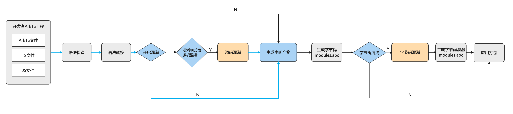

# ArkGuard字节码混淆原理及功能
<!--Kit: ArkTS-->
<!--Subsystem: arkcompiler-->
<!--Owner: @oatuwwutao; @u012789010-->
<!--SE: @hufeng20-->
<!--TSE: @kirl75; @zsw_zhushiwei-->

## 术语清单

| 名词 | 释义 |
| -------- | -------- |
|[HAP](../quick-start/hap-package.md)|HAP（Harmony Ability Package）是应用安装和运行的基本单元。HAP包是由代码、资源、第三方库、配置文件等打包生成的模块包。|
|[HAR](../quick-start/har-package.md)|HAR（Harmony Archive）是静态共享包，通过HAR可以实现多个模块或多个工程共享ArkUI组件、资源等相关代码。通过Static Library创建HAR模块。|
|[HSP](../quick-start/in-app-hsp.md) |HSP（Harmony Shared Package）是动态共享包，通过HSP可以实现代码和资源的共享。通过Shared Library创建HSP模块。|
|本地HAR|源码形式的HAR模块。|
|远程HAR|构建后打包生成的HAR包。|
|本地HSP|源码形式的HSP模块。|
|远程HSP|构建后打包生成的HSP包。|
|三方库|由第三方开发并发布的库，发布到OHPM中心仓，供其他应用使用。|
|名称混淆|将代码中的函数名、类名、文件名等标识符修改为无意义的名称。|

## 混淆生效范围

### 适用语言

ArkGuard支持ArkTS/TS/JS语言，JSON仅支持文件名混淆，不支持C/C++、资源文件等。

### 混淆能力

ArkGuard支持基础的名称混淆功能，不支持控制混淆、数据混淆等高级混淆功能。

对于名称混淆，主要提供**名称重命名**和**配置保留白名单**的能力。

### 混淆能力局限性

**1.语言的限制**
代码混淆工具在处理不同编程语言时，其类型分析机制、混淆策略和执行效率都会因目标语言的特性而呈现差异。以业界常用的ProGuard为例，其主要面向Java这类强类型语言进行混淆。由于强类型语言具有严格的类型系统，每个类型都有明确的定义来源。使得混淆过程中的类型关系追踪和处理更为精确，从而大幅减少了需要配置保留规则的场景。

相比之下，ArkGuard混淆工具主要针对JS、TS和ArkTS语言。JS支持运行时动态修改对象、函数，而混淆是在编译阶段进行的静态处理，可能导致混淆后的名称在运行时无法被正确解析，进而引发运行时异常。TS和ArkTS虽然引入了静态类型系统，但采用了结构性类型机制，即具有相同结构的不同命名类型会被视为等价类型。因此，在TS和ArkTS中仍然无法追溯类型的确切来源。
基于这些特性，使用ArkGuard时需要对更多的语法场景进行白名单配置，同时，ArkGuard采用全局生效的属性保留机制，根据白名单统一保留所有同名属性，而无法支持针对特定类型进行精确保留配置。

具体而言，可以参考以下示例：

假设ArkGuard支持配置指定类型的白名单，配置类A1作为白名单，类A1的属性prop1在白名单中，而A2中的prop1属性不在白名单中。此时，a2作为参数被传入test函数中，调用prop1属性时会导致功能异常。

```typescript
// 混淆前
class A1 {
  prop1: string = '';
}
class A2 {
  prop1: string = '';
}
function test(input: A1) {
  console.info(input.prop1);
}
let a2 = new A2();
a2.prop1 = 'prop a2';
test(a2);
```

```typescript
// 混淆后
class A1 {
  prop1: string = '';
}
class A2 {
  a: string = '';
}
function test(input: A1) {
  console.info(input.prop1);
}
let a2 = new A2();
a2.a = 'prop a2';
test(a2);
```

综上所述，开发者应了解这种语言差异带来的混淆效果差异，并尽量使用不重复的名称，以使在各种场景下的混淆效果更好。

**2.安全保证的有限性**

与其他代码混淆工具一样，混淆只能在一定程度上增加逆向过程的难度，并不能真正阻止逆向工程。

并且，由于ArkGuard混淆工具仅支持基础混淆能力，开发者不应只依赖ArkGuard来保证应用的安全性，对于源码安全有高要求的开发者，应考虑使用[应用加密](https://developer.huawei.com/consumer/cn/doc/harmonyos-guides/code-protect)、第三方安全加固等安全措施来保护代码。

## 混淆机制及流程

下图为应用编译的简要流程图：



开发者可以在模块的build-profile.json5配置文件中开启混淆功能，详细参考[字节码混淆开启指南](bytecode-obfuscation-guide.md)，从而在编译打包的过程中自动对abc进行混淆处理。

混淆过程中，首先读取混淆开关。在开关开启的情况下，解析混淆配置文件，并依据[混淆规则合并策略](#混淆规则合并策略)合并混淆规则。然后按照混淆规则对生成的abc文件进行字节码混淆，最后将混淆后的中间文件落盘至build目录。开发者可以通过build目录中混淆后的产物，确认混淆效果。

在使用混淆功能前，建议开发者先通过文档了解[混淆选项的能力](#混淆选项)与[混淆选项所需要保留白名单的场景](#保留选项)，再根据开发需求选择对应的混淆功能。

## 混淆选项

### 已有混淆选项汇总

| 功能 | 选项 |
| --- | --- |
|关闭混淆|[`-disable-obfuscation`](#-disable-obfuscation)|
|属性名称混淆|[`-enable-property-obfuscation`](#-enable-property-obfuscation)|
|字符串属性名称混淆|[`-enable-string-property-obfuscation`](#-enable-string-property-obfuscation)|
|顶层作用域名称混淆|[`-enable-toplevel-obfuscation`](#-enable-toplevel-obfuscation)|
|导入导出名称混淆|[`-enable-export-obfuscation`](#-enable-export-obfuscation)|
|文件名混淆|[`-enable-filename-obfuscation`](#-enable-filename-obfuscation)|
|代码压缩|[`-compact`](#-compact)|
|console打印删除|[`-remove-log`](#-remove-log)|
|名称缓存输出|[`-print-namecache`](#-print-namecache)|
|名称缓存复用|[`-apply-namecache`](#-apply-namecache)|
|合并依赖模块选项|[`-enable-lib-obfuscation-options`](#-enable-lib-obfuscation-options)|
|开启字节码混淆|[`-enable-bytecode-obfuscation`](#-enable-bytecode-obfuscation)|
|开启字节码混淆调试能力|[`-enable-bytecode-obfuscation-debugging`](#-enable-bytecode-obfuscation-debugging)|

### -disable-obfuscation

关闭所有混淆。

若配置该选项，则默认混淆以及所有已配置的混淆、保留选项的功能将全部失效。和关闭模块中build-profile.json5文件中混淆功能作用一致。

### -enable-property-obfuscation

开启属性名称混淆，效果如下：

 ```ts
// 混淆前：
class TestA {
  static prop1: number = 0;
}
TestA.prop1;
 ```

 ```ts
// 混淆后：
class TestA {
  static i: number = 0;
}
TestA.i;
 ```

若配置该选项，那么所有的属性名都会被混淆，除了下面场景：

* 在未开启`-enable-export-obfuscation`选项的情况下，被`import/export`直接导入或导出的类、对象的属性名不会被混淆。例如下面例子中的属性名`data`不会被混淆。

    ```ts
    export class MyClass {
       data: string;
    }
    ```

* ArkUI组件中的属性名不会被混淆。例如下面例子中的`message`和`data`不会被混淆。

    ```ts
    @Component struct MyExample {
     @State message: string = "hello";
        data: number[] = [];
        // ...
    }
    ```

* 被[保留选项指定的属性名](#-keep-property-name)不会被混淆。
* SDK API列表中的属性名不会被混淆。SDK API列表是构建时从SDK中自动提取出来的一个名称列表，其缓存文件为systemApiCache.json，路径为工程目录下build/default/cache/{...}/release/obfuscation中。
* 字符串字面量属性名不会被混淆。例如下面例子中的`firstName`和`personAge`不会被混淆。

    ```ts
    let person = {"firstName": "abc"};
    person["personAge"] = 22;
    ```

* 注解成员名不会被混淆。例如下面例子中的`authorName`和`revision`不会被混淆。

    ```ts
    @interface MyAnnotation {
    authorName: string;
    revision: number = 1;
    }
    ```

### -enable-string-property-obfuscation

开启字符串属性混淆，仅在已开启属性混淆的基础上生效。

若想混淆字符串字面量属性名，需要在已配置-enable-property-obfuscation的基础上使用。例如：

  ```txt
  -enable-property-obfuscation
  -enable-string-property-obfuscation
  ```

根据上述配置，下面例子中的"firstName"和"personAge"混淆效果如下：

  ```ts
  // 混淆前：
  let person = {"firstName": "abc"};
  person["personAge"] = 22;
  ```

  ```ts
  // 混淆后：
  let person = {"a": "abc"};
  person["b"] = 22;
  ```

**使用该选项时，需要注意以下事项：**
**1.** 如果字符串属性名包含特殊字符（除了`a-z、A-Z、0-9、_`之外的字符），例如`let obj = {"\n": 123, "": 4, " ": 5}`，建议不要开启`-enable-string-property-obfuscation`选项，因为可能无法通过[保留选项](#-keep-property-name)来指定保留这些名字。

**2.** SDK API的属性白名单中不包含声明文件中使用的字符串常量值，例如示例中的字符串'ohos.want.action.home'未包含在属性白名单中：

```ts
// SDK API文件@ohos.app.ability.wantConstant片段：
export enum Params {
  ACTION_HOME = 'ohos.want.action.home'
}
// 开发者源码示例：
let params = obj['ohos.want.action.home'];
```

因此在开启了`-enable-string-property-obfuscation`选项时，如果想保留代码中使用的SDK API字符串常量的属性不被混淆，例如obj['ohos.want.action.home']，那么需要使用[-keep-property-name选项](#-keep-property-name)保留。

### -enable-toplevel-obfuscation

开启顶层作用域名称混淆，效果如下：

```ts
// 混淆前：
let count = 0;
```

```ts
// 混淆后：
let s = 0;
```

若配置该选项，那么所有的顶层作用域的名称都会被混淆，除了下面场景：

* 在未开启`-enable-export-obfuscation`选项的情况下,被`import/export`直接导入或导出的名称不会被混淆。
* 当前文件找不到声明的名称不会被混淆。
* 被[保留选项](#-keep-global-name)指定的顶层作用域名称不会被混淆。
* SDK API列表中的顶层作用域名称不会被混淆。

### -enable-export-obfuscation

开启直接导入或导出的名称混淆，效果如下：

```ts
// 混淆前：
namespace ns {
  export type customT = string;
}
```

```ts
// 混淆后：
namespace ns {
  export type h = string;
}
```

若配置该选项，那么非顶层作用域中导入或导出的名称会被混淆。
**若想混淆顶层作用域中导入或导出的名称，需要在已配置`-enable-toplevel-obfuscation`的基础上使用。**
**若想混淆导入或导出的属性名，需要在已配置`-enable-property-obfuscation`的基础上使用。** 开启此选项时，以下特殊场景不会被混淆：

* 远程HAR（真实路径在oh_modules中的包）中导出的名称和属性名不会被混淆。
* 被[保留选项](#保留选项)指定的名称与属性名不会被混淆。
* SDK API列表中的名称不会被混淆。

### -enable-filename-obfuscation

开启文件/文件夹名称混淆，效果如下：

```ts
// 混淆前：
import * as m from '../test1/test2';
import { foo } from '../test1/test2';
const module = import('../test1/test2');
```

```ts
// 混淆后：
import * as m from '../a/b';
import { foo } from '../a/b';
const module = import('../a/b');
```

若配置该选项，那么所有的文件/文件夹名称都会被混淆，除了下面场景：

* oh-package.json5文件中'main'、'types'字段配置的文件/文件夹名称不会被混淆。
* 模块内module.json5文件中'srcEntry'字段配置的文件/文件夹名称不会被混淆。
* 被[-keep-file-name](#-keep-file-name)指定的文件/文件夹名称不会被混淆。
* 非ECMAScript模块引用方式，不会被混淆（例如：`const module = require('./module')`）。
* 非路径引用方式，例如`import module from 'json5'`中的`json5`不会被混淆。

> **注意：**
>
> 由于系统会在应用运行时加载某些指定的文件，针对这类文件，开发者需要手动在[-keep-file-name](#-keep-file-name)选项中配置相应的白名单，防止指定文件被混淆，导致运行失败。
>
> 编译入口、Ability组件、Worker多线程，这三种不能混淆的文件名在DevEco Studio 5.0.3.500版本已被自动收集进白名单中，无需再手动配置，其它不能混淆文件名的场景仍需开发者手动配置。

### -compact

删除不必要的空格符和所有的换行符。

若配置该选项，所有代码会被压缩到一行。效果如下：

```ts
// 混淆前：
class TestA {
  static prop1: number = 0;
}
TestA.prop1;
```

```ts
// 混淆后：
class TestA { static prop1: number = 0; } TestA.prop1;
```

> **注意**：
>
> release模式构建的应用栈信息仅包含代码行号，不包含列号，因此-compact功能开启后无法依据报错栈中的行号定位到源码具体位置。

### -remove-log

删除对console.*语句的调用，要求console.*语句返回值未被调用，效果如下：

```ts
// 混淆前：
if (flag) {
  console.info("hello");
}
```

```ts
// 混淆后：
if (flag) {
}
```

若配置该选项，以下场景中的console.*语句会被删除：

1. 文件顶层的调用
    例如：

    ```js
    console.info("in tolevel");
    ```

2. 代码块中的调用
    例如：

    ```ts
    function foo() {
    console.info('in block');
    }
    ```
  
3. module或namespace中的调用
    例如：
  
    ```ts
    namespace ns {
    console.info('in ns');
    }
    ```
  
4. switch语句中的调用
    例如
  
    ```js
    switch (value) {
    case 1:
        console.info("in switch case");
        break;
    default:
        console.info("default");
    }
    ```

### -print-namecache

将名称缓存保存到指定的文件路径filepath中，名称缓存包含名称混淆前后的映射。其中，filepath为必选参数，支持相对路径和绝对路径，相对路径的起始位置为混淆配置文件的当前目录。filepath参数中的文件名请以.json为后缀。
例如：

```txt
-print-namecache
./customCache/nameCache.json
```

> **注意**：
>
> 每次全量构建工程时都会生成新的namecache.json文件，因此开发者每次发布新版本时都要注意保存一个该文件的副本。

### -apply-namecache

复用指定的名称缓存文件filepath。其中，filepath为必选参数，支持相对路径和绝对路径，相对路径的起始位置为混淆配置文件的当前目录。filepath参数中的文件名请以`.json`为后缀。
该选项应该在增量编译场景中被使用。开启该选项后，名称将会被混淆成缓存映射对应的名称，若找不到对应的缓存，则会被混淆成新的随机名称。

例如：

```txt
-apply-namecache
./customCache/nameCache.json
```

默认情况下，DevEco Studio会在临时的缓存目录中保存缓存文件，并且在增量编译场景中自动应用该缓存文件。
缓存目录：build/default/cache/{...}/release/obfuscation。

### -enable-lib-obfuscation-options

配置此开关后，依赖模块的混淆选项将被合并到当前编译模块的混淆配置中。
混淆配置分为[混淆选项](#混淆选项)和[保留选项](#保留选项)：
默认情况下，生效的混淆配置为当前编译模块的混淆配置与依赖模块的保留选项的合并结果。
启用该开关后，生效的混淆配置为当前编译模块的混淆配置与依赖模块的混淆配置的合并结果。
混淆规则合并逻辑参考[混淆规则合并策略](#混淆规则合并策略)。

### -enable-bytecode-obfuscation

字节码混淆控制开关。 默认不开启。

### -enable-bytecode-obfuscation-debugging

控制字节码混淆是否输出调试信息，开启后会生成混淆日志，请参考[混淆效果](bytecode-obfuscation-guide.md#查看混淆效果)，默认不开启。
需要在已配置`-enable-bytecode-obfuscation`的基础上使用。

## 保留选项

### 已有保留选项汇总

|功能|选项|
|-----|-----|
|指定保留属性名称|[-keep-property-name](#-keep-property-name)|
|指定保留顶层作用域或导入导出元素名称|[-keep-global-name](#-keep-global-name)|
|指定保留文件/文件夹名称|[-keep-file-name](#-keep-file-name)|
|指定保留声明文件中的所有名称|[-keep-dts](#-keep-dts)|
|指定保留源码文件中的所有名称|[-keep](#-keep)|

### -keep-property-name

指定想保留的属性名，支持使用[名称类通配符](#名称类通配符)。按如下方式进行配置，表示保留名称为`age`、`firstName`和`lastName`的属性：

```txt
-keep-property-name
age
firstName
lastName
```

**使用该选项时，需要注意以下事项：**

**1.** 该选项在开启`-enable-property-obfuscation`时生效。

**2.** 属性白名单作用于全局。即代码中出现多个重名属性，只要与`-keep-property-name`配置白名单名称相同，均不会被混淆。

**哪些属性名应该被保留?**

1.如果代码中通过字符串拼接、变量访问或使用`defineProperty`方法来定义对象属性，则这些属性名应被保留。例如：

```js
var obj = {x0: 0, x1: 0, x2: 0};
for (var i = 0; i <= 2; i++) {
    console.info(obj['x' + i]);  // x0, x1, x2应该被保留
}

Object.defineProperty(obj, 'y', {});  // y应该被保留
Object.getOwnPropertyDescriptor(obj, 'y');  // y应该被保留
console.info(obj.y);

obj.s = 0;
let key = 's';
console.info(obj[key]);        // key对应的变量值s应该被保留

obj.t1 = 0;
console.info(obj['t' + '1']);        // t1应该被保留
```

对于如下的字符串常量形式的属性调用，可以选择性保留：

```js
// 混淆配置：
// -enable-property-obfuscation
// -enable-string-property-obfuscation
obj.t = 0;
console.info(obj['t']); // 此时，'t'会被正确混淆，t可以选择性保留

obj['v'] = 0;
console.info(obj['v']); // 此时，'v'会被正确混淆，v可以选择性保留
```

2.对于间接导出的场景，例如`export MyClass`和`let a = MyClass; export {a};`，如果不想混淆它们的属性名，那么需要使用[保留选项](#保留选项)来保留这些属性名。另外，对于直接导出的类或对象的属性的属性名，例如下面例子中的`firstName`和`personAge`，如果不想混淆它们，那么也需要使用[保留选项](#保留选项)来保留这些属性名。

```ts
export class MyClass {
    person = {firstName: "123", personAge: 100};
}
```

3.在ArkTS/TS/JS文件中使用so库的API（例如示例中的foo）时，需手动保留API名称。

```ts
import testNapi from 'library.so'
testNapi.foo() // foo需要保留，示例如：-keep-property-name foo
```

4.JSON数据解析及对象序列化时，需要保留使用到的字段，例如：

```ts
// 示例JSON文件结构(test.json)：
/*
{
  "jsonProperty": "value",
  "otherProperty": "value2"
}
*/
const jsonData = fs.readFileSync('./test.json', 'utf8');
let jsonObj = JSON.parse(jsonData);
let jsonProp = jsonObj.jsonProperty; // jsonProperty应该被保留
class jsonTest {
  prop1: string = '';
  prop2: number = 0
}
let obj = new jsonTest();
const jsonStr = JSON.stringify(obj); // prop1、prop2会被混淆，应该被保留
```

5.使用到的数据库相关的字段，需要手动保留。例如，数据库键值对类型（ValuesBucket）中的属性：

```ts
const valueBucket: ValuesBucket = {
  'ID1': ID1, // ID1应该被保留
  'NAME1': name, // NAME1应该被保留
  'AGE1': age, // AGE1应该被保留
  'SALARY1': salary // SALARY1应该被保留
}
```

6.源码中自定义装饰器修饰了成员变量、成员方法、参数，同时其源码编译的中间产物为js文件时（如编译release源码HAR或者源码包含@ts-ignore、@ts-nocheck），这些装饰器所在的成员变量/成员方法名称需要被保留。这是由于ts高级语法特性转换为js标准语法时，将上述装饰器所在的成员变量/成员方法名称硬编码为字符串常量。
示例：

```ts
class A {
  // 1.成员变量装饰器
  @CustomDecoarter
  propertyName: string = ""   // propertyName 需要被保留
  // 2.成员方法装饰器
  @MethodDecoarter
  methodName1(){} // methodName1 需要被保留
  // 3.方法参数装饰器
  methodName2(@ParamDecorator param: string): void { // methodName2 需要被保留
  }
}
```

### -keep-global-name

指定要保留的顶层作用域或导入和导出元素的名称，支持使用[名称类通配符](#名称类通配符)。可按如下方式进行配置：

```txt
-keep-global-name
Person
printPersonName
```

`namespace`中导出的名称也可以通过`-keep-global-name`选项保留，示例如下：

```ts
export namespace Ns {
  export const age = 18; // -keep-global-name age 保留变量age
  export function myFunc () {}; // -keep-global-name myFunc 保留函数myFunc
}
```

> **注意**
>
> `-keep-global-name`指定的白名单作用于全局。即代码中出现多个顶层作用域名称或者导出名称，只要与`-keep-global-name`配置的白名单名称相同，均不会被混淆。

**哪些顶层作用域的名称应该被保留?**

1.在JavaScript中全局变量是`globalThis`的属性。如果在代码中使用`globalThis`去访问全局变量，那么该变量名应该被保留。

示例：

```ts
var a = 0;
console.info(globalThis.a);  // a 应该被保留
function foo(){}
globalThis.foo();           // foo 应该被保留
var c = 0;
console.info(c);             // c 可以被正确地混淆
function bar(){}
bar();                      // bar 可以被正确地混淆
class MyClass {}
let d = new MyClass();      // MyClass 可以被正确地混淆
```

2.当以命名导入的方式导入 so 库的 API时，若同时开启`-enable-toplevel-obfuscation`和`-enable-export-obfuscation`选项，需要手动保留API的名称。

```ts
import { testNapi, testNapi1 as myNapi } from 'library.so' // testNapi 和 testNapi1 应该被保留
```

### -keep-file-name

指定要保留的文件/文件夹的名称（不需要写文件后缀），支持使用[名称类通配符](#名称类通配符)。例如：

```txt
-keep-file-name
index
entry
```

**哪些文件名应该被保留?**
1.在使用`require`引入文件路径时，由于`ArkTS`不支持[CommonJS](../arkts-utils/module-principle.md#commonjs模块)语法，因此这种情况下路径应该被保留。

```ts
const module1 = require('./file1')   // file1 应该被保留
```

2.对于动态导入的路径名，由于无法识别`import`函数中的参数是否为路径，因此这种情况下路径应该被保留。

```ts
const moduleName = './file2'         // moduleName对应的路径名file2应该被保留
const module2 = import(moduleName)
```

3.在使用[动态路由](../ui/arkts-navigation-navigation.md#跨包动态路由)进行路由跳转时，传递给动态路由的路径应该被保留。动态路由提供系统路由表和自定义路由表两种方式。若采用自定义路由表进行跳转，配置白名单的方式与上述第二种动态引用场景一致。而若采用系统路由表进行跳转，则需要将模块下`resources/base/profile/route_map.json`文件中`pageSourceFile`字段对应的路径添加到白名单中。

```json
{
    "routerMap": [
      {
        "name": "PageOne",
        "pageSourceFile": "src/main/ets/pages/directory/PageOne.ets",  // 路径都应该被保留
        "buildFunction": "PageOneBuilder",
        "data": {
          "description" : "this is PageOne"
        }
      }
    ]
  }
```

### -keep-dts

指定路径*filepath*的`.d.ets`文件中的名称（例如类名、属性名等）会被添加至`-keep-global-name`和`-keep-property-name`白名单中。请注意，*filepath*仅支持绝对路径，并且可以指定为一个目录。在这种情况下，该目录中所有`.d.ets`文件中的名称都将被保留。

### -keep

保留指定相对路径*filepath*中的所有名称（例如类名、属性名等）不被混淆。*filepath*可以是文件与文件夹，若是文件夹，则文件夹下的文件及子文件夹中文件都不混淆。
*filepath*仅支持相对路径，`./`与`../`为相对于混淆配置文件所在目录，支持使用[路径类通配符](#路径类通配符)。

```txt
-keep
./src/main/ets/fileName.ts   // fileName.ts中的名称不混淆
../folder                    // folder目录下文件及子文件夹中的名称都不混淆
../oh_modules/json5          // 引用的三方库json5里所有文件中的名称都不混淆
```

**使用该选项时，需要注意以下事项：**
**1.** 被-`keep filepath`所保留的文件，其依赖链路上的文件中导出名称及其属性都会被保留。
**2.** 该功能不影响文件名混淆`-enable-filename-obfuscation`的功能。

## 保留选项支持的通配符

### 名称类通配符

名称类通配符使用方式如下：

| 通配符 | 含义                   | 示例                                       |
| ------ | ---------------------- | ------------------------------------------ |
|?|匹配任意单个字符|"AB?"能匹配"ABC"等，但不能匹配"AB"|
|*|匹配任意数量的任意字符|"*AB*"能匹配"AB"、"aABb"、"cAB"、"ABc"等|

**使用示例：**
保留所有以a开头的属性名称：

```txt
-keep-property-name
a*
```

保留所有单个字符的属性名称：

```txt
-keep-property-name
?
```

保留所有属性名称：

```txt
-keep-property-name
*
```

### 路径类通配符

路径类通配符使用方式如下：

| 通配符 | 含义                                                                     | 示例                                              |
| ------ | ------------------------------------------------------------------------ | ------------------------------------------------- |
| ?     | 匹配任意单个字符，除了路径分隔符`/`。                                      | "../a?"能匹配"../ab"等，但不能匹配"../a/"。         |
| \*      | 匹配任意数量的任意字符，除了路径分隔符`/`。                                | "../a*/c"能匹配"../ab/c"，但不能匹配"../ab/d/s/c"。 |
| \*\*   | 匹配任意数量的任意字符。                                                   | "../a**/c"能匹配"../ab/c"，也能匹配"../ab/d/s/c"。  |
| !      | 表示非，只能写在某个路径最前端，用来排除用户配置的白名单中已有的某种情况。 | "!../a/b/c.ets"表示除"../a/b/c.ets"以外。           |

**使用示例：**

表示路径../a/b/中所有文件夹（不包含子文件夹）中的c.ets文件不会被混淆：

```txt
-keep
../a/b/*/c.ets
```

表示路径../a/b/中所有文件夹（包含子文件夹）中的c.ets文件不会被混淆：

```txt
-keep
../a/b/**/c.ets
```
表示路径../a/b/中，除了c.ets文件以外的其它文件都不会被混淆。其中，`!`不可单独使用，只能用来排除白名单中已有的情况：

```txt
-keep
../a/b/
!../a/b/c.ets
```

表示路径../a/中的所有文件（不包含子文件夹）不会被混淆：

```txt
-keep
../a/*
```

表示路径../a/下的所有文件夹（包含子文件夹）中的所有文件不会被混淆：

```txt
-keep
../a/**
```

表示模块内的所有文件不会被混淆：

```txt
-keep
./**
```

**使用通配符时，需要注意以下事项：**
**1.** 以上选项，不支持配置通配符`*`、`?`、`!`作其它含义使用。 例如：

```txt
class A {
  '*'= 1
}
-keep-property-name
*
```

此时`*`表示匹配任意数量的任意字符，配置效果为所有属性名称都不混淆，而不是只有`*`属性不被混淆。

**2.** -keep选项中只允许使用`/`路径格式，不支持`\`或`\\`。

## 混淆规则合并策略

在编译一个模块时，默认情况下，生效的混淆规则为**当前编译模块的混淆规则**与**依赖模块混淆规则**的合并结果，具体规则如下：

**当前编译模块混淆规则**
指当前模块配置文件`build-profile.json5`中`arkOptions.obfuscation.ruleOptions.files`字段指定的混淆配置文件内容。

**依赖模块混淆规则**
根据依赖模块的类型，混淆规则分为以下两个来源：

- **本地HAR/HSP模块**
  指该模块配置文件`build-profile.json5`中`arkOptions.obfuscation.consumerFiles`字段指定的混淆配置文件内容。

- **远程HAR/HSP包**
  指该远程HAR/HSP包中obfuscation.txt文件内容。

当构建HAP、HSP和HAR的时候，最终的混淆规则是下列文件的合并：

* 当前构建模块的ruleOptions.files属性。
* 依赖的本地HSP的consumerFiles属性。
* 依赖的本地HAR的consumerFiles属性。
* 依赖的远程HAR和远程HSP中的obfuscation.txt文件。

如果构建的是HAR，生成的远程HAR中的obfuscation.txt是下列文件的合并：

* 自身的consumerFiles属性。
* 依赖的本地HSP的consumerFiles属性。
* 依赖的本地HAR的consumerFiles属性。
* 依赖的远程HAR和远程HSP中的obfuscation.txt文件。

如果构建的是HSP，生成的远程HSP中的obfuscation.txt仅包含自身的consumerFiles属性。如果构建的是HAP，则不会生成obfuscation.txt。

### 混淆规则合并逻辑

混淆选项：使用或运算进行合并，即开关选项只要在参与合并的任意一个规则文件中存在，最终的合并结果中就会包含该开关选项。
保留选项：合并时，对于白名单选项，其内容取并集。

- **如果当前编译模块混淆配置未包含`-enable-lib-obfuscation-options`选项**：合并对象为当前模块的所有混淆规则与依赖模块混淆规则中的[保留选项](#保留选项)。

- **如果当前编译模块混淆配置包含`-enable-lib-obfuscation-options`选项**：合并对象为当前模块的所有混淆规则与依赖模块的所有混淆规则。

当`consumerFiles`指定的混淆配置文件中包含以下混淆规则时，这些混淆规则会被合并到远程HAR和远程HSP的`obfuscation.txt`文件中，而其他混淆规则不会。

```txt
// 混淆选项
-enable-property-obfuscation
-enable-string-property-obfuscation
-enable-toplevel-obfuscation
-remove-log
// 保留选项
-keep-property-name
-keep-global-name
```

**HSP和HAR中混淆注意事项**

1. 如果`consumerFiles`指定的混淆配置文件中包含上述混淆选项，当其他模块依赖该模块的时候，这些混淆选项会与主模块的混淆规则合并，从而影响主模块。因此不建议开发者在`consumer-rules.txt`文件中配置混淆选项，建议仅配置保留选项。

2. 如果在`consumerFiles`指定的混淆配置文件中添加`-keep-dts`选项，会被转换成`-keep-global-name`和`-keep-property-name`。
