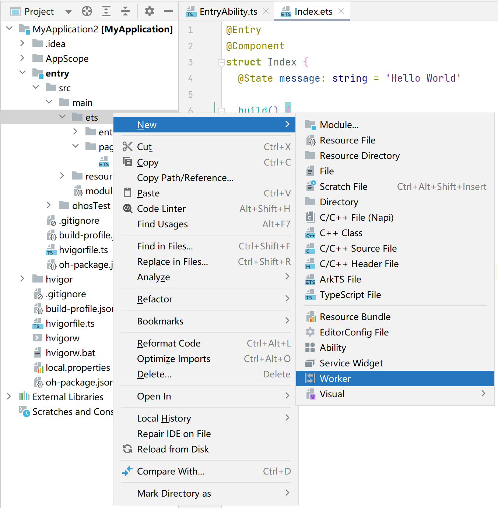

# CPU密集型任务开发指导 (TaskPool和Worker)


CPU密集型任务是指需要占用系统资源处理大量计算能力的任务，需要长时间运行，这段时间会阻塞线程其它事件的处理，不适宜放在UI主线程进行。例如图像处理、视频编码、数据分析等。


基于多线程并发机制处理CPU密集型任务可以提高CPU利用率，提升应用程序响应速度。


当任务不需要长时间（3分钟）占据后台线程，而是一个个独立的任务时，推荐使用TaskPool，反之推荐使用Worker。

接下来将以图像直方图处理以及后台长时间的模型预测任务分别进行举例。


## 使用TaskPool进行图像直方图处理

1. 实现图像处理的业务逻辑。

2. 数据分段，通过任务组发起关联任务调度。
   创建[TaskGroup](../reference/apis-arkts/js-apis-taskpool.md#taskgroup10)并通过[addTask()](../reference/apis-arkts/js-apis-taskpool.md#addtask10)添加对应的任务，通过[execute()](../reference/apis-arkts/js-apis-taskpool.md#taskpoolexecute10)执行任务组，并指定为[高优先级](../reference/apis-arkts/js-apis-taskpool.md#priority)，在当前任务组所有任务结束后，会将直方图处理结果同时返回。

3. 结果数组汇总处理。

```ts
import { taskpool } from '@kit.ArkTS';

@Concurrent
function imageProcessing(dataSlice: ArrayBuffer): ArrayBuffer {
  // 步骤1: 具体的图像处理操作及其他耗时操作
  return dataSlice;
}

function histogramStatistic(pixelBuffer: ArrayBuffer): void {
  // 步骤2: 分成三段并发调度
  let number: number = pixelBuffer.byteLength / 3;
  let buffer1: ArrayBuffer = pixelBuffer.slice(0, number);
  let buffer2: ArrayBuffer = pixelBuffer.slice(number, number * 2);
  let buffer3: ArrayBuffer = pixelBuffer.slice(number * 2);

  let group: taskpool.TaskGroup = new taskpool.TaskGroup();
  group.addTask(imageProcessing, buffer1);
  group.addTask(imageProcessing, buffer2);
  group.addTask(imageProcessing, buffer3);

  taskpool.execute(group, taskpool.Priority.HIGH).then((ret: Object) => {
    // 步骤3: 结果数组汇总处理
  })
}

@Entry
@Component
struct Index {
  @State message: string = 'Hello World'

  build() {
    Row() {
      Column() {
        Text(this.message)
          .fontSize(50)
          .fontWeight(FontWeight.Bold)
          .onClick(() => {
            let buffer: ArrayBuffer = new ArrayBuffer(24);
            histogramStatistic(buffer);
          })
      }
      .width('100%')
    }
    .height('100%')
  }
}
```


## 使用Worker进行长时间数据分析

本文通过某地区提供的房价数据训练一个简易的房价预测模型，该模型支持通过输入房屋面积和房间数量去预测该区域的房价，模型需要长时间运行，房价预测需要使用前面的模型运行结果，因此需要使用Worker。

1. DevEco Studio提供了Worker创建的模板，新建一个Worker线程，例如命名为“MyWorker”。

   

2. 在宿主线程中通过调用ThreadWorker的[constructor()](../reference/apis-arkts/js-apis-worker.md#constructor9)方法创建Worker对象。

    ```ts
    // Index.ets
    import { worker } from '@kit.ArkTS';

    const workerInstance: worker.ThreadWorker = new worker.ThreadWorker('entry/ets/workers/MyWorker.ts');
    ```

3. 在宿主线程中通过调用[onmessage()](../reference/apis-arkts/js-apis-worker.md#onmessage9)方法接收Worker线程发送过来的消息，并通过调用[postMessage()](../reference/apis-arkts/js-apis-worker.md#postmessage9)方法向Worker线程发送消息。
   例如向Worker线程发送训练和预测的消息，同时接收Worker线程发送回来的消息。

    ```ts
    // Index.ets
    let done = false;

    // 接收Worker子线程的结果
    workerInstance.onmessage = (() => {
      console.info('MyWorker.ts onmessage');
      if (!done) {
        workerInstance.postMessage({ 'type': 1, 'value': 0 });
        done = true;
      }
    })

    workerInstance.onerror = (() => {
      // 接收Worker子线程的错误信息
    })

    // 向Worker子线程发送训练消息
    workerInstance.postMessage({ 'type': 0 });
    ```

4. 在MyWorker.ts文件中绑定Worker对象，当前线程为Worker线程。

   ```ts
   // MyWorker.ts
   import { worker, ThreadWorkerGlobalScope, MessageEvents, ErrorEvent } from '@kit.ArkTS';

   let workerPort: ThreadWorkerGlobalScope = worker.workerPort;
   ```

5. 在Worker线程中通过调用[onmessage()](../reference/apis-arkts/js-apis-worker.md#onmessage9-1)方法接收宿主线程发送的消息内容，并通过调用[postMessage()](../reference/apis-arkts/js-apis-worker.md#postmessage9-2)方法向宿主线程发送消息。
    例如在Worker线程中定义预测模型及其训练过程，同时与宿主线程进行信息交互。

    ```ts
    // MyWorker.ts
    // 定义训练模型及结果
    let result: Array<number>;
    // 定义预测函数
    function predict(x: number): number {
     return result[x];
    }
    // 定义优化器训练过程
    function optimize(): void {
     result = [0];
    }
    // Worker线程的onmessage逻辑
    workerPort.onmessage = (e: MessageEvents): void => {
     // 根据传输的数据的type选择进行操作
     switch (e.data.type as number) {
      case 0:
      // 进行训练
       optimize();
      // 训练之后发送宿主线程训练成功的消息
       workerPort.postMessage({ type: 'message', value: 'train success.' });
       break;
      case 1:
      // 执行预测
       const output: number = predict(e.data.value as number);
      // 发送宿主线程预测的结果
       workerPort.postMessage({ type: 'predict', value: output });
       break;
      default:
       workerPort.postMessage({ type: 'message', value: 'send message is invalid' });
       break;
     }
    }
    ```

6. 在Worker线程中完成任务之后，执行Worker线程销毁操作。销毁线程的方式主要有两种：根据需要可以在宿主线程中对Worker线程进行销毁；也可以在Worker线程中主动销毁Worker线程。

    在宿主线程中通过调用[onexit()](../reference/apis-arkts/js-apis-worker.md#onexit9)方法定义Worker线程销毁后的处理逻辑。

    ```ts
    // Worker线程销毁后，执行onexit回调方法
    workerInstance.onexit = (): void => {
     console.info("main thread terminate");
    }
    ```

    方式一：在宿主线程中通过调用[terminate()](../reference/apis-arkts/js-apis-worker.md#terminate9)方法销毁Worker线程，并终止Worker接收消息。

    ```ts
    // 销毁Worker线程
    workerInstance.terminate();
    ```

    方式二：在Worker线程中通过调用[close()](../reference/apis-arkts/js-apis-worker.md#close9)方法主动销毁Worker线程，并终止Worker接收消息。

    ```ts
    // 销毁线程
    workerPort.close();
    ```