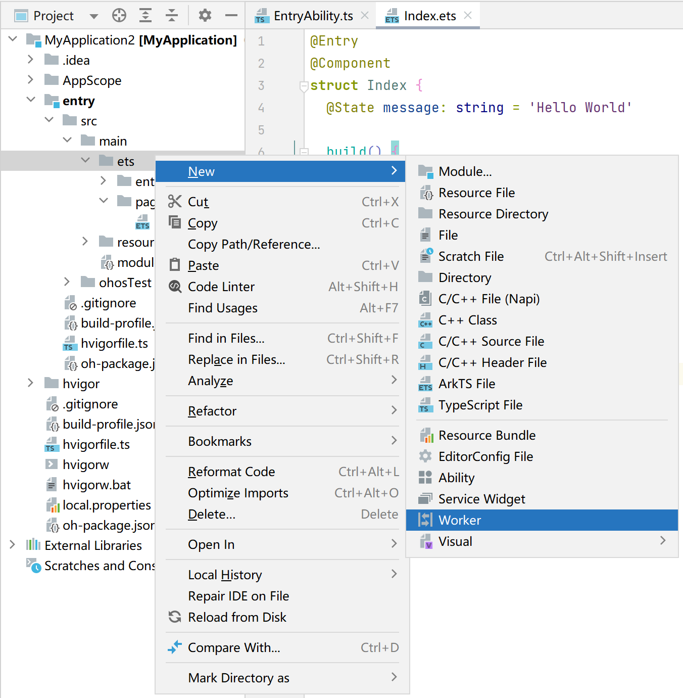

# CPU密集型任务开发指导 (TaskPool和Worker)
<!--Kit: ArkTS-->
<!--Subsystem: CommonLibrary-->
<!--Owner: @wang_zhaoyong-->
<!--Designer: @weng-changcheng-->
<!--Tester: @kirl75; @zsw_zhushiwei-->
<!--Adviser: @k1ngqaquuu-->


CPU密集型任务是指需要占用系统资源进行大量计算的任务，这类任务需要长时间运行，会阻塞线程中其他事件的处理，因此不适合在UI主线程中执行。例如图像处理、视频编码、数据分析等。


基于多线程并发机制处理CPU密集型任务可以提高CPU利用率，提升应用程序响应速度。


当任务不需要长时间（超过3分钟同步执行时长）占用后台线程，而是一个个独立的任务时，推荐使用TaskPool，反之推荐使用Worker。

接下来将分别以使用TaskPool进行图像直方图处理和使用Worker进行长时间数据分析为例进行说明。


## 使用TaskPool进行图像直方图处理

1. 实现图像处理的业务逻辑。

2. 对数据进行分段，并通过任务组发起关联任务调度。

   创建[TaskGroup](../reference/apis-arkts/js-apis-taskpool.md#taskgroup10)，通过[addTask()](../reference/apis-arkts/js-apis-taskpool.md#addtask10)添加对应的任务，然后通过[execute()](../reference/apis-arkts/js-apis-taskpool.md#taskpoolexecute10)执行任务组，并指定为[HIGH](../reference/apis-arkts/js-apis-taskpool.md#priority)优先级。在当前任务组所有任务结束后，会将直方图处理结果同时返回。

3. 汇总处理结果数组。

<!-- @[process_image_histogram](https://gitcode.com/openharmony/applications_app_samples/blob/master/code/DocsSample/ArkTS/ArkTsConcurrent/ApplicationMultithreadingDevelopment/ApplicationMultithreading/entry/src/main/ets/managers/CpuIntensiveTaskDevelopment.ets) --> 

``` TypeScript
import { taskpool } from '@kit.ArkTS';
// ...

@Concurrent
function imageProcessing(dataSlice: ArrayBuffer): ArrayBuffer {
  // 步骤1: 具体的图像处理操作及其他耗时操作
  return dataSlice;
}

async function histogramStatistic(pixelBuffer: ArrayBuffer): Promise<void> {
  // 步骤2: 分成三段并发调度
  let number: number = pixelBuffer.byteLength / 3;
  let buffer1: ArrayBuffer = pixelBuffer.slice(0, number);
  let buffer2: ArrayBuffer = pixelBuffer.slice(number, number * 2);
  let buffer3: ArrayBuffer = pixelBuffer.slice(number * 2);

  let group: taskpool.TaskGroup = new taskpool.TaskGroup();
  group.addTask(imageProcessing, buffer1);
  group.addTask(imageProcessing, buffer2);
  group.addTask(imageProcessing, buffer3);

  await taskpool.execute(group, taskpool.Priority.HIGH).then((ret: Object) => {
    // 步骤3: 结果数组汇总处理
  })
}

@Entry
@Component
struct Index {
  @State message: string = 'Hello World'

  build() {
    Row() {
      Column() {
        Text(this.message)
          .fontSize(50)
          .fontWeight(FontWeight.Bold)
          .onClick(() => {
            let buffer: ArrayBuffer = new ArrayBuffer(24);
            histogramStatistic(buffer).then(() => {
              this.message = 'success';
            }).catch((e: BusinessError) => {
              this.message = 'failed';
              console.error('histogramStatistic is failed.');
            });
            
            // ...
          })
      }
      .width('100%')
    }
    .height('100%')
  }
}
```


## 使用Worker进行长时间数据分析

本文通过某地区提供的房价数据训练一个简易的房价预测模型，该模型支持通过输入房屋面积和房间数量去预测该区域的房价，模型需要长时间运行，房价预测需要使用前面的模型运行结果，因此需要使用Worker。

1. DevEco Studio提供了Worker创建的模板，创建一个Worker线程，例如命名为“MyWorker1”。

   

2. 在宿主线程中首先调用ThreadWorker的[constructor()](../reference/apis-arkts/js-apis-worker.md#constructor9)方法创建Worker对象；然后通过注册[onmessage()](../reference/apis-arkts/js-apis-worker.md#属性)回调接收Worker线程发送过来的消息；最后通过调用[postMessage()](../reference/apis-arkts/js-apis-worker.md#postmessage9)方法向Worker线程发送消息。

   例如，向Worker线程发送训练和预测的消息，并接收Worker线程发送回来的消息。

   <!-- @[call_worker_message](https://gitcode.com/openharmony/applications_app_samples/blob/master/code/DocsSample/ArkTS/ArkTsConcurrent/ApplicationMultithreadingDevelopment/ApplicationMultithreading/entry/src/main/ets/managers/CpuIntensiveTaskDevelopment.ets) --> 
   
   ``` TypeScript
   import { worker } from '@kit.ArkTS';
   import { BusinessError } from '@kit.BasicServicesKit';
   
   const workerInstance: worker.ThreadWorker = new worker.ThreadWorker('entry/ets/workers/MyWorker1.ets');
   
   let done = false;
   
   // 接收Worker子线程的结果
   workerInstance.onmessage = (() => {
     console.info('MyWorker.ts onmessage');
     if (!done) {
       // 执行预测，传入预测条件
       workerInstance.postMessage({ 'type': 1, 'area': 80, 'room': 4 });
       done = true;
     }
   })
   
   workerInstance.onerror = (() => {
     // 接收Worker子线程的错误信息
   })
   
   // 向Worker子线程发送训练消息
   workerInstance.postMessage({ 'type': 0 });
   ```


3. 在MyWorker1.ets文件中绑定Worker对象，当前线程即为Worker线程。在Worker线程中通过注册[onmessage()](../reference/apis-arkts/js-apis-worker.md#属性-1)回调接收宿主线程发送的消息，并通过调用[postMessage()](../reference/apis-arkts/js-apis-worker.md#postmessage9-2)方法向宿主线程发送消息。

    例如，在Worker线程中定义预测模型及其训练过程，并与宿主线程进行信息交互。

    <!-- @[interact_main_thread](https://gitcode.com/openharmony/applications_app_samples/blob/master/code/DocsSample/ArkTS/ArkTsConcurrent/ApplicationMultithreadingDevelopment/ApplicationMultithreading/entry/src/main/ets/workers/MyWorker1.ets) -->
    
    ``` TypeScript
    import { worker, ThreadWorkerGlobalScope, MessageEvents, ErrorEvent } from '@kit.ArkTS';
    
    let workerPort: ThreadWorkerGlobalScope = worker.workerPort;
    
    // 假设模型为：每平米价格 = (model.areaCoefficient * area + model.roomCoefficient * room) * model.basePrice
    class PriceModel {
      public areaCoefficient: number = 0;   // 房屋面积系数
      public roomCoefficient: number = 0;   // 房间数量系数
      public basePrice: number = 0;         // 基础值
    }
    
    // 全局模型实例
    const model: PriceModel = new PriceModel();
    
    // 定义预测函数
    function predict(area: number, room: number): number {
      // 数据举例：80平米4室，房价预计为22400元每平米
      return (model.areaCoefficient * area + model.roomCoefficient * room) * model.basePrice;
    }
    
    // 定义优化器训练过程
    function optimize(): void {
      // 样例主要演示整体流程，训练过程简化处理
      model.areaCoefficient = 3;
      model.roomCoefficient = 500;
      model.basePrice = 10;
    }
    
    // Worker线程的onmessage逻辑
    workerPort.onmessage = (e: MessageEvents): void => {
      // 根据传输的数据的type选择进行操作
      switch (e.data.type as number) {
        case 0:
          // 进行训练
          optimize();
          // 训练之后给宿主线程发送训练成功的消息
          workerPort.postMessage({ type: 'message', value: 'train success.' });
          break;
        case 1:
          // 执行预测
          const output: number = predict(e.data.area as number, e.data.room as number);
          // 给宿主线程发送预测的结果
          workerPort.postMessage({ type: 'predict', value: output });
          break;
        default:
          workerPort.postMessage({ type: 'message', value: 'send message is invalid' });
          break;
      }
      // 按需销毁线程，本样例不需要
    }
    ```

4. 在Worker线程中完成任务后，可以执行销毁操作。销毁方式有两种：一是在宿主线程中销毁Worker线程；二是在Worker线程中主动销毁。

    在宿主线程中通过调用[onexit()](../reference/apis-arkts/js-apis-worker.md#属性)回调定义Worker线程销毁后的处理逻辑。

    <!-- @[after_destroy_callback](https://gitcode.com/openharmony/applications_app_samples/blob/master/code/DocsSample/ArkTS/ArkTsConcurrent/ApplicationMultithreadingDevelopment/ApplicationMultithreading/entry/src/main/ets/managers/CpuIntensiveTaskDevelopment.ets) -->
    
    ``` TypeScript
    // Worker线程销毁后，执行onexit回调方法
    workerInstance.onexit = (): void => {
      console.info('worker thread terminate');
    }
    ```

    方式一：在宿主线程中通过调用[terminate()](../reference/apis-arkts/js-apis-worker.md#terminate9)方法销毁Worker线程，并终止Worker接收消息。

    ```ts
    // 销毁Worker线程
    workerInstance.terminate();
    ```

    方式二：在Worker线程中通过调用[close()](../reference/apis-arkts/js-apis-worker.md#close9)方法主动销毁Worker线程，并终止Worker接收消息。

    ```ts
    // 销毁线程
    workerPort.close();
    ```