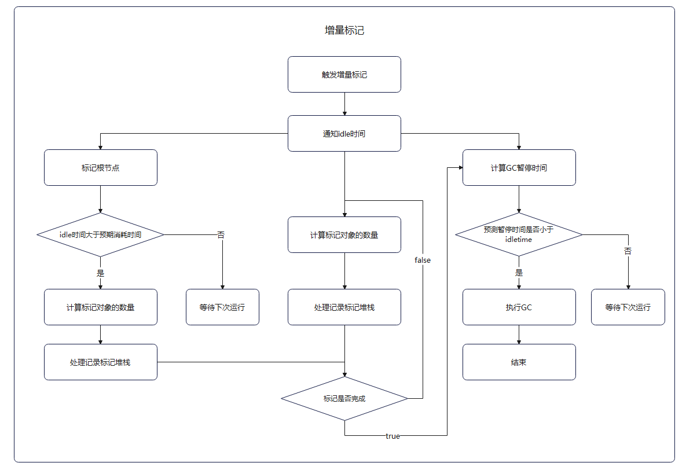
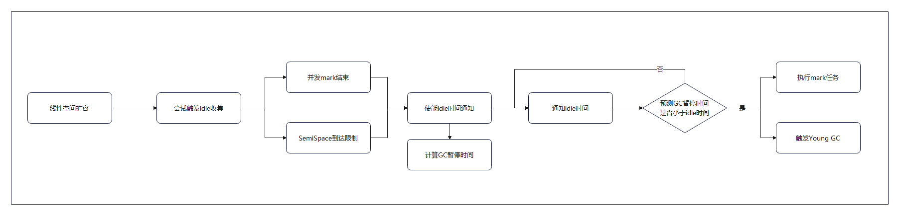

# GC介绍

GC（全称 Garbage Collection），即垃圾回收。在计算机领域，GC就是找到内存中的垃圾，释放和回收内存空间。当前主流编程语言实现的GC算法主要分为两大类：引用计数和对象追踪（即Tracing GC）。ArkTS运行时中就是基于分代模型和混合算法来实现不同场景下内存回收的高性能表现。

在ArkTS中，数据类型分为两类，简单类型和引用类型。简单类型内容直接保存在栈（Stack）中，由操作系统自动分配和释放。引用类型保存在堆（heap）中，需要引擎进行手动释放。GC就是针对堆空间的内存自动回收的管理机制。

## Heap结构及其配置参数

### Heap结构


- SemiSpace：年轻代（Young Generation），存放新创建出来的对象，存活率低，主要使用copying算法进行内存回收。
- OldSpace：老年代（Old Generation），存放年轻代多次回收仍存活的对象会被复制到该空间，根据场景混合多种算法进行内存回收。
- HugeObjectSpace：大对象空间，使用单独的region存放一个大对象的空间。
- ReadOnlySpace：只读空间，存放运行期间的只读数据。
- NonMovableSpace：不可移动空间，存放不可移动的对象。
- SnapshotSpace：快照空间，转储堆快照时使用的空间。
- MachineCodeSpace：机器码空间，存放程序机器码。

注：每个空间会有一个或多个region进行分区域管理，region是空间向内存分配器申请的单位。

### 相关参数

> **注意：**
> 
> 以下参数未提示可配置的均为不可配置项，由系统自行设定。

以下参数值有多个阶段划分的对应heap总大小64MB-128MB/128MB-256MB/大于256MB三个阶段的范围情况，剩余内存空间充足的情况下默认均为第三段大于256MB情况。

#### Semi Space

heap中会生成两个Semi Space供copying使用。

| 参数名称 | 范围 | 作用 |
| --- | --- | :--- |
| semiSpaceSize | 2MB-4MB/2MB-8MB/2MB-16MB | semispace空间大小，会根据堆总大小有不同的范围限制 |
| semiSpaceTriggerConcurrentMark | 1M/1.5M/1.5M| 首次单独触发Semi Space的并发mark的界限值，超过该值则触发 |
| semiSpaceStepOvershootSize| 2MB | 允许过冲最大大小 |

#### 其他空间

| 参数名称 | 范围 | 作用 |
| --- | --- | :--- |
| defaultReadOnlySpaceSize | 256 KB | ReadOnlySpace默认空间大小 |
| defaultNonMovableSpaceSize | 2 MB/6 MB/64 MB | NonMovableSpace默认空间大小|
| defaultSnapshotSpaceSize | 512 KB/512 KB/ 4 MB | SnapshotSpace默认空间大小|
| defaultMachineCodeSpaceSize | 2 MB/2 MB/8 MB | MachineCodeSpace默认空间大小|

#### Old Space 和 Huge Object Space

初始化时都设定为Heap剩余未分配空间的大小。

| 参数名称 | 范围 | 作用 |
| --- | --- | :--- |
| oldSpaceOvershootSize | 4MB/8MB/8MB | oldSpace允许过冲最大大小 |

#### 堆大小相关参数

| 参数名称 | 范围 | 作用 |
| --- | --- | :--- |
| HeapSize | 448MB-1024MB | 堆总大小，实际系统分配大小根据堆类型不同分配不同，或内存池不够会降低下限 |
| SemispaceSize | 2MB-4MB/2MB-8MB/2MB-16MB | semispace空间大小 |
| NonmovableSpaceSize | 2MB/6MB/64MB | nonmovableSpace空间大小 |
| SnapshotSpaceSize | 512KB | 快照空间大小， |
| MachineCodeSpaceSize | 2MB | 机器码空间大小 |

#### worker线程堆上限

| 参数名称 | 范围 | 作用 |
| --- | --- | --- |
| heapSize  | 768 MB | work类型heap空间大小 |

#### 解释器栈大小

| 参数名称 | 范围 | 作用 |
| --- | --- | --- |
| maxStackSize | 128KB | 控制解释器栈帧大小 |

#### 并发参数

| 参数名称 | 值 | 作用 |
| --- | ---: | --- |
| gcThreadNum | 7 | gc线程数量，默认为7，可通过`gc-thread-num`参数自行设定该参数值 |
| MIN_TASKPOOL_THREAD_NUM | 3 | 线程池最小线程数 |
| MAX_TASKPOOL_THREAD_NUM | 7 | 线程池最大线程数 |

注：该线程池主要用于执行GC流程中的并发任务，实际线程池初始化综合参考gcThreadNum以及线程上下限，gcThreadNum为负值时初始化线程池线程数 = cpu核心数/2

#### 其他参数

| 参数名称 | 值 | 作用 |
| --- | --- | --- |
| minAllocLimitGrowingStep | 2M/4M/8M | heap整体重新计算空间大小限制时，控制oldSpace、heapObject和globalNative的最小增长步长 |
| minGrowingStep | 4M/8M/16M | 调整oldSpace的最小增长步长 |
| longPauseTime | 40ms | 判断是否为超长GC界限，超长GC会触发完整GC日志信息打印，方便开发者定位分析。可通过`gc-long-paused-time`进行配置 |

### 其他：新增单VM内ArrayBuffer的native总内存上限为4GB

## GC流程


### HPPGC

#### Young GC

- **触发机制：** 年轻代GC触发阈值在2MB-16MB变化,根据分配速度和存活率等会变化。
- **说明：** 主要回收semi space新分配的年轻代对象。
- **场景：** 前台场景
- **日志关键词：** [ HPP YoungGC ]

#### Old GC

- **触发机制：** 老年代GC触发阈值在20MB-300多MB变化，大部分情况，第一次Old GC的阈值在20M左右，之后会根据对象存活率，内存占用大小进行阈值调整。
- **说明：** 对年轻代和部分老年代空间做整理压缩，其他空间做sweep清理。触发频率比年轻代GC低很多，由于会做全量mark，因此GC时间会比年轻代GC长，单次耗时约5ms~10ms。
- **场景：** 前台场景
- **日志关键词：**[ HPP OldGC ]

#### Full GC

- **触发机制：** 不会由内存阈值触发。应用切换后台之后，如果预测能回收的对象尺寸大于2M会触发一次Full GC。DumpHeapSnapshot 和 AllocationTracker 工具默认会触发Full GC。Native 接口和JS/TS 也有接口可以触发。
- **说明：** 会对年轻代和老年代做全量压缩，主要用于性能不敏感场景，最大限度回收内存空间。
- **场景：** 后台场景
- **日志关键词：**[ CompressGC ]

此后的Smart GC或者 IDLE GC 都是在上述三种GC中做选择。

### 触发策略

#### 空间阈值触发GC

- 函数方法：`AllocateYoungOrHugeObject`，`AllocateHugeObject`，等分配函数
- 限制参数：对应的空间阈值
- 说明：对象申请空间到达对应空间阈值时触发GC
- 典型日志：日志可区分GCReason::ALLOCATION_LIMIT

#### native绑定大小达到阈值触发GC

- 函数方法：`GlobalNativeSizeLargerThanLimit`
- 限制参数：`globalSpaceNativeLimit`
- 说明：影响是否进行全量mark，以及是否开始并发mark

#### 切换后台触发GC

- 函数方法：`ChangeGCParams`
- 说明：切换后台主动触发一次Full GC
- 典型日志：`app is inBackground`，`app is not inBackground`
  GC 日志中可区分GCReason::SWITCH_BACKGROUND

### 执行策略

#### ConcurrentMark

- 函数方法：`TryTriggerConcurrentMarking`
- 说明：尝试触发并发mark，将遍历对象进行标记的任务交由线程池中并发运行，减少主线程挂起时间。
- 典型日志：`fullMarkRequested, trigger full mark.`,`Trigger the first full mark`,`Trigger full mark`,`Trigger the first semi mark`,`Trigger semi mark`

#### new space GC前后的阈值调整

- 函数方法：`AdjustCapacity`
- 说明： 在GC后调整SemiSpace触发水线，优化空间结构。
- 典型日志：无直接日志，可以通过GC统计日志看出，GC前 young space 的阈值有动态调整。

#### 第一次OldGC后阈值的调整

- 函数方法：`AdjustOldSpaceLimit`
- 说明：根据最小增长步长以及平均存活率调整OldSpace阈值限制
- 典型日志：`"AdjustOldSpaceLimit oldSpaceAllocLimit_: " << oldSpaceAllocLimit << " globalSpaceAllocLimit_: " << globalSpaceAllocLimit_;`

#### 第二次及以后的OldGC对old Space/global space阈值调整，以及增长因子的调整

- 函数方法：`RecomputeLimits`
- 说明：根据当前GC统计的数据变化重新计算调整`newOldSpaceLimit`，`newGlobalSpaceLimit`，`globalSpaceNativeLimit`和增长因子
- 典型日志：`"RecomputeLimits oldSpaceAllocLimit_: " << newOldSpaceLimit_ << " globalSpaceAllocLimit_: " << globalSpaceAllocLimit_ << " globalSpaceNativeLimit_:" << globalSpaceNativeLimit_;`

#### PartialGC的Cset 选择策略

- 函数方法：`OldSpace::SelectCSet()`
- 说明：PartialGC执行时采用该策略选择存活对象数量少，回收代价小的Region优先进行GC。
- 典型日志：`Select CSet failure: number is too few`,
  `"Max evacuation size is 6_MB. The CSet region number: " << selectedRegionNumber;`,
  `"Select CSet success: number is " << collectRegionSet_.size();`

## 特性

### Smart GC

#### 特性介绍

在应用性能敏感场景，通过将js线程(SmartGC对worker线程和taskpool线程不生效)GC触发水线临时调整到js堆最大值（js线程默认448MB），尽量避免触发GC导致应用掉帧。如果敏感场景持续时间过久，对象分配已经达到了堆最大值，则还是会触发GC，且这次GC由于积累的对象太多，GC时间会相对较久。

#### 支持敏感场景

- 应用冷启动（默认支持）
- 应用滑动
- 应用点击页面跳转
- 超长帧

除应用冷启动是默认支持，其他敏感场景均为调用dfxjsnapi接口进行设置且无本质区别。

日志关键词: “SmartGC”

#### 交互流程


标记性能敏感场景，在进入和退出性能敏感场景时，在堆上标记，避免不必要的GC，维持高性能表现。

### IDLE GC

利用系统绘帧过程中存在的线程idletime，高效利用计算资源分段完成完整的GC工作，减少后续累积内存占用触发长GC造成的卡顿。

#### **Incremental Mark**

完成old gc通常需要消耗较多时间，一次idle time很难完成此项任务，因此将mark过程分布在多次idle time中完成。



在线性空间扩容时尝试进行Incremental Mark，满足以下条件则触发增量标记：

- 在ArkProperties里打开ENABLE_IDLE_GC且收到了元能力发送的idleTime开关回调函数；
- 当前无idleTask且未触发ConcurrentMark；
- 增量标记完成时，堆大小距到达水线小于256K；
- 增量标记期间分配对象大小小于100_KB

注：Incremental Mark与Full ConcurrentMark互斥。线性空间主要指的是semiSpace。

#### **Idle YoungGC**



在线性空间扩容时尝试进行Idle Collection，满足以下条件则设置相应的IdleTask：

- 在ArkProperties里打开ENABLE_IDLE_GC且收到了元能力发送的idleTime开关回调函数；
- 当前无idleTask且未触发ConcurrentMark；
- 堆大小小于触发YoungGC ConcurrentMark水线256K以内；

注：Idle YoungGC可与ConcurrentMark共存（防止还未接收到IdleTime就达到GC水线），可先触发ConcurrentMark，后开始Idle YoungGC.

## GC开发者调试接口

> **注意：**
> 以下接口仅供调试使用，非正式对外SDK接口，不应在应用正式版本中使用。

### ArkTools.hintGC()

- 调用方式：`ArkTools.hintGC()`
- 接口类型：js接口
- 作用：调用后由VM主动触发判断当前是否适合进行一次full GC。后台场景、内存预期存活率低于设定值，则会触发，判断为敏感状态则不会触发。
- 使用场景：开发者提示系统进行GC
- 典型日志：无直接日志，仅可区分外部触发（`GCReason::EXTERNAL_TRIGGER`）

### ArkTools.forceFullGC()

- 调用方式：`ArkTools.forceFullGC()`
- 接口类型：js接口
- 作用：直接触发一次GC，当前线程的local heap触发Full GC，shared heap触发Shared GC。
- 使用场景：大桌面，开发者调试
- 典型日志：无直接日志，仅可区分外部触发（`GCReason::EXTERNAL_TRIGGER`）

使用参考

```
// 首先需要声明接口
declare class ArkTools {
     static forceFullGC(): void;
     static hintGC(): void;
}

@Entry
@Component
struct Index {
  @State message: string = 'Hello World';
  build() {
  Row() {
    Column() {
      Text(this.message)
        .fontSize(50)
        .fontWeight(FontWeight.Bold)
  
      Button("触发FullGC").onClick((event: ClickEvent) => {
          ArkTools.forceFullGC();  //方法内直接调用
      })
     Button("触发HintGC").onClick((event: ClickEvent) => {
         ArkTools.hintGC();  //方法内直接调用
     })
    }
    .width('100%')
  }
  .height('100%')
}
}
```


