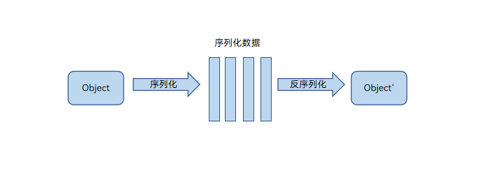

# ArkTS线程间通信概述

线程间通信指并发多线程间的数据交换行为。由于ArkTS语言兼容TS/JS，其运行时实现与其它JS引擎一样，采用基于Actor内存隔离的并发模型。

在ArkTS线程间通信中，不同数据对象的行为存在差异。例如，普通JS对象、ArrayBuffer对象和SharedArrayBuffer对象在跨线程时的处理方式不同，涉及序列化、反序列化、数据转移和数据共享等操作。

以JS对象为例，其在并发任务间的通信采用了标准的Structured Clone算法（序列化和反序列化）。该算法通过序列化将JS对象转换为与引擎无关的数据（如字符串或内存块），在另一个并发任务中通过反序列化还原成与原JS对象内容一致的新对象。因此，需要进行深拷贝，效率较低。除了支持JS标准的序列化和反序列化能力，还支持绑定Native的JS对象的传输，以及[Sendable对象](arkts-sendable.md)的共享能力。

ArkTS目前主要提供两种并发能力支持线程间通信：TaskPool和Worker。

- Worker是Actor并发模型标准的跨线程通信API，与Web Worker或者Node.js Worker的使用方式基本一致。

- TaskPool提供了功能更强、并发编程更简易的任务池API。其中TaskPool涉及跨并发任务的对象传递行为与Worker一致，还是采用了标准的Structured Clone算法，并发通信的对象越大，耗时就越长。

基于ArkTS提供的TaskPool和Worker并发接口，支持多种线程间通信能力，可以满足不同[线程间通信场景](independent-time-consuming-task.md)。如独立的耗时任务、多个耗时任务、TaskPool线程与宿主线程通信、Worker线程与宿主线程的异步通信、Worker同步调用宿主线程的接口等。此外，通过[Node-API](../napi/napi-introduction.md)机制，C++线程可以跨线程调用ArkTS接口。

图1 序列化反序列化原理图

