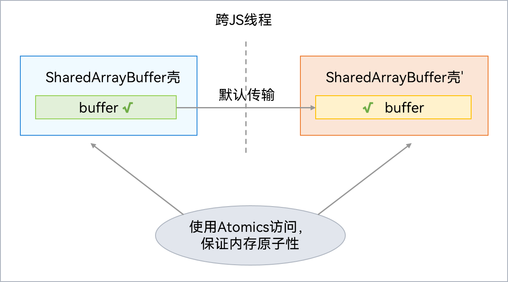

# SharedArrayBuffer对象
<!--Kit: ArkTS-->
<!--Subsystem: CommonLibrary-->
<!--Owner: @wang_zhaoyong-->
<!--SE: @weng-changcheng-->
<!--TSE: @kirl75; @zsw_zhushiwei-->

SharedArrayBuffer内部包含一块Native内存，其JS对象壳被分配在虚拟机本地堆（LocalHeap）。支持跨并发实例间共享Native内存，但是对共享Native内存的访问及修改需要采用Atomics类，防止数据竞争。SharedArrayBuffer可用于多个并发实例间的状态或数据共享。通信过程如下图所示：




## 使用示例

使用TaskPool传递Int32Array对象，实现如下：

```ts
import { taskpool } from '@kit.ArkTS';

@Concurrent
function transferAtomics(arg1: Int32Array) {
  console.info("wait begin::");
  // 使用Atomics进行操作
  let res = Atomics.wait(arg1, 0, 0, 3000);
  return res;
}

// 定义可共享对象
let sab: SharedArrayBuffer = new SharedArrayBuffer(20);
let int32 = new Int32Array(sab);
let task: taskpool.Task = new taskpool.Task(transferAtomics, int32);
taskpool.execute(task).then((res) => {
  console.info("this res is: " + res);
});
setTimeout(() => {
  Atomics.notify(int32, 0, 1);
}, 1000);
```
<!-- @[example_pass_obj](https://gitcode.com/openharmony/applications_app_samples/blob/master/code/DocsSample/ArkTS/ArkTsConcurrent/ConcurrentThreadCommunication/InterThreadCommunicationObjects/CommunicationObjects/entry/src/main/ets/managers/SharedArrayBufferObject.ets) -->
