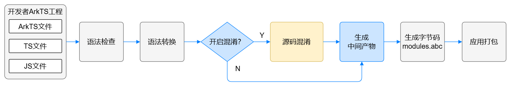
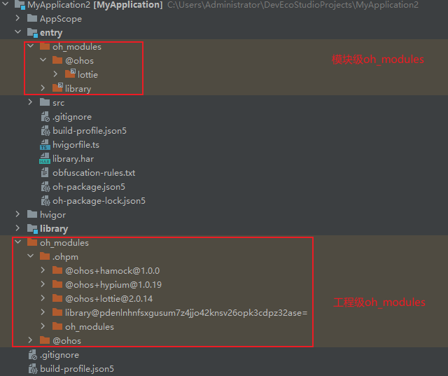

# ArkGuard混淆原理及功能
<!--Kit: ArkTS-->
<!--Subsystem: ArkCompiler-->
<!--Owner: @zju-wyx-->
<!--Designer: @xiao-peiyang; @dengxinyu-->
<!--Tester: @kirl75; @zsw_zhushiwei-->
<!--Adviser: @foryourself-->

## 术语清单

| 名词 | 释义 |
| --- | --- |
| [HAP](../quick-start/hap-package.md) | HAP（Harmony Ability Package）是应用安装和运行的基本单元。HAP包是由代码、资源、第三方库、配置文件等打包生成的模块包。 |
| [HAR](../quick-start/har-package.md) | HAR（Harmony Archive）是静态共享包，通过HAR可以实现多个模块或多个工程共享ArkUI组件、资源等相关代码。通过Static Library创建HAR模块。 |
| [HSP](../quick-start/in-app-hsp.md) | HSP（Harmony Shared Package）是动态共享包，通过HSP可以实现代码和资源的共享。通过Shared Library创建HSP模块。 |
| 本地HAR | 源码形式的HAR模块。 |
| 远程HAR | 构建后打包生成的HAR包。 |
| 本地HSP | 源码形式的HSP模块。 |
| 远程HSP | 构建后打包生成的HSP包。 |
| 三方库 | 由第三方开发并发布的库，发布到OHPM中心仓，供其他应用使用。 |
| 名称混淆 | 将代码中的类名、方法名、变量名、属性名、export变量名等标识符修改为简洁且无意义的修饰符。 |

## 混淆能力范围

### 适用语言
ArkGuard支持ArkTS、TS和JS语言，不支持C/C++、JSON、资源文件等。

### 混淆能力
ArkGuard支持名称混淆、代码压缩和注释删除的基础混淆功能，不支持控制流混淆、数据混淆等高级混淆功能。

名称混淆主要提供**名称重命名**和**配置保留白名单**的能力。
  
### 混淆能力局限性

**1.语言的限制**

源码混淆工具在处理不同编程语言时，其类型分析机制、混淆策略和执行效率都会因目标语言的特性而呈现差异。以业界常用的ProGuard为例，其主要面向Java这类强类型语言进行混淆。由于强类型语言具有严格的类型系统，每个类型都有明确的定义来源。这种特性使得混淆过程中的类型关系追踪和处理更为精确，从而大幅减少了需要配置保留规则的场景。

相比之下，ArkGuard混淆工具主要针对JS、TS和ArkTS语言。JS支持运行时动态修改对象和函数，而混淆是在编译阶段进行的静态处理，这种差异可能导致混淆后的名称在运行时无法被正确解析，进而引发运行时异常。TS和ArkTS虽然引入了静态类型系统，但采用了结构性类型机制，即具有相同结构的不同命名类型会被视为等价类型。因此，在TS和ArkTS中仍然无法追溯类型的确切来源。  
基于这些特性，使用ArkGuard时需要对更多语法场景进行白名单配置，同时，ArkGuard采用全局生效的属性保留机制，根据白名单统一保留所有同名属性，无法针对特定类型精确保留。

具体示例如下：

假设ArkGuard支持配置指定类型的白名单。配置类A1作为白名单，A1的属性prop1在白名单中，而A2的prop1属性不在白名单中。a2作为参数传入test函数，并在test函数内访问其属性。混淆前，可以正常访问prop1属性；混淆后，A1的属性prop1未被混淆，但A2的prop1属性被混淆，导致test函数中访问prop1属性时功能异常
因此，ArkGuard不支持针对特定类型的精确保留配置。

```typescript
// 混淆前
class A1 {
  prop1: string = '';
}

class A2 {
  prop1: string = '';
}

function test(input: A1) {
  console.info(input.prop1);
}

let a2 = new A2();
a2.prop1 = 'prop a2';
test(a2);
```

```typescript
// 混淆后
class A1 {
  prop1: string = '';
}

class A2 {
  a: string = '';
}

function test(input: A1) {
  console.info(input.prop1);
}

let a2 = new A2();
a2.a = 'prop a2';
test(a2);
```

综上所述，开发者应了解语言差异对混淆效果的影响，尽量使用不重复的名称，优化混淆效果。

**2.安全保证的有限性**

与其他源码混淆工具类似，混淆只能在一定程度上增加逆向工程的难度，并不能完全阻止逆向工程。

并且，由于ArkGuard混淆工具仅支持基础混淆功能，开发者不应只依赖ArkGuard来保证应用的安全性，对于源码安全有高要求的开发者，应考虑使用[应用加密](https://developer.huawei.com/consumer/cn/doc/harmonyos-guides/code-protect)、安全加固等安全措施来保护代码。

## 混淆机制及流程

下图为应用编译的简要流程图：



开发者可以在模块的build-profile.json5配置文件中开启混淆功能，详细参考[ArkGuard混淆开启指南](source-obfuscation-guide.md)，从而在编译打包的过程中自动对源码进行混淆处理。

混淆过程中，首先读取混淆开关。在开关开启的情况下，解析混淆配置文件，并依据[混淆规则合并策略](#混淆规则合并策略)合并混淆规则。然后按照混淆规则对经过语法转换的中间文件进行混淆，最后将混淆后的中间文件落盘至build目录。开发者可以通过build目录中混淆后的产物，确认混淆效果。

在使用混淆功能前，建议开发者先通过文档了解[混淆选项的能力](source-obfuscation.md#混淆选项)与[混淆选项所需要保留白名单的场景](source-obfuscation.md#保留选项)，再根据开发需求选择对应的混淆功能。


## 混淆选项

### 已有混淆选项汇总

| 功能 | 选项 |
| --- | --- |
| 默认混淆 | 开启混淆后生效 |
| 关闭混淆 | [`-disable-obfuscation`](#-disable-obfuscation) |
| 开启属性名称混淆 | [`-enable-property-obfuscation`](#-enable-property-obfuscation) |
| 开启字符串属性名称混淆 | [`-enable-string-property-obfuscation`](#-enable-string-property-obfuscation) |
| 开启顶层作用域名称混淆 | [`-enable-toplevel-obfuscation`](#-enable-toplevel-obfuscation) |
| 开启导入导出名称混淆 | [`-enable-export-obfuscation`](#-enable-export-obfuscation) |
| 开启文件名混淆 | [`-enable-filename-obfuscation`](#-enable-filename-obfuscation) |
| 代码压缩 | [`-compact`](#-compact) |
| 声明文件注释删除 | [`-remove-comments`](#-remove-comments) |
| 删除console.*语句 | [`-remove-log`](#-remove-log) |
| 名称缓存输出 | [`-print-namecache`](#-print-namecache) |
| 名称缓存复用 | [`-apply-namecache`](#-apply-namecache) |
| 输出未混淆名单 | [`-print-kept-names`](#-print-kept-names) |
| 缩减语言预置白名单 | [`-extra-options strip-language-default`](#-extra-options-strip-language-default) |
| 缩减系统预置白名单 | [`-extra-options strip-system-api-args`](#-extra-options-strip-system-api-args) |
| 保留声明文件参数 | [`-keep-parameter-names`](#-keep-parameter-names) |
| 合并依赖模块选项 | [`-enable-lib-obfuscation-options`](#-enable-lib-obfuscation-options) |
| 通过注释在源码中标记白名单 | [`-use-keep-in-source`](#-use-keep-in-source) |

### 默认混淆

开启混淆后默认生效，仅混淆局部变量名及参数名。

### -disable-obfuscation

关闭所有混淆。

配置该选项后，默认混淆（仅混淆局部变量及参数名）和其他已配置的混淆选项、保留选项将全部失效。

### -enable-property-obfuscation

配置该选项后，开启属性名称混淆，效果如下：

  ```
  // 混淆前：
  class TestA {
    static prop1: number = 0;
  }
  TestA.prop1;
  ```

  ```
  // 混淆后：
  class TestA {
    static i: number = 0;
  }
  TestA.i;
  ```

配置该选项后，所有属性名将被混淆，以下场景除外：

* 在未开启`-enable-export-obfuscation`选项的情况下，被`import/export`直接导入或导出的类或对象的属性名不会被混淆。例如，下面例子中的属性名`data`不会被混淆。

    ```
    export class MyClass {
       data: string;
    }
    ```

* ArkUI组件中的属性名不会被混淆。例如，下面例子中的`message`和`data`不会被混淆。

    ```
    @Component struct MyExample {
        @State message: string = "hello";
        data: number[] = [];
        // ...
    }
    ```

* 被[保留选项](#-keep-property-name)指定的属性名不会被混淆。
* SDK API列表中的属性名不会被混淆。SDK API列表是构建时从SDK中自动提取出来的一个名称列表。其缓存文件为systemApiCache.json，路径为工程目录/build/default/cache/{...}/release/obfuscation。
* 字符串字面量属性名不会被混淆。例如，下面例子中的`exampleName`和`exampleAge`不会被混淆。

    ```
    let person = {"exampleName": "abc"};
    person["exampleAge"] = 22;
    ```

* 注解成员名不会被混淆。例如，下面例子中的`authorName`和`revision`不会被混淆。

    ```
    @interface MyAnnotation {
      authorName: string;
      revision: number = 1;
    }
    ```

### -enable-string-property-obfuscation

若要混淆字符串字面量属性名，需在已启用`-enable-property-obfuscation`的情况下使用。例如：

  ```
  -enable-property-obfuscation
  -enable-string-property-obfuscation
  ```

根据上述配置，`exampleName`和`exampleAge`的混淆效果如下：

  ```
  // 混淆前：
  let person = {"exampleName": "abc"};
  person["exampleAge"] = 22;
  ```

  ```
  // 混淆后：
  let person = {"a": "abc"};
  person["b"] = 22;
  ```


**使用该选项时，需要注意以下事项：**

1. 如果代码里面有字符串属性名包含特殊字符（除了`a-z、A-Z、0-9、_`之外的字符），例如`let obj = {"\n": 123, "": 4, " ": 5}`，建议不要开启`-enable-string-property-obfuscation`选项，因为可能无法通过[-keep-property-name](#-keep-property-name)来保留这些名称。

2. SDK API的属性白名单中不包含声明文件中使用的字符串常量值，例如示例中的字符串'ohos.want.action.home'未包含在属性白名单中。

    ```ts
    // SDK API文件@ohos.app.ability.wantConstant片段：
    export enum Params {
      ACTION_HOME = 'ohos.want.action.home'
    }

    // 开发者源码示例：
    const obj: Record<string, string> = {
      'ohos.want.action.home': 'value'
    }
    let params = obj['ohos.want.action.home'];
    ```

    因此，在开启`-enable-string-property-obfuscation`选项后，如果希望保留代码中使用的SDK API字符串常量的属性不被混淆，例如obj['ohos.want.action.home']，可以使用[-keep-property-name](#-keep-property-name)选项进行保留。

### -enable-toplevel-obfuscation

开启顶层作用域名称混淆，效果如下：

  ```
  // 混淆前：
  let count = 0;
  ```

  ```
  // 混淆后：
  let s = 0;
  ```

配置该选项后，所有顶层作用域的名称都会被混淆，以下场景除外：

* 在未开启`-enable-export-obfuscation`选项的情况下，被`import/export`直接导入或导出的名称不会被混淆。
* 当前文件找不到声明的名称不会被混淆。
* 被[保留选项](#-keep-global-name)指定的顶层作用域名称不会被混淆。
* SDK API列表中的顶层作用域名称不会被混淆。

### -enable-export-obfuscation

开启直接导入或导出的名称混淆，效果如下：

  ```
  // 混淆前：
  namespace ns {
    export type customT = string;
  }
  ```

  ```
  // 混淆后：
  namespace ns {
    export type h = string;
  }
  ```

若仅配置该选项，那么只有非顶层作用域中导入或导出的名称会被混淆。**若想混淆顶层作用域中导入或导出的名称，需要在已配置`-enable-toplevel-obfuscation`的基础上使用；若想混淆导入或导出的属性名，需要在已配置`-enable-property-obfuscation`的基础上使用。** 开启此选项时，以下特殊场景不会被混淆：

* 远程HAR(真实路径在oh_modules中的包)中导出的名称和属性名不会被混淆。
* 被[保留选项](#保留选项)指定的名称与属性名不会被混淆。
* SDK API列表中的名称不会被混淆。

### -enable-filename-obfuscation

开启文件/文件夹名称混淆，效果如下：

  ```
  // 混淆前：
  import * as m from '../test1/test2';
  import { foo } from '../test1/test2';
  const module = import('../test1/test2');
  ```


  ```
  // 混淆后：
  import * as m from '../a/b';
  import { foo } from '../a/b';
  const module = import('../a/b');
  ```

配置该选项后，所有文件和文件夹名称都将被混淆，以下场景除外：

* oh-package.json5文件中'main'、'types'字段配置的文件/文件夹名称不会被混淆。
* 模块内module.json5文件中'srcEntry'字段配置的文件/文件夹名称不会被混淆。
* 被[-keep-file-name](#-keep-file-name)指定的文件/文件夹名称不会被混淆。
* 非ECMAScript模块引用方式（例如：`const module = require('./module')`）。
* 非路径引用方式，例如`import module from 'json5'`中的`json5`不会被混淆。

>**注意**：
>
>由于系统会在应用运行时加载某些指定的文件，针对这类文件，开发者需要手动在[-keep-file-name](#-keep-file-name)选项中配置相应的白名单，防止指定文件被混淆，导致运行失败。
>
>编译入口、Ability组件、Worker多线程，这三种不能混淆的文件名在DevEco Studio 5.0.3.500及以上版本已被自动收集进白名单中，无需再手动配置，其它不能混淆文件名的场景仍需开发者手动配置。

### -compact

删除在代码中不参与语法结构、不影响程序运行的空格符和所有的换行符。

配置该选项后，所有代码会被压缩到一行。效果如下：

  ```
  // 混淆前：
  class TestA {
    static prop1: number = 0;
  }
  TestA.prop1;
  ```

  ```
  // 混淆后：
  class TestA { static prop1: number = 0; } TestA.prop1;
  ```

>**注意**：
>
>release模式构建的应用栈信息仅包含代码行号，不包含列号，因此-compact功能开启后无法依据报错栈中的行号定位到源码具体位置。

### -remove-comments

删除编译生成的声明文件中的JsDoc注释，效果如下：

混淆前：
  ```
  /**
   * @todo
   */
  declare let count: number;
  ```

混淆后：
  ```
  declare let count: number;
  ```

使用[`-keep-comments`](#-keep-comments)配置保留声明文件中的JsDoc注释。

>**注意**：
>
>编译生成的源码文件中的注释默认全部删除，不支持保留配置。

### -remove-log

删除对console.*语句的调用，要求console.*语句的返回值未被使用。效果如下：
  ```
  // 混淆前：
  if (flag) {
    console.info("hello");
  }
  ```

  ```
  // 混淆后：
  if (flag) {
  }
  ```

若配置该选项，以下场景中的console.*语句将被删除。

1. 文件顶层的调用。  
   例如：
   ```js
   console.info("in tolevel");
   ```
2. 代码块中的调用。  
   例如：
   ```
   function foo() {
    console.info('in block');
   }
   ```
3. module或namespace中的调用。  
   例如：
   ```
   namespace ns {
    console.info('in ns');
   }
   ```
4. switch语句中的调用。  
   例如：
   ```js
   switch (value) {
     case 1:
       console.info("in switch case");
       break;
     default:
       console.warn("default");
   }
   ```

### -print-namecache

将名称缓存保存到指定的文件路径*filepath*中，名称缓存包含名称混淆前后的映射。其中，*filepath*为必选参数，支持相对路径和绝对路径，相对路径的起始位置为混淆配置文件的当前目录。*filepath*参数中的文件名请使用`.json`为后缀。

例如：
```
-print-namecache
./customCache/nameCache.json
```

>**注意**：
>
>每次全量构建工程都会生成新的nameCache.json文件，因此发布新版本时需保存该文件的副本。

### -apply-namecache

复用指定的名称缓存文件*filepath*。*filepath*为必选参数，支持相对路径和绝对路径。相对路径的起始位置为混淆配置文件的当前目录。*filepath*参数中的文件名请以`.json`为后缀。
该选项适用于增量编译。开启后，名称将根据缓存映射进行混淆。如果找不到对应的缓存，名称将被混淆为新的随机名称。

例如：
```
-apply-namecache
./customCache/nameCache.json
```

默认情况下，DevEco Studio在临时缓存目录中保存缓存文件，并在增量编译时自动应用。
缓存目录：build/default/cache/{...}/release/obfuscation。

### -print-kept-names

该选项支持输出未混淆名单和全量白名单，并支持配置*filepath*。*filepath*为可选参数，仅支持相对路径。相对路径的起始位置为混淆配置文件的当前目录。*filepath*参数中的文件名请以`.json`为后缀。

从API version 18开始，支持输出未混淆名单和全量白名单。

当*filepath*参数缺省时，未混淆名单（keptNames.json）和全量白名单（whitelist.json）默认输出到缓存路径`build/default/cache/{...}/release/obfuscation`中。

若开发者配置了*filepath*参数，未混淆名单将输出到*filepath*参数指定的路径。

一次全量编译流程中收集到的白名单分为以下七种：

(1)'sdk'：表示系统api。

(2)'lang'：表示语言中的关键字。

(3)'conf'：表示用户配置的保留选项中的白名单。

(4)'struct'：表示ArkUI的struct中的属性。

(5)'exported'：表示被导出的名称及其属性。

(6)'strProp'：表示字符串属性。

(7)'enum'：表示enum中的成员。

其中，'sdk'类白名单单独输出到缓存路径`build/default/cache/{...}/release/obfuscation/`下的`systemApiCache.json`文件中，其他类型白名单则都输出到`whitelist.json`文件中。

未混淆名单（keptNames.json）中包含未混淆的名称及其原因。未混淆的原因包括：与SDK白名单重名、与语言白名单重名、与用户配置白名单重名、与结构体白名单重名、与导出白名单重名、与字符串属性白名单重名（未开启[字符串属性混淆](#-enable-string-property-obfuscation)的情况下）以及与枚举白名单重名。

**使用该选项时，需要注意以下事项：**

1. 在编译HAR模块且开启属性混淆的情况下，'enum'白名单将收集enum中的成员名称。

    例如：
    ```ts
    enum Test {
      member1,
      member2
    }
    ```
    enum白名单内容为['member1', 'member2']。这是由于历史版本的har模块的编译中间产物为js文件，在js文件中enum类型会转换为一个立即执行函数，而enum成员会被转化为一个字符串属性和一个字符串常量。因此，为了保证开启属性混淆的情况下功能正常，需要将enum成员名称收集为白名单。在编译新版字节码har模块时，此特性仍然被保留。

2. 在编译HAP/HSP/字节码HAR模块且开启属性混淆的情况下，当enum的成员被初始化时，'enum'白名单会收集初始化表达式中包含的变量名称。

    例如：
    ```ts
    let outdoor = 1;
    enum Test {
      member1,
      member2 = outdoor + member1 + 2
    }
    ```
    其中，编译HAP/HSP模块时，enum白名单内容为['outdoor', 'member1']；编译字节码HAR模块时，enum白名单内容为['outdoor', 'member1', 'member2']。

### -extra-options strip-language-default

混淆的预置语言白名单中**默认包含了typescript的系统接口中关于dom、webworker、scriphost等API的名称以及Web API的名称**。如果开发者源码中的属性与这部分名称重名，混淆工具会对这些属性进行保留。

如果开发者需要混淆这部分代码，需要配置`-extra-options strip-language-default`选项。

从API version 18开始，支持此选项。

开发者可通过以下方式确定混淆工具默认保留的API的具体减少范围：

开启`-print-kept-names`选项，对比开启和关闭`-extra-options strip-language-default`选项时，全量白名单（whitelist.json）中`lang`字段的内容差异，该差异即为预置语言白名单的具体减少范围。

### -extra-options strip-system-api-args

当前混淆的系统API白名单中**默认包含了系统API中的局部变量名称**，且系统API白名单默认对开发者源码中的局部变量生效。如果开发者源码中的属性与系统API中的局部变量重名或源码中的局部变量与系统API白名单重名，混淆工具会对这部分属性和局部变量名称进行保留。

需要混淆这部分代码时，配置`-extra-options strip-system-api-args`选项。

从API version 18开始，支持此选项。

系统API白名单文件（systemApiCache.json）的ReservedLocalNames、ReservedPropertyNames和ReservedGlobalNames字段可以查看系统API白名单的具体内容。系统API白名单文件位于模块目录下build/default/cache/{...}/release/obfuscation路径中，记录了SDK中的接口与属性名称，与其重名的源码不会被混淆。

开发者可通过以下方式确定系统白名单减少的具体范围：

通过对比开启和关闭`-extra-options strip-system-api-args`选项时系统API白名单文件（systemApiCache.json）中ReservedLocalNames和ReservedPropertyNames字段的内容差异，该差异即为系统白名单的具体减少范围，ReservedGlobalNames字段的内容不会产生变化。

**使用-extra-options选项的方法如下**：

在混淆配置文件中添加`-extra-options`前缀和选项，且前缀与选项之间不能包含其他内容。支持开启单个选项或同时开启两个选项。例如：

单个选项：

```
-extra-options
strip-language-default

-extra-options strip-language-default
```

同时开启两个选项：

```
-extra-options strip-language-default, strip-system-api-args

-extra-options strip-language-default strip-system-api-args

-extra-options strip-language-default
-extra-options strip-system-api-args
```

### -keep-parameter-names
从API version 18开始，支持保留声明文件中对外接口的参数名称。开启此选项后，有如下效果：
- 对于函数与类中成员方法，如果函数或方法名称没有被混淆，则保留其参数名称。
- 对于类的构造器，如果类名没有被混淆，则保留构造器中的参数名称。

**使用该选项时，需要注意以下事项：**

1. 对于非上述场景（如匿名函数）中的参数名称，无法通过此选项保留。

2. 源码文件中的参数名称仍然会被混淆，无法通过此选项保留。

### -enable-lib-obfuscation-options  
配置此开关后，依赖模块的混淆选项将被合并到当前编译模块的混淆配置中。

从API version 18开始，支持此选项。

混淆配置分为[混淆选项](#混淆选项)和[保留选项](#保留选项)：
- **默认情况下**，生效的混淆配置为当前编译模块的混淆配置与依赖模块的保留选项的合并结果。  
- **启用该开关后**，生效的混淆配置为当前编译模块的混淆配置与依赖模块的混淆配置的合并结果。

混淆规则合并逻辑参考[混淆规则合并策略](#混淆规则合并策略)。

### -use-keep-in-source

支持在`.ts`/`.ets`源码中通过以下两种注释标记白名单（不支持声明文件）：

`// @KeepSymbol`：用来标记需要保留的名称，通常写在代码上一行，表示该名称在编译时不会被混淆。

`// @KeepAsConsumer`：用来标记需要保留的名称，通常写在代码上一行，表示该名称在编译时不会被混淆。在HAR/HSP模块中，被@KeepAsConsumer标记的名称还会生成在obfuscation.txt中；在HAP模块中，@KeepAsConsumer和@KeepSymbol的效果相同。

> **注意**
>
> 以上两种标记均为注释，不可去除"//"。

**当前支持这两种标记的语法如下：**

注：以下均以`// @KeepSymbol`为例，`// @KeepAsConsumer`支持的场景和`// @KeepSymbol`相同。

#### 类

当前支持对类中的以下语法进行标记：

- 类声明
- 构造函数
- 字段和方法

**示例**

```typescript
// 保留类名和所有成员名。
// @KeepSymbol
class MyClass01 {
  prop01: string = "prop"; // MyClass01和prop01不会被混淆。
}

// 通过构造函数保留类名。
class MyClass02 {
  prop02: string = "prop";
  // @KeepSymbol
  constructor() {}; // MyClass02不会被混淆。
}

// 保留类名和指定的字段名和方法，类中MyClass03，prop03_1，method03_2不会被混淆。
class MyClass03 {
  // @KeepSymbol
  prop03_1: string = "prop";
  prop03_2: number = 1;
  constructor() {};

  method03_1(): void {};
  // @KeepSymbol
  method03_2(): void {};
}
```

#### 接口

当前支持对接口中的以下语法进行标记：

- 接口声明
- 字段和方法

**示例**

```typescript
// 保留接口名和所有成员名，MyInterface01，name01，foo01不会被混淆。
// @KeepSymbol
interface MyInterface01 {
  name01: string;
  foo01(): void;
}

// 保留接口名和指定的字段和方法名，MyInterface02，name02不会被混淆。
interface MyInterface02 {
  // @KeepSymbol
  name02: string;
  foo02(): void;
}
```

#### 枚举

当前支持对枚举中的以下语法进行标记：

- 枚举声明
- 枚举成员

**示例**

```typescript
// 保留枚举名和所有成员名，Color01，RED01，BLUE01不会被混淆。
// @KeepSymbol
enum Color01 {
  RED01,
  BLUE01
}

// 保留枚举名指定的枚举成员名。
enum Color02 {
  RED02,
  // @KeepSymbol
  BLUE02 // Color02，BLUE02不会被混淆。
}
```

#### 函数

支持对函数名进行标记。

**示例**

```typescript
// 保留函数名，MyAdd不会被混淆。
// @KeepSymbol
function MyAdd(a: number, b:number): number {
  return a + b;
}
```

#### 命名空间

支持对命名空间名称进行标记。

**示例**

```typescript
// 保留命名空间名以及内部直接导出的成员名称，MyNameSpace以及foo不会被混淆。
// @KeepSymbol
namespace MyNameSpace {
  export function foo(){};
  function bar(){};
}
```

#### 全局变量

当前仅支持全局变量的标记，不支持局部变量。

**示例**

```typescript
// 保留被标记的变量名，myVal不会被混淆。
// @KeepSymbol
const myVal = 1;
```

#### 注解

当前仅支持标记并保留注解声明。标记注解成员无效，注解成员本身不会被混淆。

从API version 20开始，支持标记注解声明。

**示例**

```typescript
// 保留被标记的注解声明，MyAnnotation不会被混淆。
// @KeepSymbol
@interface MyAnnotation {
  // 标记注解成员无效，authorName不会被收集到白名单。
  // @KeepSymbol
  authorName: string;
  revision: number = 1;
}
```

#### 白名单添加规则

被标记的名称根据以下规则添加到混淆白名单，被KeepAsConsumer保留的名称还会生成到`obfuscation.txt`文件中。

* 如果该名称位于顶层作用域或被直接导出，则会被添加到-keep-global-name中。

* 如果该名称被直接导出，还会被添加到-keep-property-name中。

* 如果该名称是属性，还会被添加到-keep-property-name中。

* 局部变量名不会被添加到白名单（不会被保留）。

**示例**

```typescript
// @KeepAsConsumer
export class MyClass {
  prop01: string = "prop";
}
```
上述示例中`MyClass`会被添加到-keep-global-name和-keep-property-name中，`prop01`会被添加到-keep-property-name中，同时，该规则还会写入`obfuscation.txt`文件中。

#### -use-keep-in-source不支持的场景

暂不支持字符串属性、数字属性以及计算属性。

**示例**

```typescript
const myMethodName = "myMethod";

// 11，aa，myMethod不会被收集到白名单中
class MyClass01 {
  // @KeepSymbol
  11:11;
  // @KeepSymbol
  'aa':'aa';
  // @KeepSymbol
  [myMethodName](){}
}

// RED不会被收集到白名单中
enum MyEnum {
  // @KeepSymbol
  'RED',
  BLUE
}
```

## 保留选项

开启混淆后，代码中的方法、属性或路径被混淆。但是在程序运行时，如果访问未混淆的方法、属性或路径，可能导致功能不可用。因此需要根据不同的场景配置保留选项。

排查场景和配置字段时，推荐使用[混淆助手配置保留选项](https://developer.huawei.com/consumer/cn/doc/harmonyos-guides/ide-build-obfuscation#section19439175917123)，快速识别需要配置的保留选项和白名单字段。

### 已有保留选项汇总

| 功能 | 选项 |
| --- | --- |
| 指定保留属性名称 | [`-keep-property-name`](#-keep-property-name) |
| 指定保留顶层作用域或导入导出元素名称 | [`-keep-global-name`](#-keep-global-name) |
| 指定保留文件/文件夹名称 | [`-keep-file-name`](#-keep-file-name) |
| 指定保留注释 | [`-keep-comments`](#-keep-comments) |
| 指定保留声明文件中的所有名称 | [`-keep-dts`](#-keep-dts) |
| 指定保留源码文件中的所有名称 | [`-keep`](#-keep) |

### -keep-property-name

指定想保留的属性名，支持使用[名称类通配符](#保留选项支持的通配符)。按如下方式进行配置，表示保留名称为`firstName`和`lastName`的属性：

```txt
-keep-property-name
firstName
lastName
```

**使用该选项时，需要注意以下事项：**

1. 该选项在开启`-enable-property-obfuscation`时生效。

2. 属性白名单作用于全局。即代码中出现多个重名属性，只要与`-keep-property-name`配置白名单名称相同，均不会被混淆。

**需要手动配置白名单的属性名**

1.如果代码中通过字符串拼接、变量访问或使用`defineProperty`方法定义对象属性，则这些属性名应被保留。例如：

```js
var obj = {x0: '0', x1: '1', x2: '2'};
for (var i = 0; i <= 2; i++) {
    console.info(obj['x' + i]);  // x0, x1, x2应该被保留
}

Object.defineProperty(obj, 'y', {});  // y应该被保留
Object.getOwnPropertyDescriptor(obj, 'y');  // y应该被保留
console.info(obj.y);

obj.s1 = 'a';
let key = 's1';
console.info(obj[key]);        // key对应的变量值s1应该被保留

obj.t1 = 'b';
console.info(obj['t' + '1']);        // t1应该被保留
```

对于如下的字符串常量形式的属性调用，可以选择性保留：

```js
// 混淆配置：
// -enable-property-obfuscation
// -enable-string-property-obfuscation

var obj = {t:'1', m:'2'};
obj.t = 'a';
console.info(obj['t']); // 此时，'t'会被正确混淆，t可以选择性保留

obj['m'] = 'b';
console.info(obj['m']); // 此时，'m'会被正确混淆，m可以选择性保留
```

2.对于间接或直接导出的类或对象的属性名的场景，如果混淆后出现问题，可以使用[-keep-property-name](#-keep-property-name)来保留这些属性名。

```ts
// 间接导出MyClass
class MyClass {
  greet() {}
}
let alias = new MyClass();
export { alias };

// 直接导出MyClass1
export class MyClass1 {
  exampleName: 'jack' 
  exampleAge: 100
}
```

3.在ArkTS/TS/JS文件中使用so库的API（如示例中的foo）时，需手动保留API名称。

```
import testNapi from 'library.so'
testNapi.foo() // foo需要保留，示例如：-keep-property-name foo
```

4.JSON数据解析和对象序列化时，需要保留使用到的字段，例如：

```ts
// 示例JSON文件结构(test.json)：
/*
{
  "jsonProperty": "value",
  "otherProperty": "value2"
}
*/

import jsonData from './test.json';

let jsonProp = jsonData.jsonProperty; // jsonProperty应该被保留

class jsonTest {
  prop1: string = '';
  prop2: number = 0
}

let obj = new jsonTest();
const jsonStr = JSON.stringify(obj); // prop1 和 prop2 会被混淆，应该被保留
```

5.使用到的数据库相关的字段，需要手动保留。例如，数据库键值对类型（ValuesBucket）中的属性：

```
const valueBucket: ValuesBucket = {
  'ID1': ID1, // ID1应该被保留
  'NAME1': name, // NAME1应该被保留
  'AGE1': age, // AGE1应该被保留
  'SALARY1': salary // SALARY1应该被保留
}
```

6.源码中自定义装饰器修饰了成员变量、成员方法、参数，同时其源码编译的中间产物为js文件时（如编译release源码HAR或者源码包含@ts-ignore、@ts-nocheck），这些装饰器所在的成员变量/成员方法名称需要被保留。这是由于ts高级语法特性转换为js标准语法时，将上述装饰器所在的成员变量/成员方法名称硬编码为字符串常量。

示例：

```ts
function CustomDecorator(target: Object, propertyKey: string) {}
function MethodDecorator(target: Object, propertyKey: string, descriptor: PropertyDescriptor) {}
function ParamDecorator(target: Object, propertyKey: string, parameterIndex: number) {}

class A {
  // 1.成员变量装饰器
  @CustomDecorator
  propertyName1: string = ""   // propertyName1 需要被保留
  // 2.成员方法装饰器
  @MethodDecorator
  methodName1() {} // methodName1 需要被保留
  // 3.方法参数装饰器
  methodName2(@ParamDecorator param: string): void {} // methodName2 需要被保留
}
```

### -keep-global-name

指定要保留的顶层作用域及导入和导出元素的名称，支持使用[名称类通配符](#保留选项支持的通配符)。配置方式如下：

```
-keep-global-name
Person
printPersonName
```

`namespace`中导出的名称也可以通过`-keep-global-name`选项保留，示例如下：

```ts
export namespace Ns {
  export const myAge = 18 // -keep-global-name myAge 保留变量myAge
  export function myFunc() {} // -keep-global-name myFunc 保留函数myFunc
}
```

**使用该选项时，需要注意以下事项：**

1. 该选项在开启`-enable-toplevel-obfuscation`或`-enable-export-obfuscation`时生效。

2. `-keep-global-name`指定的白名单作用于全局。即代码中出现多个顶层作用域名称或者导出名称，只要与`-keep-global-name`配置的白名单名称相同，均不会被混淆。

**需要手动配置白名单的顶层作用域名称**

当以命名导入的方式导入so库的API时，如果同时开启`-enable-toplevel-obfuscation`和`-enable-export-obfuscation`选项，需要手动保留API的名称。

```ts
import { testNapi, testNapi1 as myNapi } from 'library.so' // testNapi 和 testNapi1 应该被保留
```

### -keep-file-name

指定要保留的文件或文件夹名称（不需要写文件后缀），支持使用[名称类通配符](#保留选项支持的通配符)。

以文件路径"utils/file.ets"为例，配置白名单的方法如下：

```txt
-keep-file-name
utils
file
```

**使用该选项时，需要注意以下事项：**

1. 该选项在开启`-enable-filename-obfuscation`时生效。

2. `-keep-file-name`指定的白名单作用于全局。即不同层级的文件或文件夹名称，只要与`-keep-file-name`配置的白名单名称相同，均不会被混淆。

**需要手动配置白名单的文件名**

1.在使用`require`引入文件路径时，由于`ArkTS`不支持[CommonJS](../arkts-utils/module-principle.md#commonjs模块)语法，因此这种情况下路径应该被保留。

```
const module1 = require('./file1')   // file1 应该被保留
```

2.对于动态导入的路径名，由于无法识别`import`函数中的参数是否为路径，因此在这种情况下应保留路径。

```
const moduleName = './file2'         // moduleName对应的路径名file2应该被保留
const module2 = import(moduleName)
```

3.在使用[动态路由](../ui/arkts-navigation-navigation.md#跨包动态路由)进行路由跳转时，传递给动态路由的路径应被保留。动态路由提供系统路由表和自定义路由表两种方式。若采用自定义路由表进行跳转，配置白名单的方式与第二种动态引用场景一致。若采用系统路由表进行跳转，则需将模块下`resources/base/profile/route_map.json`文件中`pageSourceFile`字段对应的路径添加到白名单中。

```json
{
  "routerMap": [
    {
      "name": "PageOne",
      "pageSourceFile": "src/main/ets/pages/directory/PageOne.ets",
      "buildFunction": "PageOneBuilder",
      "data": {
        "description" : "this is PageOne"
      }
    }
  ]
}
```

4.在使用[应用启动框架AppStartup](https://developer.huawei.com/consumer/cn/doc/harmonyos-guides/app-startup)时，启动参数配置文件和启动任务文件的路径应保留。这些路径配置在本模块的`resources/base/profile/startup_config.json`文件中，分别对应`configEntry`字段和`startupTasks`对象的`srcEntry`字段。

`startup_config.json`文件示例如下：

```json
{
  "startupTasks": [
    {
      "name": "StartupTask_001",
      "srcEntry": "./ets/startup/StartupTask_001.ets",
      "dependencies": [
        "StartupTask_002"
      ],
      "runOnThread": "taskPool",
      "waitOnMainThread": false
    },
    {
      "name": "StartupTask_002",
      "srcEntry": "./ets/startup/StartupTask_002.ets",
      "runOnThread": "taskPool",
      "waitOnMainThread": false
    }
  ],
  "configEntry": "./ets/startup/StartupConfig.ets"
}
```

配置白名单方式如下：

```txt
-keep-file-name
# 启动任务文件路径为："./ets/startup/StartupTask_001.ets" 和 "./ets/startup/StartupTask_002.ets"。
startup
StartupTask_001
StartupTask_002

# 启动参数配置文件路径为："./ets/startup/StartupConfig.ets"。
StartupConfig
```

### -keep-comments

保留编译生成的声明文件中class、function、namespace、enum、struct、interface、module、type及属性上方的JsDoc注释，支持使用[名称类通配符](#保留选项支持的通配符)。例如想保留声明文件中Human类上方的JsDoc注释，可进行以下配置：
```
-keep-comments
Human
```

**使用该选项时，需要注意以下事项：**

1. 该选项在开启`-remove-comments`时生效。

2. 当编译生成的声明文件中class、function、namespace、enum、struct、interface、module、type及属性的名称被混淆时，该元素上方的JsDoc注释无法通过`-keep-comments`保留。例如，当在`-keep-comments`中配置了exportClass时，如果exportClass类名被混淆，其JsDoc注释无法被保留。

    ```ts
    /*
    * @class exportClass
    */
    export class exportClass {}
    ```

### -keep-dts

指定路径`filepath`的`.d.ts`文件中的名称（如变量名、类名、属性名等）将被添加到`-keep-global-name`和`-keep-property-name`白名单中。请确保`filepath`为绝对路径，也可以指定为一个目录。如果指定为目录，则该目录下所有`.d.ts`文件中的名称都将被保留。

### -keep

保留指定相对路径*filepath*中的所有名称（例如变量名、类名、属性名等）不被混淆。*filepath*可以是文件或文件夹，若是文件夹，则文件夹下的文件及子文件夹中文件都不混淆。  
*filepath*仅支持相对路径，`./`和`../`为相对于混淆配置文件所在目录，支持使用[路径类通配符](#保留选项支持的通配符)。

```
-keep
./src/main/ets/fileName.ts   // fileName.ts中的名称不混淆
../folder                    // folder目录下文件及子文件夹中的名称都不混淆
../oh_modules/json5          // 引用的三方库json5里所有文件中的名称都不混淆
```

**如何在模块中保留远程HAR包**

**方式一**：指定远程`HAR`包在模块级`oh_modules`中的具体路径（该路径为软链接路径，真实路径为工程级`oh_modules`中的文件路径）。因为在配置模块级`oh_modules`中的路径作为白名单时，需要具体到包名或之后的目录才能正确地软链接到真实的目录路径，所以不能仅配置`HAR`包的上级目录名称。

```
// 正例
-keep
./oh_modules/harName1         // harName1目录下所有文件及子文件夹中的名称都不混淆
./oh_modules/harName1/src     // src目录下所有文件及子文件夹中的名称都不混淆
./oh_modules/folder/harName2  // harName2目录下所有文件及子文件夹中的名称都不混淆

// 反例
-keep
./oh_modules                  // 保留模块级oh_modules里HAR包时，不支持配置HAR包的上级目录名称
```

**方式二**：指定远程`HAR`包在工程级`oh_modules`中的具体路径。工程级`oh_modules`中的文件路径均为真实路径，可直接配置。
```
-keep
../oh_modules                  // 工程级oh_modules目录下所有文件及子文件夹中的名称都不混淆
../oh_modules/harName3          // harName3目录下所有文件及子文件夹中的名称都不混淆
```

模块级`oh_modules`和工程级`oh_modules`在`DevEco Studio`中的目录结构如下图所示：



**使用该选项时，需要注意以下事项：**

1. 使用`-keep filepath`保留的文件，其依赖链路上的文件中导出的名称及其属性也会被保留。

2. 该功能不影响文件名混淆`-enable-filename-obfuscation`的功能。

### 保留选项支持的通配符

#### 名称类通配符

名称类通配符使用方式如下：

| 通配符 | 含义                   | 示例                                       |
| ------ | ---------------------- | ------------------------------------------ |
| ?      | 匹配任意单个字符       | "AB?"能匹配"ABC"等，但不能匹配"AB"。        |
| \*     | 匹配任意数量的任意字符 | "\*AB\*"能匹配"AB"、"aABb"、"cAB"、"ABc"等。 |

**使用示例**：

保留所有以a开头的属性名称：

```
-keep-property-name
a*
```

保留所有单个字符的属性名称：

```
-keep-property-name
?
```

保留所有属性名称：

```
-keep-property-name
*
```

#### 路径类通配符

路径类通配符使用方式如下：

| 通配符 | 含义                                                                     | 示例                                              |
| ------ | ------------------------------------------------------------------------ | ------------------------------------------------- |
| ?     | 匹配任意单个字符，除了路径分隔符`/`。                                      | "../a?"能匹配"../ab"等，但不能匹配"../a/"。         |
| \*      | 匹配任意数量的任意字符，但不包括路径分隔符`/`。                                | "../a*/c"能匹配"../ab/c"，但不能匹配"../ab/d/s/c"。 |
| \*\*   | 匹配任意数量的任意字符。                                                   | "../a**/c"能匹配"../ab/c"，也能匹配"../ab/d/s/c"。  |
| !      | 表示非，只能写在某个路径最前端，用来排除用户配置的白名单中已有的某种情况。 | "!../a/b/c.ets"表示除"../a/b/c.ets"以外。           |

**使用示例**：

表示路径../a/b/中所有文件夹（不包含子文件夹）中的c.ets文件不会被混淆：

```
-keep
../a/b/*/c.ets
```

表示路径../a/b/中所有文件夹（包含子文件夹）中的c.ets文件不会被混淆：

```
-keep
../a/b/**/c.ets
```

表示路径../a/b/中，除了c.ets文件以外的其它文件都不会被混淆。其中，`!`不可单独使用，只能用来排除白名单中已有的情况：

```
-keep
../a/b/
!../a/b/c.ets
```

表示路径../a/中的所有文件（不包含子文件夹）不会被混淆：

```
-keep
../a/*
```

表示路径../a/下的所有文件夹（包含子文件夹）中的所有文件不会被混淆：

```
-keep
../a/**
```

表示模块内的所有文件不会被混淆：

```
-keep
./**
```

**使用通配符时，需要注意以下事项：**

1. 以上选项不支持将通配符`*`、`?`、`!`用作其他含义。
    例如：

    ```
    class A {
      '*'= 1
    }

    -keep-property-name
    *
    ```

    此时`*`表示匹配任意数量的任意字符，配置效果为所有属性名称都不会被混淆，而不是只有`*`属性不被混淆。

2. -keep选项中只允许使用`/`路径格式，不支持`\`或`\\`。

## 混淆规则合并策略

在编译一个模块时，生效的混淆规则是**当前编译模块混淆规则**和**依赖模块混淆规则**的合并结果，具体规则如下：

**当前编译模块混淆规则**  
指当前模块配置文件`build-profile.json5`中`arkOptions.obfuscation.ruleOptions.files`字段指定的混淆配置文件内容。

**依赖模块混淆规则**  
根据依赖模块的类型，混淆规则分为以下两个来源：

- **本地HAR/HSP模块**  
  指该模块配置文件`build-profile.json5`中`arkOptions.obfuscation.consumerFiles`字段指定的混淆配置文件内容。

- **远程HAR/HSP包**  
  指该远程HAR/HSP包中`obfuscation.txt`文件内容。  

构建HAP、HSP和HAR时，最终的混淆规则是以下文件的合并：
* 当前构建模块的ruleOptions.files属性。
* 依赖的本地HSP的consumerFiles属性。
* 依赖的本地HAR的consumerFiles属性。
* 依赖的远程HAR和远程HSP中的obfuscation.txt文件。

如果构建HAR，生成的远程HAR中的obfuscation.txt是以下文件的合并：
* 自身的consumerFiles属性。
* 依赖的本地HSP的consumerFiles属性。
* 依赖的本地HAR的consumerFiles属性。
* 依赖的远程HAR和远程HSP中的obfuscation.txt文件。

构建HSP时，生成的远程HSP中的obfuscation.txt仅包含自身的consumerFiles属性。
构建HAP时，不会生成obfuscation.txt文件。

#### 混淆规则合并逻辑

混淆选项：使用或运算进行合并，即开关选项只要在参与合并的任意一个规则文件中存在，最终的合并结果中就会包含该开关选项。  
保留选项：合并时，对于白名单选项，其内容取并集。

- **如果当前编译模块混淆配置未包含`-enable-lib-obfuscation-options`选项**：合并对象为当前模块的所有混淆规则与依赖模块混淆规则中的[保留选项](#保留选项)。

- **如果当前编译模块混淆配置包含`-enable-lib-obfuscation-options`选项**：合并对象为当前模块的所有混淆规则与依赖模块的所有混淆规则。

对于API version 18之前版本，如果`consumerFiles`指定的混淆配置文件中包含以下混淆选项和保留选项，这些规则将被合并到远程HAR和HSP的`obfuscation.txt`文件中，其他混淆规则不会被合并。

```
// 混淆选项
-enable-property-obfuscation
-enable-string-property-obfuscation
-enable-toplevel-obfuscation
-compact
-remove-log

// 保留选项
-keep-property-name
-keep-global-name
```

对于API version 18及之后版本，默认仅合并上述保留选项。这种设计避免了其他模块依赖远程HAR或HSP时受其混淆配置的影响。同时，远程HAR或HSP在打包时使用自身的`obfuscation-rules.txt`文件中的混淆规则，并不会影响其实际混淆效果。如果需要恢复到API version 18之前的混淆规则合并逻辑，可以通过配置`-enable-lib-obfuscation-options`选项实现。

**HSP和HAR中混淆注意事项**

1. 如果`consumerFiles`指定的混淆配置文件中包含上述混淆选项，当其他模块依赖该模块时，这些选项会与主模块的混淆规则合并，从而影响主模块。因此不建议开发者在`consumer-rules.txt`文件中配置混淆选项，建议仅配置保留选项。

2. 如果在`consumerFiles`指定的混淆配置文件中添加`-keep-dts`选项，该选项会被转换成`-keep-global-name`和`-keep-property-name`。

## 混淆各功能上线SDK版本

| 混淆选项 | 功能描述  | 最低版本号 |
| ------- | --------- | ------ |
| -disable-obfuscation         | 关闭混淆 | 4.0.9.2 |
| -enable-property-obfuscation | 属性混淆 | 4.0.9.2 |
| -enable-string-property-obfuscation | 字符串字面量属性名混淆 | 4.0.9.2 |
| -enable-toplevel-obfuscation | 顶层作用域名称混淆 | 4.0.9.2 |
| -enable-filename-obfuscation | HAR包文件/文件夹名称混淆 <br> HAP/HSP文件/文件夹名称混淆 | 4.1.5.3 <br> 5.0.0.19 |
| -enable-export-obfuscation   | 向外导入或导出的名称混淆 | 4.1.5.3 |
| -compact                     | 去除不必要的空格符和所有的换行符 | 4.0.9.2 |
| -remove-log                  | 删除特定场景中的console.* | 4.0.9.2 |
| -print-namecache             | 将名称缓存保存到指定的文件路径 | 4.0.9.2 |
| -apply-namecache             | 复用指定的名称缓存文件 | 4.0.9.2 |
| -remove-comments             | 删除文件中所有注释 | 4.1.5.3 |
| -keep-property-name          | 保留属性名 | 4.0.9.2 |
| -keep-global-name            | 保留顶层作用域的名称 | 4.0.9.2 |
| -keep-file-name              | 保留HAR包的文件/文件夹的名称 <br> 保留HAP/HSP包的文件/文件夹的名称 | 4.1.5.3 <br> 5.0.0.19 |
| -keep-dts                    | 保留指定路径的.d.ts文件中的名称 | 4.0.9.2 |
| -keep-comments               | 保留编译生成的声明文件中class、function、namespace、enum、struct、interface、module、type及属性上方的JsDoc注释 | 4.1.5.3 |
| -keep                        | 保留指定路径中的所有名称 | 5.0.0.18 |
| 通配符                       | 名称类和路径类的保留选项支持通配符 | 5.0.0.24 |
| -use-keep-in-source          | 通过注释在源码中标记白名单 | 5.1.0.57 |
