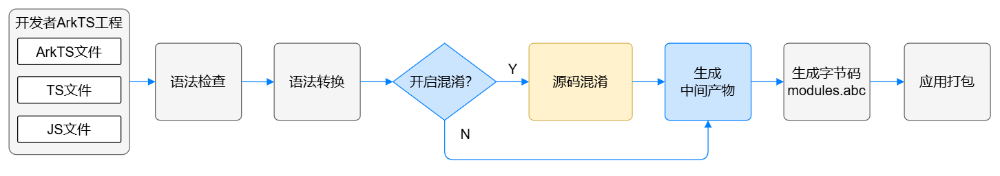

# ArkGuard混淆原理
<!--Kit: ArkTS-->
<!--Subsystem: ArkCompiler-->
<!--Owner: @oatuwwutao-->
<!--Designer: @oatuwwutao-->
<!--Tester: @kirl75; @zsw_zhushiwei-->
<!--Adviser: @k1ngqaquuu-->

ArkGuard在编译时读取模块的build-profile.json5配置文件，解析并合并当前模块与依赖模块的混淆规则，然后对中间文件进行混淆处理，最终将结果输出至build目录。

开发者可参考[ArkGuard混淆开启指南](./source-obfuscation-guide.md)，了解如何开启混淆并自定义混淆规则。

## 能力范围

ArkGuard仅支持对ArkTS、TypeScript和JavaScript代码进行混淆，不适用于C/C++、JSON及资源文件等。其基础混淆功能包括名称混淆、代码压缩和注释删除，但不提供控制流混淆、数据混淆等高级混淆功能。

名称混淆主要提供**名称重命名**和**配置保留白名单**的能力。
  
## 约束限制

### 语言的限制

源码混淆工具在处理不同编程语言时，其类型分析机制、混淆策略和执行效率都会因目标语言的特性而呈现差异。以业界常用的ProGuard为例，其主要面向Java这类强类型语言进行混淆。由于强类型语言具有严格的类型系统，每个类型都有明确的定义来源。这种特性使得混淆过程中的类型关系追踪和处理更为精确，从而大幅减少了需要配置保留规则的场景。

相比之下，ArkGuard混淆工具主要针对JS、TS和ArkTS语言。JS支持运行时动态修改对象和函数，而混淆是在编译阶段进行的静态处理，这种差异可能导致混淆后的名称在运行时无法被正确解析，进而引发运行时异常。TS和ArkTS虽然引入了静态类型系统，但采用了结构性类型机制，即具有相同结构的不同命名类型会被视为等价类型。因此，在TS和ArkTS中仍然无法追溯类型的确切来源。  

基于这些特性，使用ArkGuard时需要对更多语法场景进行白名单配置，同时，ArkGuard采用全局生效的属性保留机制，根据白名单统一保留所有同名属性，无法针对特定类型精确保留。

具体示例如下：

假设ArkGuard支持配置指定类型的白名单。配置类A1作为白名单，A1的属性prop1在白名单中，而A2的prop1属性不在白名单中。a2作为参数传入test函数，并在test函数内访问其属性。混淆前，可以正常访问prop1属性；混淆后，A1的属性prop1未被混淆，但A2的prop1属性被混淆，导致test函数中访问prop1属性时功能异常。

因此，ArkGuard不支持针对特定类型的精确保留配置。

<!-- @[example_limitation](https://gitcode.com/openharmony/applications_app_samples/blob/master/code/DocsSample/ArkTS/ArkTSCompilationToolchain/ArkGuardForSourceCodeObfuscation/ArkGuardObfuscationAbility/entry/src/main/ets/arkguardability/ArkGuardAbility.ts) -->   

``` TypeScript
// 混淆前：
// ArkGuardAbility.ts
class A1 {
  prop1: string = '';
}

class A2 {
  prop1: string = '';
}

function test(input: A1) {
  console.info(input.prop1);
}

let a2 = new A2();
a2.prop1 = 'prop a2';
test(a2);
```

``` TypeScript
// 混淆后
// ArkGuardAbility.ts
class A1 {
  prop1: string = '';
}

class A2 {
  a: string = '';
}

function test(input: A1) {
  console.info(input.prop1);
}

let a2 = new A2();
a2.a = 'prop a2';
test(a2);
```

综上所述，开发者应了解语言差异对混淆效果的影响，尽量使用不重复的名称，优化混淆效果。

### 安全保证的有限性

与其他源码混淆工具类似，混淆只能在一定程度上增加逆向工程的难度，并不能完全阻止逆向工程。

并且，由于ArkGuard混淆工具仅支持基础混淆功能，开发者不应只依赖ArkGuard来保证应用的安全性，对于源码安全有高要求的开发者，应考虑使用[应用加密](https://developer.huawei.com/consumer/cn/doc/harmonyos-guides/code-protect)、安全加固等安全措施来保护代码。

## 混淆机制及流程

下图为应用编译的简要流程图：



开发者可以在模块的build-profile.json5配置文件中开启混淆功能，详细参考[ArkGuard混淆开启指南](./source-obfuscation-guide.md)，从而在编译打包的过程中自动对源码进行混淆处理。

混淆过程中，首先读取混淆开关。在开关开启的情况下，解析混淆配置文件，并依据[混淆规则合并策略](#混淆规则合并策略)合并混淆规则。然后按照混淆规则对经过语法转换的中间文件进行混淆，最后将混淆后的中间文件落盘至build目录。开发者可以通过build目录中混淆后的产物，确认混淆效果。

在使用混淆功能前，建议开发者先通过文档了解[混淆选项的能力](./source-obfuscation-rule-options.md)与[混淆选项所需要保留白名单的场景](./source-obfuscation-keep-options.md)，再根据开发需求选择对应的混淆功能。

## 混淆规则合并策略

在编译一个模块时，生效的混淆规则是**当前编译模块混淆规则**和**依赖模块混淆规则**的合并结果，具体规则如下：

**当前编译模块混淆规则**  
指当前模块配置文件`build-profile.json5`中`arkOptions.obfuscation.ruleOptions.files`字段指定的混淆配置文件内容。

**依赖模块混淆规则**  
根据依赖模块的类型，混淆规则分为以下两个来源：

- **本地HAR/HSP模块**  

  指该模块配置文件`build-profile.json5`中`arkOptions.obfuscation.consumerFiles`字段指定的混淆配置文件内容。

- **远程HAR/HSP包**  

  指该远程HAR/HSP包中`obfuscation.txt`文件内容。  

构建HAP、HSP和HAR时，最终的混淆规则是以下文件的合并：
* 当前构建模块的ruleOptions.files属性。
* 依赖的本地HSP的consumerFiles属性。
* 依赖的本地HAR的consumerFiles属性。
* 依赖的远程HAR和远程HSP中的obfuscation.txt文件。

如果构建HAR，生成的远程HAR中的obfuscation.txt是以下文件的合并：
* 自身的consumerFiles属性。
* 依赖的本地HSP的consumerFiles属性。
* 依赖的本地HAR的consumerFiles属性。
* 依赖的远程HAR和远程HSP中的obfuscation.txt文件。

构建HSP时，生成的远程HSP中的obfuscation.txt仅包含自身的consumerFiles属性。

构建HAP时，不会生成obfuscation.txt文件。

**混淆规则合并逻辑**

混淆选项：使用或运算进行合并，即开关选项只要在参与合并的任意一个规则文件中存在，最终的合并结果中就会包含该开关选项。  

保留选项：合并时，对于白名单选项，其内容取并集。

- **如果当前编译模块混淆配置未包含`-enable-lib-obfuscation-options`选项**：合并对象为当前模块的所有混淆规则与依赖模块混淆规则中的[保留选项](./source-obfuscation-keep-options.md)。

- **如果当前编译模块混淆配置包含`-enable-lib-obfuscation-options`选项**：合并对象为当前模块的所有混淆规则与依赖模块的所有混淆规则。

对于API version 18之前版本，如果consumerFiles指定的混淆配置文件中包含以下混淆选项和保留选项，这些规则将被同步生成到远程HAR和HSP的obfuscation.txt文件中，其他混淆规则不会被保留。

```text
// 混淆选项
-enable-property-obfuscation
-enable-string-property-obfuscation
-enable-toplevel-obfuscation
-compact
-remove-log

// 保留选项
-keep-property-name
-keep-global-name
```

在API version 18之前的版本，主模块会自动合并其依赖的远程HAR或HSP中的`obfuscation.txt`配置文件中的混淆选项及保留选项。这可能导致主模块的混淆规则被意外修改，从而影响最终的混淆效果。

对于API version 18及之后版本，默认仅上述保留选项会被主模块合并从而生效，而其他混淆选项不会。这种设计避免了其他模块依赖远程HAR或HSP时受其混淆配置的影响。同时，远程HAR或HSP在打包时使用自身的`obfuscation-rules.txt`文件中的混淆规则，并不会影响其实际混淆效果。如果需要恢复到API version 18之前的混淆规则合并逻辑，可以通过配置`-enable-lib-obfuscation-options`选项实现。

**HSP和HAR中混淆注意事项**

1. 如果`consumerFiles`指定的混淆配置文件中包含上述混淆选项，当其他模块依赖该模块时，这些选项会与主模块的混淆规则合并，从而影响主模块。因此不建议开发者在`consumer-rules.txt`文件中配置混淆选项，建议仅配置保留选项。

2. 如果在`consumerFiles`指定的混淆配置文件中添加`-keep-dts`选项，该选项会被转换成`-keep-global-name`和`-keep-property-name`。
