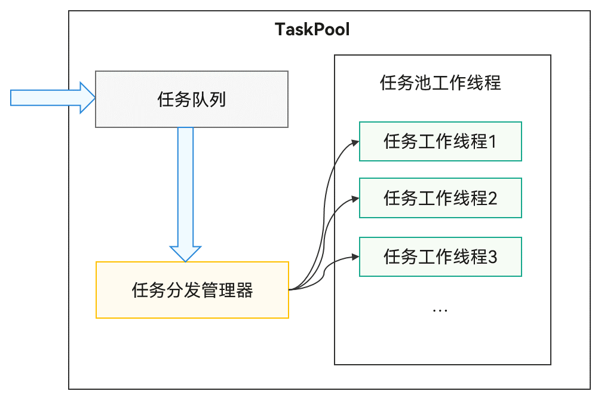

# TaskPool简介
<!--Kit: ArkTS-->
<!--Subsystem: CommonLibrary-->
<!--Owner: @wang_zhaoyong-->
<!--Designer: @weng-changcheng-->
<!--Tester: @kirl75; @zsw_zhushiwei-->
<!--Adviser: @ge-yafang-->

TaskPool为应用程序提供多线程环境，降低资源消耗并提高系统性能。无需管理线程生命周期。具体接口信息及使用方法，请参见[TaskPool](../reference/apis-arkts/js-apis-taskpool.md)。

## TaskPool运作机制

TaskPool运作机制示意图



TaskPool支持在宿主线程提交任务到任务队列，系统选择合适的工作线程执行任务，并将结果返回给宿主线程。接口易用，支持任务执行、取消和指定优先级。通过系统统一线程管理，结合动态调度和负载均衡算法，可以节约系统资源。系统默认启动一个任务工作线程，任务多时会自动扩容。工作线程数量上限由设备的物理核数决定，内部管理具体数量，确保调度和执行效率最优。长时间无任务分发时会缩容，减少工作线程数量。具体扩缩容机制请参见[TaskPool扩缩容机制](taskpool-introduction.md#taskpool扩缩容机制)。

## TaskPool注意事项

- 实现任务的函数需要使用[@Concurrent装饰器](#concurrent装饰器)标注，且仅支持在.ets文件中使用。

- 从API version 11开始，跨并发实例传递带方法的实例对象时，该类必须使用装饰器[@Sendable装饰器](arkts-sendable.md#sendable装饰器)标注，且仅支持在.ets文件中使用。

- 任务函数（[LongTask](../reference/apis-arkts/js-apis-taskpool.md#longtask12)除外）在TaskPool工作线程中的执行时长不能超过3分钟。否则，任务将被强制终止。需要注意的是，这里的3分钟限制仅统计TaskPool线程的​​同步运行时长​​，不包含异步操作（如Promise或async/await）的等待时长。例如，数据库的插入、删除、更新等操作，如果是异步操作，仅计入CPU实际处理时长（如SQL解析），网络传输或磁盘I/O等待时长不计入；如果是同步操作，整个操作时长（含I/O阻塞时间）均计入限制。开发者可通过[Task](../reference/apis-arkts/js-apis-taskpool.md#task)的属性ioDuration、cpuDuration获取执行当前任务的异步IO耗时和CPU耗时。

- 实现任务的函数入参需满足序列化支持的类型。详情请参见[线程间通信对象](interthread-communication-overview.md)。目前不支持使用[@State装饰器](../ui/state-management/arkts-state.md)、[@Prop装饰器](../ui/state-management/arkts-prop.md)、[@Link装饰器](../ui/state-management/arkts-link.md)等装饰器修饰的复杂类型。

- ArrayBuffer参数在TaskPool中默认转移，需要设置转移列表的话可通过接口[setTransferList()](../reference/apis-arkts/js-apis-taskpool.md#settransferlist10)设置。如果需要多次调用使用ArrayBuffer作为参数的task，则需要通过接口[setCloneList()](../reference/apis-arkts/js-apis-taskpool.md#setclonelist11)把ArrayBuffer在线程中的传输行为改成拷贝传递，避免对原有对象产生影响。

除上述注意事项外，使用TaskPool时还需注意[并发注意事项](multi-thread-concurrency-overview.md#并发注意事项)。

  ```ts
  import { taskpool } from '@kit.ArkTS';
  import { BusinessError } from '@kit.BasicServicesKit';
  
  @Concurrent
  function printArrayBuffer(buffer: ArrayBuffer) {
    return buffer;
  }
  
  function testArrayBuffer() {
    const buffer = new ArrayBuffer(1);
    const group = new taskpool.TaskGroup();
    const task = new taskpool.Task(printArrayBuffer, buffer);
    group.addTask(task);
    task.setCloneList([buffer]);
    for (let i = 0; i < 5; i++) {
      taskpool.execute(group).then(() => {
        console.info('execute group success');
      }).catch((e: BusinessError) => {
        console.error(`execute group error: ${e.message}`);
      })
    }
  }
  ```

- 由于不同线程中上下文对象不同，TaskPool工作线程只能使用线程安全的库。例如，不能使用UI相关的非线程安全库。

- 序列化传输的数据量限制为16MB。

- [Priority](../reference/apis-arkts/js-apis-taskpool.md#priority)的IDLE优先级是用来标记需要在后台运行的耗时任务（例如数据同步、备份），它的优先级别是最低的。这种优先级的任务只在所有线程都空闲时触发执行，并且同一时间只会有一个IDLE优先级的任务执行。

- Promise不支持跨线程传递。TaskPool返回pending或rejected状态的Promise时会失败，返回fulfilled状态的Promise时TaskPool会解析返回的结果，如果结果可以跨线程传递，则返回成功。

- 不支持在TaskPool工作线程中使用[AppStorage](../ui/state-management/arkts-appstorage.md)。

- TaskPool支持在宿主线程封装任务并提交给任务队列，理论上支持的任务数量没有上限。然而，任务的执行效率受限于任务的优先级和系统资源。当工作线程达到最大数量时，任务的执行效率可能会下降

- TaskPool不支持指定任务所运行的线程，任务会被分配到空闲的线程中执行。如果需要指定任务所运行的线程，建议使用[Worker](worker-introduction.md)。

## \@Concurrent装饰器

使用[TaskPool](../reference/apis-arkts/js-apis-taskpool.md)时，执行的并发函数必须用该装饰器修饰，否则无法通过校验。

> **说明：**
>
> 从API version 9开始，支持使用\@Concurrent装饰器声明并校验并发函数。

| \@Concurrent并发装饰器 | 说明 |
| -------- | -------- |
| 装饰器参数 | 无。 |
| 使用场景 | 仅支持在Stage模型的工程中使用。仅支持在.ets文件中使用。 |
| 装饰的函数类型 | 允许标注为async函数或普通函数。禁止标注为generator、箭头函数、类方法。不支持类成员函数或者匿名函数。 |
| 装饰的函数内的变量类型 | 允许使用局部变量、入参和通过import引入的变量，禁止使用闭包变量。 |
| 装饰的函数内的返回值类型 | 支持的类型请查[线程间通信对象](interthread-communication-overview.md)。 |

> **说明：**
>
> 由于\@Concurrent标记的函数不能访问闭包，因此函数内部不能调用当前文件的其他函数，例如：
>
> ```ts
> function bar() {
> }
> 
> @Concurrent
> function foo() {
>   bar(); // 违反闭包原则，报错
> }
> ```

## 装饰器使用示例

### 并发函数一般使用

并发函数为一个计算两数之和的普通函数，taskpool执行该函数并返回结果。

示例：

```ts
import { taskpool } from '@kit.ArkTS';

@Concurrent
function add(num1: number, num2: number): number {
  return num1 + num2;
}

async function concurrentFunc(): Promise<void> {
  try {
    const task: taskpool.Task = new taskpool.Task(add, 1, 2);
    console.info(`taskpool res is: ${await taskpool.execute(task)}`); // 输出结果：taskpool res is: 3
  } catch (e) {
    console.error(`taskpool execute error is: ${e}`);
  }
}

@Entry
@Component
struct Index {
  @State message: string = 'Hello World';

  build() {
    Row() {
      Column() {
        Text(this.message)
          .fontSize(50)
          .fontWeight(FontWeight.Bold)
          .onClick(() => {
            concurrentFunc();
          })
      }
      .width('100%')
    }
    .height('100%')
  }
}
```
<!-- @[concurrent_taskpool_common_usage](https://gitcode.com/openharmony/applications_app_samples/blob/master/code/DocsSample/ArkTS/ArkTsConcurrent/MultithreadedConcurrency/TaskPoolIntroduction/entry/src/main/ets/managers/generaluse.ets) -->

### 并发函数返回Promise

在并发函数中返回Promise时需特别注意。如示例所示，testPromise和testPromise1等函数需处理Promise并返回结果。

示例：

```ts
import { taskpool } from '@kit.ArkTS';

@Concurrent
function testPromise(args1: number, args2: number): Promise<number> {
  return new Promise<number>((resolve, reject) => {
    resolve(args1 + args2);
  });
}

@Concurrent
async function testPromise1(args1: number, args2: number): Promise<number> {
  return new Promise<number>((resolve, reject) => {
    resolve(args1 + args2);
  });
}

@Concurrent
async function testPromise2(args1: number, args2: number): Promise<number> {
  return await new Promise<number>((resolve, reject) => {
    resolve(args1 + args2);
  });
}

@Concurrent
function testPromise3() {
  return Promise.resolve(1);
}

@Concurrent
async function testPromise4(): Promise<number> {
  return 1;
}

@Concurrent
async function testPromise5(): Promise<string> {
  return await new Promise((resolve) => {
    setTimeout(() => {
      resolve('Promise setTimeout after resolve');
    }, 1000)
  });
}

async function testConcurrentFunc() {
  const task1: taskpool.Task = new taskpool.Task(testPromise, 1, 2);
  const task2: taskpool.Task = new taskpool.Task(testPromise1, 1, 2);
  const task3: taskpool.Task = new taskpool.Task(testPromise2, 1, 2);
  const task4: taskpool.Task = new taskpool.Task(testPromise3);
  const task5: taskpool.Task = new taskpool.Task(testPromise4);
  const task6: taskpool.Task = new taskpool.Task(testPromise5);

  taskpool.execute(task1).then((d: object) => {
    console.info(`task1 res is: ${d}`); // 输出结果：task1 res is: 3
  }).catch((e: object) => {
    console.error(`task1 catch e: ${e}`);
  })
  taskpool.execute(task2).then((d: object) => {
    console.info(`task2 res is: ${d}`);
  }).catch((e: object) => {
    console.error(`task2 catch e: ${e}`); // 输出结果：task2 catch e: Error: Can't return Promise in pending state
  })
  taskpool.execute(task3).then((d: object) => {
    console.info(`task3 res is: ${d}`); // 输出结果：task3 res is: 3
  }).catch((e: object) => {
    console.error(`task3 catch e: ${e}`);
  })
  taskpool.execute(task4).then((d: object) => {
    console.info(`task4 res is: ${d}`); // 输出结果：task4 res is: 1
  }).catch((e: object) => {
    console.error(`task4 catch e: ${e}`);
  })
  taskpool.execute(task5).then((d: object) => {
    console.info(`task5 res is: ${d}`); // 输出结果：task5 res is: 1
  }).catch((e: object) => {
    console.error(`task5 catch e: ${e}`);
  })
  taskpool.execute(task6).then((d: object) => {
    console.info(`task6 res is: ${d}`); // 输出结果：task6 res is: Promise setTimeout after resolve
  }).catch((e: object) => {
    console.error(`task6 catch e: ${e}`);
  })
}

@Entry
@Component
struct Index {
  @State message: string = 'Hello World';

  build() {
    Row() {
      Column() {
        Button(this.message)
          .fontSize(50)
          .fontWeight(FontWeight.Bold)
          .onClick(() => {
            testConcurrentFunc();
          })
      }
      .width('100%')
    }
    .height('100%')
  }
}
```
<!-- @[concurrent_taskpool_promise_return](https://gitcode.com/openharmony/applications_app_samples/blob/master/code/DocsSample/ArkTS/ArkTsConcurrent/MultithreadedConcurrency/TaskPoolIntroduction/entry/src/main/ets/managers/returnpromise.ets) -->

### 并发函数中使用自定义类或函数

在并发函数中使用自定义类或函数时，需将其定义在单独的文件中，否则可能被视为闭包。如下示例所示。

示例：

```ts
// Index.ets
import { taskpool } from '@kit.ArkTS';
import { BusinessError } from '@kit.BasicServicesKit';
import { testAdd, MyTestA, MyTestB } from './Test';

function add(arg: number) {
  return ++arg;
}

class TestA {
  constructor(name: string) {
    this.name = name;
  }

  name: string = 'ClassA';
}

class TestB {
  static nameStr: string = 'ClassB';
}

@Concurrent
function TestFunc() {
  // case1：在并发函数中直接调用同文件内定义的类或函数

  // 直接调用同文件定义的函数add()，add飘红报错：Only imported variables and local variables can be used in @Concurrent decorated functions. <ArkTSCheck>
  // add(1);
  // 直接使用同文件定义的TestA构造，TestA飘红报错：Only imported variables and local variables can be used in @Concurrent decorated functions. <ArkTSCheck>
  // const a = new TestA('aaa');
  // 直接访问同文件定义的TestB的成员nameStr，TestB飘红报错：Only imported variables and local variables can be used in @Concurrent decorated functions. <ArkTSCheck>
  // console.info(`TestB name is: ${TestB.nameStr}`);

  // case2：在并发函数中调用定义在Test.ets文件并导入当前文件的类或函数

  // 输出结果：res1 is: 2
  console.info(`res1 is: ${testAdd(1)}`);
  const tmpStr = new MyTestA('TEST A');
  // 输出结果：res2 is: TEST A
  console.info(`res2 is: ${tmpStr.name}`);
  // 输出结果：res3 is: MyTestB
  console.info(`res3 is: ${MyTestB.nameStr}`);
}


@Entry
@Component
struct Index {
  @State message: string = 'Hello World';

  build() {
    RelativeContainer() {
      Text(this.message)
        .id('HelloWorld')
        .fontSize(50)
        .fontWeight(FontWeight.Bold)
        .alignRules({
          center: { anchor: '__container__', align: VerticalAlign.Center },
          middle: { anchor: '__container__', align: HorizontalAlign.Center }
        })
        .onClick(() => {
          const task = new taskpool.Task(TestFunc);
          taskpool.execute(task).then(() => {
            console.info('taskpool: execute task success!');
          }).catch((e: BusinessError) => {
            console.error(`taskpool: execute: Code: ${e.code}, message: ${e.message}`);
          })
        })
    }
    .height('100%')
    .width('100%')
  }
}
```
<!-- @[concurrent_taskpool_custom_class_function](https://gitcode.com/openharmony/applications_app_samples/blob/master/code/DocsSample/ArkTS/ArkTsConcurrent/MultithreadedConcurrency/TaskPoolIntroduction/entry/src/main/ets/managers/customclasses.ets) -->

```ts
// Test.ets
export function testAdd(arg: number) {
  return ++arg;
}

@Sendable
export class MyTestA {
  constructor(name: string) {
    this.name = name;
  }
  name: string = 'MyTestA';
}

export class MyTestB {
  static nameStr:string = 'MyTestB';
}
```
<!-- @[concurrent_taskpool_test_resources](https://gitcode.com/openharmony/applications_app_samples/blob/master/code/DocsSample/ArkTS/ArkTsConcurrent/MultithreadedConcurrency/TaskPoolIntroduction/entry/src/main/ets/managers/Test.ets) -->

### 并发异步函数中使用Promise

在并发异步函数中使用Promise时，建议搭配await使用，这样TaskPool可以捕获Promise中的异常。推荐使用示例如下。

示例：

```ts
import { taskpool } from '@kit.ArkTS';

@Concurrent
async function testPromiseError() {
  await new Promise<number>((resolve, reject) => {
    resolve(1);
  }).then(() => {
    throw new Error('testPromise error');
  })
}

@Concurrent
async function testPromiseError1() {
  await new Promise<string>((resolve, reject) => {
    reject('testPromiseError1 error msg');
  })
}

@Concurrent
function testPromiseError2() {
  return new Promise<string>((resolve, reject) => {
    reject('testPromiseError2 error msg');
  })
}

async function testConcurrentFunc() {
  const task1: taskpool.Task = new taskpool.Task(testPromiseError);
  const task2: taskpool.Task = new taskpool.Task(testPromiseError1);
  const task3: taskpool.Task = new taskpool.Task(testPromiseError2);

  taskpool.execute(task1).then((d: object) => {
    console.info(`task1 res is: ${d}`);
  }).catch((e: object) => {
    console.error(`task1 catch e: ${e}`); // task1 catch e: Error: testPromise error
  })
  taskpool.execute(task2).then((d: object) => {
    console.info(`task2 res is: ${d}`);
  }).catch((e: object) => {
    console.error(`task2 catch e: ${e}`); // task2 catch e: testPromiseError1 error msg
  })
  taskpool.execute(task3).then((d: object) => {
    console.info(`task3 res is: ${d}`);
  }).catch((e: object) => {
    console.error(`task3 catch e: ${e}`); // task3 catch e: testPromiseError2 error msg
  })
}

@Entry
@Component
struct Index {
  @State message: string = 'Hello World';

  build() {
    Row() {
      Column() {
        Button(this.message)
          .fontSize(50)
          .fontWeight(FontWeight.Bold)
          .onClick(() => {
            testConcurrentFunc();
          })
      }
      .width('100%')
    }
    .height('100%')
  }
}
```
<!-- @[concurrent_taskpool_async_promise_usage](https://gitcode.com/openharmony/applications_app_samples/blob/master/code/DocsSample/ArkTS/ArkTsConcurrent/MultithreadedConcurrency/TaskPoolIntroduction/entry/src/main/ets/managers/asynchronousfunctions.ets) -->

## TaskPool扩缩容机制

### 扩容机制

一般情况下，向任务队列提交任务时会触发扩容检测。扩容检测首先判断当前空闲工作线程数是否大于任务数。如果大于，说明线程池中有空闲工作线程，无需扩容。否则，通过负载计算确定所需工作线程数并创建。

### 缩容机制

扩容后，TaskPool创建多个工作线程，但当任务数减少后，这些线程就会处于空闲状态，造成资源浪费，因此，TaskPool提供了缩容机制。TaskPool使用定时器，每30秒检测一次当前负载，并尝试释放空闲的工作线程。释放的线程需满足以下条件：

- 该线程空闲时长达到30s。

- 该线程上未执行长时任务（[LongTask](../reference/apis-arkts/js-apis-taskpool.md#longtask12)）。

- 该线程上没有业务申请且未释放的句柄，例如[Timer(定时器)](../reference/common/js-apis-timer.md)。

- 该线程处于非调试调优阶段。

- 该线程中不存在已创建未销毁的子Worker。