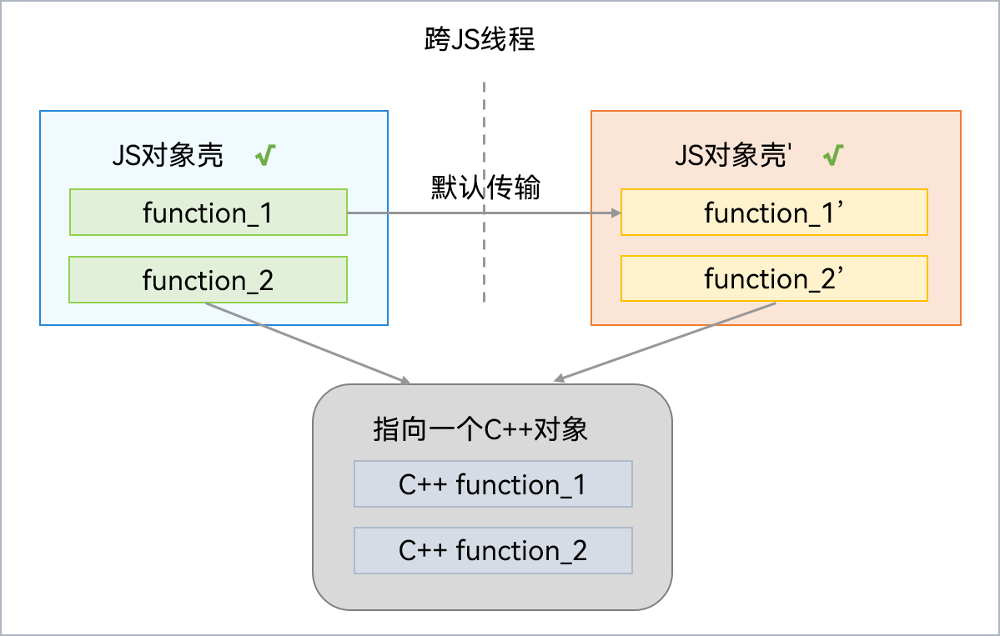
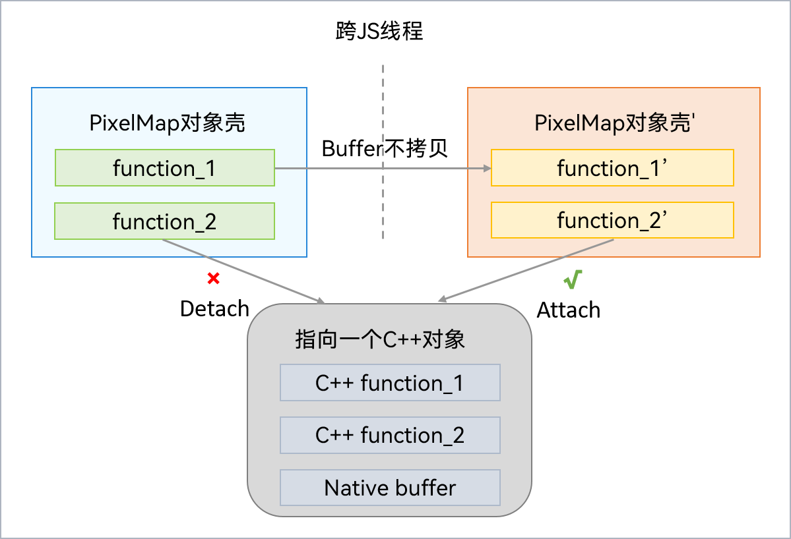

# Transferable对象（NativeBinding对象）

Transferable对象（也称为NativeBinding对象）指的是一个JS对象，绑定了一个C++对象，且主体功能由C++提供。跨线程传输时可以直接复用同一个C++对象，相比于JS对象的拷贝模式，传输效率较高。因此，可共享或转移的NativeBinding对象也被称为Transferable对象。

## 共享模式

如果C++实现能够保证线程安全性，则这个NativeBinding对象的C++部分可以支持共享传输。此时，NativeBinding对象跨线程传输后，只需要重新创建JS壳，就可以桥接到相同的C++对象上。通信过程如下图所示：

常见的共享模式NativeBinding对象包括Context，Context对象包含应用程序组件的上下文信息，它提供了一种访问系统服务和资源的方式，使得应用程序组件可以与系统进行交互。获取Context信息的方法可以参考[获取上下文信息](../application-models/application-context-stage.md)。

## 转移模式

如果C++实现包含了数据，且无法保证线程安全性，则这个NativeBinding对象的C++部分需要采用转移方式传输。此时，NativeBinding对象跨线程传输后，只需要重新创建JS壳，就可以桥接到C++对象上，不过原对象需要移除对此对象的绑定关系。通信过程如下图所示：

常见的转移模式NativeBinding对象包括PixelMap，[PixelMap对象](../reference/apis-image-kit/js-apis-image.md#imagecreatepixelmap8)可以读取或写入图像数据以及获取图像信息，常用于在应用或系统中显示图片。
