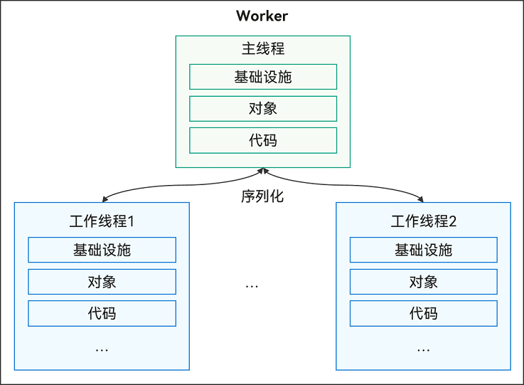

# Worker简介

Worker主要作用是为应用程序提供一个多线程的运行环境，可满足应用程序在执行过程中与宿主线程分离，在后台线程中运行一个脚本进行耗时操作，极大避免类似于计算密集型或高延迟的任务阻塞宿主线程的运行。具体接口信息及使用方法详情请见[Worker](../reference/apis-arkts/js-apis-worker.md)。


## Worker运作机制

**图1** Worker运作机制示意图



创建Worker的线程称为宿主线程（不一定是主线程，工作线程也支持创建Worker子线程），Worker自身的线程称为Worker子线程（或Actor线程、工作线程）。每个Worker子线程与宿主线程拥有独立的实例，包含基础设施、对象、代码段等，因此每个Worker启动存在一定的内存开销，需要限制Worker的子线程数量。Worker子线程和宿主线程之间的通信是基于消息传递的，Worker通过序列化机制与宿主线程之间相互通信，完成命令及数据交互。


## Worker注意事项

- 创建Worker时，有手动和自动两种创建方式，手动创建Worker线程目录及文件时，还需同步进行相关配置，详情请参考[创建Worker的注意事项](#创建worker的注意事项)。
- 使用Worker能力时，构造函数中传入的Worker线程文件的路径在不同版本有不同的规则，详情请参见[文件路径注意事项](#文件路径注意事项)。
- Worker创建后需要手动管理生命周期，且最多同时运行的Worker子线程数量为64个，并满足与[napi_create_ark_runtime](../reference/native-lib/napi.md#napi_create_ark_runtime)创建的runtime总数不超过80，详情请参见[生命周期注意事项](#生命周期注意事项)。
- 由于不同线程中上下文对象是不同的，因此Worker线程只能使用线程安全的库，例如UI相关的非线程安全库不能使用。
- 序列化传输的数据量大小限制为16MB。
- 使用Worker模块时，API version 18及之后的版本推荐在宿主线程中注册onAllErrors回调，以捕获Worker线程生命周期内的各种异常，API version 15及之前的版本需要注册onerror回调。如果未注册onAllErrors或onerror接口，当Worker线程出现异常时会发生jscrash问题。需要注意的是，onerror接口仅能捕获onmessage回调中的同步异常，且捕获异常后Worker线程会进入销毁流程，无法继续使用。详情请参见[onAllErrors接口与onerror接口之间的行为差异](#onallerrors接口与onerror接口之间的行为差异)。
- 不支持跨HAP使用Worker线程文件。
- 引用HAR/HSP前，需要先配置对HAR/HSP的依赖，详见[引用共享包](https://developer.huawei.com/consumer/cn/doc/harmonyos-guides-V5/ide-har-import-V5)。
- 不支持在Worker工作线程中使用[AppStorage](../quick-start/arkts-appstorage.md)。
- 从API version 18开始，Worker线程优先级可以在构造函数的参数[WorkerOptions](../reference/apis-arkts/js-apis-worker.md#workeroptions)中进行指定。

### 创建Worker的注意事项

Worker线程文件需要放在"{moduleName}/src/main/ets/"目录层级之下，否则不会被打包到应用中。有手动和自动两种创建Worker线程目录及文件的方式。

- 手动创建：开发者手动创建相关目录及文件，此时需要配置build-profile.json5的相关字段信息，Worker线程文件才能确保被打包到应用中。

  Stage模型：

  ```json
  "buildOption": {
    "sourceOption": {
      "workers": [
        "./src/main/ets/workers/worker.ets"
      ]
    }
  }
  ```

  FA模型：

  ```json
  "buildOption": {
    "sourceOption": {
      "workers": [
        "./src/main/ets/MainAbility/workers/worker.ets"
      ]
    }
  }
  ```

- 自动创建：DevEco Studio支持一键生成Worker，在对应的{moduleName}目录下任意位置，点击鼠标右键 > New > Worker，即可自动生成Worker的模板文件及配置信息，无需再手动在build-profile.json5中进行相关配置。


### 文件路径注意事项

  当使用Worker模块具体功能时，均需先构造Worker实例对象，其构造函数与API版本相关，且构造函数需要传入Worker线程文件的路径（scriptURL）。

```ts
// 导入模块
import { worker } from '@kit.ArkTS';

// API 9及之后版本使用：
const worker1: worker.ThreadWorker = new worker.ThreadWorker('entry/ets/workers/worker.ets');
// API 8及之前版本使用：
const worker2: worker.Worker = new worker.Worker('entry/ets/workers/worker.ets');
```


#### Stage模型下的文件路径规则

构造函数中的scriptURL要求如下：

- scriptURL的组成包含{moduleName}/ets和相对路径relativePath。
- relativePath是Worker线程文件相对于"{moduleName}/src/main/ets/"目录的相对路径。

1） 加载Ability中Worker线程文件场景

加载Ability中的worker线程文件，加载路径规则：{moduleName}/ets/{relativePath}。

```ts
import { worker } from '@kit.ArkTS';

// worker线程文件所在路径："entry/src/main/ets/workers/worker.ets"
const workerStage1: worker.ThreadWorker = new worker.ThreadWorker('entry/ets/workers/worker.ets');

// worker线程文件所在路径："testworkers/src/main/ets/ThreadFile/workers/worker.ets"
const workerStage2: worker.ThreadWorker = new worker.ThreadWorker('testworkers/ets/ThreadFile/workers/worker.ets');
```

2） 加载[HSP](../quick-start/in-app-hsp.md)中Worker线程文件场景

加载HSP中worker线程文件，加载路径规则：{moduleName}/ets/{relativePath}。

```ts
import { worker } from '@kit.ArkTS';

// worker线程文件所在路径： "hsp/src/main/ets/workers/worker.ets"
const workerStage3: worker.ThreadWorker = new worker.ThreadWorker('hsp/ets/workers/worker.ets');
```

3） 加载[HAR](../quick-start/har-package.md)中Worker线程文件场景

加载HAR中worker线程文件存在以下两种情况：

- @标识路径加载形式：所有种类的模块加载本地HAR中的Worker线程文件，加载路径规则：@{moduleName}/ets/{relativePath}。

- 相对路径加载形式：本地HAR加载该包内的Worker线程文件，加载路径规则：创建Worker对象所在文件与Worker线程文件的相对路径。

>**说明：**
>
>当开启useNormalizedOHMUrl（即将工程目录中与entry同级别的应用级build-profile.json5文件中strictMode属性的useNormalizedOHMUrl字段配置为true）或HAR包会被打包成三方包使用时，则HAR包中使用Worker仅支持通过相对路径的加载形式创建。

```ts
import { worker } from '@kit.ArkTS';

// @标识路径加载形式：
// worker线程文件所在路径: "har/src/main/ets/workers/worker.ets"
const workerStage4: worker.ThreadWorker = new worker.ThreadWorker('@har/ets/workers/worker.ets');

// 相对路径加载形式：
// worker线程文件所在路径: "har/src/main/ets/workers/worker.ets"
// 创建Worker对象的文件所在路径："har/src/main/ets/components/mainpage/MainPage.ets"
const workerStage5: worker.ThreadWorker = new worker.ThreadWorker('../../workers/worker.ets');
```


#### FA模型下的文件路径规则

  构造函数中的scriptURL为：Worker线程文件与"{moduleName}/src/main/ets/MainAbility"的相对路径。

```ts
import { worker } from '@kit.ArkTS';

// 主要说明以下三种场景：

// 场景1： Worker线程文件所在路径："{moduleName}/src/main/ets/MainAbility/workers/worker.ets"
const workerFA1: worker.ThreadWorker = new worker.ThreadWorker("workers/worker.ets", {name:"first worker in FA model"});

// 场景2： Worker线程文件所在路径："{moduleName}/src/main/ets/workers/worker.ets"
const workerFA2: worker.ThreadWorker = new worker.ThreadWorker("../workers/worker.ets");

// 场景3： Worker线程文件所在路径："{moduleName}/src/main/ets/MainAbility/ThreadFile/workers/worker.ets"
const workerFA3: worker.ThreadWorker = new worker.ThreadWorker("ThreadFile/workers/worker.ets");
```


### 生命周期注意事项

- Worker的创建和销毁耗费性能，建议开发者合理管理已创建的Worker并重复使用。Worker空闲时也会一直运行，因此当不需要Worker时，可以调用[terminate()](../reference/apis-arkts/js-apis-worker.md#terminate9)接口或[close()](../reference/apis-arkts/js-apis-worker.md#close9)方法主动销毁Worker。若Worker处于已销毁或正在销毁等非运行状态时，调用其功能接口，会抛出相应的错误。


- Worker的数量由内存管理策略决定，设定的内存阈值为1.5GB和设备物理内存的60%中的较小者。在内存允许的情况下，系统最多可以同时运行64个Worker。如果尝试创建的Worker数量超出这一上限，系统将抛出错误：“Worker initialization failure, the number of workers exceeds the maximum.”。实际运行的Worker数量会根据当前内存使用情况动态调整。一旦所有Worker和主线程的累积内存占用超过了设定的阈值，系统将触发内存溢出（OOM）错误，导致应用程序崩溃。


### onAllErrors接口与onerror接口之间的行为差异

1. 异常捕获范围

    onAllErrors接口可以捕获Worker线程的onmessage回调、timer回调以及文件执行等流程产生的全局异常。

    onerror接口仅捕获onmessage回调中同步方法产生的异常，无法捕获多线程回调产生的异常和模块化相关异常。

2. 异常捕获后的线程状态

    onAllErrors接口捕获异常后，Worker线程仍然存活，可以继续使用。这使得开发者可以在捕获异常后继续执行其他操作，而不必担心线程被终止。

    onerror接口一旦捕获到异常，Worker线程会进入销毁流程，无法继续使用。这意味着在onerror触发后，Worker线程将被终止，后续的操作将无法进行。

3. 适用场景

    onAllErrors接口适用于需要捕获Worker线程中所有类型异常的场景，尤其是在需要确保Worker线程在异常发生后仍然能够继续运行的复杂场景。

    onerror接口适用于只需要捕获onmessage回调中同步异常的简单场景。由于捕获异常后线程会被销毁，适合在不需要继续使用Worker线程的情况下使用。

    推荐使用onAllErrors接口，因为它提供了更全面的异常捕获能力，并且不会导致线程终止。


## Worker基本用法示例

1. DevEco Studio支持一键生成Worker，在对应的{moduleName}目录下任意位置，点击鼠标右键 &gt; New &gt; Worker，即可自动生成Worker的模板文件及配置信息。本文以创建“worker”为例。

   此外，还支持手动创建Worker文件，具体方式和相关注意事项请见[创建Worker的注意事项](#创建worker的注意事项)。

2. 导入Worker模块。

    ```ts
    // Index.ets
    import { ErrorEvent, MessageEvents, worker } from '@kit.ArkTS'
    ```

3. 在宿主线程中通过调用ThreadWorker的[constructor()](../reference/apis-arkts/js-apis-worker.md#constructor9)方法创建Worker对象，当前线程为宿主线程，并注册回调函数。

      ```ts
      // Index.ets
      @Entry
      @Component
      struct Index {
        @State message: string = 'Hello World';

        build() {
          RelativeContainer() {
            Text(this.message)
              .id('HelloWorld')
              .fontSize(50)
              .fontWeight(FontWeight.Bold)
              .alignRules({
                center: { anchor: '__container__', align: VerticalAlign.Center },
                middle: { anchor: '__container__', align: HorizontalAlign.Center }
              })
              .onClick(() => {
                // 创建Worker对象
                let workerInstance = new worker.ThreadWorker('entry/ets/workers/worker.ets');

                // 注册onmessage回调，当宿主线程接收到来自其创建的Worker通过workerPort.postMessage接口发送的消息时被调用，在宿主线程执行
                workerInstance.onmessage = (e: MessageEvents) => {
                  let data: string = e.data;
                  console.info("workerInstance onmessage is: ", data);
                }

                // 注册onAllErrors回调，可以捕获Worker线程的onmessage回调、timer回调以及文件执行等流程产生的全局异常，在宿主线程执行
                workerInstance.onAllErrors = (err: ErrorEvent) => {
                  console.info("workerInstance onAllErrors message is: " + err.message);
                }

                // 注册onmessageerror回调，当Worker对象接收到一条无法被序列化的消息时被调用，在宿主线程执行
                workerInstance.onmessageerror = () => {
                  console.info('workerInstance onmessageerror');
                }

                // 注册onexit回调，当Worker销毁时被调用，在宿主线程执行
                workerInstance.onexit = (e: number) => {
                  // 当Worker正常退出时code为0，异常退出时code为1
                  console.info("workerInstance onexit code is: ", e);
                }

                // 向Worker线程发送消息
                workerInstance.postMessage('1');
              })
          }
          .height('100%')
          .width('100%')
        }
      }
      ```

4. 在Worker文件中注册回调函数。

      ```ts
      // worker.ets
      import { ErrorEvent, MessageEvents, ThreadWorkerGlobalScope, worker } from '@kit.ArkTS';

      const workerPort: ThreadWorkerGlobalScope = worker.workerPort;

      // 注册onmessage回调，当Worker线程收到来自其宿主线程通过postMessage接口发送的消息时被调用，在Worker线程执行
      workerPort.onmessage = (e: MessageEvents) => {
        let data: string = e.data;
        console.info('workerPort onmessage is: ', data);

        // 向主线程发送消息
        workerPort.postMessage('2');
      }

      // 注册onmessageerror回调，当Worker对象接收到一条无法被序列化的消息时被调用，在Worker线程执行
      workerPort.onmessageerror = () => {
        console.info('workerPort onmessageerror');
      }

      // 注册onerror回调，当Worker在执行过程中发生异常被调用，在Worker线程执行
      workerPort.onerror = (err: ErrorEvent) => {
        console.info('workerPort onerror err is: ', err.message);
      }
      ```


## 跨har包加载Worker

1. 创建har详情参考[开发静态共享包](../quick-start/har-package.md)。

2. 在har中创建Worker线程文件相关内容。

   ```ts
   // worker.ets
   workerPort.onmessage = (e: MessageEvents) => {
     console.info("worker thread receive message: ", e.data);
     workerPort.postMessage('worker thread post message to main thread');
   }
   ```

3. 在entry模块的oh-package.json5文件中配置har包的依赖。

   ```ts
   // 在entry模块配置har包的依赖
   {
     "name": "entry",
     "version": "1.0.0",
     "description": "Please describe the basic information.",
     "main": "",
     "author": "",
     "license": "",
     "dependencies": {
       "har": "file:../har"
     }
   }
   ```

4. 在entry模块中加载har包中的Worker线程文件。

   ```ts
   // Index.ets
   import { worker } from '@kit.ArkTS';

   @Entry
   @Component
   struct Index {
     @State message: string = 'Hello World';

     build() {
       RelativeContainer() {
         Text(this.message)
           .id('HelloWorld')
           .fontSize(50)
           .fontWeight(FontWeight.Bold)
           .alignRules({
             center: { anchor: '__container__', align: VerticalAlign.Center },
             middle: { anchor: '__container__', align: HorizontalAlign.Center }
           })
           .onClick(() => {
             // 通过@标识路径加载形式，加载har中Worker线程文件
             let workerInstance = new worker.ThreadWorker('@har/ets/workers/worker.ets');
             workerInstance.onmessage = () => {
               console.info('main thread onmessage');
             };
             workerInstance.postMessage('hello world');
           })
       }
       .height('100%')
       .width('100%')
     }
   }
   ```


## 多级Worker生命周期管理
由于支持创建多级Worker（即通过父Worker创建子Worker的机制形成层级线程关系），且Worker线程生命周期由用户自行管理，因此需要注意多级Worker生命周期的正确管理。若用户销毁父Worker时未能结束其子Worker的运行，会产生不可预期的结果。建议用户确保子Worker的生命周期始终在父Worker生命周期范围内，并在销毁父Worker前先销毁所有子Worker。


### 推荐使用示例

```ts
// 在主线程中创建Worker线程（父Worker），在worker线程中再次创建Worker线程（子Worker）
// main thread
import { worker, MessageEvents, ErrorEvent } from '@kit.ArkTS';

// 主线程中创建父worker对象
const parentworker = new worker.ThreadWorker("entry/ets/workers/parentworker.ets");

parentworker.onmessage = (e: MessageEvents) => {
  console.info("主线程收到父worker线程信息 " + e.data);
}

parentworker.onexit = () => {
  console.info("父worker退出");
}

parentworker.onAllErrors = (err: ErrorEvent) => {
  console.info("主线程接收到父worker报错 " + err);
}

parentworker.postMessage("主线程发送消息给父worker-推荐示例");
```

```ts
// parentworker.ets
import { ErrorEvent, MessageEvents, ThreadWorkerGlobalScope, worker } from '@kit.ArkTS';

// 创建父Worker线程中与主线程通信的对象
const workerPort: ThreadWorkerGlobalScope = worker.workerPort;

workerPort.onmessage = (e : MessageEvents) => {
  if (e.data == "主线程发送消息给父worker-推荐示例") {
    let childworker = new worker.ThreadWorker("entry/ets/workers/childworker.ets");

    childworker.onmessage = (e: MessageEvents) => {
      console.info("父Worker收到子Worker的信息 " + e.data);
      if (e.data == "子Worker向父Worker发送信息") {
        workerPort.postMessage("父Worker向主线程发送信息");
      }
    }

    childworker.onexit = () => {
      console.info("子Worker退出");
      // 子Worker退出后再销毁父Worker
      workerPort.close();
    }

    childworker.onAllErrors = (err: ErrorEvent) => {
      console.info("子Worker发生报错 " + err);
    }

    childworker.postMessage("父Worker向子Worker发送信息-推荐示例");
  }
}
```

```ts
// childworker.ets
import { ErrorEvent, MessageEvents, ThreadWorkerGlobalScope, worker } from '@kit.ArkTS';

// 创建子Worker线程中与父Worker线程通信的对象
const workerPort: ThreadWorkerGlobalScope = worker.workerPort;

workerPort.onmessage = (e: MessageEvents) => {
  if (e.data == "父Worker向子Worker发送信息-推荐示例") {
    // 子Worker线程业务逻辑...
    console.info("业务执行结束，然后子Worker销毁");
    workerPort.close();
  }
}
```


### 不推荐使用示例

不建议父Worker主动销毁后，子Worker仍向父Worker发送消息。

```ts
// main thread
import { worker, MessageEvents, ErrorEvent } from '@kit.ArkTS';

const parentworker = new worker.ThreadWorker("entry/ets/workers/parentworker.ets");

parentworker.onmessage = (e: MessageEvents) => {
  console.info("主线程收到父Worker信息" + e.data);
}

parentworker.onexit = () => {
  console.info("父Worker退出");
}

parentworker.onAllErrors = (err: ErrorEvent) => {
  console.info("主线程接收到父Worker报错 " + err);
}

parentworker.postMessage("主线程发送消息给父Worker");
```

```ts
// parentworker.ets
import { ErrorEvent, MessageEvents, ThreadWorkerGlobalScope, worker } from '@kit.ArkTS';

const workerPort: ThreadWorkerGlobalScope = worker.workerPort;

workerPort.onmessage = (e : MessageEvents) => {
  console.info("父Worker收到主线程的信息 " + e.data);

  let childworker = new worker.ThreadWorker("entry/ets/workers/childworker.ets")

  childworker.onmessage = (e: MessageEvents) => {
    console.info("父Worker收到子Worker的信息 " + e.data);
  }

  childworker.onexit = () => {
    console.info("子Worker退出");
    workerPort.postMessage("父Worker向主线程发送信息");
  }

  childworker.onAllErrors = (err: ErrorEvent) => {
    console.info("子Worker发生报错 " + err);
  }

  childworker.postMessage("父Worker向子Worker发送信息");

  // 创建子Worker后，销毁父Worker
  workerPort.close();
}
```

```ts
// childworker.ets
import { ErrorEvent, MessageEvents, ThreadWorkerGlobalScope, worker } from '@kit.ArkTS';

const workerPort: ThreadWorkerGlobalScope = worker.workerPort;

workerPort.onmessage = (e: MessageEvents) => {
  console.info("子Worker收到信息 " + e.data);

  // 父Worker销毁后，子Worker向父Worker发送信息，行为不可预期
  workerPort.postMessage("子Worker向父Worker发送信息");
  setTimeout(() => {
    workerPort.postMessage("子Worker向父Worker发送信息");
  }, 1000);
}
```

不建议在明确父Worker发起销毁操作的同步调用前后仍在父Worker线程创建子Worker。不建议在不确定父Worker是否发起销毁操作的情况下，仍在父Worker线程创建子Worker，即创建子Worker线程成功之前需保证父Worker线程始终处于存活状态。

```ts
// main thread
import { worker, MessageEvents, ErrorEvent } from '@kit.ArkTS';

const parentworker = new worker.ThreadWorker("entry/ets/workers/parentworker.ets");

parentworker.onmessage = (e: MessageEvents) => {
  console.info("主线程收到父Worker信息" + e.data);
}

parentworker.onexit = () => {
  console.info("父Worker退出");
}

parentworker.onAllErrors = (err: ErrorEvent) => {
  console.info("主线程接收到父Worker报错 " + err);
}

parentworker.postMessage("主线程发送消息给父Worker");
```

```ts
// parentworker.ets
import { ErrorEvent, MessageEvents, ThreadWorkerGlobalScope, worker } from '@kit.ArkTS';

const workerPort: ThreadWorkerGlobalScope = worker.workerPort;

workerPort.onmessage = (e : MessageEvents) => {
  console.info("父Worker收到主线程的信息 " + e.data);

  // 父Worker销毁后创建子Worker，行为不可预期
  workerPort.close();
  let childworker = new worker.ThreadWorker("entry/ets/workers/childworker.ets");

  // 子Worker线程未确认创建成功前销毁父Worker，行为不可预期
  // let childworker = new worker.ThreadWorker("entry/ets/workers/childworker.ets");
  // workerPort.close();

  childworker.onmessage = (e: MessageEvents) => {
    console.info("父Worker收到子Worker的信息 " + e.data);
  }

  childworker.onexit = () => {
    console.info("子Worker退出");
    workerPort.postMessage("父Worker向主线程发送信息");
  }

  childworker.onAllErrors = (err: ErrorEvent) => {
    console.info("子Worker发生报错 " + err);
  }

  childworker.postMessage("父Worker向子Worker发送信息");
}
```

```ts
// childworker.ets
import { ErrorEvent, MessageEvents, ThreadWorkerGlobalScope, worker } from '@kit.ArkTS';

const workerPort: ThreadWorkerGlobalScope = worker.workerPort;

workerPort.onmessage = (e: MessageEvents) => {
  console.info("子Worker收到信息 " + e.data);
}
```