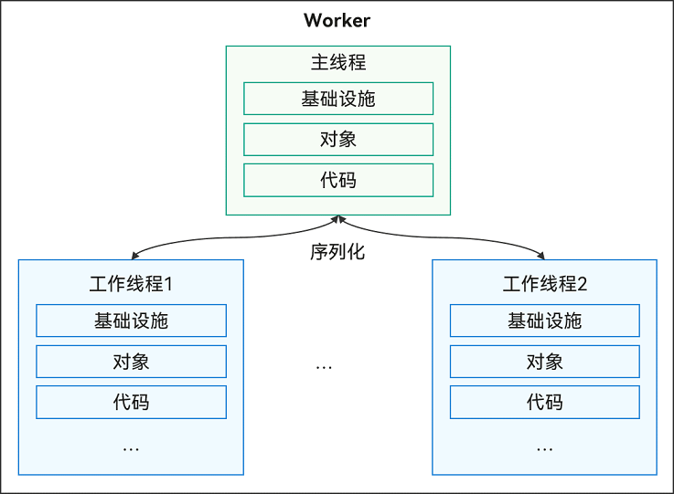

# Worker简介
<!--Kit: ArkTS-->
<!--Subsystem: CommonLibrary-->
<!--Owner: @wang_zhaoyong-->
<!--Designer: @huanghello-->
<!--Tester: @kirl75; @zsw_zhushiwei-->
<!--Adviser: @k1ngqaquuu-->

Worker的主要作用是为应用程序提供一个多线程的运行环境，实现应用程序执行过程与宿主线程分离。通过在后台线程运行脚本处理耗时操作，避免计算密集型或高延迟任务阻塞宿主线程。具体接口信息及使用方法详情请见[Worker](../reference/apis-arkts/js-apis-worker.md)。


## Worker运作机制

**图1** Worker运作机制示意图



创建Worker的线程称为宿主线程（不局限于主线程，Worker线程也支持创建Worker子线程）。Worker子线程（或Actor线程、工作线程）是Worker自身运行的线程。每个Worker子线程和宿主线程拥有独立的实例，包含独立执行环境、对象、代码段等。因此，启动每个Worker存在一定的内存开销，需要限制Worker子线程的数量。Worker子线程和宿主线程通过消息传递机制通信，利用序列化、引用传递或转移所有权的机制完成命令和数据的交互。

## 创建Worker的注意事项

Worker线程文件需要放在"{moduleName}/src/main/ets/"目录层级之下，否则不会被打包到应用中。有手动和自动两种创建Worker线程目录及文件的方式，推荐使用自动创建方式。手动创建Worker线程目录及文件时，需同步进行相关配置。

- 手动创建：开发者手动创建相关目录及文件，通常是在ets目录下创建一个workers文件夹，用于存放worker.ets文件，需要配置build-profile.json5的相关字段信息，确保Worker线程文件被打包到应用中。

  Stage模型：
  <!-- @[manual_create_worker](https://gitcode.com/openharmony/applications_app_samples/blob/master/code/DocsSample/ArkTS/ArkTsConcurrent/MultithreadedConcurrency/WorkerIntroduction/har/build-profile.json5) -->
  
  ``` JSON5
  "buildOption": {
    "sourceOption": {
      "workers": [
        './src/main/ets/workers/worker.ets'
      ]
    }
  }
  ```

  FA模型：
  <!-- @[manual_create_worker](https://gitcode.com/openharmony/applications_app_samples/blob/master/code/DocsSample/ArkTS/ArkTsConcurrent/MultithreadedConcurrency/WorkerIntroduction/mainAbility/build-profile.json5) -->
  
  ``` JSON5
  "buildOption": {
    "sourceOption": {
      "workers": [
        "./src/main/ets/MainAbility/workers/worker.ets"
      ]
    }
  }
  ```

- 自动创建：DevEco Studio支持一键生成Worker，在对应的{moduleName}目录下任意位置，单击鼠标右键 > New > Worker，即可自动生成Worker的模板文件及配置信息，无需再手动在build-profile.json5中进行相关配置。


## 文件路径注意事项

  使用Worker模块的具体功能时，需先构造Worker实例对象。构造函数与API版本相关，且需传入Worker线程文件的路径（scriptURL）。

<!-- @[import_worker](https://gitcode.com/openharmony/applications_app_samples/blob/master/code/DocsSample/ArkTS/ArkTsConcurrent/MultithreadedConcurrency/WorkerIntroduction/entry/src/main/ets/managers/CreateWorker.ets) -->

``` TypeScript
import { worker } from '@kit.ArkTS';

const worker1: worker.ThreadWorker = new worker.ThreadWorker('entry/ets/workers/worker.ets');
```

### Stage模型下的文件路径规则

针对scriptURL的路径有以下三种写法：

写法一：以{moduleName}/ets/{relativePath}的方式加载Worker线程文件。relativePath是Worker线程文件相对于"{moduleName}/src/main/ets/"目录的相对路径。

路径规则：{moduleName}/ets/{relativePath}。

<!-- @[import_worker](https://gitcode.com/openharmony/applications_app_samples/blob/master/code/DocsSample/ArkTS/ArkTsConcurrent/MultithreadedConcurrency/WorkerIntroduction/entry/src/main/ets/managers/StageRulesThreadFile.ets) -->

``` TypeScript
import { worker } from '@kit.ArkTS';
// Worker线程文件所在路径："entry/src/main/ets/workers/worker.ets"
const workerInstance1: worker.ThreadWorker = new worker.ThreadWorker('entry/ets/workers/worker.ets');
// Worker线程文件所在路径："testworkers/src/main/ets/ThreadFile/workers/worker.ets"
const workerInstance2: worker.ThreadWorker = new worker.ThreadWorker('testworkers/ets/ThreadFile/workers/worker.ets');
```

写法二：以@{moduleName}/ets/{relativePath}的方式加载Worker线程文件。

路径规则：@{moduleName}/ets/{relativePath}。

<!-- @[import_worker](https://gitcode.com/openharmony/applications_app_samples/blob/master/code/DocsSample/ArkTS/ArkTsConcurrent/MultithreadedConcurrency/WorkerIntroduction/entry/src/main/ets/managers/StageRulesHar.ets) -->

``` TypeScript
import { worker } from '@kit.ArkTS';
// @标识路径加载形式：
// Worker线程文件所在路径: "har/src/main/ets/workers/worker.ets"
const workerInstance3: worker.ThreadWorker = new worker.ThreadWorker('@har/ets/workers/worker.ets');
```

写法三：以相对路径的方式加载Worker线程文件（仅支持包内加载，不支持跨包加载）。

路径规则：../../{relativePath}。

<!-- @[import_worker](https://gitcode.com/openharmony/applications_app_samples/blob/master/code/DocsSample/ArkTS/ArkTsConcurrent/MultithreadedConcurrency/WorkerIntroduction/har/src/main/ets/components/mainpage/MainPage.ets) -->

``` TypeScript
import { worker } from '@kit.ArkTS';
// 相对路径加载形式：
// Worker线程文件所在路径: "har/src/main/ets/workers/worker.ets"
// 创建Worker对象的文件所在路径："har/src/main/ets/components/mainpage/MainPage.ets"
const workerInstance4: worker.ThreadWorker = new worker.ThreadWorker('../../workers/worker.ets');
```

详细文件路径加载规则如下表：

下表第一列各行表示加载Worker线程文件的所在位置，第一行各列表示被加载的Worker线程文件的所在位置。其余表格内容表示是否支持此类加载及对应路径规则的写法。

例如，下表第二行第四列表示entry模块可以通过写法一加载应用内hsp模块内的Worker线程文件。

> **说明：**
>
>* 当开发者加载entry、[feature](../quick-start/hap-package.md)及hsp包的Worker线程文件时，不建议采用写法三，推荐使用写法一，此写法无需拼接路径，可实现Worker的快速创建。
>
>* Worker线程文件的路径后缀（.ets/.ts）可以省略。
>
>* 跨工程HSP/HAR的场景下，需在创建Worker的模块包对应的oh-package.json5文件中，配置所需HSP/HAR包的依赖项，详见[引用共享包](https://developer.huawei.com/consumer/cn/doc/harmonyos-guides/ide-har-import)。
>
>* 当feature模块需加载其他模块的Worker线程文件时，应先完成对feature模块的调用。
>
>* 当开启useNormalizedOHMUrl（在工程目录中与entry同级别的应用级build-profile.json5文件中，将strictMode属性下的useNormalizedOHMUrl字段配置为true）或HAR包被打包成三方包使用时，HAR包中使用Worker仅支持通过相对路径的加载形式创建。

| 加载方\被加载方    | entry     | feature                 | 应用内hsp                  | 跨工程hsp | 源码har                   | 三方har                                    |
|:------- | --------- | ----------------------- | ----------------------- | ------ | ----------------------- | ---------------------------------------- |
| entry   | 支持（写法一、三） | 支持（写法一）                 | 支持（写法一）                 | 不支持    | 支持（写法二）                 | 不支持                                      |
| feature | 不支持       | 跨包支持（写法一），包内场景支持（写法一、三） | 支持（写法一）                 | 不支持    | 支持（写法二）                 | 不支持                                      |
| 应用内hsp  | 不支持       | 支持（写法一）                 | 跨包支持（写法一），包内场景支持（写法一、三） | 不支持    | 支持（写法二）                 | 不支持                                      |
| 跨工程hsp  | 不支持       | 不支持                     | 不支持                     | 不支持    | 不支持                     | 不支持                                      |
| 源码har   | 不支持       | 支持（写法一）                 | 支持（写法一）                 | 不支持    | 跨包支持（写法二），包内场景支持（写法二、三） | 不支持                                      |
| 三方har   | 不支持       | 不支持                     | 不支持                     | 不支持    | 不支持                     | 仅支持包内场景（写法三） |


以entry模块加载源码har包的Worker线程文件为例，具体步骤如下：

1. 创建HAR详情参考[开发静态共享包](../quick-start/har-package.md)。

2. 在HAR中创建Worker线程文件相关内容。

   <!-- @[create_har_worker](https://gitcode.com/openharmony/applications_app_samples/blob/master/code/DocsSample/ArkTS/ArkTsConcurrent/MultithreadedConcurrency/WorkerIntroduction/har/src/main/ets/workers/worker.ets) -->
   
   ``` TypeScript
   import { ErrorEvent, MessageEvents, ThreadWorkerGlobalScope, worker } from '@kit.ArkTS';
   
   const workerPort: ThreadWorkerGlobalScope = worker.workerPort;
   // ...
   workerPort.onmessage = (e: MessageEvents) => {
     console.info('worker thread receive message: ', e.data);
     workerPort.postMessage('worker thread post message to main thread');
   }
   ```

3. 在entry模块的oh-package.json5文件中配置HAR包的依赖。

   <!-- @[config_har_dependency](https://gitcode.com/openharmony/applications_app_samples/blob/master/code/DocsSample/ArkTS/ArkTsConcurrent/MultithreadedConcurrency/WorkerIntroduction/entry/oh-package.json5) --> 
   
   ``` JSON5
   {
     "name": "entry",
     "version": "1.0.0",
     "description": "Please describe the basic information.",
     "main": "",
     "author": "",
     "license": "",
     "dependencies": {
       // ...
       "har": "file:../har"
     }
   }
   ```

4. 在entry模块中加载HAR包中的Worker线程文件。注：该用例中用的worker.ets文件首字母为小写，实际创建的Worker文件默认为大写。

   <!-- @[load_har_worker](https://gitcode.com/openharmony/applications_app_samples/blob/master/code/DocsSample/ArkTS/ArkTsConcurrent/MultithreadedConcurrency/WorkerIntroduction/entry/src/main/ets/managers/crosshar.ets) -->
   
   ``` TypeScript
   import { worker } from '@kit.ArkTS';
   
   @Entry
   @Component
   struct Index {
     @State message: string = 'Hello World';
   
     build() {
       RelativeContainer() {
         Text(this.message)
           .id('HelloWorld')
           .fontSize(50)
           .fontWeight(FontWeight.Bold)
           .alignRules({
             center: { anchor: '__container__', align: VerticalAlign.Center },
             middle: { anchor: '__container__', align: HorizontalAlign.Center }
           })
           .onClick(() => {
             // 通过@标识路径加载形式，加载har中Worker线程文件
             let workerInstance = new worker.ThreadWorker('@har/ets/workers/worker.ets');
             workerInstance.onmessage = () => {
               console.info('main thread onmessage');
             };
             workerInstance.postMessage('hello world');
             this.message = 'success';
           })
       }
       .height('100%')
       .width('100%')
     }
   }
   ```


### FA模型下的文件路径规则

  构造函数中的scriptURL为：Worker线程文件与"{moduleName}/src/main/ets/MainAbility"的相对路径。

<!-- @[import_worker](https://gitcode.com/openharmony/applications_app_samples/blob/master/code/DocsSample/ArkTS/ArkTsConcurrent/MultithreadedConcurrency/WorkerIntroduction/mainAbility/src/main/ets/MainAbility/StageRulesFa.ets) -->

``` TypeScript
import { worker } from '@kit.ArkTS';

// 主要说明以下三种场景：

// 场景1： Worker线程文件所在路径："{moduleName}/src/main/ets/MainAbility/workers/worker.ets"
const workerFA1: worker.ThreadWorker = new worker.ThreadWorker('workers/worker.ets', {name:'first worker in FA model'});

// 场景2： Worker线程文件所在路径："{moduleName}/src/main/ets/workers/worker.ets"
const workerFA2: worker.ThreadWorker = new worker.ThreadWorker('../workers/worker.ets');

// 场景3： Worker线程文件所在路径："{moduleName}/src/main/ets/MainAbility/ThreadFile/workers/worker.ets"
const workerFA3: worker.ThreadWorker = new worker.ThreadWorker('ThreadFile/workers/worker.ets');
```


## 生命周期注意事项

- Worker创建后需要手动管理生命周期。Worker的创建和销毁会消耗较多的系统资源，建议开发者合理管理并重复使用已创建的Worker。Worker空闲时仍会占用资源，当不需要Worker时，可以调用[terminate()](../reference/apis-arkts/js-apis-worker.md#terminate9)方法或[close()](../reference/apis-arkts/js-apis-worker.md#close9)方法主动销毁Worker。需要注意的是，调用完terminate()方法或close()方法后，Worker线程的退出是异步的。若开发者注册onexit()，则线程真正退出的时机是在onexit()回调完成之后。若Worker处于已销毁或正在销毁等非运行状态时，调用其功能接口，会抛出相应的错误。


- Worker的数量由内存管理策略决定，设定的内存阈值为1.5GB和设备物理内存的60%中的较小值。在内存允许的情况下，系统最多可以同时运行64个Worker，并且与[napi_create_ark_runtime](../reference/native-lib/napi.md#napi_create_ark_runtime)创建的runtime总数不超过80。尝试创建的Worker数量超出上限时，系统将抛出错误：“Worker initialization failure, the number of workers exceeds the maximum.”。实际运行的Worker数量会根据当前内存使用情况实时调整。当所有Worker和主线程的累积内存占用超过设定的阈值时，系统将触发内存溢出（OOM）错误，导致应用程序崩溃。

## 其他注意事项

- 不同线程中上下文对象是不同的，因此Worker线程只能使用线程安全的库，例如UI相关的非线程安全库不能在Worker子线程中使用。
- 单次序列化传输的数据量大小限制为16MB。
- 不支持在Worker工作线程中使用[AppStorage](../ui/state-management/arkts-appstorage.md)。
- 在Worker文件中禁止使用export语法导出任何内容，否则会导致jscrash问题。
- 应用挂起切换到[后台](../task-management/background-task-overview.md)后，该应用的Worker线程会暂停运行。
- 除上述注意事项外，使用Worker时还需注意[并发注意事项](multi-thread-concurrency-overview.md#并发注意事项)。

## Worker基本用法示例

1. DevEco Studio支持一键生成Worker，在对应的{moduleName}目录下任意位置，单击鼠标右键 &gt; New &gt; Worker，即可自动生成Worker的模板文件及配置信息。本文以创建“worker”为例。

   支持手动创建Worker文件，具体方式和注意事项请参阅[创建Worker的注意事项](#创建worker的注意事项)。

2. 导入Worker模块。
    <!-- @[create_manager_index_import](https://gitcode.com/openharmony/applications_app_samples/blob/master/code/DocsSample/ArkTS/ArkTsConcurrent/MultithreadedConcurrency/WorkerIntroduction/entry/src/main/ets/managers/Index.ets) -->
    
    ``` TypeScript
    // Index.ets
    import { ErrorEvent, MessageEvents, worker } from '@kit.ArkTS';
    ```

3. 在宿主线程中，通过调用ThreadWorker的[constructor()](../reference/apis-arkts/js-apis-worker.md#constructor9)方法创建Worker对象，并注册回调函数。
      <!-- @[create_manager_index](https://gitcode.com/openharmony/applications_app_samples/blob/master/code/DocsSample/ArkTS/ArkTsConcurrent/MultithreadedConcurrency/WorkerIntroduction/entry/src/main/ets/managers/Index.ets) -->
      
      ``` TypeScript
      // Index.ets
      @Entry
      @Component
      struct Index {
        @State message: string = 'Hello World';
      
        build() {
          RelativeContainer() {
            Text(this.message)
              .id('HelloWorld')
              .fontSize(50)
              .fontWeight(FontWeight.Bold)
              .alignRules({
                center: { anchor: '__container__', align: VerticalAlign.Center },
                middle: { anchor: '__container__', align: HorizontalAlign.Center }
              })
              .onClick(() => {
                // 创建Worker对象
                let workerInstance = new worker.ThreadWorker('entry/ets/workers/worker.ets');
      
                // 注册onmessage回调，捕获宿主线程接收到来自其创建的Worker通过workerPort.postMessage接口发送的消息。该回调在宿主线程执行
                workerInstance.onmessage = (e: MessageEvents) => {
                  let data: string = e.data;
                  console.info('workerInstance onmessage is: ', data);
                }
      
                // 注册onAllErrors回调，捕获Worker线程的onmessage回调、timer回调以及文件执行等流程产生的全局异常。该回调在宿主线程执行
                workerInstance.onAllErrors = (err: ErrorEvent) => {
                  console.error('workerInstance onAllErrors message is: ' + err.message);
                }
      
                // 注册onmessageerror回调，当Worker对象接收到无法序列化的消息时被调用，在宿主线程执行
                workerInstance.onmessageerror = () => {
                  console.error('workerInstance onmessageerror');
                }
      
                // 注册onexit回调，当Worker销毁时被调用，在宿主线程执行
                workerInstance.onexit = (e: number) => {
                  // Worker正常退出时，code为0；异常退出时，code为1
                  console.info('workerInstance onexit code is: ', e);
                }
      
                // 发送消息给Worker线程
                workerInstance.postMessage('1');
                // ...
              })
          }
          .height('100%')
          .width('100%')
        }
      }
      ```

4. 在Worker文件中注册回调函数。
      <!-- @[register_callback_function](https://gitcode.com/openharmony/applications_app_samples/blob/master/code/DocsSample/ArkTS/ArkTsConcurrent/MultithreadedConcurrency/WorkerIntroduction/entry/src/main/ets/workers/worker.ets) -->
      
      ``` TypeScript
      // worker.ets
      import { ErrorEvent, MessageEvents, ThreadWorkerGlobalScope, worker } from '@kit.ArkTS';
      
      const workerPort: ThreadWorkerGlobalScope = worker.workerPort;
      
      // 注册onmessage回调，当Worker线程收到来自其宿主线程通过postMessage接口发送的消息时被调用，在Worker线程执行
      workerPort.onmessage = (e: MessageEvents) => {
        let data: string = e.data;
        console.info('workerPort onmessage is: ', data);
      
        // 向宿主线程发送消息
        workerPort.postMessage('2');
      }
      
      // 注册onmessageerror回调，当Worker对象接收到一条无法被序列化的消息时被调用，在Worker线程执行
      workerPort.onmessageerror = () => {
        console.error('workerPort onmessageerror');
      }
      
      // 注册onerror回调，捕获Worker在执行过程中发生的异常，在Worker线程执行
      workerPort.onerror = (err: ErrorEvent) => {
        console.error('workerPort onerror err is: ', err.message);
      }
      ```

## 多级Worker生命周期管理
支持创建多级Worker，即父Worker可以创建子Worker，形成层级线程关系。由于Worker线程的生命周期由开发者管理，因此需要正确管理多级Worker的生命周期。当销毁父Worker时未能终止其子Worker的运行，可能会导致不可预期的结果。所以需要确保子Worker的生命周期在父Worker生命周期范围内，销毁父Worker前，先销毁所有子Worker，以防止不可预期的结果。


### 推荐使用示例
<!-- @[recommended_example](https://gitcode.com/openharmony/applications_app_samples/blob/master/code/DocsSample/ArkTS/ArkTsConcurrent/MultithreadedConcurrency/WorkerIntroduction/entry/src/main/ets/managers/recommend.ets) -->

``` TypeScript
// 在宿主线程中创建Worker线程（父Worker），在Worker线程中再次创建Worker线程（子Worker）
import { worker, MessageEvents, ErrorEvent } from '@kit.ArkTS';

// 宿主线程中创建父Worker对象
const parentWorker = new worker.ThreadWorker('entry/ets/workers/ParentWorker.ets');

// 接收父Worker返回的消息
parentWorker.onmessage = (e: MessageEvents) => {
  console.info('宿主线程收到父Worker线程信息 ' + e.data);
}

// 父Worker正常退出后的回调
parentWorker.onexit = () => {
  console.info('父Worker退出');
}

// 父Worker运行过程中发生未被捕获的异常或运行错误时的回调
parentWorker.onAllErrors = (err: ErrorEvent) => {
  console.error('宿主线程接收到父Worker报错 ' + err.message);
}

// 向父Worker发送启动消息，用于触发其onmessage中的处理逻辑
parentWorker.postMessage('宿主线程发送消息给父Worker-推荐示例');
```
<!-- @[recommended_example](https://gitcode.com/openharmony/applications_app_samples/blob/master/code/DocsSample/ArkTS/ArkTsConcurrent/MultithreadedConcurrency/WorkerIntroduction/entry/src/main/ets/workers/ParentWorker.ets) -->

``` TypeScript
// ParentWorker.ets
import { ErrorEvent, MessageEvents, ThreadWorkerGlobalScope, worker } from '@kit.ArkTS';

// 父Worker线程中与宿主线程通信的对象
const workerPort: ThreadWorkerGlobalScope = worker.workerPort;

workerPort.onmessage = (e : MessageEvents) => {
  // 收到宿主线程指令后，创建子Worker
  if (e.data == '宿主线程发送消息给父Worker-推荐示例') {
    let childWorker = new worker.ThreadWorker('entry/ets/workers/ChildWorker.ets');

    // 接收子Worker的执行结果
    childWorker.onmessage = (e: MessageEvents) => {
      console.info('父Worker收到子Worker的信息 ' + e.data);
      if (e.data == '子Worker向父Worker发送信息') {
        // 子Worker任务完成后，通知宿主线程
        workerPort.postMessage('父Worker向宿主线程发送信息');
      }
    }

    // 子Worker退出后再销毁父Worker
    childWorker.onexit = () => {
      console.info('子Worker退出');
      workerPort.close();
    }

    // 子Worker运行过程中发生未被捕获的异常或运行错误时的回调
    childWorker.onAllErrors = (err: ErrorEvent) => {
      console.error('子Worker发生报错 ' + err.message);
    }

    // 向子Worker发送启动消息，用于触发其onmessage中的处理逻辑
    childWorker.postMessage('父Worker向子Worker发送信息-推荐示例');
  }
}
```

<!-- @[recommended_example](https://gitcode.com/openharmony/applications_app_samples/blob/master/code/DocsSample/ArkTS/ArkTsConcurrent/MultithreadedConcurrency/WorkerIntroduction/entry/src/main/ets/workers/ChildWorker.ets) -->

``` TypeScript
// ChildWorker.ets
import { ErrorEvent, MessageEvents, ThreadWorkerGlobalScope, worker } from '@kit.ArkTS';

// 子Worker线程中与父Worker线程通信的对象
const workerPort: ThreadWorkerGlobalScope = worker.workerPort;

workerPort.onmessage = (e: MessageEvents) => {
  if (e.data == '父Worker向子Worker发送信息-推荐示例') {
    // 子Worker线程业务逻辑...
    console.info('业务执行结束，然后子Worker销毁');
    // 子Worker任务完成后退出
    workerPort.close();
  }
}
```

### 不推荐使用示例

不建议在父Worker销毁后，子Worker继续向父Worker发送消息。因为父Worker已被销毁，消息无法被正确处理。

反例1

<!-- @[not_recommended_example](https://gitcode.com/openharmony/applications_app_samples/blob/master/code/DocsSample/ArkTS/ArkTsConcurrent/MultithreadedConcurrency/WorkerIntroduction/entry/src/main/ets/managers/notrecommendedone.ets) -->

``` TypeScript
import { worker, MessageEvents, ErrorEvent } from '@kit.ArkTS';

// 宿主线程中创建父Worker对象
const parentWorker = new worker.ThreadWorker('entry/ets/workers/ParentWorker.ets');

// 接收父Worker返回的消息
parentWorker.onmessage = (e: MessageEvents) => {
  console.info('宿主线程收到父Worker信息' + e.data);
}

// 父Worker正常退出后的回调
parentWorker.onexit = () => {
  console.info('父Worker退出');
}

// 父Worker运行过程中发生未被捕获的异常或运行错误时的回调
parentWorker.onAllErrors = (err: ErrorEvent) => {
  console.error('宿主线程接收到父Worker报错 ' + err.message);
}

// 向父Worker发送启动消息，用于触发其onmessage中的处理逻辑
parentWorker.postMessage('宿主线程发送消息给父Worker');
```

反例2

<!-- @[not_recommended_example](https://gitcode.com/openharmony/applications_app_samples/blob/master/code/DocsSample/ArkTS/ArkTsConcurrent/MultithreadedConcurrency/WorkerIntroduction/testworkers/src/main/ets/workers/ParentWorker.ets) -->

``` TypeScript
// ParentWorker.ets
import { ErrorEvent, MessageEvents, ThreadWorkerGlobalScope, worker } from '@kit.ArkTS';

// 父Worker线程中与宿主线程通信的对象
const workerPort: ThreadWorkerGlobalScope = worker.workerPort;

workerPort.onmessage = (e : MessageEvents) => {
  console.info('父Worker收到宿主线程的信息 ' + e.data);

  // 收到宿主线程指令后，创建子Worker
  let childWorker = new worker.ThreadWorker('entry/ets/workers/ChildWorker.ets')

  // 接收子Worker的执行结果
  childWorker.onmessage = (e: MessageEvents) => {
    console.info('父Worker收到子Worker的信息 ' + e.data);
  }

  // 子Worker正常退出后的回调
  childWorker.onexit = () => {
    console.info('子Worker退出');
    // 父Worker已经或即将退出时，再次通过父Worker端口发送消息
    workerPort.postMessage('父Worker向宿主线程发送信息');
  }

  // 子Worker运行过程中发生未被捕获的异常或运行错误时的回调
  childWorker.onAllErrors = (err: ErrorEvent) => {
    console.error('子Worker发生报错 ' + err.message);
  }

  // 向子Worker发送启动消息，用于触发其onmessage中的处理逻辑
  childWorker.postMessage('父Worker向子Worker发送信息');

  // 创建子Worker后，销毁父Worker
  workerPort.close();
}
```
<!-- @[not_recommended_example](https://gitcode.com/openharmony/applications_app_samples/blob/master/code/DocsSample/ArkTS/ArkTsConcurrent/MultithreadedConcurrency/WorkerIntroduction/testworkers/src/main/ets/workers/ChildWorker.ets) -->

``` TypeScript
// ChildWorker.ets
import { ErrorEvent, MessageEvents, ThreadWorkerGlobalScope, worker } from '@kit.ArkTS';

// 子Worker与父Worker通信的对象
const workerPort: ThreadWorkerGlobalScope = worker.workerPort;

workerPort.onmessage = (e: MessageEvents) => {
  console.info('子Worker收到信息 ' + e.data);

  // 父Worker销毁后，子Worker向父Worker发送信息
  workerPort.postMessage('子Worker向父Worker发送信息');

  // 延迟再次发送
  setTimeout(() => {
    workerPort.postMessage('子Worker向父Worker发送信息');
  }, 1000);
}
```

不建议在父Worker发起销毁操作的执行阶段创建子Worker。在创建子Worker线程之前，需确保父Worker线程始终处于存活状态，建议在确定父Worker未发起销毁操作的情况下创建子Worker。
<!-- @[not_recommended_example](https://gitcode.com/openharmony/applications_app_samples/blob/master/code/DocsSample/ArkTS/ArkTsConcurrent/MultithreadedConcurrency/WorkerIntroduction/entry/src/main/ets/managers/notrecommendedtwo.ets) -->

``` TypeScript
import { worker, MessageEvents, ErrorEvent } from '@kit.ArkTS';

// 宿主线程中创建父Worker对象
const parentWorker = new worker.ThreadWorker('entry/ets/workers/ParentWorker.ets');

// 接收父Worker返回的消息
parentWorker.onmessage = (e: MessageEvents) => {
  console.info('宿主线程收到父Worker信息' + e.data);
}

// 父Worker正常退出后的回调
parentWorker.onexit = () => {
  console.info('父Worker退出');
}

// 父Worker运行过程中发生未被捕获的异常或运行错误时的回调
parentWorker.onAllErrors = (err: ErrorEvent) => {
  console.error('宿主线程接收到父Worker报错 ' + err.message);
}

// 向父Worker发送启动消息，用于触发其onmessage中的处理逻辑
parentWorker.postMessage('宿主线程发送消息给父Worker');
```

<!-- @[not_recommended_example_two](https://gitcode.com/openharmony/applications_app_samples/blob/master/code/DocsSample/ArkTS/ArkTsConcurrent/MultithreadedConcurrency/WorkerIntroduction/mainAbility/src/main/ets/workers/ParentWorker.ets) -->

``` TypeScript
// ParentWorker.ets
import { ErrorEvent, MessageEvents, ThreadWorkerGlobalScope, worker } from '@kit.ArkTS';

// 父Worker线程中与宿主线程通信的对象
const workerPort: ThreadWorkerGlobalScope = worker.workerPort;

workerPort.onmessage = (e : MessageEvents) => {
  console.info('父Worker收到宿主线程的信息 ' + e.data);

  // 父Worker销毁后创建子Worker
  workerPort.close();
  let childWorker = new worker.ThreadWorker('entry/ets/workers/ChildWorker.ets');

  // 子Worker线程未确认创建成功前销毁父Worker
  // let childWorker = new worker.ThreadWorker('entry/ets/workers/ChildWorker.ets');
  // workerPort.close();

  // 接收子Worker返回的消息
  childWorker.onmessage = (e: MessageEvents) => {
    console.info('父Worker收到子Worker的信息 ' + e.data);
  }

  // 子Worker正常退出后的回调
  childWorker.onexit = () => {
    console.info('子Worker退出');
    // 父Worker已经或即将退出时，再次通过父Worker端口发送消息
    workerPort.postMessage('父Worker向宿主线程发送信息');
  }

  // 子Worker运行过程中发生未被捕获的异常或运行错误时的回调
  childWorker.onAllErrors = (err: ErrorEvent) => {
    console.error('子Worker发生报错 ' + err.message);
  }

  // 向子Worker发送启动消息
  childWorker.postMessage('父Worker向子Worker发送信息');
}
```

<!-- @[not_recommended_example_two](https://gitcode.com/openharmony/applications_app_samples/blob/master/code/DocsSample/ArkTS/ArkTsConcurrent/MultithreadedConcurrency/WorkerIntroduction/mainAbility/src/main/ets/workers/ChildWorker.ets) --> 

``` TypeScript
// ChildWorker.ets
import { ErrorEvent, MessageEvents, ThreadWorkerGlobalScope, worker } from '@kit.ArkTS';

// 子Worker与父Worker通信的对象
const workerPort: ThreadWorkerGlobalScope = worker.workerPort;

// 子Worker接收返回的消息
workerPort.onmessage = (e: MessageEvents) => {
  console.info('子Worker收到信息 ' + e.data);
}
```