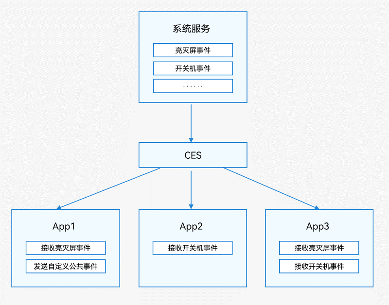

# 公共事件简介

CES（Common Event Service，公共事件服务）为应用程序提供订阅、发布、退订公共事件的能力。

## 公共事件分类
公共事件从系统角度可分为：系统公共事件和自定义公共事件。

- 系统公共事件：CES内部定义的公共事件，当前仅支持系统应用和系统服务发布，例如HAP安装、更新、卸载等公共事件。目前支持的系统公共事件请参见[系统公共事件列表](../../reference/apis-basic-services-kit/common_event/commonEventManager-definitions.md)。
- 自定义公共事件：应用定义的公共事件，可用于实现跨进程的事件通信能力。

公共事件按发送方式可分为：无序公共事件、有序公共事件和粘性公共事件。

- 无序公共事件：CES在转发公共事件时，不考虑订阅者是否接收到该事件，也不保证订阅者接收到该事件的顺序与其订阅顺序一致。
- 有序公共事件：CES在转发公共事件时，根据订阅者设置的优先级等级，优先将公共事件发送给优先级较高的订阅者，等待其成功接收该公共事件之后再将事件发送给优先级较低的订阅者。如果有多个订阅者具有相同的优先级，则他们将随机接收到公共事件。
- 粘性公共事件：能够让订阅者收到在订阅前已经发送的公共事件就是粘性公共事件。普通的公共事件只能在订阅后发送才能收到，而粘性公共事件的特殊性就是可以先发送后订阅，同时也支持先订阅后发送。发送粘性事件必须是系统应用或系统服务，粘性事件发送后会一直存在系统中，且发送者需要申请`ohos.permission.COMMONEVENT_STICKY`权限，配置方式请参见[声明权限](../../security/AccessToken/declare-permissions.md)。

## 运作机制
每个应用都可以按需订阅公共事件，订阅成功，当公共事件发布时，系统会将其发送给对应的应用。这些公共事件可能来自系统、其他应用和应用自身。

**图1** 公共事件示意图  

## 安全注意事项

- **公共事件发布方**：如果不加限制，任何应用都可以订阅公共事件并读取相关信息，应避免在公共事件中携带敏感信息。采用以下方式，可以限制公共事件接收方的范围。
  - 通过[CommonEventPublishData](../../reference/apis-basic-services-kit/js-apis-inner-commonEvent-commonEventPublishData.md)中的subscriberPermissions参数指定订阅者所需权限。
  - 通过[CommonEventPublishData](../../reference/apis-basic-services-kit/js-apis-inner-commonEvent-commonEventPublishData.md)中的bundleName参数指定订阅者的包名。
- **公共事件订阅方**：订阅自定义公共事件后，任意应用都可以向订阅者发送潜在的恶意公共事件。采用以下方式，可以限制公共事件发布方的范围。
  - 通过[CommonEventSubscribeInfo](../../reference/apis-basic-services-kit/js-apis-inner-commonEvent-commonEventSubscribeInfo.md)中的publisherPermission参数指定发布者所需权限。
  - 通过[CommonEventSubscribeInfo](../../reference/apis-basic-services-kit/js-apis-inner-commonEvent-commonEventSubscribeInfo.md)中的publisherBundleName参数参数指定发布者的包名。
- 自定义公共事件名称应确保全局唯一，否则可能与其他公共事件冲突。