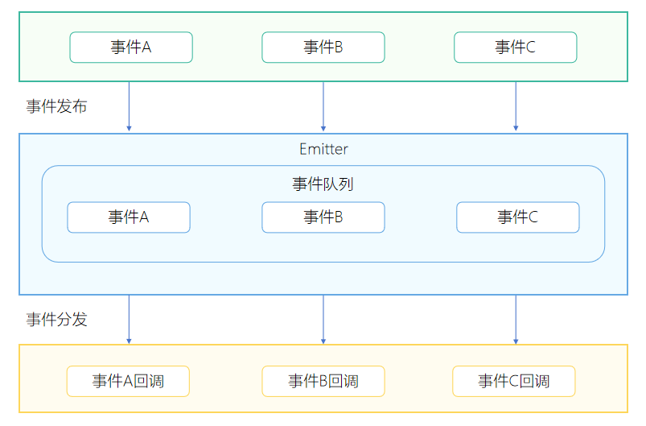

# 使用Emitter进行线程间通信

<!--Kit: Basic Services Kit-->
<!--Subsystem: Notification-->
<!--Owner: @peixu-->
<!--Designer: @dongqingran; @wulong158-->
<!--Tester: @wanghong1997-->
<!--Adviser: @huipeizi-->

Emitter是一种作用在进程内的事件处理机制，为应用程序提供订阅事件、发布事件、取消事件订阅的能力。

## 场景介绍

Emitter用于同一进程内相同线程或不同线程间的事件处理，事件异步执行。使用时需要先订阅一个事件，然后发布该事件，发布完成后Emitter会将已发布的事件分发给订阅者，订阅者就会执行该事件订阅时设置的回调方法。当不需要订阅该事件时应及时取消订阅释放Emitter资源。

## 运作机制
Emitter通过维护一个内部事件队列，来进行任务分发。应用需要先订阅某个事件并设置好该事件的回调方法，当应用程序发布事件后，就会往队列里面插入一个事件。任务队列会串行执行队列里面的任务，执行任务时会调用该任务订阅者的回调方法进行事件处理。



## 接口说明
详细请参见[Emitter接口文档](../../reference/apis-basic-services-kit/js-apis-emitter.md)。
| 接口名  | 用途   | 说明     |
| ------- | ------ | -------- |
| on | 订阅事件 | 持续订阅事件，直至该事件被取消订阅。 |
| once | 订阅事件 | 订阅事件一次。 |
| emit | 发布事件 | 发布事件一次。 |
| off | 取消事件订阅 | 取消事件订阅后，将不再接收该事件的消息。 |

## 开发步骤

使用Emitter实现事件订阅、事件发送以及事件删除，开发步骤如下。

1. 导入模块。
   
   ```ts
   import { emitter, Callback } from '@kit.BasicServicesKit';
   ```

2. 订阅事件。

   订阅事件使用on（持续订阅）或者once（单次订阅）接口进行订阅，设置要订阅的事件以及接收到事件后的回调函数。
   ```ts
    // 定义一个eventId为1的事件。
    let event: emitter.InnerEvent = {
      eventId: 1
    };
    // 定义一个事件的回调处理函数，当收到对应的事件后执行回调函数
    let callback: Callback<emitter.EventData> = (eventData: emitter.EventData) => {
      console.info(`eventData: ${JSON.stringify(eventData)}`);
    }

    // 收到eventId为1的事件后执行回调函数
    emitter.on(event, callback);
   ```

   ```ts
    // 收到eventId为1的事件后执行回调函数。
    // 注意：once订阅只接收一次事件，on订阅则一直接收直到取消订阅为止。
    emitter.once(event, callback);
   ```

3. 发送事件。

   发送事件使用emit接口进行发送，设置要发送的事件以及要传递的参数。
    > **说明：**
    >
    > emit接口支持跨线程传输数据对象，需要遵循数据跨线程传输的规格约束，详见[线程间通信对象](../../arkts-utils/serializable-overview.md)。目前不支持使用[@State装饰器](../../ui/state-management/arkts-state.md)、[@Observed装饰器](../../ui/state-management/arkts-observed-and-objectlink.md)等装饰器修饰的复杂类型数据。
   ```ts
   // 定义一个eventId为1的事件，事件优先级为Low。
   let event: emitter.InnerEvent = {
     eventId: 1,
     priority: emitter.EventPriority.LOW
   };

   let eventData: emitter.EventData = {
     data: {
       content: 'emitter',
       id: 1,
       isEmpty: false
     }
   };
   
   // 发送eventId为1的事件，事件内容为eventData。
   emitter.emit(event, eventData);
   ```

4. 取消事件订阅。
    > **说明：**
    >
    > - 当不需要订阅某个事件时，需要及时取消订阅避免造成内存泄漏。
    > - 使用[off](../../reference/apis-basic-services-kit/js-apis-emitter.md#emitteroff)接口取消某个事件订阅后，已通过[emit](../../reference/apis-basic-services-kit/js-apis-emitter.md#emitteremit)接口发布但尚未被执行的事件将被取消。
   ```ts
   // 取消eventId为1的事件。
   emitter.off(1);
   ```
