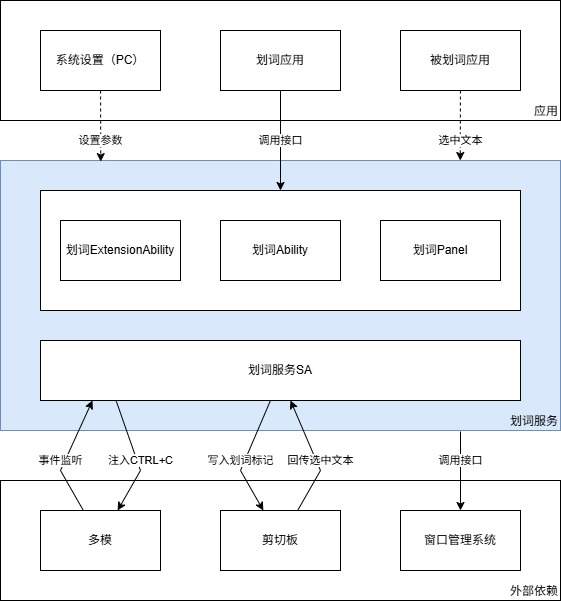

# 划词服务概述（仅对系统应用开放）

从API version 20开始，新增支持划词服务，提供跨应用文本处理及系统管理划词应用的能力。

主要用于文本翻译、内容摘要、术语解释等场景，例如用户长按外文新闻中的单词时，自动触发翻译服务并悬浮显示结果；在阅读应用中划选长段落，通过划词服务快速生成内容摘要；教育类应用识别用户选中的专业术语，提供即时解释卡片等。

## 框架原理

划词服务根据用户设置的开关按需启停。运行时，该服务会监听多模事件识别划词动作，并通过剪贴板接口设置划词标记，触发模拟CTRL+C操作。当选中文本写入剪贴板后，剪贴板会回调该服务的接口以回传划词内容，随后该服务将划词内容发送给应用处理。

## 能力范围

- 划词方式：

  支持鼠标左键按下滑动、左键双击、左键三击三种划词方式。

- 划词窗口管理：

  支持创建和管理菜单窗口与主窗口，提供窗口创建、移动、隐藏、销毁等接口，并支持设定窗口内容。

## 约束限制

- 支持外接键盘和鼠标的2in1设备。

- 支持获取文本类型的划词内容，最大长度限制为6000个字节。
