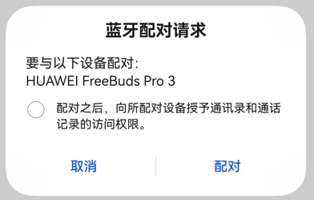

# 配对连接设备

<!--Kit: Connectivity Kit-->
<!--Subsystem: Communication-->
<!--Owner: @enjoy_sunshine-->
<!--SE: @chengguohong; @tangjia15-->
<!--TSE: @wangfeng517-->

## 简介
本指南主要提供了主动配对设备和连接设备可用profile能力的开发指导。

## 开发步骤

### 申请蓝牙权限
需要申请权限ohos.permission.ACCESS_BLUETOOTH。如何配置和申请权限，具体操作请参考[声明权限](../../security/AccessToken/declare-permissions.md)和[向用户申请授权](../../security/AccessToken/request-user-authorization.md)。

### 导入所需API模块
导入connection、a2dp、 hfp、 hid、baseProfile、constant和错误码模块。
```ts
import { connection, a2dp, hfp, hid, baseProfile, constant } from '@kit.ConnectivityKit';
import { BusinessError } from '@kit.BasicServicesKit';
```

### 订阅配对状态变化事件
通过订阅配对状态变化事件，可以获取实时的配对状态。在整个配对过程中，涉及多种状态的跃迁，其中[BOND_STATE_BONDED](../../reference/apis-connectivity-kit/js-apis-bluetooth-connection.md#bondstate)表示已配对。

应用主动发起配对其他设备，或者其他设备主动配对本机设备，都可以通过此事件获取配对情况。
```ts
// 定义配对状态变化函数回调
function onReceiveEvent(data: connection.BondStateParam) {
    console.info('pair result: '+ JSON.stringify(data));
}

try {
  // 发起订阅
  connection.on('bondStateChange', onReceiveEvent);
} catch (err) {
  console.error('errCode: ' + (err as BusinessError).code + ', errMessage: ' + (err as BusinessError).message);
}
```

### 发起配对
若目标设备的配对状态是[BOND_STATE_INVALID](../../reference/apis-connectivity-kit/js-apis-bluetooth-connection.md#bondstate)，则可以主动配对目标设备。
- 目标设备可以通过发现设备流程获取，详情请参考：[传统蓝牙查找设备](br-discovery-development-guide.md)或者[低功耗蓝牙查找设备](ble-development-guide.md)。

配对过程中，系统会弹出对话框。不同配对类型，对话框样式可能不一样，其中“确认配对密钥（Confirm Passkey）”模式如下图1。若用户同意授权，才能配对成功。



**图1** 蓝牙配对请求对话框
```ts
// 设备地址可以通过查找设备流程获取
let device = 'XX:XX:XX:XX:XX:XX';

try {
  // 发起配对
  connection.pairDevice(device).then(() => {
    console.info('pairDevice');
  }, (error: BusinessError) => {
    console.error('pairDevice: errCode:' + error.code + ',errMessage' + error.message);
  });
} catch (err) {
  console.error('startPair: errCode:' + err.code + ',errMessage' + err.message);
}
```

### 连接已配对设备的profile
若应用配对完目标设备后，可以调用[connectAllowedProfiles](../../reference/apis-connectivity-kit/js-apis-bluetooth-connection.md#connectionconnectallowedprofiles16)，发起连接该设备支持的profile能力（只包括A2DP、HFP和HID）。若应用需要使用SPP连接，请参考[连接和传输数据](spp-development-guide.md)。

- 蓝牙子系统会在配对过程中查询和保存目标设备支持的所有profile能力。
- 配对完成后，应用可以主动查询目标设备的profile能力，需调用[getRemoteProfileUuids](../../reference/apis-connectivity-kit/js-apis-bluetooth-connection.md#connectiongetremoteprofileuuids12)。若存在应用需要的能力，则可以在配对完成后30s内，发起连接目标设备的profile。
```ts
// 设备地址是已配对的设备
let device = 'XX:XX:XX:XX:XX:XX';

// 创建A2DP/HFP/HID实例
let a2dpSrc = a2dp.createA2dpSrcProfile();
let hfpAg = hfp.createHfpAgProfile();
let hidHost = hid.createHidHostProfile();

// 定义A2DP连接状态变化回调函数
function onA2dpConnectStateChange(data: baseProfile.StateChangeParam) {
  console.info(`A2DP State: ${JSON.stringify(data)}`);
}

// 定义HFP连接状态变化回调函数
function onHfpConnectStateChange(data: baseProfile.StateChangeParam) {
  console.info(`HFP State: ${JSON.stringify(data)}`);
}

// 定义HID连接状态变化回调函数
function onHidConnectStateChange(data: baseProfile.StateChangeParam) {
  console.info(`HID State: ${JSON.stringify(data)}`);
}

try {
    // 建议判断目标设备的profile能力是否存在A2DP/HFP/HID
    // 订阅A2DP/HFP/HID连接状态变化事件
    a2dpSrc.on('connectionStateChange', onA2dpConnectStateChange);
    hfpAg.on('connectionStateChange', onHfpConnectStateChange);
    hidHost.on('connectionStateChange', onHidConnectStateChange);

    // 发起连接profile
    connection.connectAllowedProfiles(device).then(() => {
      console.info('connectAllowedProfiles');
    }, (error: BusinessError) => {
      console.error('errCode:' + error.code + ',errMessage' + error.message);
    });
} catch (err) {
  console.error('errCode:' + err.code + ',errMessage' + err.message);
}
```

## 完整示例
```ts
import { connection, a2dp, hfp, hid, baseProfile, constant } from '@kit.ConnectivityKit';
import { BusinessError } from '@kit.BasicServicesKit';

export class PairDeviceManager {
  device: string = '';
  pairState: connection.BondState = connection.BondState.BOND_STATE_INVALID;
  a2dpSrc = a2dp.createA2dpSrcProfile();
  hfpAg = hfp.createHfpAgProfile();
  hidHost = hid.createHidHostProfile();

  // 定义配对状态变化回调函数
  onBondStateEvent = (data: connection.BondStateParam) => {
    console.info('pair result: '+ JSON.stringify(data));
    if (data && data.deviceId == this.device) {
      this.pairState = data.state; // 保存目标设备的配对状态
    }
  };

  // 发起配对，设备地址可以通过查找设备流程获取
  public startPair(device: string) {
    this.device = device;
    try {
      // 发起订阅配对状态变化事件
      connection.on('bondStateChange', this.onBondStateEvent);
    } catch (err) {
      console.error('bondStateChange errCode: ' + (err as BusinessError).code + ', errMessage: ' + (err as BusinessError).message);
    }

    try {
      // 发起配对
      connection.pairDevice(device).then(() => {
        console.info('pairDevice');
      }, (error: BusinessError) => {
        console.error('pairDevice: errCode:' + error.code + ',errMessage' + error.message);
      });
    } catch (err) {
      console.error('startPair: errCode:' + err.code + ',errMessage' + err.message);
    }
  }

  // 定义A2DP连接状态变化回调函数
  onA2dpConnectStateChange = (data: baseProfile.StateChangeParam) => {
    console.info(`A2DP State: ${JSON.stringify(data)}`);
  };

  // 定义HFP连接状态变化回调函数
  onHfpConnectStateChange = (data: baseProfile.StateChangeParam) => {
    console.info(`HFP State: ${JSON.stringify(data)}`);
  };

  // 定义HID连接状态变化回调函数
  onHidConnectStateChange = (data: baseProfile.StateChangeParam) => {
    console.info(`HID State: ${JSON.stringify(data)}`);
  };

  // 发起连接
  public async connect(device: string) {
    try {
      let uuids = await connection.getRemoteProfileUuids(device);
      console.info('device: ' + device + ' remoteUuids: '+ JSON.stringify(uuids));
      let allowedProfiles = 0;
      // 若存在应用需要的profile，则监听对应的profile连接状态
      if (uuids.some(uuid => uuid == constant.ProfileUuids.PROFILE_UUID_A2DP_SINK.toLowerCase())) {
        console.info('device supports a2dp');
        allowedProfiles++;
        this.a2dpSrc.on('connectionStateChange', this.onA2dpConnectStateChange);
      }
      if (uuids.some(uuid => uuid == constant.ProfileUuids.PROFILE_UUID_HFP_HF.toLowerCase())) {
        console.info('device supports hfp');
        allowedProfiles++;
        this.hfpAg.on('connectionStateChange', this.onHfpConnectStateChange);
      }
      if (uuids.some(uuid => uuid == constant.ProfileUuids.PROFILE_UUID_HID.toLowerCase()) ||
        uuids.some(uuid => uuid == constant.ProfileUuids.PROFILE_UUID_HOGP.toLowerCase())) {
        console.info('device supports hid');
        allowedProfiles++;
        this.hidHost.on('connectionStateChange', this.onHidConnectStateChange);
      }
      if (allowedProfiles > 0) { // 若存在可用的profile，则发起连接
        connection.connectAllowedProfiles(device).then(() => {
          console.info('connectAllowedProfiles');
        }, (error: BusinessError) => {
          console.error('errCode:' + error.code + ',errMessage' + error.message);
        });
      }
    } catch (err) {
      console.error('errCode:' + err.code + ',errMessage' + err.message);
    }
  }
}

let pairDeviceManager = new PairDeviceManager();
export default pairDeviceManager as PairDeviceManager;
```