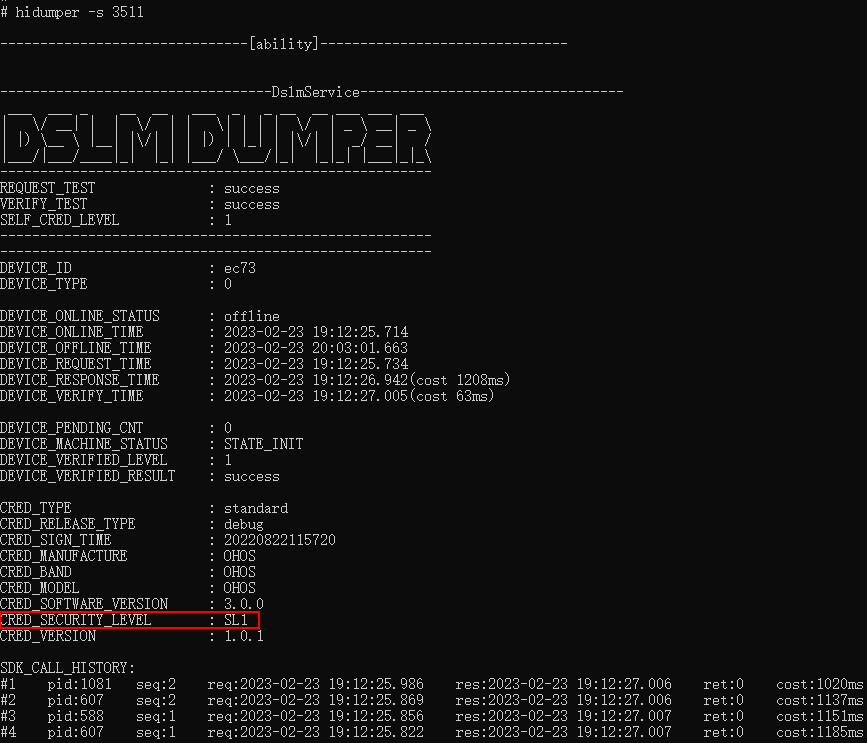

# 基于设备分类和数据分级的访问控制 (ArkTS)

## 基本概念

分布式数据管理对数据实施分类分级保护，提供基于数据安全标签以及设备安全等级的访问控制机制。

数据安全标签和设备安全等级越高，加密措施和访问控制措施越严格，数据安全性越高。


### 数据安全标签

按照数据分类分级规范要求，可将数据分为S1、S2、S3、S4四个安全等级。

  | 风险等级 | 风险标准 | 定义 | 样例 | 
| -------- | -------- | -------- | -------- |
| 严重 | S4 | 业界法律法规定义的特殊数据类型，涉及个人的最私密领域的信息或一旦泄露、篡改、破坏、销毁可能会给个人或组织造成重大的不利影响的数据。 | 政治观点、宗教和哲学信仰、工会成员资格、基因数据、生物信息、健康和性生活状况，性取向等或设备认证鉴权、个人信用卡等财物信息等。 | 
| 高 | S3 | 数据的泄露、篡改、破坏、销毁可能会给个人或组织导致严峻的不利影响。 | 个人实时精确定位信息、运动轨迹等。 | 
| 中 | S2 | 数据的泄露、篡改、破坏、销毁可能会给个人或组织导致严重的不利影响。 | 个人的详细通信地址、姓名昵称等。 | 
| 低 | S1 | 数据的泄露、篡改、破坏、销毁可能会给个人或组织导致有限的不利影响。 | 性别、国籍、用户申请记录等。 | 


### 设备安全等级
<!--RP1-->
根据设备安全能力（例如是否有TEE、是否有安全存储芯片等），将设备安全等级分为SL1、SL2、SL3、SL4、SL5五个等级。例如，开发板rk3568、hi3516为安全等级低的SL1设备，平板为安全等级高的SL4设备。

在设备组网时，可以通过`hidumper -s 3511`命令查看设备的安全等级。如果查询无结果可以通过service_control start dslm_service主动拉起对应进程，之后再使用hidumper命令查询。例如，rk3568设备的安全等级查询如下：
<!--RP1End-->
<!--Del-->

<!--DelEnd-->

## 跨设备同步访问控制机制

数据跨设备同步时，基于数据安全标签和设备安全等级进行访问控制。数据库的数据安全标签不高于对端设备的设备安全等级时，数据才能同步。具体访问控制矩阵如下：

|设备安全级别|可同步的数据安全标签|
|---|---|
|SL1|S1|
|SL2|S1~S2|
|SL3|S1~S3|
|SL4|S1~S4|
|SL5|S1~S4| 
<!--RP2-->
例如，对于类似rk3568、hi3516的开发板设备，设备安全等级为SL1。若创建数据安全标签为S1的数据库，则此数据库数据可以在这些设备间同步；若创建的数据库标签为S2-S4，则不能在这些设备间同步。
<!--RP2End-->

## 场景介绍

分布式数据库的访问控制机制确保了数据存储和同步时的安全能力。在创建数据库时，应当基于数据分类分级规范合理地设置数据库的安全标签，确保数据库内容和数据标签的一致性。


## 使用键值型数据库实现数据分级

键值型数据库，通过securityLevel参数设置数据库的安全等级。此处以创建安全等级为S3的数据库为例。

具体接口及功能，可见[分布式键值数据库](../reference/apis-arkdata/js-apis-distributedKVStore.md)。
> **说明**：
>
> 在单设备使用场景下，KV数据库支持修改securityLevel开库参数进行安全等级升级。数据库安全等级升级操作需要注意以下几点：
> * 该操作不支持需要进行跨设备同步的数据库，不同安全等级的数据库之间不能进行数据同步，需要跨设备同步的数据库如果要升级安全等级，建议重新创建更高安全等级的数据库。
> * 该操作需在关闭当前数据库之后，通过修改securityLevel开库参数重新设置数据库的安全等级，再进行开库操作。
> * 该操作只支持升级，不支持降级。例如支持S2->S3的升级，不支持S3->S2的降级。


```ts
import { AbilityConstant, ConfigurationConstant, UIAbility, Want } from '@kit.AbilityKit';
import { hilog } from '@kit.PerformanceAnalysisKit';
import { distributedKVStore } from '@kit.ArkData';
import { BusinessError } from '@kit.BasicServicesKit';

export default class EntryAbility extends UIAbility {
  onCreate(want: Want, launchParam: AbilityConstant.LaunchParam): void {
    this.context.getApplicationContext().setColorMode(ConfigurationConstant.ColorMode.COLOR_MODE_NOT_SET);
    hilog.info(0x0000, 'testTag', '%{public}s', 'Ability onCreate');
    let kvManager: distributedKVStore.KVManager;
    let kvStore: distributedKVStore.SingleKVStore;
    let context = this.context;
    const kvManagerConfig: distributedKVStore.KVManagerConfig = {
      context: context,
      bundleName: 'com.example.datamanagertest'
    }
    try {
      kvManager = distributedKVStore.createKVManager(kvManagerConfig);
      console.info('Succeeded in creating KVManager.');
      try {
        const options: distributedKVStore.Options = {
          createIfMissing: true,
          encrypt: true,
          backup: false,
          autoSync: false,
          kvStoreType: distributedKVStore.KVStoreType.SINGLE_VERSION,
          securityLevel: distributedKVStore.SecurityLevel.S3
        };
        kvManager.getKVStore<distributedKVStore.SingleKVStore>('storeId', options, (err, store: distributedKVStore.SingleKVStore) => {
          if (err) {
            console.error(`Failed to get KVStore. Code:${err.code},message:${err.message}`);
            return;
          }
          console.info('Succeeded in getting KVStore.');
          kvStore = store;
        });
      } catch (e) {
        let error = e as BusinessError;
        console.error(`An unexpected error occurred. Code:${error.code},message:${error.message}`);
      }
    } catch (e) {
      let error = e as BusinessError;
      console.error(`Failed to create KVManager. Code:${error.code},message:${error.message}`);
    }
  }
}
```

## 使用关系型数据库实现数据分级

关系型数据库，通过securityLevel参数设置数据库的安全等级。此处以创建安全等级为S3的数据库为例。

具体接口及功能，可见[关系型数据库](../reference/apis-arkdata/arkts-apis-data-relationalStore.md)。


  
```ts
import { UIAbility } from '@kit.AbilityKit';
import { relationalStore } from '@kit.ArkData';
import { BusinessError } from '@kit.BasicServicesKit';

export default class EntryAbility extends UIAbility {
  async onCreate(): Promise<void> {
    let store: relationalStore.RdbStore | undefined = undefined;
    let context = this.context;

    try {
      const STORE_CONFIG: relationalStore.StoreConfig = {
        name: 'RdbTest.db',
        securityLevel: relationalStore.SecurityLevel.S3
      };
      store = await relationalStore.getRdbStore(context, STORE_CONFIG);
      console.info('Succeeded in getting RdbStore.')
    } catch (e) {
      const err = e as BusinessError;
      console.error(`Failed to get RdbStore. Code:${err.code}, message:${err.message}`);
    }
  }
}
```
