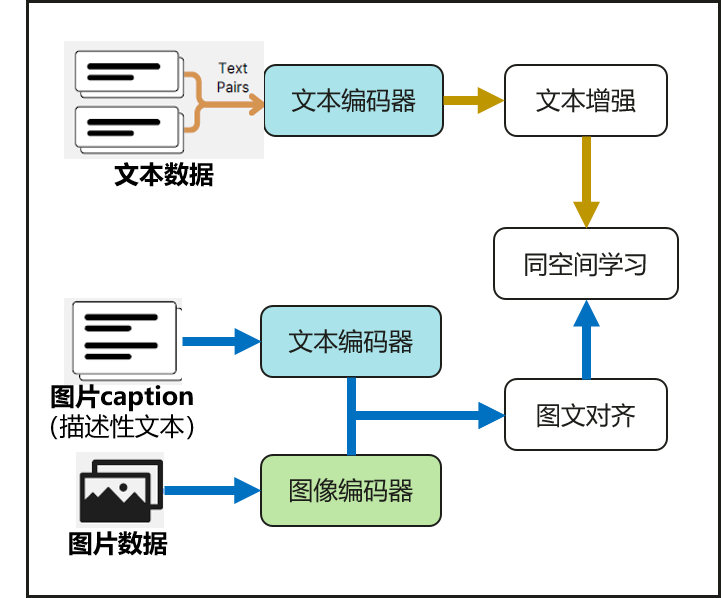

# 应用数据向量化

## 场景介绍

嵌入模型将非结构化的文本、图像等多模态数据，转换成具有语义的向量。在智慧化检索、RAG（检索增强生成）等场景中，嵌入模型扮演桥梁的角色，将离散的图文数据映射到同一向量空间，支撑跨模态的数据检索。其作用主要体现在以下三方面：

### 语义化表征
将用户查询词与多模态数据统一映射为稠密向量，突破关键词匹配的局限，捕捉深层语义关联（如文字的“手机”和手机的图像的相关性），解决语言表述模糊、数据跨模态等问题。

### 高效检索
通过向量的相似度计算，快速从向量数据库中召回与查询词最相关的文档片段。相比传统倒排索引，能识别语义隐含关联（如“国产操作系统”匹配鸿蒙技术文档），提升召回内容的上下文适配性。

### 生成质量提升
检索增强生成（RAG）是解决LLM大模型生成幻觉问题的主流方案，向量知识库是RAG技术的关键，RAG检索出知识库中的精准上下文（Top-K相关向量对应文本）作为提示输入生成模型（如端侧小艺大模型），显著减少生成幻觉。

详细的接口介绍请参考[Intelligence接口](../../reference/apis-arkdata/js-apis-data-intelligence.md)。

## 基本概念

### 多模态嵌入模型
AIP提供多模态的嵌入模型，能将文本和图像这两种不同数据模态转换到同一个向量空间，支持单模态（文搜文、图搜图）和跨模态（文搜图、图搜文）的语义表征能力。

### 文本分块
嵌入模型对输入文本长度有限制。AIP提供分块接口，将输入文本按照开发者指定的上限进行高效切分。

## 运作机制
向量化构建、存储及查询过程，首先介绍应用数据向量化、存储和检索的过程。

### 数据向量化
即数据处理阶段，调用向量化接口，对待处理的原始文本或图像数据做向量化，得到向量数据底库；

### 存储
即数据处理阶段，获取RdbStore，调用向量持久化接口，将向量和原始数据持久化存储；

### 检索
即检索使用阶段，给定查询词，使用嵌入模型将查询词向量化，将查询词向量在已持久化处理的向量底库中做检索，得到与查询词最相似的检索结果。

### 多模态嵌入模型的技术原理
多模态嵌入模型（如图所示）由文本编码器和图像编码器组成，通过多任务、多阶段的表征增强技术，使得模型同时具备单模态（文搜文、图搜图）和跨模态（文搜图、图搜文）的语义表征能力。其中，文搜图能力能够对标同等量级的clip模型，文搜文能力能够对标同等量级Bert-based文本表征模型。
模型推理性能方面，通过模型侧和硬件侧两方面，对嵌入模型的内存、功耗、时延展开优化。模型侧基于模型量化、剪枝、蒸馏等轻量化技术，降低端侧模型的性能开销；硬件侧对NPU算子进行适配分析和优化，进一步对模型的性能消耗进行压缩。


## 约束限制
- 模型推理单次可处理的文本长度上限为512个字符，支持中英文。
- 模型推理单次可处理的图像大小<20MB。

## 接口说明

以下是智慧数据向量化功能的相关接口，接口为异步接口。异步接口通过Promise方式返回。

| 接口名称 | 描述 | 
| -------- | -------- |
| getTextEmbeddingModel(config: ModelConfig): Promise&lt;TextEmbedding&gt; | 获取文本嵌入模型。 | 
| loadModel(): Promise&lt;void&gt; | 加载文本嵌入模型。 | 
| releaseModel(): Promise&lt;void&gt;; | 释放文本嵌入模型。 | 
| getEmbedding(text: string): Promise&lt;Array&lt;number&gt;&gt; | 获取给定文本的嵌入向量。 | 
| getEmbedding(batchTexts: Array&lt;string&gt;): Promise&lt;Array&lt;Array&lt;number&gt;&gt;&gt; | 获取给定批次文本的嵌入向量。 |
| getImageEmbeddingModel(config: ModelConfig): Promise&lt;ImageEmbedding&gt; | 获取图像嵌入模型。 | 
| loadModel(): Promise&lt;void&gt; | 加载图像嵌入模型。 | 
| releaseModel(): Promise&lt;void&gt;; | 释放图像嵌入模型。 | 
| getEmbedding(image: Image): Promise&lt;Array&lt;number&gt;&gt; | 获取给定图像的嵌入向量。 | 
| splitText(text: string, config: SplitConfig): Promise&lt;Array&lt;string&gt;&gt; | 获取文本的分块。 | 


## 开发步骤

1. 导入模块。

    ```ts
    import { intelligence } from '@kit.ArkData';
    ```

2. 获取文本嵌入模型。
     
    ```ts
    import { BusinessError } from '@kit.BasicServicesKit';

    let config:intelligence.ModelConfig = {
      version:1,
      isNpuAvailable:false,
      achePath:"/data"
    }
    let textEmbedding:intelligence.TextEmbedding;

    intelligence.getTextEmbeddingModel(config)
      .then((data:intelligence.TextEmbedding) => {
        console.info("Succeeded in getting TextModel");
        textEmbedding = data;
      })
      .catch((err:BusinessError) => {
        console.error("Failed to get TextModel and code is " + err.code);
      })
    ```

3. 加载文本嵌入模型。

   > **说明：**
   >
   > 该接口都需先调用getTextEmbeddingModel接口获取到TextEmbedding实例，再通过此实例调用如下接口。
     
    ```ts
    import { BusinessError } from '@kit.BasicServicesKit';

    textEmbedding.loadModel()
      .then(() => {
        console.info("Succeeded in loading Model");
      })
      .catch((err:BusinessError) => {
        console.error("Failed to load Model and code is " + err.code);
      })
    ```

4. 释放嵌入模型。

   > **说明：**
   >
   > 该接口都需先调用getTextEmbeddingModel接口获取到TextEmbedding实例，再通过此实例调用如下接口。
     
    ```ts
    import { BusinessError } from '@kit.BasicServicesKit';

    textEmbedding.releaseModel()
      .then(() => {
        console.info("Succeeded in releasing Model");
      })
      .catch((err:BusinessError) => {
        console.error("Failed to release Model and code is " + err.code);
      })
    ```

5. 获取给定文本的嵌入向量。

   > **说明：**
   >
   > 该接口需先调用loadModel接口加载文本嵌入模型，加载成功后调用getEmbedding。
     
    ```ts
    import { BusinessError } from '@kit.BasicServicesKit';

    textEmbedding.loadModel();
    let text = 'text';
    textEmbedding.getEmbedding(text)
      .then((data:Array<number>) => {
        console.info("Succeeded in getting Embedding");
      })
      .catch((err:BusinessError) => {
        console.error("Failed to get Embedding and code is " + err.code);
      })
    ```

6. 获取给定批次文本的嵌入向量。

   > **说明：**
   >
   > 该接口需先调用loadModel接口加载文本嵌入模型，加载成功后调用getEmbedding。
     
    ```ts
    import { BusinessError } from '@kit.BasicServicesKit';

    textEmbedding.loadModel();
    let batchTexts = ['text1','text2'];
    textEmbedding.getEmbedding(batchTexts)
      .then((data:Array<Array<number>>) => {
        console.info("Succeeded in getting Embedding");
      })
      .catch((err:BusinessError) => {
        console.error("Failed to get Embedding and code is " + err.code);
      })
    ```

7. 获取图像嵌入模型。
     
    ```ts
    import { BusinessError } from '@kit.BasicServicesKit';

    let config:intelligence.ModelConfig = {
      version:1,
      isNpuAvailable:false,
      cachePath:"/data"
    }
    let imageEmbedding:intelligence.ImageEmbedding;

    intelligence.getImageEmbeddingModel(config)
      .then((data:intelligence.ImageEmbedding) => {
        console.info("Succeeded in getting ImageModel");
        imageEmbedding = data;
      })
      .catch((err:BusinessError) => {
        console.error("Failed to get ImageModel and code is " + err.code);
      })
   ```

8. 加载图像嵌入模型。

   > **说明：**
   >
   > 该接口都需先调用getTextEmbeddingModel接口获取到TextEmbedding实例，再通过此实例调用如下接口。
 
    ```ts
    import { BusinessError } from '@kit.BasicServicesKit';

    imageEmbedding.loadModel()
      .then(() => {
        console.info("Succeeded in loading Model");
      })
      .catch((err:BusinessError) => {
        console.error("Failed to load Model and code is " + err.code);
      })
    ```

9. 释放图像嵌入模型。

   > **说明：**
   >
   > 该接口都需先调用getTextEmbeddingModel接口获取到TextEmbedding实例，再通过此实例调用如下接口。
     
    ```ts
    import { BusinessError } from '@kit.BasicServicesKit';

    imageEmbedding.releaseModel()
      .then(() => {
        console.info("Succeeded in releasing Model");
      })
      .catch((err:BusinessError) => {
        console.error("Failed to release Model and code is " + err.code);
      })
    ```

10. 获取给定图像的嵌入向量。

   > **说明：**
   >
   > 该接口需先调用loadModel接口加载图像嵌入模型，加载成功后调用getEmbedding。
     
    ```ts
    import { BusinessError } from '@kit.BasicServicesKit';

    imageEmbedding.loadModel();
    let image = 'file://<packageName>/data/storage/el2/base/haps/entry/files/xxx.jpg';
    imageEmbedding.getEmbedding(image)
      .then((data:Array<number>) => {
        console.info("Succeeded in getting Embedding");
      })
      .catch((err:BusinessError) => {
        console.error("Failed to get Embedding and code is " + err.code);
      })
    ```

11. 获取文本的分块。
     
    ```ts
    import { BusinessError } from '@kit.BasicServicesKit';

    let splitConfig:intelligence.SplitConfig = {
      size:10,
      overlapRatio:0.1
    }
    let text = 'text';

    intelligence.splitText(text, splitConfig)
      .then((data:Array<string>) => {
        console.info("Succeeded in splitting Text");
      })
      .catch((err:BusinessError) => {
        console.error("Failed to split Text and code is " + err.code);
      })
    ```