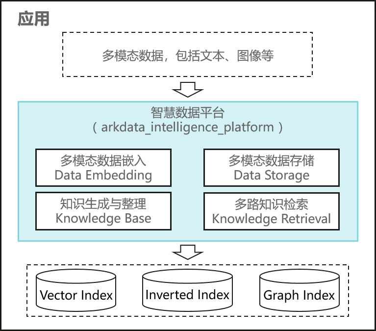

# 智慧数据平台概述

## 场景介绍

在数字化向智能化演进的关键阶段，构建智慧化服务已成为应用开发者提升产品竞争力的必然选择。ArkData智慧数据平台（Arkdata Intelligence Platform，AIP）打造端侧数据智慧化解决方案，提供四大基础能力，端到端覆盖数据语义化、数据结构化存储、知识生成和融合检索全流程，完成数据和AI智能在端侧闭环。例如，在个人办公场景中，开发者可以将用户文档生成向量化语义，存储在向量数据库中，挖掘相似文档，生成个性化知识，支撑智能的检索、推荐、生成、问答等任务。

## 基本概念

在智慧化数据构建与检索过程中，涉及以下基本概念，请先了解相关含义。

### 嵌入/向量化
嵌入（Embedding）技术是将高维非结构化数据（如文字、图像）映射为低维连续向量的技术，通过机器学习模型捕捉数据之间的语义关系，将抽象概念转化为可计算的数学表示，使计算机能够理解非结构化数据。嵌入技术广泛应用于自然语言处理（语义搜索）、图像识别（特征提取）、推荐系统（用户/物品表征）等领域。

## 运作机制

应用引入AIP模块后，AIP的能力均运行在应用进程内（如图所示），数据不出应用，保证隐私安全。AIP将提供以下基础能力：

### 多模态数据嵌入
提供向量化接口，使用端侧嵌入模型，将文本、图像、音视频等非结构化数据转化为可计算的向量表示，映射到同一向量空间，实现跨模态数据的统一表征，支持相似性检索、语义理解等智能场景。

### 多模态数据存储
提供数据存储接口，基于底层数据库能力，支持向量、图、倒排索引等多模态数据存储，数据存在应用沙箱内。AIP对数据的智慧化处理都在端侧进行，避免将原始数据发送到服务器进行处理，减少了数据泄露的风险。

### 知识生成与整理
基于图片、文本等数据，支持高效数据整理与知识生成，实现数据到知识的转换。

### 多路知识检索
提供多路检索接口，支持结构化数据库、向量数据库、图数据库的融合查询，打破数据孤岛，支持条件过滤、关系推理的复合数据检索场景。

以上能力将逐步开放。

## 约束限制

考虑到数据智慧化（主要是向量化）处理的计算量和资源占用较大，当前仅支持在PC产品上开放。
需要注意的是，嵌入模型的推理过程可使用NPU加速，纯CPU的计算在时延和功耗上都有较大差距，建议采用NPU加速。
