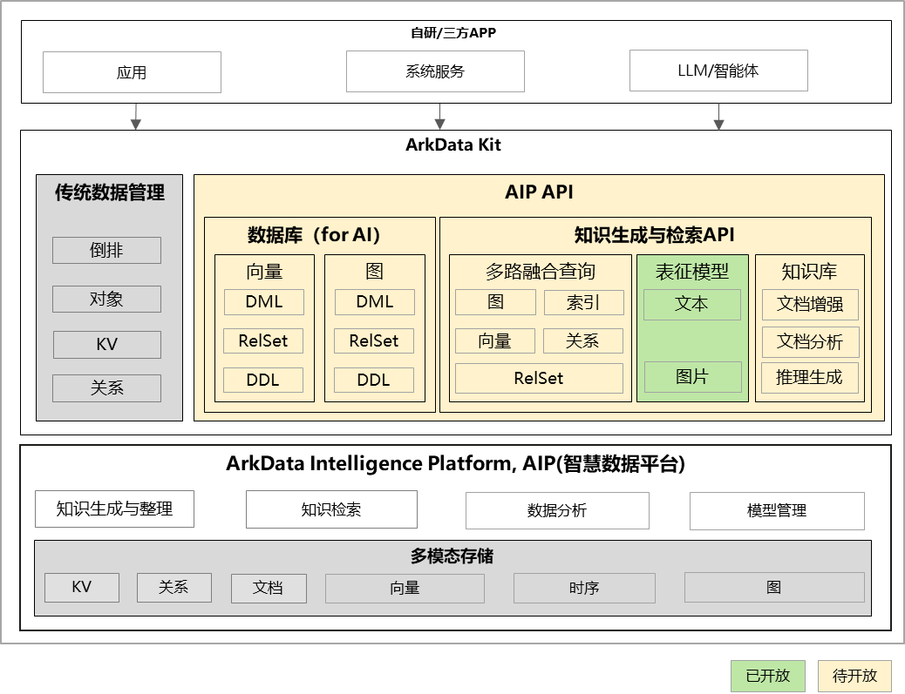

# 智慧化数据构建与检索概述

## 介绍
智慧数据平台（ArkData Intelligence Platform，AIP）提供端侧的数据智慧化能力，完成数据+AI智能在端侧闭环。作为端侧智慧化能力底座，将构建以下能力：
- 多模态嵌入模型：支持文字、图片多模态数据嵌入模型，由传统文本检索到多模态检索（PPT、图片、音频等）。
- 多模态数据存储：支持端侧向量、倒排索引等多模态数据存储，避免将原始数据发送到服务器进行处理，减少了数据泄露的风险。
- 知识检索：逐步构建语义索引、知识图谱、召回、重排等能力，支持用户知识的语义化检索。
- 知识生成与整理：基于用户文档、消息、电子邮件、照片、视频、日历事件、屏幕上下文等数据，支持高效数据整理与知识生成，实现数据到知识的转换。
- 能力开放：面向业务智慧化需求，结合数据与能力开放原则，从基础能力到知识库构建，逐步、逐层开放ArkData Intelligence Platform能力。

## 前置条件
考虑到多模态表征模型的资源占用，目前首先在PC产品上开放，模型推理可使用NPU加速。