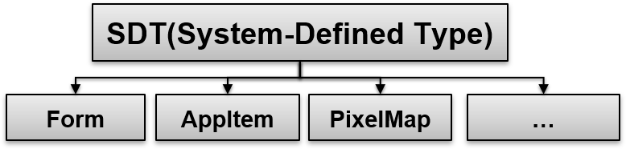
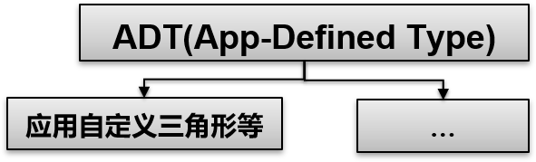

# 标准化数据定义


## 场景介绍

设备、应用的交互核心在于数据的互通，高效的数据互通基础是共识。为了降低应用/业务数据交互成本，促进数据生态建设，标注化数据定义致力于构建
跨应用、跨设备、跨平台的统一数据标准与交互共识，构建统一的OpenHarmony数据语言。应用可以使用统一数据管理框架提供的接口创建和使用这些标准化数据类型。

为了构建OpenHarmony数据跨应用交互的标准定义，降低应用/业务数据交互成本，促进数据生态建设，UDMF提供了标准化的数据定义，统一定义了多种常用的数据类型。
应用可以使用统一数据管理框架提供的接口创建和使用这些标准化数据类型。

## 标准化数据定义与描述

标准化数据定义与描述（Uniform Type Descriptor，简称UTD）在构建过程中首先需要解决OpenHarmony系统中类型模糊问题，即针对同一种数据类型，
存在不同的类型描述方式：MIME Type、文件扩展名等。例如描述JPG/JPEG类型图片时，可以使用image/jpeg、.jgp、.jpeg或直接使用image/picture
等方式进行描述。当相关类型的数据进行跨应用、跨设备传输时，目的端应用/设备需要进行多方面的适配，才能够对数据内容进行推论，且存在无法识别
的情况。

UTD通过定义常用的数据类型描述符，构筑OpenHarmony生态内跨应用、跨设备间数据交互的基础语言，生态内的应用间、设备间数据交互将会形成统一的
逻辑，进而成为OpenHarmony生态内的数据类型标准，可以极大的减少数据互通的适配成本。

### 标准化数据类型的层级关系

基于MIME Type或文件后缀名进行类型区分，存在另一个不足，即扁平化的数据类型定义；扁平/松散的类型定义难以描述不同类型间的兼容与继承关系，
且在实际使用过程中，会增加应用处理数据类型时的开发复杂度，例如搜索场景，用户从精确地搜索动物相关的任意类型图片，进一步扩展到动物相关的
任意图片、视频或音频资源。为了满足上述场景，我们需要在定义数据类型时，支持类型层级结构。

构建标准类型的层级结构，定义层级结构中的兼容与集成关系，能够帮助系统、应用实现数据类型的分层、分类管理。当用户进行数据分享或拖拽式，如果
数据中同时包含图片、视频、音频等内容，系统/应用可以根据层级按需对分享内容进行整理，如分享了XX张照片、XX条视频或XX个媒体资源文件等。

同时，基于标准类型的层级结构，业务声明自己支持的数据类型标识符时，需要声明该类型标识符的层级逻辑，例如业务自定义图片类型UTD标识符
com.company.x-image，并归属到general.image类中。UTD框架会检验自定义类型标识符，确保归属关系中不出现环状结构。

### UTD设计

无论是预定义标准数据类型描述符还是应用自定义数据类型描述符，都遵循同样的UTD结构，包含每个类型描述符的标识ID、层级关系、兼容关系等信息，
其定义如下所示：

“TypeID”：定义每个类型描述符的ID，在UTD框架中，该ID具有唯一性。

“BelongingToTypes”：定义了每个类型描述符的层级结构，即该类型描述符归属于哪个父类型描述符，存在一个类型描述符归属于多个父类型描述的情况，
如general.java-script即归属于general.script，同时也归属于general.executable。

“FilenameExtensions”：当该类型描述符用于描述某个文件类型，可以在定义类型描述符时，定义该类型描述符对应的文件名后缀，支持关联多个文件后缀
名，如定义general.jpeg时，关联.jpg与.jpeg后缀名。

“MIMETypes”：在定义类型描述符时，还支持定义与该类型兼容的MIME Type，同样支持关联多个MIME Type。如定义general.tar-archive类型标识符时，
可以与application/x-tar、application/tar两种MIME Type进行关联。

“Description”：主要介绍该类型描述符的基本信息与使用场景。

“ReferenceURL”：描述该类型描述符的对应的URL链接，该链接可能包含该类型的更多信息。

“IconFile”：用于声明该类型描述符对应的默认图标文件路径。

在UTD框架中，我们将在UTD中定义/注册的标准数据类型描述符分为两类，物理&逻辑，如下图所示（图中设计的类型详见UTD类型定义表）。物理分类的
根节点为general.entity，主要用于描述类型的物理属性，比如文件、目录等；逻辑分类的根节点为general。object，更加注重描述类型的功能性特征，
如图片、网页等。

将类型分为物理和逻辑两类，可以从两个维度对数据类型进行描述，如描述图片是，可以是一个图片对象，同时也可以是一个文件，并非所有的格式都具有
两个维度，如general.calendar，更多的注重calendar对象的功能性描述。


### 接口说明

| 类名称           | 接口名称           | 描述                                                                                            | 
|---------------|-------------------|-----------------------------------------------------------------------------------------------|
| UnifiedRecord | getType(): string                      | 获取当前数据记录对应的具体数据类型。 |
| UnifiedData   | constructor(record: UnifiedRecord)     | 用于创建带有一条数据记录的统一数据对象。                                                     |
| UnifiedData   | addRecord(record: UnifiedRecord): void | 在当前统一数据对象中添加一条数据记录。                                                      |
| UnifiedData   | getRecords(): Array\<UnifiedRecord> | 将当前统一数据对象中的所有数据记录取出，通过本接口取出的数据为UnifiedRecord类型，需通过getType获取数据类型后转为子类再使用。 |


### 开发步骤

## 应用自定义数据类型

UTD基于数据类型是否为常用类型，预先定义一部分标准数据类型描述符，无法穷举式的定义出所有类型描述符，在业务的跨设备、跨平台交互过程中，
会涉及到非预定义的数据类型，为了解决该问题，UTD支持业务声明自定义类型描述符，应用新定义的类型描述符可以继承已有的标准类型描述符，例如业务
自定义的图片类型可以使用com.company.x-image作为UTD标识。

自定义类型标识符与标准数据类型描述符为互补关系，业务可以将自定义类型标识符注册到UTD框架中，这样其他业务在需要使用时可以引用，进而实现
鸿蒙生态内自定义数据类型的共享与统一。


## 显式定义的标准化数据类型

例如跨应用拖拽场景，拖出方应用可以按照标准化数据定义将拖拽数据写入[拖拽事件](../reference/arkui-ts/ts-universal-events-drag-drop.md#dragevent说明)，
拖入方应用从拖拽事件中读取拖拽数据并按照标准化数据定义进行数据的解析。这使得不同应用间的数据交互遵从相同的标准定义，避免了穷举式的数据
类型适配，有效减少了跨应用数据交互的开发工作量。

UDMF提供的标准化数据类型主要包括以下几类：

**基础数据类型：** File、Text等，能够进行跨应用与跨平台流转，如图1和图2所示。

**图1** UDMF File数据类型示意图


**图2** UDMF Text数据类型示意图


**系统相关数据类型（System Defined Type, SDT）：** 与具体的平台/操作系统绑定，如Form（UI卡片信息）、AppItem（App描述信息）、PixelMap（缩略图格式）等，该类数据可以实现系统/平台内的跨应用流转，如图3所示。

**图3** UDMF SDT数据类型示意图



**应用自定义数据类型（App Defined Type, ADT）：** 单个应用自定义的数据，该类数据可以实现应用内的跨平台流转，如图4所示为例，应用可自定义MyFile类型文件格式在应用生态内部使用。

**图4** UDMF ADT数据类型示意图



### 约束限制

- UDMF中每条数据记录大小不超过2MB。
- UDMF支持批量数据记录的分组管理，每个分组整体大小不超过4MB。

### 接口说明

UDMF提供了统一数据对象UnifiedData，用于封装一组数据记录UnifiedRecord。数据记录UnifiedRecord则是对UDMF支持的数据内容的抽象定义，例如一条文本记录、一条图片记录等。数据记录中的数据内容类型对应为各数据类型UniformDataType。

以下是常见的UDMF的接口说明，更多接口和具体说明，请见[标准化数据通路](../reference/apis/js-apis-data-unifiedDataChannel.md)和[标准化数据定义与描述](../reference/apis/js-apis-data-uniformTypeDescriptor.md)。

| 类名称           | 接口名称           | 描述                                                                                            | 
|---------------|-------------------|-----------------------------------------------------------------------------------------------|
| UnifiedRecord | getType(): string                      | 获取当前数据记录对应的具体数据类型。 |
| UnifiedData   | constructor(record: UnifiedRecord)     | 用于创建带有一条数据记录的统一数据对象。                                                     |
| UnifiedData   | addRecord(record: UnifiedRecord): void | 在当前统一数据对象中添加一条数据记录。                                                      |
| UnifiedData   | getRecords(): Array\<UnifiedRecord> | 将当前统一数据对象中的所有数据记录取出，通过本接口取出的数据为UnifiedRecord类型，需通过getType获取数据类型后转为子类再使用。 |


### 开发步骤

以一次创建统一数据对象（包含图片、纯文本两条数据记录）为例，说明开发步骤。

1. 导入`@ohos.data.unifiedDataChannel`和`@ohos.data.uniformTypeDescriptor`模块。
   
   ```ts
   import unifiedDataChannel from '@ohos.data.unifiedDataChannel';
   import uniformTypeDescriptor from '@ohos.data.uniformTypeDescriptor';
   ```
2. 创建图片数据记录，并初始化得到带有该数据记录的UnifiedData对象。
   
   （1）创建图片数据记录。
   
   ```ts
   let image = new unifiedDataChannel.Image();
   ```
   
   （2）修改对象属性。
   
   ```ts
   // Image对象包含一个属性imageUri
   image.imageUri = '...';
   ```
   
   （3）访问对象属性。
   
   ```ts
   console.info(`imageUri = ${image.imageUri}`);
   ```
   
   （4）创建一个统一数据对象实例。
   
   ```ts
   let unifiedData = new unifiedDataChannel.UnifiedData(image);
   ```
3. 创建纯文本数据类型记录，将其添加到刚才创建的UnifiedData对象。
   
   ```ts
   let plainText = new unifiedDataChannel.PlainText();
   plainText.textContent = 'this is textContent of plainText';
   plainText.abstract = 'abstract of plainText';
   plainText.details = {
     plainKey1: 'plainValue1',
     plainKey2: 'plainValue2',
   };
   unifiedData.addRecord(plainText);
   ```
4. 记录添加完成后，可获取当前UnifiedData对象内的所有数据记录。
   
   ```ts
   let records = unifiedData.getRecords();
   ```
5. 遍历每条记录，判断该记录的数据类型，转换为子类对象，得到原数据记录。
   
   ```ts
   for (let i = 0; i < records.length; i ++) {
     // 读取该数据记录的类型
     let type = records[i].getType();
     switch (type) {
       case uniformTypeDescriptor.UniformDataType.IMAGE:
         // 转换得到原图片数据记录
         let image = records[i] as unifiedDataChannel.Image;
         break;
       case uniformTypeDescriptor.UniformDataType.PLAIN_TEXT:
         // 转换得到原文本数据记录
         let plainText = records[i] as unifiedDataChannel.PlainText;
         break;
       default:
         break;
     }
   }
   ```
