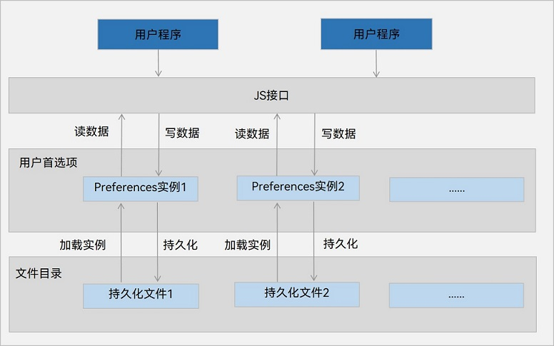

# 通过用户首选项实现数据持久化


## 场景介绍

用户首选项为应用提供Key-Value键值型的数据处理能力，支持应用持久化轻量级数据，并对其修改和查询。当用户希望有一个全局唯一存储的地方，可以采用用户首选项来进行存储。Preferences会将该数据缓存在内存中，当用户读取的时候，能够快速从内存中获取数据，当需要持久化时可以使用flush接口将内存中的数据写入持久化文件中。Preferences会随着存放的数据量越多而导致应用占用的内存越大，因此，Preferences不适合存放过多的数据，也不支持通过配置加密，适用的场景一般为应用保存用户的个性化设置（字体大小，是否开启夜间模式）等。


## 运作机制

如图所示，用户程序通过ArkTS接口调用用户首选项读写对应的数据文件。开发者可以将用户首选项持久化文件的内容加载到Preferences实例，每个文件唯一对应到一个Preferences实例，系统会通过静态容器将该实例存储在内存中，直到主动从内存中移除该实例或者删除该文件。

应用首选项的持久化文件保存在应用沙箱内部，可以通过context获取其路径。具体可见[获取应用文件路径](../application-models/application-context-stage.md#获取应用文件路径)。

**图1** 用户首选项运作机制  




## 约束限制

- 首选项无法保证进程并发安全，会有文件损坏和数据丢失的风险，不支持在多进程场景下使用。

- Key键为string类型，要求非空且长度不超过1024个字节。

- 如果Value值为string类型，请使用UTF-8编码格式，可以为空，不为空时长度不超过16 * 1024 * 1024个字节。

- 内存会随着存储数据量的增大而增大，所以存储的数据量应该是轻量级的，建议存储的数据不超过一万条，否则会在内存方面产生较大的开销。


## 接口说明

以下是用户首选项持久化功能的相关接口，更多接口及使用方式请见[用户首选项](../reference/apis-arkdata/js-apis-data-preferences.md)。

| 接口名称                                                     | 描述                                                         |
| ------------------------------------------------------------ | ------------------------------------------------------------ |
| getPreferencesSync(context: Context, options: Options): Preferences | 获取Preferences实例。该接口存在异步接口。                    |
| putSync(key: string, value: ValueType): void                 | 将数据写入Preferences实例，可通过flush将Preferences实例持久化。该接口存在异步接口。 |
| hasSync(key: string): boolean                                   | 检查Preferences实例是否包含名为给定Key的存储键值对。给定的Key值不能为空。该接口存在异步接口。 |
| getSync(key: string, defValue: ValueType): ValueType              | 获取键对应的值，如果值为null或者非默认值类型，返回默认数据defValue。该接口存在异步接口。 |
| deleteSync(key: string): void                                | 从Preferences实例中删除名为给定Key的存储键值对。该接口存在异步接口。 |
| flush(callback: AsyncCallback&lt;void&gt;): void             | 将当前Preferences实例的数据异步存储到用户首选项持久化文件中。 |
| on(type: 'change', callback: Callback&lt;string&gt;): void | 订阅数据变更，订阅的数据发生变更后，在执行flush方法后，触发callback回调。 |
| off(type: 'change', callback?: Callback&lt;string&gt;): void | 取消订阅数据变更。                                           |
| deletePreferences(context: Context, options: Options, callback: AsyncCallback&lt;void&gt;): void | 从内存中移除指定的Preferences实例。若Preferences实例有对应的持久化文件，则同时删除其持久化文件。 |


## 开发步骤

1. 导入`@kit.ArkData`模块。
   
   ```ts
   import { preferences } from '@kit.ArkData';
   ```

2. 获取Preferences实例。

   <!--Del-->Stage模型示例：<!--DelEnd-->


   ```ts
   import { UIAbility } from '@kit.AbilityKit';
   import { BusinessError } from '@kit.BasicServicesKit';
   import { window } from '@kit.ArkUI';

   let dataPreferences: preferences.Preferences | null = null;

   class EntryAbility extends UIAbility {
     onWindowStageCreate(windowStage: window.WindowStage) {
       let options: preferences.Options = { name: 'myStore' };
       dataPreferences = preferences.getPreferencesSync(this.context, options);
     }
   }
   ```

   <!--Del-->FA模型示例：


   ```ts
   // 获取context
   import { featureAbility } from '@kit.AbilityKit';
   import { BusinessError } from '@kit.BasicServicesKit';
   
   let context = featureAbility.getContext();
   let options: preferences.Options =  { name: 'myStore' };
   let dataPreferences: preferences.Preferences = preferences.getPreferencesSync(context, options);
   ```
<!--DelEnd-->

3. 写入数据。

   使用putSync()方法保存数据到缓存的Preferences实例中。在写入数据后，如有需要，可使用flush()方法将Preferences实例的数据存储到持久化文件。

   > **说明：**
   >
   > 当对应的键已经存在时，putSync()方法会覆盖其值。可以使用hasSync()方法检查是否存在对应键值对。

   示例代码如下所示：

   ```ts
   import { util } from '@kit.ArkTS';
   if (dataPreferences.hasSync('startup')) {
     console.info("The key 'startup' is contained.");
   } else {
     console.info("The key 'startup' does not contain.");
     // 此处以此键值对不存在时写入数据为例
     dataPreferences.putSync('startup', 'auto');
     // 当字符串有特殊字符时，需要将字符串转为Uint8Array类型再存储
     let uInt8Array1 = new util.TextEncoder().encodeInto("~！@#￥%……&*（）——+？");
     dataPreferences.putSync('uInt8', uInt8Array1);
   }
   ```

4. 读取数据。

   使用getSync()方法获取数据，即指定键对应的值。如果值为null或者非默认值类型，则返回默认数据。

   示例代码如下所示：

   ```ts
   let val = dataPreferences.getSync('startup', 'default');
   console.info("The 'startup' value is " + val);
   // 当获取的值为带有特殊字符的字符串时，需要将获取到的Uint8Array转换为字符串
   let uInt8Array2 : preferences.ValueType = dataPreferences.getSync('uInt8', new Uint8Array(0));
   let textDecoder = util.TextDecoder.create('utf-8');
   val = textDecoder.decodeToString(uInt8Array2 as Uint8Array);
   console.info("The 'uInt8' value is " + val);
   ```

5. 删除数据。

   使用deleteSync()方法删除指定键值对，示例代码如下所示：


   ```ts
   dataPreferences.deleteSync('startup');
   ```

6. 数据持久化。

   应用存入数据到Preferences实例后，可以使用flush()方法实现数据持久化。示例代码如下所示：

   ```ts
   dataPreferences.flush((err: BusinessError) => {
     if (err) {
       console.error(`Failed to flush. Code:${err.code}, message:${err.message}`);
       return;
     }
     console.info('Succeeded in flushing.');
   })
   ```

7. 订阅数据变更。

   应用订阅数据变更需要指定observer作为回调方法。订阅的Key值发生变更后，当执行flush()方法时，observer被触发回调。示例代码如下所示：

   ```ts
   let observer = (key: string) => {
     console.info('The key' + key + 'changed.');
   }
   dataPreferences.on('change', observer);
   // 数据产生变更，由'auto'变为'manual'
   dataPreferences.put('startup', 'manual', (err: BusinessError) => {
     if (err) {
       console.error(`Failed to put the value of 'startup'. Code:${err.code},message:${err.message}`);
       return;
     }
     console.info("Succeeded in putting the value of 'startup'.");
     if (dataPreferences !== null) {
       dataPreferences.flush((err: BusinessError) => {
         if (err) {
           console.error(`Failed to flush. Code:${err.code}, message:${err.message}`);
           return;
         }
         console.info('Succeeded in flushing.');
       })
     }
   })
   ```

8. 删除指定文件。

   使用deletePreferences()方法从内存中移除指定文件对应的Preferences实例，包括内存中的数据。若该Preference存在对应的持久化文件，则同时删除该持久化文件，包括指定文件及其备份文件、损坏文件。

   > **说明：**
   >
   > - 调用该接口后，应用不允许再使用该Preferences实例进行数据操作，否则会出现数据一致性问题。
   > 
   > - 成功删除后，数据及文件将不可恢复。

   示例代码如下所示：


   ```ts
   preferences.deletePreferences(this.context, options, (err: BusinessError) => {
     if (err) {
       console.error(`Failed to delete preferences. Code:${err.code}, message:${err.message}`);
         return;
     }
     console.info('Succeeded in deleting preferences.');
   })
   ```

## 相关实例

针对用户首选项开发，有以下相关实例可供参考：

- [游戏2048（ArkTS）（API9）](https://gitee.com/openharmony/applications_app_samples/tree/OpenHarmony-5.0.1-Release/code/Solutions/Game/Game2048)

- [图案密码锁（ArkTS）（API9）](https://gitee.com/openharmony/applications_app_samples/tree/OpenHarmony-5.0.1-Release/code/Solutions/Tools/PatternLock)

- [首选项（ArkTS）（API9）](https://gitee.com/openharmony/applications_app_samples/tree/OpenHarmony-5.0.1-Release/code/BasicFeature/DataManagement/Preferences)

- [首选项（ArkTS）（API9）](https://gitee.com/openharmony/codelabs/tree/master/Data/Preferences)

- [用户首选项（JS）（API9）](https://gitee.com/openharmony/codelabs/tree/master/Data/PreferenceJS)

- [备忘录（ArkTS）（API9）](https://gitee.com/openharmony/codelabs/tree/master/Data/NotePadOpenHarmony)

- [应用的首次启动（ArkTS）（API9）](https://gitee.com/openharmony/codelabs/tree/master/Data/FirstStartDemo)

- [应用内字体大小调节（ArkTS）（API9）](https://gitee.com/openharmony/codelabs/tree/master/Data/SetAppFontSize)

<!--RP1--><!--RP1End-->