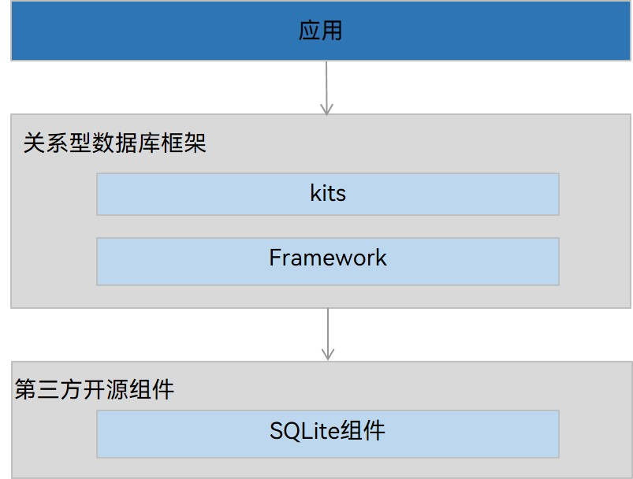

# 通过关系型数据库实现数据持久化 (ArkTS)


## 场景介绍

关系型数据库基于SQLite组件，适用于存储包含复杂关系数据的场景，比如一个班级的学生信息，需要包括姓名、学号、各科成绩等，又或者公司的雇员信息，需要包括姓名、工号、职位等，由于数据之间有较强的对应关系，复杂程度比键值型数据更高，此时需要使用关系型数据库来持久化保存数据。

大数据量场景下查询数据可能会导致耗时长甚至应用卡死，如有相关操作可参考文档[批量数据写数据库场景](../arkts-utils/batch-database-operations-guide.md)，且有建议如下：
- 单次查询数据量不超过5000条。
- 在[TaskPool](../reference/apis-arkts/js-apis-taskpool.md)中查询。
- 拼接SQL语句尽量简洁。
- 合理地分批次查询。

## 基本概念

- **谓词**：数据库中用来代表数据实体的性质、特征或者数据实体之间关系的词项，主要用来定义数据库的操作条件。

- **结果集**：指用户查询之后的结果集合，可以对数据进行访问。结果集提供了灵活的数据访问方式，可以更方便地拿到用户想要的数据。


## 运作机制

关系型数据库对应用提供通用的操作接口，底层使用SQLite作为持久化存储引擎，支持SQLite具有的数据库特性，包括但不限于事务、索引、视图、触发器、外键、参数化查询和预编译SQL语句。

**图1** 关系型数据库运作机制
 



## 约束限制

- 系统默认日志方式是[WAL](data-terminology.md#wal模式)（Write Ahead Log）模式，系统默认落盘方式是[FULL模式](data-terminology.md#full模式)。

- 数据库中常驻有4个读连接和1个写连接。读连接会动态扩充，无可用读连接时，会创建新的读连接执行读操作。写连接不会动态扩充，无可用写连接时，会等待连接释放后执行写操作。

- 为保证数据的准确性，数据库同一时间只能支持一个写操作。

- 当应用被卸载完成后，设备上的相关数据库文件及临时文件会被自动清除。

- ArkTS侧支持的基本数据类型：number、string、二进制类型数据、boolean。

- 为保证插入并读取数据成功，建议一条数据不要超过2M。超出该大小，插入成功，读取失败。

## 接口说明

以下是关系型数据库持久化功能的相关接口，大部分为异步接口。异步接口均有callback和Promise两种返回形式，下表均以callback形式为例，更多接口及使用方式请见[关系型数据库](../reference/apis-arkdata/arkts-apis-data-relationalStore.md)。

| 接口名称 | 描述 | 
| -------- | -------- |
| getRdbStore(context: Context, config: StoreConfig, callback: AsyncCallback&lt;RdbStore&gt;): void | 获得一个RdbStore，操作关系型数据库，用户可以根据自己的需求配置RdbStore的参数，然后通过RdbStore调用相关接口可以执行相关的数据操作。 | 
| executeSql(sql: string, bindArgs: Array&lt;ValueType&gt;, callback: AsyncCallback&lt;void&gt;):void | 执行包含指定参数但不返回值的SQL语句。 | 
| insert(table: string, values: ValuesBucket, callback: AsyncCallback&lt;number&gt;):void | 向目标表中插入一行数据。 | 
| update(values: ValuesBucket, predicates: RdbPredicates, callback: AsyncCallback&lt;number&gt;):void | 根据predicates的指定实例对象更新数据库中的数据。 | 
| delete(predicates: RdbPredicates, callback: AsyncCallback&lt;number&gt;):void | 根据predicates的指定实例对象从数据库中删除数据。 | 
| query(predicates: RdbPredicates, columns: Array&lt;string&gt;, callback: AsyncCallback&lt;ResultSet&gt;):void | 根据指定条件查询数据库中的数据。 | 
| deleteRdbStore(context: Context, name: string, callback: AsyncCallback&lt;void&gt;): void | 删除数据库。 | 
| isTokenizerSupported(tokenizer: Tokenizer): boolean | 判断当前平台是否支持传入的分词器（将文本分解为更小单元的工具，这些单元可以是单词、子词、字符或者其他语言片段）。|

## 开发步骤
因Stage模型、FA模型的差异，个别示例代码提供了在两种模型下的对应示例；示例代码未区分模型或没有对应注释说明时默认在两种模型下均适用。

关系型数据库操作或者存储过程中，有可能会因为各种原因发生非预期的数据库异常情况（抛出14800011），此时需要对数据库进行重建并恢复数据，以保障正常的应用开发，具体可见[关系型数据库异常重建](data-backup-and-restore.md#关系型数据库异常重建)。

1. 使用关系型数据库实现数据持久化，需要获取一个RdbStore，其中包括建库、建表、升降级等操作。示例代码如下所示：

   Stage模型示例：
     
   ```ts
   import { relationalStore } from '@kit.ArkData'; // 导入模块
   import { UIAbility } from '@kit.AbilityKit';
   import { BusinessError } from '@kit.BasicServicesKit';
   import { window } from '@kit.ArkUI';

   // 此处示例在Ability中实现，使用者也可以在其他合理场景中使用
   class EntryAbility extends UIAbility {
     onWindowStageCreate(windowStage: window.WindowStage) {
       // 若希望使用分词器，可调用isStorageTypeSupported检查希望使用的分词器是否支持当前平台。
       let tokenType = relationalStore.Tokenizer.ICU_TOKENIZER;
       let tokenTypeSupported = relationalStore.isTokenizerSupported(tokenType);
       if (!tokenTypeSupported) {
         console.error(`ICU_TOKENIZER is not supported on this platform.`);
       }
       const STORE_CONFIG: relationalStore.StoreConfig = {
         // 数据库文件名
         name: 'RdbTest.db',
         // 数据库安全级别
         securityLevel: relationalStore.SecurityLevel.S3,
         // 可选参数，指定数据库是否加密，默认不加密
         encrypt: false,
         // 可选参数，数据库自定义路径。默认在本应用沙箱目录下创建RdbStore实例。
         customDir: 'customDir/subCustomDir',
         // 可选参数，指定数据库是否以只读方式打开。默认为false，表示数据库可读可写。为true时，只允许从数据库读取数据，不允许对数据库进行写操作，否则会返回错误码801。
         isReadOnly: false,
         // 可选参数，指定用户在全文搜索场景(FTS)下使用哪种分词器。默认在FTS下仅支持英文分词，不支持其他语言分词。
         tokenizer: tokenType
       };

       // 判断数据库版本，如果不匹配则需进行升降级操作
       // 假设当前数据库版本为3，表结构：EMPLOYEE (NAME, AGE, SALARY, CODES, IDENTITY)
       // 建表Sql语句, IDENTITY为bigint类型，sql中指定类型为UNLIMITED INT
       const SQL_CREATE_TABLE =
         'CREATE TABLE IF NOT EXISTS EMPLOYEE (ID INTEGER PRIMARY KEY AUTOINCREMENT, NAME TEXT NOT NULL, AGE INTEGER, SALARY REAL, CODES BLOB, IDENTITY UNLIMITED INT)';

       relationalStore.getRdbStore(this.context, STORE_CONFIG, async (err, store) => {
         if (err) {
           console.error(`Failed to get RdbStore. Code:${err.code}, message:${err.message}`);
           return;
         }
         console.info('Succeeded in getting RdbStore.');
         let storeVersion = store.version;
         // 当数据库创建时，数据库默认版本为0
         if (storeVersion === 0) {
           try {
             await store.executeSql(SQL_CREATE_TABLE); // 创建数据表，以便后续调用insert接口插入数据
             storeVersion = 3;
             // 设置数据库的版本，入参为大于0的整数
           } catch (e) {
             const err = e as BusinessError;
             console.error(`Failed to executeSql. Code:${err.code}, message:${err.message}`);
           }
         }

         // 如果数据库版本不为0且和当前数据库版本不匹配，需要进行升降级操作
         // 当数据库存在并假定版本为1时，例应用从某一版本升级到当前版本，数据库需要从1版本升级到2版本
         if (storeVersion === 1) {
           // version = 1：表结构：EMPLOYEE (NAME, SALARY, CODES, ADDRESS) => version = 2：表结构：EMPLOYEE (NAME, AGE, SALARY, CODES, ADDRESS)
           try {
             await store.executeSql('ALTER TABLE EMPLOYEE ADD COLUMN AGE INTEGER');
             console.info("Upgrade store version from 1 to 2 success.")
             storeVersion = 2;
           } catch (e) {
             const err = e as BusinessError;
             console.error(`Failed to executeSql. Code:${err.code}, message:${err.message}`);
           }
         }

         // 当数据库存在并假定版本为2时，例应用从某一版本升级到当前版本，数据库需要从2版本升级到3版本
         if (storeVersion === 2) {
           // version = 2：表结构：EMPLOYEE (NAME, AGE, SALARY, CODES, ADDRESS) => version = 3：表结构：EMPLOYEE (NAME, AGE, SALARY, CODES)
           try {
             await store.executeSql('ALTER TABLE EMPLOYEE DROP COLUMN ADDRESS');
             storeVersion = 3;
             console.info("Upgrade store version from 2 to 3 success.")
           } catch (e) {
             const err = e as BusinessError;
             console.error(`Failed to executeSql. Code:${err.code}, message:${err.message}`);
           }
         }
         store.version = storeVersion;
         // 请确保获取到RdbStore实例，完成数据表创建后，再进行数据库的增、删、改、查等操作
       });
     }
   }
   ```

   FA模型示例：

   ```ts
   import { relationalStore } from '@kit.ArkData'; // 导入模块
   import { featureAbility } from '@kit.AbilityKit';
   import { BusinessError } from '@kit.BasicServicesKit';
   
   let context = featureAbility.getContext();

   const STORE_CONFIG: relationalStore.StoreConfig = {
     name: 'RdbTest.db', // 数据库文件名
     securityLevel: relationalStore.SecurityLevel.S3 // 数据库安全级别
   };

   // 假设当前数据库版本为3，表结构：EMPLOYEE (NAME, AGE, SALARY, CODES, IDENTITY)
   // 建表Sql语句，IDENTITY为bigint类型，sql中指定类型为UNLIMITED INT
   const SQL_CREATE_TABLE =
     'CREATE TABLE IF NOT EXISTS EMPLOYEE (ID INTEGER PRIMARY KEY AUTOINCREMENT, NAME TEXT NOT NULL, AGE INTEGER, SALARY REAL, CODES BLOB, IDENTITY UNLIMITED INT)';
   
   relationalStore.getRdbStore(context, STORE_CONFIG, async (err, store) => {
     if (err) {
       console.error(`Failed to get RdbStore. Code:${err.code}, message:${err.message}`);
       return;
     }
     console.info('Succeeded in getting RdbStore.');

     let storeVersion = store.version;
     // 当数据库创建时，数据库默认版本为0
     if (storeVersion === 0) {
       try {
         await store.executeSql(SQL_CREATE_TABLE); // 创建数据表，以便后续调用insert接口插入数据
         // 设置数据库的版本，入参为大于0的整数
         storeVersion = 3;
       } catch (e) {
         const err = e as BusinessError;
         console.error(`Failed to executeSql. Code:${err.code}, message:${err.message}`);
       }
     }

     // 如果数据库版本不为0且和当前数据库版本不匹配，需要进行升降级操作
     // 当数据库存在并假定版本为1时，例应用从某一版本升级到当前版本，数据库需要从1版本升级到2版本
     if (storeVersion === 1) {
       try {
         // version = 1：表结构：EMPLOYEE (NAME, SALARY, CODES, ADDRESS) => version = 2：表结构：EMPLOYEE (NAME, AGE, SALARY, CODES, ADDRESS)
         await store.executeSql('ALTER TABLE EMPLOYEE ADD COLUMN AGE INTEGER');
         storeVersion = 2;
         console.info("Upgrade store version from 1 to 2 success.")
       } catch (e) {
         const err = e as BusinessError;
         console.error(`Failed to executeSql. Code:${err.code}, message:${err.message}`);
       }
     }

     // 当数据库存在并假定版本为2时，例应用从某一版本升级到当前版本，数据库需要从2版本升级到3版本
     if (storeVersion === 2) {
       try {
         // version = 2：表结构：EMPLOYEE (NAME, AGE, SALARY, CODES, ADDRESS) => version = 3：表结构：EMPLOYEE (NAME, AGE, SALARY, CODES)
         await store.executeSql('ALTER TABLE EMPLOYEE DROP COLUMN ADDRESS');
         storeVersion = 3;
         console.info("Upgrade store version from 2 to 3 success.")
       } catch (e) {
         const err = e as BusinessError;
         console.error(`Failed to executeSql. Code:${err.code}, message:${err.message}`);
       }
     }
     // 请确保获取到RdbStore实例，完成数据表创建后，再进行数据库的增、删、改、查等操作
   });
   ```

   > **说明：**
   >
   > - 应用创建的数据库与其上下文（Context）有关，即使使用同样的数据库名称，但不同的应用上下文，会产生多个数据库，例如每个UIAbility都有各自的上下文。
   > 
   > - 当应用首次获取数据库（调用getRdbStore）后，在应用沙箱内会产生对应的数据库文件。使用数据库的过程中，在与数据库文件相同的目录下可能会产生以-wal和-shm结尾的临时文件。此时若开发者希望移动数据库文件到其它地方使用查看，则需要同时移动这些临时文件，当应用被卸载完成后，其在设备上产生的数据库文件及临时文件也会被移除。
   > 
   > - 错误码的详细介绍请参见[通用错误码](../reference/errorcode-universal.md)和[关系型数据库错误码](../reference/apis-arkdata/errorcode-data-rdb.md)。

2. 获取到RdbStore，完成数据表创建后，调用insert()接口插入数据。示例代码如下所示：
     
   ```ts
   let store: relationalStore.RdbStore | undefined = undefined;

   let value1 = 'Lisa';
   let value2 = 18;
   let value3 = 100.5;
   let value4 = new Uint8Array([1, 2, 3, 4, 5]);
   let value5 = BigInt('15822401018187971961171');
   // 以下三种方式可用
   const valueBucket1: relationalStore.ValuesBucket = {
     'NAME': value1,
     'AGE': value2,
     'SALARY': value3,
     'CODES': value4,
     'IDENTITY': value5,
   };
   const valueBucket2: relationalStore.ValuesBucket = {
     NAME: value1,
     AGE: value2,
     SALARY: value3,
     CODES: value4,
     IDENTITY: value5,
   };
   const valueBucket3: relationalStore.ValuesBucket = {
     "NAME": value1,
     "AGE": value2,
     "SALARY": value3,
     "CODES": value4,
     "IDENTITY": value5,
   };

   if (store !== undefined) {
     (store as relationalStore.RdbStore).insert('EMPLOYEE', valueBucket1, (err: BusinessError, rowId: number) => {
       if (err) {
         console.error(`Failed to insert data. Code:${err.code}, message:${err.message}`);
         return;
       }
       console.info(`Succeeded in inserting data. rowId:${rowId}`);
     })
   }
   ```

   > **说明：**
   >
   > 关系型数据库没有显式的flush操作实现持久化，数据插入即保存在持久化文件。

3. 根据谓词指定的实例对象，对数据进行修改或删除。

   调用update()方法修改数据，调用delete()方法删除数据。示例代码如下所示：

   ```ts
   let value6 = 'Rose';
   let value7 = 22;
   let value8 = 200.5;
   let value9 = new Uint8Array([1, 2, 3, 4, 5]);
   let value10 = BigInt('15822401018187971967863');
   // 以下三种方式可用
   const valueBucket4: relationalStore.ValuesBucket = {
     'NAME': value6,
     'AGE': value7,
     'SALARY': value8,
     'CODES': value9,
     'IDENTITY': value10,
   };
   const valueBucket5: relationalStore.ValuesBucket = {
     NAME: value6,
     AGE: value7,
     SALARY: value8,
     CODES: value9,
     IDENTITY: value10,
   };
   const valueBucket6: relationalStore.ValuesBucket = {
     "NAME": value6,
     "AGE": value7,
     "SALARY": value8,
     "CODES": value9,
     "IDENTITY": value10,
   };

   // 修改数据
   let predicates1 = new relationalStore.RdbPredicates('EMPLOYEE'); // 创建表'EMPLOYEE'的predicates
   predicates1.equalTo('NAME', 'Lisa'); // 匹配表'EMPLOYEE'中'NAME'为'Lisa'的字段
   if (store !== undefined) {
     (store as relationalStore.RdbStore).update(valueBucket4, predicates1, (err: BusinessError, rows: number) => {
       if (err) {
         console.error(`Failed to update data. Code:${err.code}, message:${err.message}`);
        return;
      }
      console.info(`Succeeded in updating data. row count: ${rows}`);
     })
   }

   // 删除数据
   predicates1 = new relationalStore.RdbPredicates('EMPLOYEE');
   predicates1.equalTo('NAME', 'Lisa');
   if (store !== undefined) {
     (store as relationalStore.RdbStore).delete(predicates1, (err: BusinessError, rows: number) => {
       if (err) {
         console.error(`Failed to delete data. Code:${err.code}, message:${err.message}`);
         return;
       }
       console.info(`Delete rows: ${rows}`);
     })
   }
   ```

4. 根据谓词指定的查询条件查找数据。

   调用query()方法查找数据，返回一个ResultSet结果集。示例代码如下所示：

   ```ts
   let predicates2 = new relationalStore.RdbPredicates('EMPLOYEE');
   predicates2.equalTo('NAME', 'Rose');
   if (store !== undefined) {
     (store as relationalStore.RdbStore).query(predicates2, ['ID', 'NAME', 'AGE', 'SALARY', 'IDENTITY'], (err: BusinessError, resultSet) => {
       if (err) {
         console.error(`Failed to query data. Code:${err.code}, message:${err.message}`);
         return;
       }
       console.info(`ResultSet column names: ${resultSet.columnNames}, column count: ${resultSet.columnCount}`);
       // resultSet是一个数据集合的游标，默认指向第-1个记录，有效的数据从0开始。
       while (resultSet.goToNextRow()) {
         const id = resultSet.getLong(resultSet.getColumnIndex('ID'));
         const name = resultSet.getString(resultSet.getColumnIndex('NAME'));
         const age = resultSet.getLong(resultSet.getColumnIndex('AGE'));
         const salary = resultSet.getDouble(resultSet.getColumnIndex('SALARY'));
         const identity = resultSet.getValue(resultSet.getColumnIndex('IDENTITY'));
         console.info(`id=${id}, name=${name}, age=${age}, salary=${salary}, identity=${identity}`);
       }
       // 释放数据集的内存
       resultSet.close();
     })
   }
   ```

   > **说明：**
   >
   > 当应用完成查询数据操作，不再使用结果集（ResultSet）时，请及时调用close方法关闭结果集，释放系统为其分配的内存。

   当前RDB还支持进行FTS全文检索，可以根据中文或者英文进行文本检索，针对中文分词器支持ICU分词器。

   以中文关键字检索为例：

   ```ts
   let store: relationalStore.RdbStore | undefined = undefined;
   if (store !== undefined) {
     // 创建全文检索表
     const  SQL_CREATE_TABLE = "CREATE VIRTUAL TABLE example USING fts4(name, content, tokenize=icu zh_CN)";
     (store as relationalStore.RdbStore).executeSql(SQL_CREATE_TABLE, (err: BusinessError) => {
       if (err) {
         console.error(`Failed to creating fts table.`);
         return;
       }
       console.info(`Succeeded in creating fts table.`);
     })
   }
   if(store != undefined) {
      (store as relationalStore.RdbStore).querySql("SELECT name FROM example WHERE example MATCH '测试'", (err, resultSet) => {
        if (err) {
          console.error(`Query failed.`);
          return;
        }
        while (resultSet.goToNextRow()) {
          const name = resultSet.getString(resultSet.getColumnIndex("name"));
          console.info(`name=${name}`);
        }
        resultSet.close();
      })
   }
   ```

5. 使用事务对象执行数据的插入、删除和更新操作。
   
   调用createTransaction方法创建事务对象并执行相应操作。
   支持配置的事务类型有DEFERRED、IMMEDIATE和EXCLUSIVE，默认为DEFERRED。

   具体信息请参见[关系型数据库](../reference/apis-arkdata/arkts-apis-data-relationalStore-RdbStore.md#createtransaction14)。

   ```ts
   if (store != undefined) {
     const valueBucket: relationalStore.ValuesBucket = {
       'NAME': "Lisa",
       'AGE': 18,
       'SALARY': 100.5,
       'CODES': new Uint8Array([1, 2, 3, 4, 5])
     };
     // 创建事务对象
     (store as relationalStore.RdbStore).createTransaction().then((transaction: relationalStore.Transaction) => {
       // 使用事务对象插入数据
       transaction.insert("EMPLOYEE", valueBucket, relationalStore.ConflictResolution.ON_CONFLICT_REPLACE)
         .then((rowId: number) => {
           // 插入成功提交事务
           transaction.commit();
           console.info(`Insert is successful, rowId = ${rowId}`);
         })
         .catch((e: BusinessError) => {
           // 插入失败回滚事务
           transaction.rollback();
           console.error(`Insert is failed, code is ${e.code},message is ${e.message}`);
         });
     }).catch((err: BusinessError) => {
       console.error(`createTransaction failed, code is ${err.code},message is ${err.message}`);
     });
   }
   ```

   ```ts
   if (store != undefined) {
     const valueBucket: relationalStore.ValuesBucket = {
       'NAME': "Rose",
       'AGE': 22,
       'SALARY': 200.5,
       'CODES': new Uint8Array([1, 2, 3, 4, 5]),
     };
     let predicates = new relationalStore.RdbPredicates('EMPLOYEE');
     predicates.equalTo("NAME", "Lisa");
     // 创建事务对象
     (store as relationalStore.RdbStore).createTransaction().then((transaction: relationalStore.Transaction) => {
       // 使用事务对象更新数据
       transaction.update(valueBucket, predicates, relationalStore.ConflictResolution.ON_CONFLICT_REPLACE)
         .then(async (rows: Number) => {
           // 更新成功提交事务
           transaction.commit();
           console.info(`Updated row count: ${rows}`);
         }).catch((e: BusinessError) => {
           // 更新失败回滚事务
           transaction.rollback();
           console.error(`Updated failed, code is ${e.code},message is ${e.message}`);
         });
     }).catch((err: BusinessError) => {
       console.error(`createTransaction failed, code is ${err.code},message is ${err.message}`);
     });
   }
   ```

   ```ts
   if (store != undefined) {
     // 创建事务
     (store as relationalStore.RdbStore).createTransaction()
       .then((transaction: relationalStore.Transaction) => {
         // 使用事务对象删除数据
         transaction.execute("DELETE FROM EMPLOYEE WHERE age = ? OR age = ?", [21, 20]).then(() => {
           // 删除成功提交事务
           transaction.commit();
           console.log(`execute delete success`);
         }).catch((e: BusinessError) => {
           // 删除失败回滚事务
           transaction.rollback();
           console.error(`execute sql failed, code is ${e.code},message is ${e.message}`);
         });
       })
       .catch((err: BusinessError) => {
         console.error(`createTransaction faided, code is ${err.code},message is ${err.message}`);
       });
   }
   ```

6. 在同路径下备份数据库。关系型数据库支持两种手动备份和自动备份（仅系统应用可用）两种方式，具体可见[关系型数据库备份](data-backup-and-restore.md#关系型数据库备份)。

   此处以手动备份为例：

   ```ts
   if (store !== undefined) {
     // "Backup.db"为备份数据库文件名，默认在RdbStore同路径下备份。也可指定路径：customDir + "backup.db"
     (store as relationalStore.RdbStore).backup("Backup.db", (err: BusinessError) => {
       if (err) {
         console.error(`Failed to backup RdbStore. Code:${err.code}, message:${err.message}`);
         return;
       }
       console.info(`Succeeded in backing up RdbStore.`);
     })
   }
   ```

7. 从备份数据库中恢复数据。关系型数据库支持两种方式：恢复手动备份数据和恢复自动备份数据（仅系统应用可用），具体可见[关系型数据库数据恢复](data-backup-and-restore.md#关系型数据库数据恢复)。

   此处以调用[restore](../reference/apis-arkdata/arkts-apis-data-relationalStore-RdbStore.md#restore)接口恢复手动备份数据为例：

   ```ts
   if (store !== undefined) {
     (store as relationalStore.RdbStore).restore("Backup.db", (err: BusinessError) => {
       if (err) {
         console.error(`Failed to restore RdbStore. Code:${err.code}, message:${err.message}`);
         return;
       }
       console.info(`Succeeded in restoring RdbStore.`);
     })
   }
   ```

8. 删除数据库。

   调用deleteRdbStore()方法，删除数据库及数据库相关文件。示例代码如下：

   Stage模型示例：

   ```ts
   relationalStore.deleteRdbStore(this.context, 'RdbTest.db', (err: BusinessError) => {
    if (err) {
       console.error(`Failed to delete RdbStore. Code:${err.code}, message:${err.message}`);
       return;
     }
     console.info('Succeeded in deleting RdbStore.');
   });
   ```

   FA模型示例：

   ```ts
   relationalStore.deleteRdbStore(context, 'RdbTest.db', (err: BusinessError) => {
     if (err) {
       console.error(`Failed to delete RdbStore. Code:${err.code}, message:${err.message}`);
       return;
     }
     console.info('Succeeded in deleting RdbStore.');
   });
   ```

## 相关实例

针对关系型数据库的开发，有以下相关实例可供参考：

- [`Rdb`：关系型数据库（ArkTS）（API9）](https://gitee.com/openharmony/codelabs/tree/master/Data/Rdb)

<!--RP1--><!--RP1End-->
