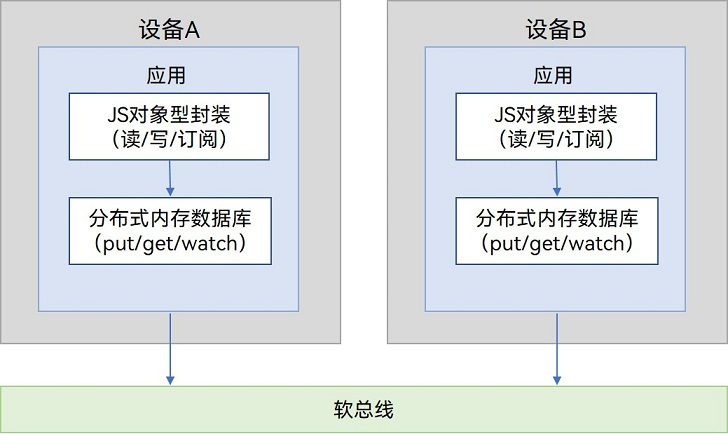
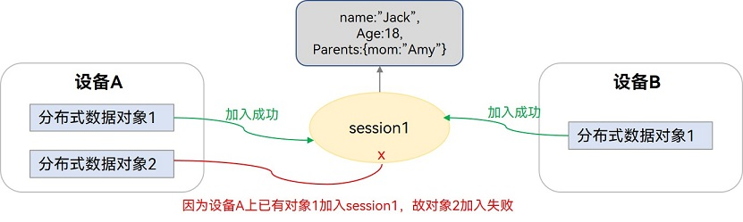
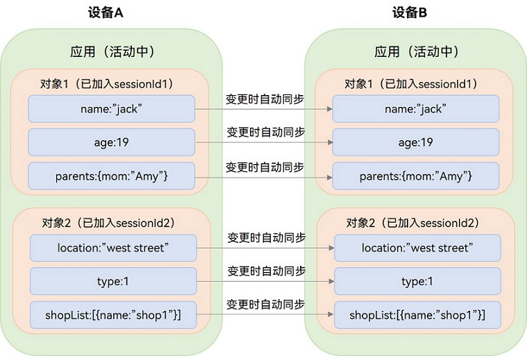

# 分布式数据对象跨设备数据同步 (ArkTS)


## 场景介绍

传统方式下，设备之间的数据同步，需要开发者完成消息处理逻辑，包括：建立通信链接、消息收发处理、错误重试、数据冲突解决等操作，工作量非常大。而且设备越多，调试复杂度也将同步增加。

其实设备之间的状态、消息发送进度、发送的数据等都是“变量”。如果这些变量支持“全局”访问，那么开发者跨设备访问这些变量就能像操作本地变量一样，从而能够自动高效、便捷地实现数据多端同步。

分布式数据对象即实现了对“变量”的“全局”访问。向应用开发者提供内存对象的创建、查询、删除、修改、订阅等基本数据对象的管理能力，同时具备分布式能力。为开发者在分布式应用场景下提供简单易用的JS接口，轻松实现多设备间同应用的数据协同，同时设备间可以监听对象的状态和数据变更。满足超级终端场景下，相同应用多设备间的数据对象协同需求。与传统方式相比，分布式数据对象大大减少了开发者的工作量。

目前<!--RP2-->分布式数据对象只能在[跨端迁移](../application-models/hop-cross-device-migration.md)和[通过跨设备Call调用实现的多端协同](../application-models/hop-multi-device-collaboration.md#通过跨设备call调用实现多端协同)场景中使用。<!--RP2End-->

## 基本概念

- **分布式内存数据库**：分布式内存数据库将数据缓存在内存中，以便应用获得更快的数据存取速度，不会将数据进行持久化。若数据库关闭，则数据不会保留。

- **分布式数据对象**：分布式数据对象是一个JS对象型的封装。每一个分布式数据对象实例会创建一个内存数据库中的数据表，每个应用程序创建的内存数据库相互隔离，对分布式数据对象的“读取”或“赋值”会自动映射到对应数据库的get/put操作。

  分布式数据对象的生命周期包括以下状态：

  - 未初始化：未实例化，或已被销毁。
  - 本地数据对象：已创建对应的数据表，但是还无法进行数据同步。
  - 分布式数据对象：已创建对应的数据表，设备在线且组网内设置同样sessionId的对象数&gt;=2，可以跨设备同步数据。若设备掉线或将sessionId置为空，分布式数据对象退化为本地数据对象。


## 运作机制

**图1** 分布式数据对象运作机制 



分布式数据对象生长在分布式内存数据库之上，在分布式内存数据库上进行了JS对象型的封装，能像操作本地变量一样操作分布式数据对象，数据的跨设备同步由系统自动完成。


### JS对象型存储与封装机制

- 为每个分布式数据对象实例创建一个内存数据库，通过SessionId标识，每个应用程序创建的内存数据库相互隔离。

- 在分布式数据对象实例化的时候，（递归）遍历对象所有属性，使用“Object.defineProperty”定义所有属性的set和get方法，set和get中分别对应数据库一条记录的put和get操作，Key对应属性名，Value对应属性值。

- 在开发者对分布式数据对象进行“读取”或者“赋值”的时候，都会自动调用到set和get方法，映射到对应数据库的操作。

**表1** 分布式数据对象和分布式数据库的对应关系

| 分布式对象实例 | 对象实例 | 属性名称 | 属性值 | 
| -------- | -------- | -------- | -------- |
| 分布式内存数据库 | 一个数据库（sessionID标识） | 一条数据库记录的key | 一条数据库记录的value | 


### 跨设备同步和数据变更通知机制

分布式数据对象，最重要的功能就是对象之间的数据同步。可信组网内的设备可以在本地创建分布式数据对象，并设置sessionID。不同设备上的分布式数据对象，通过设置相同的sessionID，建立对象之间的同步关系。

如下图所示，设备A和设备B上的“分布式数据对象1”，其sessionID均为session1，这两个对象建立了session1的同步关系。

  **图2** 对象的同步关系  



一个同步关系中，一个设备只能有一个对象加入。比如上图中，设备A的“分布式数据对象1”已经加入了session1的同步关系，所以设备A的“分布式数据对象2”就加入失败了。

建立同步关系后，每个Session有一份共享对象数据。加入了同一个Session的对象，支持以下操作：

（1）读取/修改Session中的数据。

（2）监听数据变更，感知其他设备对共享对象数据的修改。

（3）监听状态变更，感知其他设备的加入和退出。

分布式数据对象加入session时，如果它的数据与session中的数据不同，则它会更新session中的数据。如果希望分布式数据对象加入sessionId时不更新session中的数据，并且得到session中的数据，需要将对象的属性的值设置为undefined（资产类型的属性则是将它的各个属性值设置为空字符串）。

### 同步的最小单位

关于分布式数据对象的数据同步，值得注意的是，同步的最小单位是“属性”。比如，下图中对象1包含三个属性：name、age和parents。当其中一个属性变更时，则数据同步时只需同步此变更的属性。

对象属性支持基本类型（数字类型、布尔类型、字符串类型）以及复杂类型（数组、基本类型嵌套）。针对复杂类型的数据修改，目前仅支持对根属性的修改，暂不支持对下级属性的修改。

```ts
dataObject['parents'] = {mom: "amy"}; // 支持的修改
dataObject['parents']['mon'] = "amy"; // 不支持的修改
```

**图3** 数据同步视图 





### 对象持久化缓存机制

分布式对象主要运行在应用程序的进程空间。当调用分布式对象持久化接口时，通过分布式数据库对对象进行持久化和同步，进程退出后数据也不会丢失。

该场景是分布式对象的扩展场景，主要用于以下情况：

- 在设备上创建持久化对象后APP退出，重新打开APP，创建持久化对象，加入同一个Session，数据可以恢复到APP退出前的数据。

- 在设备A上创建持久化对象并同步后持久化到设备B后，A设备的APP退出，设备B打开APP，创建持久化对象，加入同一个Session，数据可以恢复到A设备退出前的数据。

### 资产同步机制

在分布式对象中，可以使用[资产类型](../reference/apis-arkdata/js-apis-data-commonType.md#asset)来描述本地实体资产文件，分布式对象跨设备同步时，该文件会和数据一起同步到其他设备上。

在API version 20之前版本，仅支持资产类型，不支持[资产类型数组](../reference/apis-arkdata/js-apis-data-commonType.md#assets)。如需同步多个资产，可将每个资产作为分布式对象的一个根属性实现。

从API version 20开始，支持[资产类型数组](../reference/apis-arkdata/js-apis-data-commonType.md#assets)的同步。

## 约束限制
<!--RP5-->
- 目前分布式数据对象只能在[跨端迁移](../application-models/hop-cross-device-migration.md)和[通过跨设备Call调用实现的多端协同](../application-models/hop-multi-device-collaboration.md#通过跨设备call调用实现多端协同)场景中使用。

- 当前跨设备接续能力支持以下两种场景的 ​​Ability 跨端迁移​​
  - [支持同应用中不同Ability跨端迁移](../application-models/hop-cross-device-migration.md#支持同应用中不同ability跨端迁移)
  - [支持同应用不同BundleName的Ability跨端迁移](../application-models/hop-cross-device-migration.md#支持同应用不同bundlename的ability跨端迁移)
<!--RP5End-->
- 分布式数据对象的数据同步发生在同一个应用程序下，且同sessionID之间。

- 不建议创建过多的分布式数据对象，每个分布式数据对象将占用100-150KB内存。

- 每个分布式数据对象大小不超过500KB。

- 设备A修改1KB数据，设备B收到变更通知，50ms内完成。

- 单个应用程序最多只能创建16个分布式数据对象实例。

- 考虑到性能和用户体验，最多不超过3个设备进行数据协同。

- 如对复杂类型的数据进行修改，仅支持修改根属性，暂不支持下级属性修改。[资产同步机制](#资产同步机制)中，资产类型的数据支持下一级属性修改。

- 支持JS接口间的互通，与其他语言不互通。

## 接口说明

以下是分布式对象跨设备数据同步功能的相关接口，大部分为异步接口。异步接口均有callback和Promise两种返回形式，下表均以callback形式为例，更多接口及使用方式请见[分布式数据对象](../reference/apis-arkdata/js-apis-data-distributedobject.md)。


| 接口名称 | 描述 |
| -------- | -------- |
| create(context: Context, source: object): DataObject | 创建并得到一个分布式数据对象实例。 |
| genSessionId(): string | 创建一个sessionId，可作为分布式数据对象的sessionId。 |
| setSessionId(sessionId: string, callback: AsyncCallback&lt;void&gt;): void | 设置同步的sessionId，当可信组网中有多个设备时，多个设备间的对象如果设置为同一个sessionId，就能自动同步。 |
| setSessionId(callback: AsyncCallback&lt;void&gt;): void | 退出所有已加入的session。 |
| on(type: 'change', callback: (sessionId: string, fields: Array&lt;string&gt;) => void): void | 监听分布式数据对象的数据变更。 |
| off(type: 'change', callback?: (sessionId: string, fields: Array&lt;string&gt;) => void): void | 取消监听分布式数据对象的数据变更。 |
| on(type: 'status', callback: (sessionId: string, networkId: string, status: 'online' \| 'offline' ) => void): void | 监听分布式数据对象的上下线。 |
| off(type: 'status', callback?: (sessionId: string, networkId: string, status: 'online' \|'offline' ) => void): void | 取消监听分布式数据对象的上下线。 |
| save(deviceId: string, callback: AsyncCallback&lt;SaveSuccessResponse&gt;): void | 保存分布式数据对象。 |
| revokeSave(callback: AsyncCallback&lt;RevokeSaveSuccessResponse&gt;): void | 撤回保存的分布式数据对象。 |
| bindAssetStore(assetKey: string, bindInfo: BindInfo, callback: AsyncCallback&lt;void&gt;): void | 绑定融合资产。 |
| setAsset(assetKey: string, uri: string): void | 设置单个资产。 |
| setAssets(assetKey: string, uris: Array&lt;string&gt;): void | 设置资产数组。 |
| on(type: 'change', callback: DataObserver&lt;void&gt;): void; | 监听分布式对象的数据变更。 |
| off(type: 'change', callback?: DataObserver&lt;void&gt;): void |  删除分布式对象数据变更监听的回调实例。 |
| on(type: 'status', callback: StatusObserver&lt;void&gt;): void; | 监听分布式对象的状态变更。 |
| off(type: 'status', callback?: StatusObserver&lt;void&gt;): void | 删除分布式对象状态变更监听的回调实例。 |


## 开发步骤

### 在跨端迁移中使用分布式数据对象迁移数据

1. 迁移发起端在onContinue接口中创建分布式数据对象并保存数据到接收端：

    1.1 调用create接口创建并得到一个分布式数据对象实例。

    1.2 调用genSessionId接口创建一个sessionId，调用setSessionId接口设置同步的sessionId，并将这个sessionId放入wantParam。

    1.3 从wantParam获取接收端设备networkId，使用这个networkId调用save接口保存数据到接收端。

2. 接收端在onCreate和onNewWant接口中创建分布式数据对象并注册恢复状态监听：

    2.1 调用create接口创建并得到一个分布式数据对象实例。

    2.2 注册恢复状态监听。收到状态为'restored'的回调通知时，表示接收端分布式数据对象已恢复发起端保存过来的数据。

    2.3 从want.parameters中获取发起端放入的sessionId，调用setSessionId接口设置同步的sessionId。

> **说明：**
>
> - 跨端迁移时，在迁移发起端调用setsessionId接口设置同步的sessionId后，必须再调用save接口保存数据到接收端。
> - 在应用迁移启动时，无论是冷启动还是热启动，都会在执行完onCreate()/onNewWant()后，触发[onWindowStageRestore()](../reference/apis-ability-kit/js-apis-app-ability-uiAbility.md#onwindowstagerestore)生命周期函数，不执行[onWindowStageCreate()](../reference/apis-ability-kit/js-apis-app-ability-uiAbility.md#onwindowstagecreate)生命周期函数。开发者如果在`onWindowStageCreate()`中进行了一些应用启动时必要的初始化，那么迁移后需要在`onWindowStageRestore()`中执行同样的初始化操作，避免应用异常
>
<!--RP1-->
> - 跨端迁移需要配置`continuable`标签，详见[跨端迁移开发步骤](../application-models/hop-cross-device-migration.md#开发步骤)。<!--RP1End-->
>
> - wantParam中的"sessionId"字段可能被其他服务占用，建议自定义一个key存取sessionId。
>
> - 可以使用资产类型记录资产附件（文件、图片、视频等类型文件）的相关信息，迁移资产类型数据时，对应的资产附件会一起迁移到对端。
>
> - 接收端需要将业务数据的初始值设置为undefined，才能恢复发起端保存的数据，否则接收端的数据会覆盖同步到发起端。如果是资产数据，需要将资产数据的各个属性设置为空字符串而不是将整个资产数据设置为undefined。
>
> - 暂不支持资产类型数组，如果要迁移多个文件，在业务数据中定义多条资产数据来记录。
>
> - 目前仅支持迁移分布式文件目录下的文件，非分布式文件目录下的文件可以复制或移动到分布式文件目录下再进行迁移。文件的操作和URI的获取详见[文件管理](../reference/apis-core-file-kit/js-apis-file-fs.md)和[文件URI](../reference/apis-core-file-kit/js-apis-file-fileuri.md)。

```ts
import { AbilityConstant, UIAbility, Want } from '@kit.AbilityKit';
import { commonType, distributedDataObject } from '@kit.ArkData';
import { BusinessError } from '@kit.BasicServicesKit';

// 业务数据定义
export class ContentInfo {
  mainTitle: string | undefined;
  textContent: string | undefined;
  imageUriArray: Array<ImageInfo> | undefined;
  isShowLocalInfo: boolean | undefined;
  isAddLocalInfo: boolean | undefined;
  selectLocalInfo: string | undefined;
  attachments?: commonType.Assets | undefined;

  constructor(
    mainTitle: string | undefined,
    textContent: string | undefined,
    imageUriArray: Array<ImageInfo>| undefined,
    isShowLocalInfo: boolean | undefined,
    isAddLocalInfo: boolean | undefined,
    selectLocalInfo: string | undefined,
    attachments?: commonType.Assets | undefined
  ) {
    this.mainTitle = mainTitle;
    this.textContent = textContent;
    this.imageUriArray = imageUriArray;
    this.isShowLocalInfo = isShowLocalInfo;
    this.isAddLocalInfo = isAddLocalInfo;
    this.selectLocalInfo = selectLocalInfo;
    this.attachments = attachments;
  }

  flatAssets(): object {
    let obj: object = this;
    if (!this.attachments) {
      return obj;
    }
    for (let i = 0; i < this.attachments.length; i++) {
      obj[`attachments${i}`] = this.attachments[i];
    }
    return obj;
  }
}

export interface ImageInfo {
  /**
   * image PixelMap.
   */
  imagePixelMap: PixelMap;

  /**
   * Image name.
   */
  imageName: string;
}

const TAG = '[DistributedDataObject]';
let dataObject: distributedDataObject.DataObject;

export default class EntryAbility extends UIAbility {
  private imageUriArray: Array<ImageInfo> = [];
  private distributedObject: distributedDataObject.DataObject | undefined = undefined;
  // 1. 迁移发起端在onContinue接口中创建分布式数据对象并保存数据到接收端
  async onContinue(wantParam: Record<string, Object | undefined>): Promise<AbilityConstant.OnContinueResult> {
    // 1.1 获取需要设置的分布式对象的资产关键uri
    try {
      let sessionId: string = distributedDataObject.genSessionId();
      wantParam.distributedSessionId = sessionId;

      let distrUriArray: Array<string> = [];
      let assetUriArray = AppStorage.get<Array<string>>('assetUriArray');
        if (assetUriArray) {
          distrUriArray = assetUriArray;
        }
      // 1.2 创建分布式数据对象
      let contentInfo: ContentInfo = new ContentInfo(
        AppStorage.get('mainTitle'),
        AppStorage.get('textContent'),
        AppStorage.get('imageUriArray'),
        AppStorage.get('isShowLocalInfo'),
        AppStorage.get('isAddLocalInfo'),
        AppStorage.get('selectLocalInfo'),
      );
      let source = contentInfo.flatAssets();
      this.distributedObject = distributedDataObject.create(this.context, source);

      // 1.3 将需要设置的分布式对象的资产或资产数组填充完成
      if (assetUriArray?.length == 1) {
        this.distributedObject?.setAsset('attachments', distrUriArray[0]). then(() => {
          console.info('OnContinue setAsset');
        })
      } else {
        this.distributedObject?.setAssets('attachments', distrUriArray). then(() => {
          console.info('OnContinue setAssets');
        })
      }
      // 1.4 将设置的资产或资产数组保存至迁移发起端
      this.distributedObject?.setSessionId(sessionId);
      this.distributedObject?.save(wantParam.targetDevice as string).catch((err: BusinessError) => {
        console.error('OnContinue failed to save. code: ', err.code);
        console.error('OnContinue failed to save. message: ', err.message);
      });
    } catch (error) {
      console.error('OnContinue faild code: ', error.code);
      console.error('OnContinue faild message: ', error.message);
    }
    console.info("OnContinue success!");
    return AbilityConstant.OnContinueResult.AGREE;
  }

  // 2. 接收端在onCreate和onNewWant接口中创建分布式数据对象并加入组网进行数据恢复
  onCreate(want: Want, launchParam: AbilityConstant.LaunchParam): void {
    if (launchParam.launchReason == AbilityConstant.LaunchReason.CONTINUATION) {
      if (want.parameters && want.parameters.distributedSessionId) {
        this.restoreDistributedObject(want);
      }
    }
  }

  // 2. 接收端在onCreate和onNewWant接口中创建分布式数据对象并加入组网进行数据恢复
  onNewWant(want: Want, launchParam: AbilityConstant.LaunchParam): void {
    if (launchParam.launchReason == AbilityConstant.LaunchReason.CONTINUATION) {
      if (want.parameters && want.parameters.distributedSessionId) {
        this.restoreDistributedObject(want);
      }
    }
  }

  async restoreDistributedObject(want: Want): Promise<void> {
    if (!want.parameters || !want.parameters.distributedSessionId) {
      console.error(TAG + 'missing sessionId');
      return;
    }

    // 2.1 调用create接口创建并得到一个分布式数据对象实例
    let mailInfo: ContentInfo = new ContentInfo(undefined, undefined, [], undefined, undefined, undefined, undefined);
    dataObject = distributedDataObject.create(this.context, mailInfo);

    // 2.2 注册恢复状态监听。收到状态为'restored'的回调通知时，表示接收端分布式数据对象已恢复发起端保存过来的数据（有资产数据时，对应的文件也迁移过来了）
    dataObject.on('status', (sessionId: string, networkId: string, status: string) => {
      console.log(TAG + `status change, sessionId:  ${sessionId}`);
      console.log(TAG + `status change, networkId:  ${networkId}`);
      if (status == 'restored') { // 收到'restored'的状态通知表示已恢复发起端保存的数据
        console.log(TAG + `title: ${dataObject['title']}, text: ${dataObject['text']}`);
        AppStorage.setOrCreate('mainTitle', dataObject['mainTitle']);
        AppStorage.setOrCreate('textContent', dataObject['textContent']);
        AppStorage.setOrCreate('imageUriArray', dataObject['imageUriArray']);
        AppStorage.setOrCreate('isShowLocalInfo', dataObject['isShowLocalInfo']);
        AppStorage.setOrCreate('isAddLocalInfo', dataObject['isAddLocalInfo']);
        AppStorage.setOrCreate('selectLocalInfo', dataObject['selectLocalInfo']);
        AppStorage.setOrCreate<Array<ImageInfo>>('imageUriArray', this.imageUriArray);
      }
    });

    // 2.3 从want.parameters中获取发起端放入的sessionId，调用setSessionId接口设置同步的sessionId
    let sessionId = want.parameters.distributedSessionId as string;
    console.log(TAG + `get sessionId: ${sessionId}`);
    dataObject.setSessionId(sessionId);
  }
}
```

### 在多端协同中使用分布式数据对象

1. 调用端调用startAbilityByCall接口拉起对端Ability：

    1.1 调用genSessionId接口创建一个sessionId，通过分布式设备管理接口获取对端设备networkId。

    1.2 组装want，并将sessionId放入want。

    1.3 调用startAbilityByCall接口拉起对端Ability。

2. 调用端拉起对端Ability后创建分布式数据对象并加入组网：

   2.1 创建分布式数据对象实例。

   2.2 注册数据变更监听。

   2.3 设置同步sessionId加入组网。

3. 被调用端被拉起后创建和恢复分布式数据对象：

   3.1 创建分布式数据对象实例。

   3.2 注册数据变更监听。

   3.3 从want中获取源端放入的sessionId，使用这个sessionId加入组网。

> **说明：**
>
> - 暂时只支持<!--RP3-->在[跨设备Call调用实现的多端协同](../application-models/hop-multi-device-collaboration.md#通过跨设备call调用实现多端协同)中使用分布式数据对象进行数据同步。<!--RP3End-->
>
> - 跨设备Call调用实现的多端协同开发<!--RP4-->需要申请`ohos.permission.DISTRIBUTED_DATASYNC`权限和配置单实例启动标签，详见跨设备Call调用实现的多端协同的[开发步骤](../application-models/hop-multi-device-collaboration.md#通过跨设备call调用实现多端协同)。<!--RP4End-->
>
> - wantParam中的"sessionId"字段可能被其他服务占用，建议自定义一个key存取sessionId。
>
> - 使用分布式设备管理获取对端设备networkId详见[设备信息查询开发指导](../distributedservice/devicemanager-guidelines.md#设备信息查询开发指导)。

 示例代码如下：

```ts
import { AbilityConstant, Caller, common, UIAbility, Want } from '@kit.AbilityKit';
import { distributedDataObject } from '@kit.ArkData';
import { distributedDeviceManager } from '@kit.DistributedServiceKit';
import { BusinessError } from '@kit.BasicServicesKit';
import { JSON } from '@kit.ArkTS';

// 业务数据定义
class Data {
  title: string | undefined;
  text: string | undefined;

  constructor(title: string | undefined, text: string | undefined) {
    this.title = title;
    this.text = text;
  }
}

const TAG = '[DistributedDataObject]';

let sessionId: string;
let caller: Caller;
let dataObject: distributedDataObject.DataObject;
const changeCallBack: distributedDataObject.DataObserver = (sessionId: string, fields: Array<string>) => {
  console.info(`change, sessionId: ${sessionId}, fields: ${JSON.stringify(fields)}`);
}

export default class EntryAbility extends UIAbility {
  // 1. 调用端调用startAbilityByCall接口拉起对端Ability
  callRemote() {
    if (caller) {
      console.error(TAG + 'call remote already');
      return;
    }

    // 1.1 调用genSessionId接口创建一个sessionId，通过分布式设备管理接口获取对端设备networkId
    sessionId = distributedDataObject.genSessionId();
    console.log(TAG + `gen sessionId: ${sessionId}`);
    let deviceId = getRemoteDeviceId();
    if (deviceId == "") {
      console.warn(TAG + 'no remote device');
      return;
    }
    console.log(TAG + `get remote deviceId: ${deviceId}`);

    // 1.2 组装want，并将sessionId放入want
    let want: Want = {
      bundleName: 'com.example.collaboration',
      abilityName: 'EntryAbility',
      deviceId: deviceId,
      parameters: {
        'ohos.aafwk.param.callAbilityToForeground': true, // 前台启动，非必须
        'distributedSessionId': sessionId
      }
    }
    try {
      // 1.3 调用startAbilityByCall接口拉起对端Ability
      this.context.startAbilityByCall(want).then((res) => {
        if (!res) {
          console.error(TAG + 'startAbilityByCall failed');
        }
        caller = res;
      })
    } catch (e) {
      let err = e as BusinessError;
      console.error(TAG + `get remote deviceId error, error code: ${err.code}, error message: ${err.message}`);
    }
  }

  // 2. 拉起对端Ability后创建分布式数据对象
  createDataObject() {
    if (!caller) {
      console.error(TAG + 'call remote first');
      return;
    }
    if (dataObject) {
      console.error(TAG + 'create dataObject already');
      return;
    }

    // 2.1 创建分布式数据对象实例
    let data = new Data('The title', 'The text');
    dataObject = distributedDataObject.create(this.context, data);

    // 2.2 注册数据变更监听
    dataObject.on('change', changeCallBack);
    // 2.3 设置同步sessionId加入组网
    dataObject.setSessionId(sessionId);
  }

  // 3. 被调用端被拉起后创建和恢复分布式数据对象
  onCreate(want: Want, launchParam: AbilityConstant.LaunchParam): void {
    if (want.parameters && want.parameters.distributedSessionId) {
      // 3.1 创建分布式数据对象实例
      let data = new Data(undefined, undefined);
      dataObject = distributedDataObject.create(this.context, data);

      // 3.2 注册数据变更监听
      dataObject.on('change', changeCallBack);
      // 3.3 从want中获取源端放入的sessionId，使用这个sessionId加入组网
      let sessionId = want.parameters.distributedSessionId as string;
      console.log(TAG + `onCreate get sessionId: ${sessionId}`);
      dataObject.setSessionId(sessionId);
    }
  }
}

// 获取可信组网中的设备
function getRemoteDeviceId() {
  let deviceId = "";
  try {
    let deviceManager = distributedDeviceManager.createDeviceManager('com.example.collaboration');
    let devices = deviceManager.getAvailableDeviceListSync();
    if (devices[0] && devices[0].networkId) {
      deviceId = devices[0].networkId;
    }
  } catch (e) {
    let err = e as BusinessError;
    console.error(TAG + `get remote deviceId error, error code: ${err.code}, error message: ${err.message}`);
  }
  return deviceId;
}
```

## 相关实例

针对分布式数据对象开发，有以下相关实例可供参考：

- [设备管理（ArkTS）（Full SDK）（API10）](https://gitee.com/openharmony/applications_app_samples/tree/master/code/SystemFeature/DistributedAppDev/DistributedAuthentication)

- [分布式备忘录（ArkTS）（Full SDK）（API10）](https://gitee.com/openharmony/applications_app_samples/tree/master/code/SuperFeature/DistributedAppDev/DistributedNote)