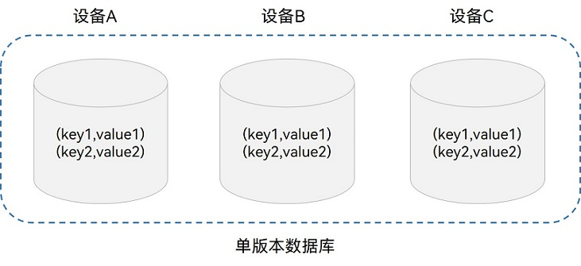
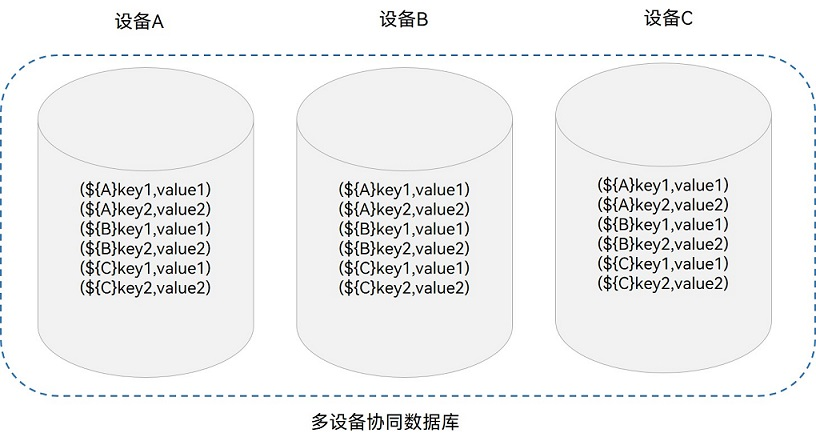
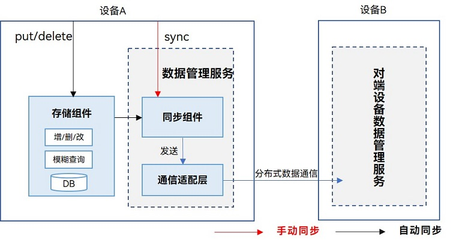
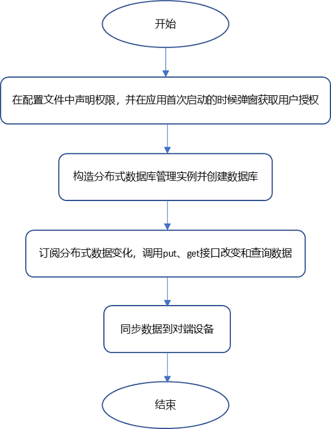

# 键值型数据库跨设备数据同步 (ArkTS)
<!--Kit: ArkData-->
<!--Subsystem: DistributedDataManager-->
<!--Owner: @ding_dong_dong-->
<!--Designer: @dboy190; @houpengtao1-->
<!--Tester: @logic42-->
<!--Adviser: @ge-yafang-->


## 场景介绍

键值型数据库适合不涉及过多数据关系和业务关系的业务数据存储，比SQL数据库存储拥有更好的读写性能，同时因其在分布式场景中降低了解决数据库版本兼容问题的复杂度，和数据端端同步过程中冲突解决的复杂度而被广泛使用。


## 基本概念

在使用键值型数据库跨设备数据端端同步前，请先了解以下概念。


### 单版本数据库

单版本是指数据在本地是以单个条目为单位的方式保存，当用户修改时，直接在这个条目上进行修改。在数据端端同步后多个设备全局只保留一份数据，多个设备的相同记录（主码相同）会按时间最新保留一条记录，数据不分设备，设备之间修改相同的key会覆盖。端端同步也以此为基础，按照它在本地被写入或更改的顺序将当前最新一次修改逐条同步至远端设备，常用于联系人、天气等应用存储场景。




### 多设备协同数据库

多设备协同分布式数据库建立在单版本数据库之上，对应用程序存入的键值型数据中的Key前面拼接了本设备的DeviceID标识符，这样能保证每个设备产生的数据严格隔离。数据以设备的维度管理，不存在冲突；支持按照设备的维度查询数据。

底层按照设备的维度管理这些数据，多设备协同数据库支持以设备的维度查询分布式数据，但是不支持修改远端设备同步过来的数据。需要分开查询各设备数据的可以使用设备协同版本数据库。常用于图库缩略图存储场景。




## 端端同步方式

数据管理服务提供了两种同步方式：手动同步和自动同步。键值型数据库可选择其中一种方式实现同应用跨设备数据端端同步。

### 手动同步

由应用程序调用sync接口来触发，需要指定端端同步的设备列表和同步模式。同步模式分为PULL_ONLY（将远端数据拉取到本端）、PUSH_ONLY（将本端数据推送到远端）和PUSH_PULL（将本端数据推送到远端同时也将远端数据拉取到本端）。[带有Query参数的端端同步接口](../reference/apis-arkdata/js-apis-distributedKVStore.md#sync-1)，支持按条件过滤的方法进行端端同步，将符合条件的数据同步到远端。

### 自动同步

<!--RP5-->
在[跨设备Call调用实现的多端协同](../application-models/hop-multi-device-collaboration.md#通过跨设备call调用实现多端协同)场景中，在应用程序更新数据后，由分布式数据库自动将本端数据推送到远端，同时也将远端数据拉取到本端来完成数据同步，应用不需要主动调用sync接口。<!--RP5End-->


## 运作机制

底层通信组件完成设备发现和认证，会通知上层应用程序设备上线。收到设备上线的消息后数据管理服务可以在两个设备之间建立加密的数据传输通道，利用该通道在两个设备之间进行数据端端同步。


### 数据跨设备端端同步机制



如图所示，通过put、delete接口触发自动端端同步，将分布式数据通过通信适配层发送给对端设备，实现分布式数据的自动端端同步。

手动同步则是手动调用sync接口触发端端同步，将分布式数据通过通信适配层发送给对端设备。


### 数据变化通知机制

增、删、改数据时，会给订阅者发送数据变化的通知。主要分为本地数据变化通知和分布式数据变化通知。

- **本地数据变化通知**：本地设备的应用内订阅数据变化通知，数据库增删改数据时，会收到通知。

- **分布式数据变化通知**：同一应用订阅组网内其他设备数据变化的通知，其他设备增删改数据时，本设备会收到通知。


## 约束限制

- 设备协同数据库，针对每条记录，Key的长度≤896 Byte，Value的长度&lt;4 MB。

- 单版本数据库，针对每条记录，Key的长度≤1 KB，Value的长度&lt;4 MB。

- 键值型数据库不支持应用程序自定义冲突解决策略。

- 每个应用程序可以同时打开最多16个键值型分布式数据库。

- 单个数据库可以注册最多8个订阅数据变化的回调。


## 接口说明

以下是单版本键值型分布式数据库跨设备数据端端同步功能的相关接口，大部分为异步接口。异步接口均有callback和Promise两种返回形式，下表均以callback形式为例，更多接口及使用方式请见[分布式键值数据库](../reference/apis-arkdata/js-apis-distributedKVStore.md)。

| 接口名称 | 描述 | 
| -------- | -------- |
| createKVManager(config: KVManagerConfig): KVManager | 创建一个KVManager对象实例，用于管理数据库对象。 | 
| getKVStore&lt;T&gt;(storeId: string, options: Options, callback: AsyncCallback&lt;T&gt;): void | 指定options和storeId，创建并得到指定类型的KVStore数据库。 | 
| put(key: string, value: Uint8Array \| string \| number \| boolean, callback: AsyncCallback&lt;void&gt;): void | 插入和更新数据。 | 
| on(event: 'dataChange', type: SubscribeType, listener: Callback&lt;ChangeNotification&gt;): void | 订阅数据库中数据的变化。 | 
| get(key: string, callback: AsyncCallback&lt;boolean \| string \| number \| Uint8Array&gt;): void | 查询指定Key键的值。 | 
| sync(deviceIds: string[], mode: SyncMode, delayMs?: number): void | 在手动模式下，触发数据库端端同步。 | 


## 开发步骤

此处以单版本键值型数据库跨设备数据端端同步的开发为例。以下是具体的开发流程和开发步骤。



> **说明：**
>
> 数据只允许向数据安全标签不高于对端设备安全等级的设备同步数据，具体规则可见[跨设备同步访问控制机制](access-control-by-device-and-data-level.md#跨设备同步访问控制机制)。

1. 导入模块。
     
   ```ts
   import { distributedKVStore } from '@kit.ArkData';
   ```

2. 请求权限。

   1. 需要申请ohos.permission.DISTRIBUTED_DATASYNC权限，配置方式请参见[声明权限](../security/AccessToken/declare-permissions.md)。
   2. 同时需要在应用首次启动时弹窗向用户申请授权，使用方式请参见[向用户申请授权](../security/AccessToken/request-user-authorization.md)。

3. 根据配置调用createKVManager()方法构造分布式数据库管理类实例。

   1. 根据应用上下文创建kvManagerConfig对象。
   2. 创建分布式数据库管理器实例。

     
   ```ts
   // Stage模型获取context
   import { window } from '@kit.ArkUI';
   import { UIAbility } from '@kit.AbilityKit';
   import { BusinessError } from '@kit.BasicServicesKit';
   
   let kvManager: distributedKVStore.KVManager | undefined = undefined;
   
   class EntryAbility extends UIAbility {
     onWindowStageCreate(windowStage:window.WindowStage) {
       let context = this.context;
     }
   }
    
    // FA模型获取context
   import { featureAbility } from '@kit.AbilityKit';
   import { BusinessError } from '@kit.BasicServicesKit';
    
   let context = featureAbility.getContext();
   
   // 获取context之后，构造分布式数据库管理类实例
   try {
     const kvManagerConfig: distributedKVStore.KVManagerConfig = {
       bundleName: 'com.example.datamanagertest',
       context: context
     }
     kvManager = distributedKVStore.createKVManager(kvManagerConfig);
     console.info('Succeeded in creating KVManager.');
     // 继续创建获取数据库
   } catch (e) {
     let error = e as BusinessError;
     console.error(`Failed to create KVManager. Code:${error.code},message:${error.message}`);
   }
   
   if (kvManager !== undefined) {
     // 进行后续创建数据库等相关操作
     // ...
   }
   ```

4. 调用getKVStore()方法获取并得到指定类型的键值型数据库。

   1. 声明需要创建的分布式数据库ID描述（例如示例代码中的'storeId'）。
   2. 创建分布式数据库，建议关闭自动端端同步功能（autoSync:false），方便后续对端端同步功能进行验证，需要端端同步时主动调用sync接口。

     
   ```ts
   let kvStore: distributedKVStore.SingleKVStore | undefined = undefined;
   try {
     let child1 = new distributedKVStore.FieldNode('id');
     child1.type = distributedKVStore.ValueType.INTEGER;
     child1.nullable = false;
     child1.default = '1';
     let child2 = new distributedKVStore.FieldNode('name');
     child2.type = distributedKVStore.ValueType.STRING;
     child2.nullable = false;
     child2.default = 'zhangsan';

     let schema = new distributedKVStore.Schema();
     schema.root.appendChild(child1);
     schema.root.appendChild(child2);
     schema.indexes = ['$.id', '$.name'];
     // 0表示COMPATIBLE模式，1表示STRICT模式。
     schema.mode = 1;
     // 支持在检查Value时，跳过skip指定的字节数，且取值范围为[0,4M-2]。
     schema.skip = 0;

     const options: distributedKVStore.Options = {
       createIfMissing: true,
       encrypt: false,
       backup: false,
       autoSync: false,
       // kvStoreType不填时，默认创建多设备协同数据库
       // 多设备协同数据库：kvStoreType: distributedKVStore.KVStoreType.DEVICE_COLLABORATION,
       kvStoreType: distributedKVStore.KVStoreType.SINGLE_VERSION,
       // schema 可以不填，在需要使用schema功能时可以构造此参数，例如：使用谓词查询等。
       schema: schema,
       securityLevel: distributedKVStore.SecurityLevel.S3
     };
     kvManager.getKVStore<distributedKVStore.SingleKVStore>('storeId', options, (err, store: distributedKVStore.SingleKVStore) => {
       if (err) {
         console.error(`Failed to get KVStore: Code:${err.code},message:${err.message}`);
         return;
       }
       console.info('Succeeded in getting KVStore.');
       kvStore = store;
       if (kvStore !== undefined) {
           // 请确保获取到键值数据库实例后，再进行相关数据操作
           // 进行后续相关数据操作，包括数据的增、删、改、查、订阅数据变化等操作
           // ...
       }
     });
   } catch (e) {
     let error = e as BusinessError;
     console.error(`An unexpected error occurred. Code:${error.code},message:${error.message}`);
   }
   ```

5. 调用on()方法订阅分布式数据变化，如需关闭订阅分布式数据变化，调用[off('dataChange')](../reference/apis-arkdata/js-apis-distributedKVStore.md#offdatachange)关闭。
     
   ```ts
   try {
     kvStore.on('dataChange', distributedKVStore.SubscribeType.SUBSCRIBE_TYPE_ALL, (data) => {
       console.info(`dataChange callback call data: ${data}`);
     });
   } catch (e) {
     let error = e as BusinessError;
     console.error(`An unexpected error occurred. code:${error.code},message:${error.message}`);
   }
   ```

6. 调用put()方法将数据写入分布式数据库。

   1. 构造需要写入分布式数据库的Key（键）和Value（值）。
   2. 将键值数据写入分布式数据库。

     
   ```ts
   const KEY_TEST_STRING_ELEMENT = 'key_test_string';
   // 如果未定义Schema则Value可以传其他符合要求的值。
   const VALUE_TEST_STRING_ELEMENT = '{"id":0, "name":"lisi"}';
   try {
     kvStore.put(KEY_TEST_STRING_ELEMENT, VALUE_TEST_STRING_ELEMENT, (err) => {
       if (err !== undefined) {
         console.error(`Failed to put data. Code:${err.code},message:${err.message}`);
         return;
       }
       console.info('Succeeded in putting data.');
     });
   } catch (e) {
     let error = e as BusinessError;
     console.error(`An unexpected error occurred. Code:${error.code},message:${error.message}`);
   }
   ```

7. 调用get()方法查询分布式数据库数据。

   1. 构造需要从单版本分布式数据库中查询的Key（键）。
   2. 从单版本分布式数据库中获取数据。

     
   ```ts
   try {
     kvStore.put(KEY_TEST_STRING_ELEMENT, VALUE_TEST_STRING_ELEMENT, (err) => {
       if (err !== undefined) {
         console.error(`Failed to put data. Code:${err.code},message:${err.message}`);
         return;
       }
       console.info('Succeeded in putting data.');
       kvStore = kvStore as distributedKVStore.SingleKVStore;
       kvStore.get(KEY_TEST_STRING_ELEMENT, (err, data) => {
         if (err != undefined) {
           console.error(`Failed to get data. Code:${err.code},message:${err.message}`);
           return;
         }
         console.info(`Succeeded in getting data. Data:${data}`);
       });
     });
   } catch (e) {
     let error = e as BusinessError;
     console.error(`Failed to get data. Code:${error.code},message:${error.message}`);
   }
   ```

8. 调用sync()方法同步数据到其他设备。

   选择同一组网环境下的设备以及同步模式（需用户在应用首次启动的弹窗中确认选择同步模式），进行数据端端同步。

   > **说明：**
   >
   > 在手动端端同步的方式下，其中的deviceIds通过调用[devManager.getAvailableDeviceListSync](../reference/apis-distributedservice-kit/js-apis-distributedDeviceManager.md#getavailabledevicelistsync)方法得到。

   ```ts
   import { distributedDeviceManager } from '@kit.DistributedServiceKit';
    
   let devManager: distributedDeviceManager.DeviceManager;
   try {
     // create deviceManager
     devManager = distributedDeviceManager.createDeviceManager(context.applicationInfo.name);
     // deviceIds由deviceManager调用getAvailableDeviceListSync方法得到
     let deviceIds: string[] = [];
     if (devManager != null) {
       let devices = devManager.getAvailableDeviceListSync();
       for (let i = 0; i < devices.length; i++) {
         deviceIds[i] = devices[i].networkId as string;
       }
     }
     try {
       // 1000表示最大延迟时间为1000ms
       kvStore.sync(deviceIds, distributedKVStore.SyncMode.PUSH_ONLY, 1000);
     } catch (e) {
       let error = e as BusinessError;
       console.error(`An unexpected error occurred. Code:${error.code},message:${error.message}`);
     }
   
   } catch (err) {
     let error = err as BusinessError;
     console.error("createDeviceManager errCode:" + error.code + ",errMessage:" + error.message);
   }
   ```

## 相关实例

针对键值型数据库开发，有以下相关实例可供参考：

- [分布式组网认证（ArkTS）（Full SDK）（API10）](https://gitcode.com/openharmony/applications_app_samples/tree/master/code/SystemFeature/DistributedAppDev/DistributedAuthentication)

- [分布式数据管理（ArkTS）（Full SDK）（API9）](https://gitcode.com/openharmony/applications_app_samples/tree/master/code/SuperFeature/DistributedAppDev/Kvstore)

- [分布式音乐播放（JS）（Full SDK）（API10）](https://gitcode.com/openharmony/applications_app_samples/tree/master/code/SuperFeature/DistributedAppDev/JsDistributedMusicPlayer)

- [分布式音乐播放（ArkTS）（Full SDK）（API9）](https://gitcode.com/openharmony/applications_app_samples/tree/master/code/SuperFeature/DistributedAppDev/ArkTSDistributedMusicPlayer)

- [分布式计算器（JS）（Full SDK）（API10）](https://gitcode.com/openharmony/applications_app_samples/tree/master/code/SuperFeature/DistributedAppDev/DistributeCalc)

- [分布式计算器（ArkTS）（Full SDK）（API9）](https://gitcode.com/openharmony/applications_app_samples/tree/master/code/SuperFeature/DistributedAppDev/ArkTSDistributedCalc)

- [分布式五子棋（ArkTS）（Full SDK）（API9）](https://gitcode.com/openharmony/applications_app_samples/tree/master/code/Solutions/Game/DistributedDataGobang)

- [分布式手写板（ArkTS）（Full SDK）（API10）](https://gitcode.com/openharmony/codelabs/tree/master/Distributed/DistributeDraw)