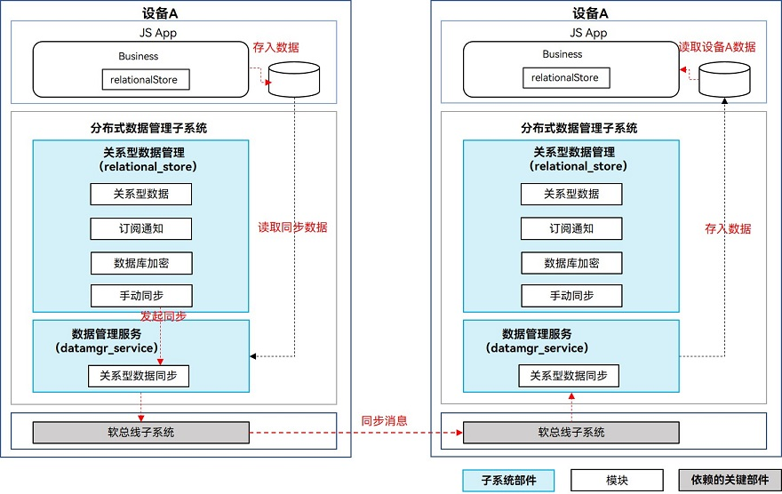

# 关系型数据库跨设备数据同步 (ArkTS)
<!--Kit: ArkData-->
<!--Subsystem: DistributedDataManager-->
<!--Owner: @baijidong-->
<!--Designer: @widecode; @htt1997-->
<!--Tester: @yippo; @logic42-->
<!--Adviser: @ge-yafang-->


## 场景介绍

当应用程序本地存储的关系型数据存在跨设备同步的需求时，可以将需要同步的表数据迁移到新的支持跨设备的表中，当然也可以在刚完成表创建时设置其支持跨设备。


## 基本概念

关系型数据库跨设备数据同步，支持应用在多设备间同步存储的关系型数据。

- 分布式表：支持组网内多设备间数据同步的数据库表。来自其他设备的数据将同步至本地，并通过与设备ID关联的表名进行存储。
- 数据同步：将设备上数据库中分布式表发生的变更，同步至组网内其他设备。有推送数据和拉取数据两种方式触发同步。
- 数据变化通知：组网内其他设备数据发生的变化同步至当前设备时，会执行已注册的回调函数。

## 运作机制

底层通信组件完成设备发现和认证，会通知上层应用程序设备上线。收到设备上线的消息后数据管理服务可以在两个设备之间建立加密的数据传输通道，利用该通道在两个设备之间进行数据同步。


### 数据跨设备同步机制



业务将数据写入关系型数据库后，向数据管理服务发起同步请求。

数据管理服务从应用沙箱内读取待同步数据，根据对端设备的deviceId将数据发送到其他设备的数据管理服务。再由数据管理服务将数据写入同应用的数据库内。


### 数据变化通知机制

增、删、改数据库时，会给订阅者发送数据变化的通知。主要分为本地数据变化通知和分布式数据变化通知。

- **本地数据变化通知**：本地设备的应用内订阅数据变化通知，数据库增删改数据时，会收到通知。

- **分布式数据变化通知**：同一应用订阅组网内其他设备数据变化的通知，其他设备增删改数据时，本设备会收到通知。


## 约束限制

- 每个应用程序最多支持同时打开16个关系型分布式数据库。

- 单个数据库最多支持注册8个订阅数据变化的回调。

- 不支持将含有复合键的表设置为分布式表。

## 接口说明

以下是关系型设备协同分布式数据库跨设备数据同步功能的相关接口，大部分为异步接口。异步接口均有callback和Promise两种返回形式，下表均以callback形式为例，更多接口及使用方式请见[关系型数据库](../reference/apis-arkdata/arkts-apis-data-relationalStore.md)。

| 接口名称 | 描述 | 
| -------- | -------- |
| setDistributedTables(tables: Array&lt;string&gt;, callback: AsyncCallback&lt;void&gt;): void | 设置分布式同步表。 | 
| sync(mode: SyncMode, predicates: RdbPredicates, callback: AsyncCallback&lt;Array&lt;[string, number]&gt;&gt;): void | 分布式数据同步。 | 
| on(event: 'dataChange', type: SubscribeType, observer: Callback&lt;Array&lt;string&gt;&gt;): void | 订阅分布式数据变化。 | 
| off(event:'dataChange', type: SubscribeType, observer: Callback&lt;Array&lt;string&gt;&gt;): void | 取消订阅分布式数据变化。 | 
| obtainDistributedTableName(device: string, table: string, callback: AsyncCallback&lt;string&gt;): void | 根据本地数据库表名获取指定设备上的表名。 | 
| remoteQuery(device: string, table: string, predicates: RdbPredicates, columns: Array&lt;string&gt; , callback: AsyncCallback&lt;ResultSet&gt;): void | 根据指定条件查询远程设备数据库中的数据。 | 


## 开发步骤

> **说明：**
>
> 数据只允许向数据安全标签不高于对端设备安全等级的设备同步数据，具体规则可见[跨设备同步访问控制机制](access-control-by-device-and-data-level.md#跨设备同步访问控制机制)。

1. 导入模块。
     
   ```ts
   import { relationalStore } from '@kit.ArkData';
   ```

2. 请求权限。

   1. 需要申请ohos.permission.DISTRIBUTED_DATASYNC权限，配置方式请参见[声明权限](../security/AccessToken/declare-permissions.md)。
   2. 同时需要在应用首次启动时弹窗向用户申请授权，使用方式请参见[向用户申请授权](../security/AccessToken/request-user-authorization.md)。

3. 创建关系型数据库，创建数据表，并将需要进行跨设备同步的数据表设置为分布式表。
     
   ```ts
   import { UIAbility } from '@kit.AbilityKit';
   import { BusinessError } from '@kit.BasicServicesKit';
   import { window } from '@kit.ArkUI';
   import { distributedDeviceManager } from '@kit.DistributedServiceKit';

   const STORE_CONFIG: relationalStore.StoreConfig = {
     name: 'RdbTest.db',
     securityLevel: relationalStore.SecurityLevel.S3
   };

   export default class EntryAbility extends UIAbility {
     async onWindowStageCreate(windowStage: window.WindowStage): Promise<void> {
       let store: relationalStore.RdbStore | null = null;

       store = await relationalStore.getRdbStore(this.context, STORE_CONFIG);
       await store.executeSql('CREATE TABLE IF NOT EXISTS EMPLOYEE (ID INTEGER PRIMARY KEY AUTOINCREMENT, NAME TEXT NOT NULL, AGE INTEGER, SALARY REAL, CODES BLOB)');
       // 将已创建的表设置分布式表。
       await store.setDistributedTables(['EMPLOYEE']);
       // 进行数据的相关操作
     }
   }
   ```

4. 订阅组网内其他设备的数据变化消息。
   1. 调用[on('dataChange')](../reference/apis-arkdata/arkts-apis-data-relationalStore-RdbStore.md#ondatachange)接口监听其他设备的数据变化，当数据变化同步至当前设备时，将执行订阅的回调方法，入参为数据发生变化的设备ID列表。
   2. 通过设备ID获取与设备对应的分布式表表名，查询对应设备分布式表中的数据。

   ```ts
   if (store) {
     try {
       // 调用分布式数据订阅接口，注册数据库的观察者
       // 当分布式数据库中的数据发生更改时，将调用回调
       store.on('dataChange', relationalStore.SubscribeType.SUBSCRIBE_TYPE_REMOTE, async (devices) => {
         for (let i = 0; i < devices.length; i++) {
           let device = devices[i];
           if (!store) {
             return;
           }
           console.info(`The data of device:${device} has been changed.`);
           // 获取device对应的组网内设备分分布式表名
           const distributedTableName = await store.obtainDistributedTableName(device, 'EMPLOYEE');
           // 创建查询谓词，查询组网内设备分布式表的数据
           const predicates = new relationalStore.RdbPredicates(distributedTableName);
           const resultSet = await store.query(predicates);
           console.info(`device ${device}, table EMPLOYEE rowCount is: ${resultSet.rowCount}`);
         }
       });
     } catch (err) {
       console.error(`Failed to register observer. Code:${err.code},message:${err.message}`);
     }
   }
   ```

5. 同步当前设备数据变化至组网内其他设备。
   1. 当前设备分布式表中的数据发生变化后，调用RdbStore的[sync](../reference/apis-arkdata/arkts-apis-data-relationalStore-RdbStore.md#sync-1)接口传入[SYNC_MODE_PUSH](../reference/apis-arkdata/arkts-apis-data-relationalStore-e.md#syncmode)参数推送数据变化至其他设备。
   2. 通过谓词的[inDevices](../reference/apis-arkdata/arkts-apis-data-relationalStore-RdbPredicates.md#indevices)方法指定推送的目标设备。
     
   ```ts
   if (store) {
     // 当前设备分布式数据表中插入新数据
     const ret = store.insertSync('EMPLOYEE', {
       name: 'sync_me',
       age: 18,
       salary: 666
     });
     console.info('Insert to distributed table EMPLOYEE, result: ' + ret);
     // 查询组网内的设备列表
     const deviceManager = distributedDeviceManager.createDeviceManager('com.example.appdatamgrverify');
     const deviceList = deviceManager.getAvailableDeviceListSync();
     const syncTarget: string[] = [];
     deviceList.forEach(item => {
       if (item.networkId) {
         syncTarget.push(item.networkId);
       }
     });
     if (syncTarget.length === 0) {
       console.error('no device to sync');
     } else {
       // 构造用于同步分布式表的谓词对象
       const predicates = new relationalStore.RdbPredicates('EMPLOYEE');
       // 指定要同步的设备列表
       predicates.inDevices(syncTarget);
       try {
         // 调用同步数据的接口推送当前设备数据变化至组网内其他设备
         const result = await store.sync(relationalStore.SyncMode.SYNC_MODE_PUSH, predicates);
         console.info('Push data success.');
         // 获取同步结果
         for (let i = 0; i < result.length; i++) {
           const deviceId = result[i][0];
           const syncResult = result[i][1];
           if (syncResult === 0) {
             console.info(`device:${deviceId} sync success`);
           } else {
             console.error(`device:${deviceId} sync failed, status:${syncResult}`);
           }
         }
       } catch (e) {
         console.error('Push data failed, code: ' + e.code + ', message: ' + e.message);
       }
     }
   }
   ```

6. 拉取组网内其他设备的数据变化。
   1. 当前设备可调用RdbStore的[sync](../reference/apis-arkdata/arkts-apis-data-relationalStore-RdbStore.md#sync-1)接口传入[SYNC_MODE_PULL](../reference/apis-arkdata/arkts-apis-data-relationalStore-e.md#syncmode)参数拉取组网内其他设备的数据变化。
   2. 通过谓词的[inDevices](../reference/apis-arkdata/arkts-apis-data-relationalStore-RdbPredicates.md#indevices)方法指定拉取的目标设备。

   ```ts
   if (store) {
     // 查询组网内的设备列表
     const deviceManager = distributedDeviceManager.createDeviceManager('com.example.appdatamgrverify');
     const deviceList = deviceManager.getAvailableDeviceListSync();
     const syncTarget: string[] = [];
     deviceList.forEach(item => {
       if (item.networkId) {
         syncTarget.push(item.networkId);
       }
     });
     if (syncTarget.length === 0) {
       console.error('no device to pull data');
     } else {
       // 构造用于同步分布式表的谓词对象
       const predicates = new relationalStore.RdbPredicates('EMPLOYEE');
       // 指定要同步的设备列表
       predicates.inDevices(syncTarget);
       try {
         // 调用同步数据的接口拉取其他设备数据变化至当前设备
         const result = await store.sync(relationalStore.SyncMode.SYNC_MODE_PULL, predicates);
         console.info('Push data success.');
         // 获取同步结果
         for (let i = 0; i < result.length; i++) {
           const deviceId = result[i][0];
           const syncResult = result[i][1];
           if (syncResult === 0) {
             console.info(`device:${deviceId} sync success`);
           } else {
             console.error(`device:${deviceId} sync failed, status:${syncResult}`);
           }
         }
       } catch (e) {
         console.error('Push data failed, code: ' + e.code + ', message: ' + e.message);
       }
     }
   }
   ```

7. 当数据未完成同步，或未触发数据同步时，可使用RdbStore的[remoteQuery](../reference/apis-arkdata/arkts-apis-data-relationalStore-RdbStore.md#remotequery-1)方法查询组网内指定设备上分布式表中的数据。

   ```ts
   if (store) {
     // 查询组网内的设备列表
     const deviceManager = distributedDeviceManager.createDeviceManager('com.example.appdatamgrverify');
     const deviceList = deviceManager.getAvailableDeviceListSync();
     const devices: string[] = [];
     deviceList.forEach(item => {
       if (item.networkId) {
         devices.push(item.networkId);
       }
     });
     if (devices.length === 0) {
       console.error('no device to query data');
     } else {
       // 构造用于查询分布式表的谓词对象
       const predicates = new relationalStore.RdbPredicates('EMPLOYEE');
       try {
         // 查询组网内设备上的分布式表
         const resultSet = await store.remoteQuery(devices[0], 'EMPLOYEE', predicates, ['ID', 'NAME', 'AGE', 'SALARY', 'CODES']);
         console.info('Remote query success, row cout: ' + resultSet.rowCount);
         console.info(`ResultSet column names: ${resultSet.columnNames}, column count: ${resultSet.columnCount}`);
       } catch (e) {
         console.error('Remote query failed, code: ' + e.code + ', message: ' + e.message);
       }
     }
   }
   ```

## 相关实例

针对关系型数据库开发，有以下相关实例可供参考：

- [分布式组网认证（ArkTS）（Full SDK）（API10）](https://gitcode.com/openharmony/applications_app_samples/tree/master/code/SystemFeature/DistributedAppDev/DistributedAuthentication)

- [分布式关系型数据库（ArkTS）（Full SDK）（API10）](https://gitcode.com/openharmony/applications_app_samples/tree/master/code/SuperFeature/DistributedAppDev/DistributedRdb)

- [分布式账号（ArkTS）（Full SDK）（API10）](https://gitcode.com/openharmony/applications_app_samples/tree/master/code/SystemFeature/DistributedAppDev/DistributedAccount)