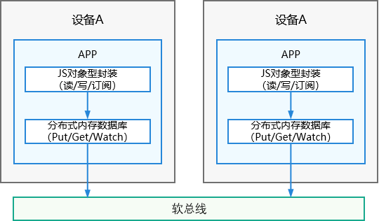

# 分布式数据对象概述

分布式数据对象管理框架是一款面向对象的内存数据管理框架。向应用开发者提供内存对象的创建、查询、删除、修改、订阅等基本数据对象的管理能力;同时具备分布式能力，满足超级终端场景下，相同应用多设备间的数据对象协同需求。

## 基本概念

- **分布式内存数据库**
  
  分布式内存数据库将数据缓存在内存中，以便应用获得更快的数据存取速度，不会将数据进行持久化。若数据库关闭，则数据不会保留。

- **分布式数据对象**

  分布式数据对象是一个JS对象型的封装。每一个分布式数据对象实例会创建一个内存数据库中的数据表，每个应用程序创建的内存数据库相互隔离，对分布式数据对象的“读取”或“赋值”会自动映射到对应数据库的put/get操作。

  分布式数据对象的生命周期包括以下状态：

  - **未初始化**：未实例化，或已被销毁。
  - **本地数据对象**：已创建对应的数据表，但是还无法进行数据同步。
  - **分布式数据对象**：已创建对应的数据表，设备在线且组网内设置同样sessionId的对象数>=2，可以跨设备同步数据。若设备掉线或将sessionId置为空，分布式数据对象退化为本地数据对象。

## 运作机制

分布式数据对象生长在分布式内存数据库之上，在分布式内存数据库上进行了JS对象型的封装，能像操作本地变量一样操作分布式数据对象，数据的跨设备同步由系统自动完成。

**图1** 分布式数据对象运行机制

## 约束与限制

- 不同设备间只有相同bundleName的应用才能直接同步。

- 不建议创建过多分布式数据对象，每个分布式数据对象将占用100-150KB内存。

- 每个分布式数据对象大小不超过500KB。

- 如对复杂类型的数据进行修改，仅支持修改根属性，暂不支持下级属性修改。
  
- 支持JS接口间的互通，与其他语言不互通。

