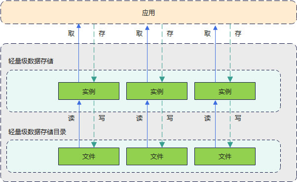

# 轻量级数据存储概述

轻量级数据存储适用于对Key-Value结构的数据进行存取和持久化操作。应用获取某个轻量级存储对象后，该存储对象中的数据将会被缓存在内存中，以便应用获得更快的数据存取速度。应用也可以将缓存的数据再次写回文本文件中进行持久化存储，由于文件读写将产生不可避免的系统资源开销，建议应用减少对持久化文件的读写频率。

## 基本概念

- **Key-Value数据结构**

  一种键值结构数据类型。Key是不重复的关键字，Value是数据值。

- **非关系型数据库**

  区别于关系数据库，不保证遵循ACID（Atomicity, Consistency, Isolation and Durability）特性，不采用关系模型来组织数据，数据之间无关系。

## 运作机制

1. 应用通过指定Storage文件将其中的数据加载到Storage实例，系统会通过静态容器将该实例存储在内存中，同一应用或进程中每个文件仅存在一个Storage实例，直到应用主动从内存中移除该实例或者删除该Storage文件。
2. 应用获取到Storage文件对应的实例后，可以从Storage实例中读取数据，或者将数据存入Storage实例中。通过调用flush或者flushSync方法可以将Storage实例中的数据回写到文件里。

**图1** 轻量级数据存储运作机制

## 约束与限制

- 因Storage实例会加载到内存中，建议存储的数据不超过一万条，并及时清理不再使用的实例，以便减少非内存开销。
- 数据中的key为string类型，要求非空且字符长度不超过80个。
- 当数据中的value为string类型时，允许为空，字符长度不超过8192个。