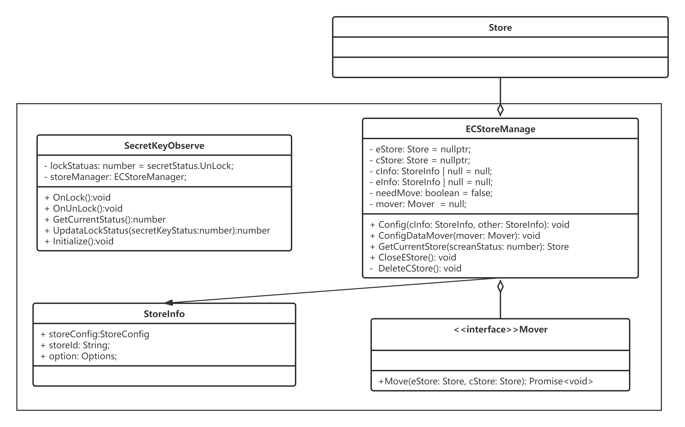
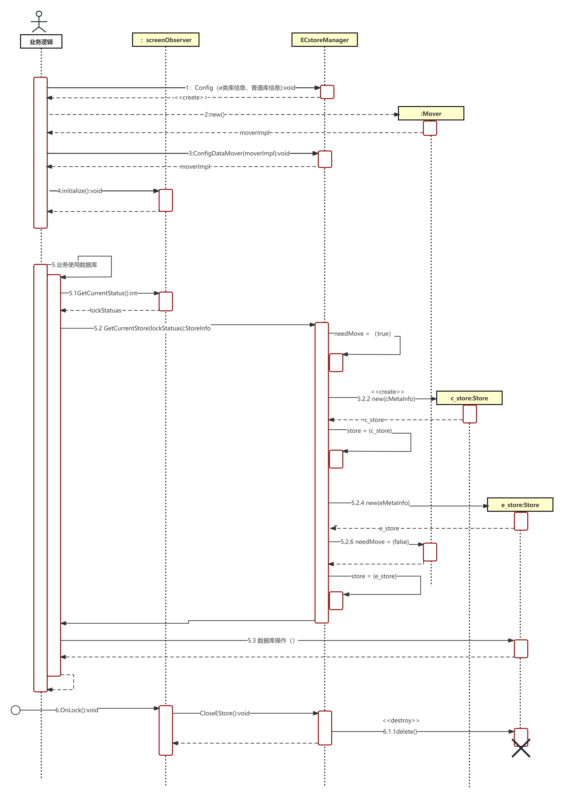

# E类加密库使用指南


## 场景介绍

为了满足数据库的安全特性，存有敏感信息的应用会在El5（加密路径切换请参考[获取和修改加密分区](../application-models/application-context-stage.md#获取和修改加密分区)EL1-EL4路径切换）路径下创建了一个E类数据库。在锁屏的情况下，满足一定条件时，会触发密钥的销毁。此时，E类数据库不可操作。当锁屏解锁后，密钥会恢复，E类数据库恢复正常读写操作。这样的设计可以有效防止用户数据的泄露。

然而，在锁屏的过程中，应用程序仍然可以继续写入数据，由于此时E类数据库不可读写，可能会导致数据丢失。为了解决这个问题，当前提供了一种方案：在锁屏的状态下，将数据存储在[EL2](../application-models/application-context-stage.md#获取和修改加密分区)路径下的C类数据库中。当解锁后，再将数据迁移到E类数据库中。这样可以确保数据在锁屏期间的安全性和一致性。

## 设计实现

### 类图

Mover类：提供数据库数据迁移接口，在锁屏解锁后若C类数据库中有数据，使用该接口将数据迁移到E类数据库。

Store类：提供访问当前可操作数据库，对数据库进行相关操作的接口。

secretKeyObserver类：提供了获取当前密钥状态的接口，在密钥销毁后，关闭E类数据库。

ECStoreManager类：用于管理应用的E类数据库和C类数据库。

**图1** EC数据库管理类图



### 时序图

**图2** EC数据库管理时序图



## 配置权限

在model.json5中配置ohos.permission.PROTECT_SCREEN_LOCK_DATA权限。

```ts
//未配置权限会报错：（create dir /data/storage/el5/database/entry failed, errno is 13.）
"requestPermissions": [
      {
        "name": "ohos.permission.PROTECT_SCREEN_LOCK_DATA"
      }
    ]
```

## 键值型数据库E类加密

本章节提供键值型数据库的E类加密库使用方式，提供[Mover](#Mover)类，[Store](#Store)类，[SecretKeyObserver](#SecretKeyObserver)类和[ECStoreManager](#ECStoreManager)类的具体实现，并在[EntryAbility](#EntryAbility)和[index按键事件](#index按键事件)中展示这几个类的使用方式。

### Mover

提供数据库数据迁移接口，在锁屏解锁后若C类数据库中有数据，使用该接口将数据迁移到E类数据库。

```ts
import { distributedKVStore } from '@kit.ArkData';

export class Mover {
  async Move(eStore: distributedKVStore.SingleKVStore, cStore: distributedKVStore.SingleKVStore): Promise<void> {
    if (eStore != null && cStore != null) {
      let entries: distributedKVStore.Entry[] = await cStore.getEntries('key_test_string');
      await eStore.putBatch(entries);
      console.info(`ECDB_Encry move success`);
    }
  }
}
```

### Store

提供了获取数据库，在数据库中插入数据，删除数据，更新数据和获取当前数据数量的接口。其中StoreInfo类用于存储获取数据库相关信息。

```ts
import { distributedKVStore } from '@kit.ArkData';
import { BusinessError } from '@kit.BasicServicesKit';

let kvManager: distributedKVStore.KVManager;

export class StoreInfo {
  kvManagerConfig: distributedKVStore.KVManagerConfig;
  storeId: string;
  option: distributedKVStore.Options;
}

export class Store {
  async GetECStore(storeInfo: StoreInfo): Promise<distributedKVStore.SingleKVStore> {
    try {
      kvManager = distributedKVStore.createKVManager(storeInfo.kvManagerConfig);
      console.info("Succeeded in creating KVManager");
    } catch (e) {
      let error = e as BusinessError;
      console.error(`Failed to create KVManager.code is ${error.code},message is ${error.message}`);
    }
    if (kvManager !== undefined) {
      kvManager = kvManager as distributedKVStore.KVManager;
      let kvStore: distributedKVStore.SingleKVStore | null;
      try {
        kvStore = await kvManager.getKVStore<distributedKVStore.SingleKVStore>(storeInfo.storeId, storeInfo.option);
        if (kvStore != undefined) {
          return kvStore;
        }
      } catch (e) {
        let error = e as BusinessError;
        console.error(`An unexpected error occurred.code is ${error.code},message is ${error.message}`);
      }
    }
  }

  PutOnedata(kvStore: distributedKVStore.SingleKVStore): void {
    if (kvStore != undefined) {
      const KEY_TEST_STRING_ELEMENT = 'key_test_string' + String(Date.now());
      const VALUE_TEST_STRING_ELEMENT = 'value_test_string' + String(Date.now());
      try {
        kvStore.put(KEY_TEST_STRING_ELEMENT, VALUE_TEST_STRING_ELEMENT, (err) => {
          if (err !== undefined) {
            console.error(`Failed to put data. Code:${err.code},message:${err.message}`);
            return;
          }
          console.info(`ECDB_Encry Succeeded in putting data.${KEY_TEST_STRING_ELEMENT}`);
        });
      } catch (e) {
        let error = e as BusinessError;
        console.error(`An unexpected error occurred. Code:${error.code},message:${error.message}`);
      }
    }
  }

  GetDataNum(kvStore: distributedKVStore.SingleKVStore): void {
    if (kvStore != undefined) {
      let resultSet: distributedKVStore.KVStoreResultSet;
      kvStore.getResultSet("key_test_string").then((result: distributedKVStore.KVStoreResultSet) => {
        console.info(`ECDB_Encry Succeeded in getting result set num ${result.getCount()}`);
        resultSet = result;
        if (kvStore != null) {
          kvStore.closeResultSet(resultSet).then(() => {
            console.info('Succeeded in closing result set');
          }).catch((err: BusinessError) => {
            console.error(`Failed to close resultset.code is ${err.code},message is ${err.message}`);
          });
        }
      }).catch((err: BusinessError) => {
        console.error(`Failed to get resultset.code is ${err.code},message is ${err.message}`);
      });
    }
  }

  DeleteOnedata(kvStore: distributedKVStore.SingleKVStore): void {
    if (kvStore != undefined) {
      kvStore.getEntries('key_test_string', (err: BusinessError, entries: distributedKVStore.Entry[]) => {
        if (err != undefined) {
          console.error(`Failed to get Entries.code is ${err.code},message is ${err.message}`);
          return;
        }
        if (kvStore != null && entries.length != 0) {
          kvStore.delete(entries[0].key, (err: BusinessError) => {
            if (err != undefined) {
              console.error(`Failed to delete.code is ${err.code},message is ${err.message}`);
              return;
            }
            console.info('ECDB_Encry Succeeded in deleting');
          });
        }
      });
    }
  }

  UpdataOnedata(kvStore: distributedKVStore.SingleKVStore): void {
    if (kvStore != undefined) {
      kvStore.getEntries('key_test_string', async (err: BusinessError, entries: distributedKVStore.Entry[]) => {
        if (err != undefined) {
          console.error(`Failed to get Entries.code is ${err.code},message is ${err.message}`);
          return;
        }
        if (kvStore != null && entries.length != 0) {
          console.info(`ECDB_Encry old data:${entries[0].key},value :${entries[0].value.value.toString()}`)
          await kvStore.put(entries[0].key, "new value_test_string" + String(Date.now()) + 'new').then(() => {
          }).catch((err: BusinessError) => {
            console.error(`Failed to put.code is ${err.code},message is ${err.message}`);
          });
        }
        console.info(`ECDB_Encry updata success`)
      });
    }
  }
}
```

### SecretKeyObserver

该类提供了获取当前密钥状态的接口，在密钥销毁后，关闭E类数据库。

```ts
import { ECStoreManager } from './ECStoreManager'

enum SecretStatus {
  Lock,
  UnLock
}

export class SecretKeyObserver {
  OnLock(): void {
    this.lockStatuas = SecretStatus.Lock;
    this.storeManager.CloseEStore();
  }

  OnUnLock(): void {
    this.lockStatuas = SecretStatus.UnLock;
  }

  GetCurrentStatus(): number {
    return this.lockStatuas;
  }

  Initialize(storeManager: ECStoreManager): void {
    this.storeManager = storeManager;
  }

  UpdatalockStatus(code: number) {
    this.lockStatuas = code;
  }

  private lockStatuas: number = SecretStatus.UnLock;
  private storeManager: ECStoreManager;
}

export let lockObserver = new SecretKeyObserver();
```

### ECStoreManager

ECStoreManager类用于管理应用的E类数据库和C类数据库。提供配置数据库信息，配置迁移函数的信息，根据密钥状态为应用提供相应的数据库句柄，提供E类数据关库接口和在数据迁移完成后销毁C类数据库的接口。

```ts
import distributedKVStore from '@ohos.data.distributedKVStore';
import { Mover } from './Mover'
import { BusinessError } from '@kit.BasicServicesKit';
import { StoreInfo, Store } from './Store'

let store = new Store();

export class ECStoreManager {
  Config(cInfo: StoreInfo, other: StoreInfo): void {
    this.cInfo = cInfo;
    this.eInfo = other;
  }

  ConfigDataMover(mover: Mover): void {
    this.mover = mover;
  }

  async GetCurrentStore(screanStatus: number): Promise<distributedKVStore.SingleKVStore> {
    console.info(`ECDB_Encry GetCurrentStore start screanStatus: ${screanStatus}`);
    if (screanStatus) {
      this.eStore = await store.GetECStore(this.eInfo);
      //解锁状态 获取e类库
      if (this.needMove) {
        if (this.eStore != undefined && this.cStore != undefined) {
          await this.mover.Move(this.eStore, this.cStore);
        }
        this.DeleteCStore();
        console.info(`ECDB_Encry Data migration is complete. Destroy cstore`);
        this.needMove = false;
      }
      return this.eStore;
    } else {
      //加锁状态 获取c类库
      this.needMove = true;
      this.cStore = await store.GetECStore(this.cInfo);
      return this.cStore;
    }
  }

  CloseEStore(): void {
    try {
      let kvManager = distributedKVStore.createKVManager(this.eInfo.kvManagerConfig);
      console.info("Succeeded in creating KVManager");
      if (kvManager != undefined) {
        kvManager.closeKVStore(this.eInfo.kvManagerConfig.bundleName, this.eInfo.storeId);
        this.eStore = null;
        console.info(`ECDB_Encry close EStore success`)
      }
    } catch (e) {
      let error = e as BusinessError;
      console.error(`Failed to create KVManager.code is ${error.code},message is ${error.message}`);
    }
  }

  DeleteCStore(): void {
    try {
      let kvManager = distributedKVStore.createKVManager(this.cInfo.kvManagerConfig);
      console.info("Succeeded in creating KVManager");
      if (kvManager != undefined) {
        kvManager.deleteKVStore(this.cInfo.kvManagerConfig.bundleName, this.cInfo.storeId);
        this.cStore = null;
        console.info("ECDB_Encry delete cStore success");
      }
    } catch (e) {
      let error = e as BusinessError;
      console.error(`Failed to create KVManager.code is ${error.code},message is ${error.message}`);
    }
  }

  private eStore: distributedKVStore.SingleKVStore = null;
  private cStore: distributedKVStore.SingleKVStore = null;
  private cInfo: StoreInfo | null = null;
  private eInfo: StoreInfo | null = null;
  private needMove: boolean = false;
  private mover: Mover | null = null;
}
```

### EntryAbility

模拟应用启动期间，注册对COMMON_EVENT_SCREEN_LOCK_FILE_ACCESS_STATE_CHANGED公共事件的监听，并配置相应的数据库信息，密钥状态信息等。

```ts
import { AbilityConstant, contextConstant, UIAbility, Want } from '@kit.AbilityKit';
import { hilog } from '@kit.PerformanceAnalysisKit';
import { window } from '@kit.ArkUI';
import { distributedKVStore } from '@kit.ArkData';
import { ECStoreManager } from './ECStoreManager'
import { StoreInfo } from './Store'
import { Mover } from './Mover'
import { SecretKeyObserver } from './secretKeyObserver'
import CommonEventManager from '@ohos.commonEventManager';
import Base from '@ohos.base';


export let storeManager = new ECStoreManager();

export let secretKeyObserver = new SecretKeyObserver();

let mover = new Mover();

let subscriber: CommonEventManager.CommonEventSubscriber;

export function createCB(err: Base.BusinessError, commonEventSubscriber: CommonEventManager.CommonEventSubscriber) {
  if (!err) {
    console.info('ECDB_Encry createSubscriber');
    subscriber = commonEventSubscriber;
    try {
      CommonEventManager.subscribe(subscriber, (err: Base.BusinessError, data: CommonEventManager.CommonEventData) => {
        if (err) {
          console.error(`subscribe failed, code is ${err.code}, message is ${err.message}`);
        } else {
          console.info(`ECDB_Encry SubscribeCB ${data.code}`);
          secretKeyObserver.UpdatalockStatus(data.code);
        }
      });
    } catch (error) {
      const err: Base.BusinessError = error as Base.BusinessError;
      console.error(`subscribe failed, code is ${err.code}, message is ${err.message}`);
    }
  } else {
    console.error(`createSubscriber failed, code is ${err.code}, message is ${err.message}`);
  }
}

let cInfo: StoreInfo | null = null;
let eInfo: StoreInfo | null = null;

export default class EntryAbility extends UIAbility {
  onCreate(want: Want, launchParam: AbilityConstant.LaunchParam): void {
    hilog.info(0x0000, 'testTag', '%{public}s', 'Ability onCreate');
    let cContext = this.context;
    cInfo = {
      "kvManagerConfig": {
        context: cContext,
        bundleName: 'com.example.ecstoredemo',
      },
      "storeId": "cstore",
      "option": {
        createIfMissing: true,
        encrypt: false,
        backup: false,
        autoSync: false,
        // kvStoreType不填时，默认创建多设备协同数据库
        kvStoreType: distributedKVStore.KVStoreType.SINGLE_VERSION,
        // 多设备协同数据库：kvStoreType: distributedKVStore.KVStoreType.DEVICE_COLLABORATION,
        securityLevel: distributedKVStore.SecurityLevel.S1
      }
    }
    let eContext = this.context.createModuleContext("entry");
    eContext.area = contextConstant.AreaMode.EL5;
    eInfo = {
      "kvManagerConfig": {
        context: eContext,
        bundleName: 'com.example.ecstoredemo',
      },
      "storeId": "estore",
      "option": {
        createIfMissing: true,
        encrypt: false,
        backup: false,
        autoSync: false,
        // kvStoreType不填时，默认创建多设备协同数据库
        kvStoreType: distributedKVStore.KVStoreType.SINGLE_VERSION,
        // 多设备协同数据库：kvStoreType: distributedKVStore.KVStoreType.DEVICE_COLLABORATION,
        securityLevel: distributedKVStore.SecurityLevel.S1
      }
    }
    console.info(`ECDB_Encry store area : estore:${eContext.area},cstore${cContext.area}`);
    //监听COMMON_EVENT_SCREEN_LOCK_FILE_ACCESS_STATE_CHANGED事件 code == 1解锁状态，code==0加锁状态
    try {
      CommonEventManager.createSubscriber({
        events: ['COMMON_EVENT_SCREEN_LOCK_FILE_ACCESS_STATE_CHANGED']
      }, createCB);
      console.info(`ECDB_Encry success subscribe`);
    } catch (error) {
      const err: Base.BusinessError = error as Base.BusinessError;
      console.error(`createSubscriber failed, code is ${err.code}, message is ${err.message}`);
    }
    storeManager.Config(cInfo, eInfo);
    storeManager.ConfigDataMover(mover);
    secretKeyObserver.Initialize(storeManager);
  }

  onDestroy(): void {
    hilog.info(0x0000, 'testTag', '%{public}s', 'Ability onDestroy');
  }

  onWindowStageCreate(windowStage: window.WindowStage): void {
    // Main window is created, set main page for this ability
    hilog.info(0x0000, 'testTag', '%{public}s', 'Ability onWindowStageCreate');

    windowStage.loadContent('pages/Index', (err) => {
      if (err.code) {
        hilog.error(0x0000, 'testTag', 'Failed to load the content. Cause: %{public}s', JSON.stringify(err) ?? '');
        return;
      }
      hilog.info(0x0000, 'testTag', 'Succeeded in loading the content.');
    });
  }

  onWindowStageDestroy(): void {
    // Main window is destroyed, release UI related resources
    hilog.info(0x0000, 'testTag', '%{public}s', 'Ability onWindowStageDestroy');
  }

  onForeground(): void {
    // Ability has brought to foreground
    hilog.info(0x0000, 'testTag', '%{public}s', 'Ability onForeground');
  }

  onBackground(): void {
    // Ability has back to background
    hilog.info(0x0000, 'testTag', '%{public}s', 'Ability onBackground');
  }
}
```

### index按键事件

模拟应用操作数据库，如插入数据，删除数据，更新数据和获取数据数量的操作等。

```ts
import { storeManager, secretKeyObserver } from "../entryability/EntryAbility"
import { distributedKVStore } from '@kit.ArkData';
import { Store } from '../entryability/Store';

let storeOption = new Store();

let lockStatus: number = 1;

@Entry
@Component
struct Index {
  @State message: string = 'Hello World';

  build() {
    Row() {
      Column() {
        Button('加锁/解锁').onClick((event: ClickEvent) => {
          if (lockStatus) {
            secretKeyObserver.OnLock();
            lockStatus = 0;
          } else {
            secretKeyObserver.OnUnLock();
            lockStatus = 1;
          }
          lockStatus ? this.message = "解锁" : this.message = "加锁";
        }).margin("5");
        Button('store type').onClick(async (event: ClickEvent) => {
          secretKeyObserver.GetCurrentStatus() ? this.message = "estroe" : this.message = "cstore";
        }).margin("5");

        Button("put").onClick(async (event: ClickEvent) => {
          let store: distributedKVStore.SingleKVStore = await storeManager.GetCurrentStore(secretKeyObserver.GetCurrentStatus());
          storeOption.PutOnedata(store);
        }).margin(5)

        Button("Get").onClick(async (event: ClickEvent) => {
          let store: distributedKVStore.SingleKVStore = await storeManager.GetCurrentStore(secretKeyObserver.GetCurrentStatus());
          storeOption.GetDataNum(store);
        }).margin(5)

        Button("delete").onClick(async (event: ClickEvent) => {
          let store: distributedKVStore.SingleKVStore = await storeManager.GetCurrentStore(secretKeyObserver.GetCurrentStatus());
          storeOption.DeleteOnedata(store);
        }).margin(5)

        Button("updata").onClick(async (event: ClickEvent) => {
          let store: distributedKVStore.SingleKVStore = await storeManager.GetCurrentStore(secretKeyObserver.GetCurrentStatus());
          storeOption.UpdataOnedata(store);
        }).margin(5)

        Text(this.message)
          .fontSize(50)
          .fontWeight(FontWeight.Bold)
      }
      .width('100%')
    }
    .height('100%')
  }
}
```

## 关系型数据库E类加密

本章节提供键值型数据库的E类加密库使用方式，提供[Mover](#Mover-1)类，[Store](#Store-1)类，[SecretKeyObserver](#SecretKeyObserver-1)类和[ECStoreManager](#ECStoreManager-1)类的具体实现，并在[EntryAbility](#EntryAbility-1)和[index按键事件](#index按键事件-1)中展示这几个类的使用方式。

### Mover

提供数据库数据迁移接口，在锁屏解锁后若C类数据库中有数据，使用该接口将数据迁移到E类数据库。

```ts
import { relationalStore } from '@kit.ArkData';

export class Mover {
  async Move(eStore: relationalStore.RdbStore, cStore: relationalStore.RdbStore) {
    if (eStore != null && cStore != null) {
      let predicates = new relationalStore.RdbPredicates('test');
      let resultSet = await cStore.query(predicates);
      while (resultSet.goToNextRow()) {
        let bucket = resultSet.getRow();
        await eStore.insert('test', bucket);
      }
    }
  }
}
```

### Store

提供了获取数据库，在数据库中插入数据，删除数据，更新数据和获取当前数据数量的接口。其中StoreInfo类用于存储获取数据库相关信息。

```ts
import { relationalStore } from '@kit.ArkData';
import { BusinessError } from '@kit.BasicServicesKit';

export class StoreInfo {
  context: Context;
  config: relationalStore.StoreConfig;
  storeId: string;
}

const SQL_CREATE_TABLE = 'CREATE TABLE IF NOT EXISTS EMPLOYEE (ID INTEGER PRIMARY KEY AUTOINCREMENT, NAME TEXT NOT NULL, AGE INTEGER, SALARY REAL, CODES BLOB, IDENTITY UNLIMITED INT)'; // 建表Sql语句，IDENTITY为bigint类型，sql中指定类型为UNLIMITED INT


export class Store {
  async GetECStore(storeInfo: StoreInfo): Promise<relationalStore.RdbStore> {
    let rdbStore: relationalStore.RdbStore | null;
    try {
      rdbStore = await relationalStore.getRdbStore(storeInfo.context, storeInfo.config);
      if (rdbStore.version == 0) {
        await rdbStore.execute(SQL_CREATE_TABLE);
        rdbStore.version = 1;
      }
    } catch (e) {
      let error = e as BusinessError;
      console.error(`An unexpected error occurred.code is ${error.code},message is ${error.message}`);
    }
    return rdbStore;
  }

  async PutOnedata(rdbStore: relationalStore.RdbStore) {
    if (rdbStore != undefined) {
      const valueBucket: relationalStore.ValuesBucket = {
        NAME: 'Lisa',
        AGE: 18,
        SALARY: 100.5,
        CODES: new Uint8Array([1, 2, 3, 4, 5]),
        IDENTITY: BigInt('15822401018187971961171'),
      };
      try {
        await rdbStore.insert("EMPLOYEE", valueBucket);
      } catch (e) {
        let error = e as BusinessError;
        console.error(`An unexpected error occurred. Code:${error.code},message:${error.message}`);
      }
    }
  }

  GetDataNum(rdbStore: relationalStore.RdbStore) {
    if (rdbStore != undefined) {
      try {
        let predicates = new relationalStore.RdbPredicates('EMPLOYEE');
        let resultSet = await rdbStore.query(predicates);
        let count = resultSet.rowCount;
      } catch (e) {
        let error = e as BusinessError;
        console.error(`An unexpected error occurred. Code:${error.code},message:${error.message}`);
      }
    }
  }

  async DeleteOnedata(rdbStore: relationalStore.RdbStore) {
    if (rdbStore != undefined) {
      try {
        let predicates = new relationalStore.RdbPredicates('EMPLOYEE');
        predicates.equalTo('NAME', 'Lisa');
        await rdbStore.delete(predicates)
      } catch (e) {
        let error = e as BusinessError;
        console.error(`An unexpected error occurred. Code:${error.code},message:${error.message}`);
      }
    }
  }

  async UpdataOnedata(rdbStore: relationalStore.SinglerdbStore) {
    if (rdbStore != undefined) {
      try {
        let predicates = new relationalStore.RdbPredicates('EMPLOYEE');
        predicates.equalTo('NAME', 'Lisa');
        const valueBucket: relationalStore.ValuesBucket = {
          NAME: 'Anna',
          AGE: 30,
          SALARY: 100.5,
          CODES: new Uint8Array([1, 2, 3, 4, 5]),
          IDENTITY: BigInt('158224000000000971961171'),
        };
        await rdbStore.update(valueBucket, predicates);
      } catch (e) {
        let error = e as BusinessError;
        console.error(`An unexpected error occurred. Code:${error.code},message:${error.message}`);
      }
    }
  }
}
```

### SecretKeyObserver

该类提供了获取当前密钥状态的接口，在密钥销毁后，关闭E类数据库。

```ts
import { ECStoreManager } from './ECStoreManager'

enum SecretStatus {
  Lock,
  UnLock
}

export class SecretKeyObserver {
  OnLock(): void {
    this.lockStatuas = SecretStatus.Lock;
    this.storeManager.CloseEStore();
  }

  OnUnLock(): void {
    this.lockStatuas = SecretStatus.UnLock;
  }

  GetCurrentStatus(): number {
    return this.lockStatuas;
  }

  Initialize(storeManager: ECStoreManager): void {
    this.storeManager = storeManager;
  }

  UpdatalockStatus(code: number) {
    this.lockStatuas = code;
  }

  private lockStatuas: number = SecretStatus.UnLock;
  private storeManager: ECStoreManager;
}

export let lockObserve = new SecretKeyObserver();
```

### ECStoreManager

ECStoreManager类用于管理应用的E类数据库和C类数据库。提供配置数据库信息，配置迁移函数的信息，根据密钥状态为应用提供相应的数据库句柄，提供E类数据关库接口和在数据迁移完成后销毁C类数据库的接口。

```ts
import { relationalStore } from '@kit.ArkData';
import { Mover } from './Mover'
import { BusinessError } from '@kit.BasicServicesKit';
import { StoreInfo, Store } from './Store'

let store = new Store();

export class ECStoreManager {
  Config(cInfo: StoreInfo, other: StoreInfo): void {
    this.cInfo = cInfo;
    this.eInfo = other;
  }

  ConfigDataMover(mover: Mover): void {
    this.mover = mover;
  }

  async GetCurrentStore(screanStatus: number): Promise<relationalStore.RdbStore> {
    if (screanStatus) {
      this.eStore = await store.GetECStore(this.eInfo);
      //解锁状态 获取e类库
      if (this.needMove) {
        if (this.eStore != undefined && this.cStore != undefined) {
          await this.mover.Move(this.eStore, this.cStore);
        }
        this.DeleteCStore();
        this.needMove = false;
      }
      return this.eStore;
    } else {
      //加锁状态 获取c类库
      this.needMove = true;
      this.cStore = await store.GetECStore(this.cInfo);
      return this.cStore;
    }
  }

  CloseEStore(): void {
    this.eStore = undefined;
  }

  async DeleteCStore() {
    try {
      await relationalStore.deleteRdbStore(this.cInfo.context, this.cInfo.storeId)
    } catch (e) {
      let error = e as BusinessError;
      console.error(`Failed to create KVManager.code is ${error.code},message is ${error.message}`);
    }
  }

  private eStore: relationalStore.RdbStore = null;
  private cStore: relationalStore.RdbStore = null;
  private cInfo: StoreInfo | null = null;
  private eInfo: StoreInfo | null = null;
  private needMove: boolean = false;
  private mover: Mover | null = null;
}
```

### EntryAbility

模拟在应用启动期间，注册对COMMON_EVENT_SCREEN_LOCK_FILE_ACCESS_STATE_CHANGED公共事件的监听，并配置相应的数据库信息，密钥状态信息等。

```ts
import { AbilityConstant, contextConstant, UIAbility, Want } from '@kit.AbilityKit';
import { hilog } from '@kit.PerformanceAnalysisKit';
import { window } from '@kit.ArkUI';
import { relationalStore } from '@kit.ArkData';
import { ECStoreManager } from './ECStoreManager'
import { StoreInfo } from './Store'
import { Mover } from './Mover'
import { SecretKeyObserver } from './secretKeyObserver'
import CommonEventManager from '@ohos.commonEventManager';
import Base from '@ohos.base';


export let storeManager = new ECStoreManager();

export let secretKeyObserver = new SecretKeyObserver();

let mover = new Mover();

let subscriber: CommonEventManager.CommonEventSubscriber;

export function createCB(err: Base.BusinessError, commonEventSubscriber: CommonEventManager.CommonEventSubscriber) {
  if (!err) {
    console.info('ECDB_Encry createSubscriber');
    subscriber = commonEventSubscriber;
    try {
      CommonEventManager.subscribe(subscriber, (err: Base.BusinessError, data: CommonEventManager.CommonEventData) => {
        if (err) {
          console.error(`subscribe failed, code is ${err.code}, message is ${err.message}`);
        } else {
          console.info(`ECDB_Encry SubscribeCB ${data.code}`);
          secretKeyObserver.UpdatalockStatus(data.code);
        }
      });
    } catch (error) {
      const err: Base.BusinessError = error as Base.BusinessError;
      console.error(`subscribe failed, code is ${err.code}, message is ${err.message}`);
    }
  } else {
    console.error(`createSubscriber failed, code is ${err.code}, message is ${err.message}`);
  }
}

let cInfo: StoreInfo | null = null;
let eInfo: StoreInfo | null = null;

export default class EntryAbility extends UIAbility {
  onCreate(want: Want, launchParam: AbilityConstant.LaunchParam): void {
    hilog.info(0x0000, 'testTag', '%{public}s', 'Ability onCreate');
    let cContext = this.context;
    cInfo = {
      context: cContext;
      config: {
        name: 'cstore.db', 
        securityLevel: relationalStore.SecurityLevel.S1,
      },
      storeId: "cstore.db"
    }
    let eContext = this.context.createModuleContext("entry");
    eContext.area = contextConstant.AreaMode.EL5;
    cInfo = {
      context: cContext;
      config: {
        name: 'estore.db', 
        securityLevel: relationalStore.SecurityLevel.S1,
      },
      storeId: "estore.db",
    }
    //监听COMMON_EVENT_SCREEN_LOCK_FILE_ACCESS_STATE_CHANGED事件 code == 1解锁状态，code==0加锁状态
    console.info(`ECDB_Encry store area : estore:${eContext.area},cstore${cContext.area}`)
    try {
      CommonEventManager.createSubscriber({
        events: ['COMMON_EVENT_SCREEN_LOCK_FILE_ACCESS_STATE_CHANGED']
      }, createCB);
      console.info(`ECDB_Encry success subscribe`);
    } catch (error) {
      const err: Base.BusinessError = error as Base.BusinessError;
      console.error(`createSubscriber failed, code is ${err.code}, message is ${err.message}`);
    }
    storeManager.Config(cInfo, eInfo);
    storeManager.ConfigDataMover(mover);
    secretKeyObserve.Initialize(storeManager);
  }

  onDestroy(): void {
    hilog.info(0x0000, 'testTag', '%{public}s', 'Ability onDestroy');
  }

  onWindowStageCreate(windowStage: window.WindowStage): void {
    // Main window is created, set main page for this ability
    hilog.info(0x0000, 'testTag', '%{public}s', 'Ability onWindowStageCreate');

    windowStage.loadContent('pages/Index', (err) => {
      if (err.code) {
        hilog.error(0x0000, 'testTag', 'Failed to load the content. Cause: %{public}s', JSON.stringify(err) ?? '');
        return;
      }
      hilog.info(0x0000, 'testTag', 'Succeeded in loading the content.');
    });
  }

  onWindowStageDestroy(): void {
    // Main window is destroyed, release UI related resources
    hilog.info(0x0000, 'testTag', '%{public}s', 'Ability onWindowStageDestroy');
  }

  onForeground(): void {
    // Ability has brought to foreground
    hilog.info(0x0000, 'testTag', '%{public}s', 'Ability onForeground');
  }

  onBackground(): void {
    // Ability has back to background
    hilog.info(0x0000, 'testTag', '%{public}s', 'Ability onBackground');
  }
}
```

### index按键事件

模拟应用操作数据库，如插入数据，删除数据，更新数据和获取数据数量的操作等。

```ts
import { storeManager, secretKeyObserver } from "../entryability/EntryAbility"
import { relationalStore } from '@kit.ArkData';
import { Store } from '../entryability/Store';

let storeOption = new Store();

let lockStatus: number = 1;

@Entry
@Component
struct Index {
  @State message: string = 'Hello World';

  build() {
    Row() {
      Column() {
        Button('加锁/解锁').onClick((event: ClickEvent) => {
          if (lockStatus) {
            secretKeyObserver.OnLock();
            lockStatus = 0;
          } else {
            secretKeyObserver.OnUnLock();
            lockStatus = 1;
          }
          lockStatus ? this.message = "解锁" : this.message = "加锁";
        }).margin("5");
        Button('store type').onClick(async (event: ClickEvent) => {
          secretKeyObserver.GetCurrentStatus() ? this.message = "estroe" : this.message = "cstore";
        }).margin("5");

        Button("put").onClick(async (event: ClickEvent) => {
          let store: relationalStore.RdbStore = await storeManager.GetCurrentStore(secretKeyObserver.GetCurrentStatus());
          storeOption.PutOnedata(store);
        }).margin(5)

        Button("Get").onClick(async (event: ClickEvent) => {
          let store: relationalStore.RdbStore = await storeManager.GetCurrentStore(secretKeyObserver.GetCurrentStatus());
          storeOption.GetDataNum(store);
        }).margin(5)

        Button("delete").onClick(async (event: ClickEvent) => {
          let store: relationalStore.RdbStore = await storeManager.GetCurrentStore(secretKeyObserver.GetCurrentStatus());
          storeOption.DeleteOnedata(store);
        }).margin(5)

        Button("updata").onClick(async (event: ClickEvent) => {
          let store: relationalStore.RdbStore = await storeManager.GetCurrentStore(secretKeyObserver.GetCurrentStatus());
          storeOption.UpdataOnedata(store);
        }).margin(5)

        Text(this.message)
          .fontSize(50)
          .fontWeight(FontWeight.Bold)
      }
      .width('100%')
    }
    .height('100%')
  }
}
```
