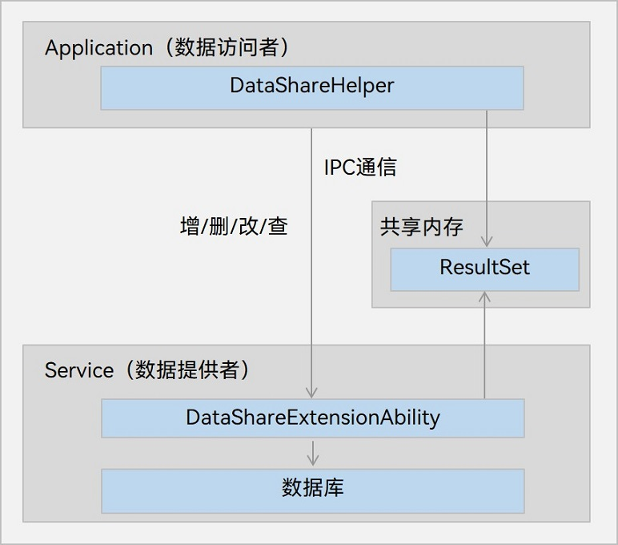

# 通过DataShareExtensionAbility实现数据共享 (ArkTS)(仅对系统应用开放)
<!--Kit: ArkData-->
<!--Subsystem: DistributedDataManager-->
<!--Owner: @woodenarow-->
<!--SE: @woodenarow; @xuelei3-->
<!--TSE: @chenwan188; @logic42-->


## 场景介绍

跨应用访问数据时，可以通过DataShareExtensionAbility拉起数据提供方的应用以实现对数据的访问。

此种方式支持跨应用拉起数据提供方的DataShareExtension，数据提供方的开发者可以在回调中实现灵活的业务逻辑。用于跨应用复杂业务场景。


## 运作机制

数据共享可分为数据的提供方和访问方两部分。

- 数据提供方：[DataShareExtensionAbility](../reference/apis-arkdata/js-apis-application-dataShareExtensionAbility-sys.md)，可以选择性实现数据的增、删、改、查，以及文件打开等功能，并对外共享这些数据。

- 数据访问方：由[createDataShareHelper()](../reference/apis-arkdata/js-apis-data-dataShare-sys.md#datasharecreatedatasharehelper)方法所创建的工具类，利用工具类便可以访问提供方提供的这些数据。

**图1** 数据共享运作机制  


- DataShareExtensionAbility模块为数据提供方，实现跨应用数据共享的相关业务。

- DataShareHelper模块为数据访问方，提供各种访问数据的接口，包括增删改查等。

- 数据访问方与提供方通过IPC进行通信，数据提供方可以通过数据库实现，也可以通过其他数据存储方式实现。

- ResultSet模块通过共享内存实现，用于存储查询数据得到的结果集，并提供了遍历结果集的方法。

## 实现说明


### 数据提供方应用的开发（仅限系统应用）

[DataShareExtensionAbility](../reference/apis-arkdata/js-apis-application-dataShareExtensionAbility-sys.md)提供以下API，根据需要重写对应回调方法。

| 接口名称                                     | 描述                   |
| ---------------------------------------- | -------------------- |
| onCreate(want: Want, callback: AsyncCallback&lt;void&gt;): void | DataShare客户端连接DataShareExtensionAbility服务端时，服务端需要在此回调中实现初始化业务逻辑，该方法可以选择性重写。         |
| insert(uri: string, value: ValuesBucket, callback: AsyncCallback&lt;number&gt;): void | 客户端请求插入数据时回调此接口，服务端需要在此回调中实现插入数据功能，该方法可以选择性重写。         |
| update(uri: string, predicates: dataSharePredicates.DataSharePredicates, value: ValuesBucket, callback: AsyncCallback&lt;number&gt;): void | 客户端请求更新数据时回调此接口，服务端需要在此回调中实现更新数据功能，该方法可以选择性重写。         |
| batchUpdate(operations: Record&lt;string, Array&lt;UpdateOperation&gt;&gt;): Promise&lt;Record&lt;string, Array&lt;number&gt;&gt;&gt; | 客户端请求批量更新数据时回调此接口，服务端需要在此回调中实现批量更新数据功能，该方法可以选择性重写。    |
| delete(uri: string, predicates: dataSharePredicates.DataSharePredicates, callback: AsyncCallback&lt;number&gt;): void | 客户端请求删除数据时回调此接口，服务端需要在此回调中实现删除数据功能，该方法可以选择性重写。    |
| query(uri: string, predicates: dataSharePredicates.DataSharePredicates, columns: Array&lt;string&gt;, callback: AsyncCallback&lt;DataShareResultSet&gt;): void | 客户端请求查询数据时回调此接口，服务端需要在此回调中实现查询数据功能，该方法可以选择性重写。           |
| batchInsert(uri: string, values: Array&lt;ValuesBucket&gt;, callback: AsyncCallback&lt;number&gt;): void | 客户端请求批量插入数据时回调此接口，服务端需要在此回调中实现批量插入数据的功能，该方法可以选择性重写。    |
| normalizeUri(uri: string, callback: AsyncCallback&lt;string&gt;): void | 客户端给定的URI转换为服务端使用的URI时回调此接口，该方法可以选择性重写。    |
| denormalizeUri(uri: string, callback: AsyncCallback&lt;string&gt;): void | 服务端使用的URI转换为客户端传入的初始URI时服务端回调此接口，该方法可以选择性重写。    |

开发者在实现一个数据共享服务时，需要在DevEco Studio工程中手动新建一个DataShareExtensionAbility，具体步骤如下。

1. 在工程Module对应的ets目录下，右键选择“New &gt; Directory”，新建一个目录并命名为DataShareExtAbility。

2. 在DataShareExtAbility目录，右键选择“New &gt; ArkTS File”，新建一个文件并命名为DataShareExtAbility.ets。

3. 在DataShareExtAbility.ets文件中，导入DataShareExtensionAbility模块，开发者可根据应用需求选择性重写其业务实现。例如数据提供方只提供插入、删除和查询服务，则可只重写这些接口，并导入对应的基础依赖模块；如果需要增加权限校验，可以在重写的回调方法中使用IPC提供的[getCallingPid](../reference/apis-ipc-kit/js-apis-rpc.md#getcallingpid)、[getCallingUid](../reference/apis-ipc-kit/js-apis-rpc.md#getcallinguid)、[getCallingTokenId](../reference/apis-ipc-kit/js-apis-rpc.md#getcallingtokenid8)方法获取访问者信息来进行权限校验。
   
   ```ts
   import { DataShareExtensionAbility, dataShare, dataSharePredicates, relationalStore, DataShareResultSet } from '@kit.ArkData';
   import { Want } from '@kit.AbilityKit';
   import { BusinessError } from '@kit.BasicServicesKit';
   ```

4. 数据提供方的业务实现由开发者自定义。例如可以通过数据库、读写文件或访问网络等各方式实现数据提供方的数据存储。
   
   ```ts
   const DB_NAME = 'DB00.db';
   const TBL_NAME = 'TBL00';
   const DDL_TBL_CREATE = "CREATE TABLE IF NOT EXISTS "
     + TBL_NAME
     + ' (id INTEGER PRIMARY KEY AUTOINCREMENT, name TEXT, age INTEGER, isStudent BOOLEAN, Binary BINARY)';

   let rdbStore: relationalStore.RdbStore;
   let result: string;

   export default class DataShareExtAbility extends DataShareExtensionAbility {
     // 重写onCreate接口
     onCreate(want: Want, callback: Function) {
       result = this.context.cacheDir + '/datashare.txt';
       // 业务实现使用RDB
       relationalStore.getRdbStore(this.context, {
         name: DB_NAME,
         securityLevel: relationalStore.SecurityLevel.S3
       }, (err:BusinessError, data:relationalStore.RdbStore) => {
         rdbStore = data;
         rdbStore.executeSql(DDL_TBL_CREATE, [], (err) => {
           console.error(`DataShareExtAbility onCreate, executeSql done err:${err}`);
         });
         if (callback) {
           callback();
         }
       });
     }

     // 重写query接口
     query(uri: string, predicates: dataSharePredicates.DataSharePredicates, columns: Array<string>, callback: Function) {
       if (predicates === null || predicates === undefined) {
         console.error('invalid predicates');
       }
       try {
         rdbStore.query(TBL_NAME, predicates, columns, (err:BusinessError, resultSet:relationalStore.ResultSet) => {
           if (resultSet !== undefined) {
             console.info(`resultSet.rowCount:${resultSet.rowCount}`);
           }
           if (callback !== undefined) {
             callback(err, resultSet);
           }
         });
       } catch (err) {
         let code = (err as BusinessError).code;
         let message = (err as BusinessError).message;
         console.error(`Failed to query. Code:${code},message:${message}`);
       }
     }
     // 重写batchUpdate接口
     batchUpdate(operations:Record<string, Array<dataShare.UpdateOperation>>, callback:Function) {
       let recordOps : Record<string, Array<dataShare.UpdateOperation>> = operations;
       let results : Record<string, Array<number>> = {};
       let a = Object.entries(recordOps);
       for (let i = 0; i < a.length; i++) {
         let key = a[i][0];
         let values = a[i][1];
         let result : number[] = [];
         for (const value of values) {
           rdbStore.update(TBL_NAME, value.values, value.predicates).then(async (rows) => {
             console.info('Update row count is ' + rows);
             result.push(rows);
           }).catch((err:BusinessError) => {
             console.error('Update failed, err is ' + JSON.stringify(err));
             result.push(-1)
           })
         }
         results[key] = result;
       }
       callback(null, results);
     }

     batchInsert(uri: string, valueBuckets:Array<ValuesBucket>, callback:Function) {
       if (valueBuckets == null || valueBuckets.length == undefined) {
        return;
       }
       let resultNum = valueBuckets.length;
       rdbStore.batchInsert(TBL_NAME, valueBuckets, (err, ret) => {
        if (callback !== undefined) {
          callback(err, ret);
        }
       });
     }

     async normalizeUri(uri: string, callback:Function) {
       let ret = "normalize+" + uri;
       let err:BusinessError = {
         message: "message",
         code: 0,
         name: 'name'
       };
       await callback(err, ret);
     }

     async denormalizeUri(uri: string, callback:Function) {
       let ret = "denormalize+" + uri;

       let err:BusinessError = {
         message: "message",
         code: 0,
         name: 'name'
       };
       await callback(err, ret);
     }
     // 可根据应用需求，选择性重写各个接口
   };
   ```

5. 在module.json5中定义DataShareExtensionAbility。

     **表1** module.json5对应属性字段
   
   | 属性名称 | 备注说明 | 必填 |
   | -------- | -------- | -------- |
   | name | Ability名称，对应Ability派生的ExtensionAbility类名。 | 是 |
   | type | Ability类型，DataShare对应的Ability类型为“dataShare”，表示基于datashare模板开发的。 | 是 |
   | uri | 通信使用的URI，是客户端链接服务端的唯一标识。 | 是 |
   | exported | 对其他应用是否可见，设置为true时，才能与其他应用进行通信传输数据。 | 是 |
   | readPermission | 访问数据时需要的权限，不配置默认不进行读权限校验。<br>注意：当前DataShareExtensionAbility的权限约束方式与静默访问的权限约束方式不同，请注意区分，切勿混淆，具体可参考[静默访问章节](share-data-by-silent-access.md)。 | 否 |
   | writePermission | 修改数据时需要的权限，不配置默认不进行写权限校验。<br>注意：当前DataShareExtensionAbility的权限约束方式与静默访问的权限约束方式不同，请注意区分，切勿混淆，具体可参考[静默访问章节](share-data-by-silent-access.md)。 | 否 |
   | metadata   | 增加静默访问所需的额外配置项，包含name和resource字段。<br /> name类型固定为"ohos.extension.dataShare"，是配置的唯一标识。 <br /> resource类型固定为"$profile:data_share_config"，表示配置文件的名称为data_share_config.json。 | 若Ability启动模式为"singleton"，则metadata必填，Ability启动模式可见[abilities对象的内部结构-launchType](../quick-start/module-structure.md#abilities对象的内部结构)；其他情况下无需填写。 |

   **module.json5配置样例：**
   
   ```json
   // 以下配置以settingsdata为例，应用需根据实际情况配置各个字段
   "extensionAbilities": [
     {
       "srcEntry": "./ets/DataAbility/DataExtAbility.ets",
       "name": "DataExtAbility",
       "icon": "$media:icon",
       "description": "$string:description_datashareextability",
       "type": "dataShare",
       "uri": "datashare://com.ohos.settingsdata.DataAbility",
       "exported": true,
       // 实际请按照应用具体场景需要的安全权限配置，如配置应用自定义权限、系统权限或用户授权权限，当前权限仅为示例
       "readPermission": "ohos.permission.MANAGE_SECURE_SETTINGS",
       "writePermission": "ohos.permission.MANAGE_SECURE_SETTINGS",
       "metadata": [{"name": "ohos.extension.dataShare", "resource": "$profile:data_share_config"}]
     }
   ]
   ```

   **表2** data_share_config.json对应属性字段

   | 属性名称            | 备注说明                                                     | 必填 |
   | ------------------- | ------------------------------------------------------------ | ---- |
   | tableConfig         | 配置标签。包括uri和crossUserMode。<br>**-uri：** 指定配置生效的范围，uri支持以下三种格式，优先级为**表配置>库配置>\***，如果同时配置，高优先级会覆盖低优先级 。<br /> 1. "*" : 所有的数据库和表。<br /> 2. "datashare:///{bundleName}/{moduleName}/{storeName}" : 指定数据库。<br /> 3. "datashare:///{bundleName}/{moduleName}/{storeName}/{tableName}" : 指定表<br>**-crossUserMode：** 标识数据是否为多用户共享，配置为1则多用户数据共享，配置为2则多用户数据隔离。 | 是   |
   | isSilentProxyEnable | 标识该ExtensionAbility是否启用静默访问。<br />false：代表禁用静默访问。<br />true：代表打开静默访问。<br />不填写默认为true，即默认启用静默访问。<br />如果该应用下存在多个ExtensionAbility，其中一个配置了该属性为false，代表应用禁用静默访问。<br />如果数据提供方调用过enableSilentProxy和disableSilentProxy接口，则按照接口的设置结果来启用或禁用静默访问。否则会读取该配置来启用或禁用静默访问。 | 否   |
   | launchInfos         | 包括storeId和tableNames。<br>该配置中表粒度的数据变更时，通过所属extensionAbilities中的uri拉起extension。若业务方需要在非主动数据变更时做处理，则配置此项，拉起extension即时处理；若不需要，则可以不配置。<br>**-storeId：** 数据库名。该配置需要去掉数据库名后缀，如：数据库名为test.db时，配置信息填入test即可。<br>**-tableNames：** 数据库表名集合。集合内单个表数据变更就会拉起extension。 | 否   |
   
   **data_share_config.json配置样例**
   
   ```json
   {
       "tableConfig":[
           {
               "uri":"*",
               "crossUserMode":1
           },
           {
               "uri":"datashare:///com.ohos.settingsdata/entry/DB00",
               "crossUserMode":1
           },
           {
               "uri":"datashare:///com.acts.datasharetest/entry/DB00/TBL00",
               "crossUserMode":2
           }
       ],
       "isSilentProxyEnable":true,
       "launchInfos":[
           {
               "storeId": "test",
               "tableNames":["test1", "test2"]
           }
       ]
   }
   ```


### 数据访问方应用的开发

1. 导入基础依赖包。
   
   ```ts
   import { UIAbility } from '@kit.AbilityKit';
   import { dataShare, dataSharePredicates, DataShareResultSet, ValuesBucket } from '@kit.ArkData';
   import { window } from '@kit.ArkUI';
   import { BusinessError } from '@kit.BasicServicesKit';
   ```

2. 定义与数据提供方通信的URI字符串。<br/> URI即为上文数据提供方在配置文件中配置的标识。URI支持添加后缀参数来设置具体的访问对象，URI添加后缀参数需在URI结尾以"?"符号开始参数。<br/> - 当前仅支持设置"user"参数。<br/> - "user"仅支持设置为整型，表示数据提供方的用户ID。不填写时，默认为数据访问方所在的用户ID。user的定义及获取参照[user](../reference/apis-basic-services-kit/js-apis-osAccount.md#getactivatedosaccountlocalids9)。<br/> - 目前跨用户访问需要数据访问方配有跨用户访问权限ohos.permission.INTERACT_ACROSS_LOCAL_ACCOUNTS才可成功访问。目前跨用户访问功能仅支持增删改查功能，订阅通知功能不支持跨用户。
   
   ```ts
   // 作为参数传递的URI，与module.json5中定义的URI的区别是多了一个"/"，是因为作为参数传递的URI中，在第二个与第三个"/"中间，存在一个DeviceID的参数
   let dseUri = ('datashare:///com.ohos.settingsdata.DataAbility');
   ```

3. 使用createDataShareHelper()方法传入URI创建DataShareHelper对象。
   
   ```ts
   let dsHelper: dataShare.DataShareHelper | undefined = undefined;
   let abilityContext: Context;

   export default class EntryAbility extends UIAbility {
     onWindowStageCreate(windowStage: window.WindowStage) {
       abilityContext = this.context;
       dataShare.createDataShareHelper(abilityContext, dseUri, (err, data) => {
         dsHelper = data;
       });
     }
   }
   ```

4. 获取到DataShareHelper对象后，便可利用其提供的接口访问提供方提供的服务，如使用insert()、delete()、update()或query()接口进行数据的增、删、改、查等。
   
   ```ts
   // 构建一条数据
   let key1 = 'name';
   let key2 = 'age';
   let key3 = 'isStudent';
   let key4 = 'Binary';
   let valueName1 = 'ZhangSan';
   let valueName2 = 'LiSi';
   let valueAge1 = 21;
   let valueAge2 = 18;
   let valueIsStudent1 = false;
   let valueIsStudent2 = true;
   let valueBinary = new Uint8Array([1, 2, 3]);
   let valuesBucket: ValuesBucket = { key1: valueName1, key2: valueAge1, key3: valueIsStudent1, key4: valueBinary };
   let updateBucket: ValuesBucket = { key1: valueName2, key2: valueAge2, key3: valueIsStudent2, key4: valueBinary };
   let predicates = new dataSharePredicates.DataSharePredicates();
   let valArray = ['*'];
   
   let record: Record<string, Array<dataShare.UpdateOperation>> = {};
   let operations1: Array<dataShare.UpdateOperation> = [];
   let operations2: Array<dataShare.UpdateOperation> = [];
   let operation1: dataShare.UpdateOperation = {
     values: valuesBucket,
     predicates: predicates
   };
   operations1.push(operation1);
   let operation2: dataShare.UpdateOperation = {
     values: updateBucket,
     predicates: predicates
   };
   operations2.push(operation2);
   record["uri1"] = operations1;
   record["uri2"] = operations2;
   
   if (dsHelper != undefined) {
     // 插入一条数据
     (dsHelper as dataShare.DataShareHelper).insert(dseUri, valuesBucket, (err:BusinessError, data:number) => {
       console.info(`dsHelper insert result:${data}`);
     });
     // 更新数据
     (dsHelper as dataShare.DataShareHelper).update(dseUri, predicates, updateBucket, (err:BusinessError, data:number) => {
       console.info(`dsHelper update result:${data}`);
     });
     // 查询数据
     (dsHelper as dataShare.DataShareHelper).query(dseUri, predicates, valArray, (err:BusinessError, data:DataShareResultSet) => {
       console.info(`dsHelper query result:${data}`);
     });
     // 删除指定的数据
     (dsHelper as dataShare.DataShareHelper).delete(dseUri, predicates, (err:BusinessError, data:number) => {
       console.info(`dsHelper delete result:${data}`);
     });
     // 批量更新数据
     (dsHelper as dataShare.DataShareHelper).batchUpdate(record).then((data: Record<string, Array<number>>) => {
        // 遍历data获取每条数据的更新结果， value为更新成功的数据记录数，若小于0，说明该次更新失败
        let a = Object.entries(data);
        for (let i = 0; i < a.length; i++) {
          let key = a[i][0];
          let values = a[i][1];
          console.info(`Update uri:${key}`);
          for (const value of values) {
            console.info(`Update result:${value}`);
          }
        }
      });
     // 关闭DataShareHelper实例
     (dsHelper as dataShare.DataShareHelper).close();
   }
   ```

## 相关实例

针对数据共享开发，有以下相关实例可供参考：

- [系统应用跨应用数据共享（ArkTS）（Full SDK）（API9）](https://gitcode.com/openharmony/applications_app_samples/tree/master/code/SystemFeature/DataManagement/CrossAppDataShare)