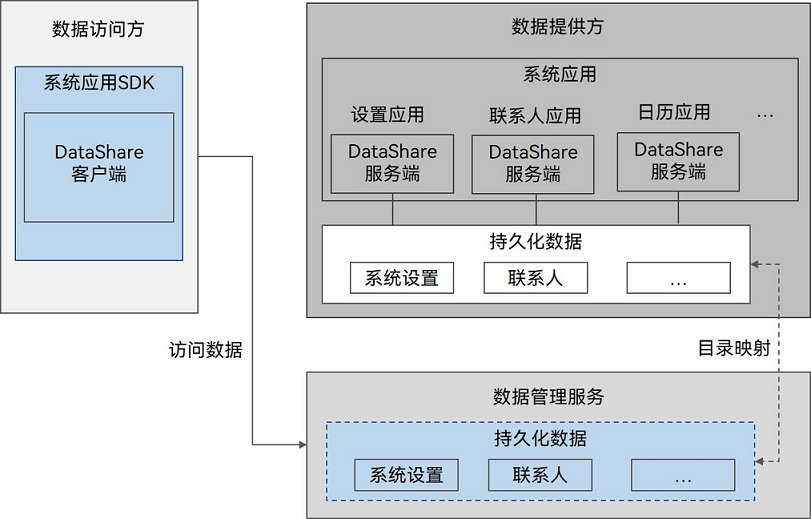

# 通过数据管理服务实现数据共享静默访问 (ArkTS)(仅对系统应用开放)


## 场景介绍

典型跨应用访问数据的用户场景下，数据提供方会存在多次被拉起的情况。

为了降低数据提供方拉起次数，提高访问速度，OpenHarmony提供了一种不拉起数据提供方直接访问数据库的方式，即静默数据访问。

静默数据访问通过数据管理服务进行数据的访问和修改，无需拉起数据提供方。

数据管理服务仅支持数据库的基本访问或数据托管，如果有业务处理，需要将业务处理封装成接口，给数据访问方调用。

如果业务过于复杂，无法放到数据访问方，建议通过[DataShareExtensionAbility](../reference/apis-arkdata/js-apis-application-dataShareExtensionAbility-sys.md)拉起数据提供方实现功能。


## 运作机制

可以通过数据管理服务进行代理访问的数据分为以下两种：

- 持久化数据：归属于数据提供方的数据库，这类数据存储于数据提供方的沙箱，可以在数据提供方中通过声明的方式进行共享，按表为粒度配置为可以被其他应用访问的数据表。


- 过程数据：托管在数据管理服务上的过程数据，这类数据存储于数据管理服务的沙箱，格式为json或byte数据，无人订阅10天后自动删除。


| 数据类型  | 存储位置      | 数据格式        | 有效期          | 适用场景                              |
| ----- | --------- | ----------- | ------------ | --------------------------------- |
| 持久化数据 | 数据提供方的沙箱  | 数据库中的数据表    | 永久存储         | 适用于数据格式类似关系型数据库的相关场景，如日程，会议等。      |
| 过程数据  | 数据管理服务的沙箱 | json或byte数据 | 无人订阅10天后自动删除 | 适用于数据有时效性且数据格式较简单的相关场景，如步数，天气，心率等。 |


图1 静默数据访问视图



- 与DataShareExtensionAbility跨应用数据共享方式不同，静默数据访问借助数据管理服务，通过目录映射方式直接读取数据提供方的配置，按规则预处理后访问数据库。

- 数据访问方的URI需严格按照如下格式：`datashareproxy://{bundleName}/{dataPath}`

  数据管理服务会读取对应bundleName作为数据提供方应用，读取配置，进行权限校验并访问对应数据。

  dataPath为数据标识，可以自行定义，在同一个数据提供方应用中需要保持唯一。

- URI还支持添加其他参数来设置具体的访问方式或访问对象，URI添加参数需严格遵循格式：`datashareproxy://{bundleName}/{dataPath}?{arg1}&{arg2}`，不符合规范的URI参数不生效。

  其中以"?"符号开始参数，以"&"符号连接参数，连续的多个符号会被视为一个。当前仅支持"appIndex"以及"user"参数。

  - "appIndex"仅支持设置为整型，表示应用包的分身索引，从1开始支持，仅在分身应用中生效。appIndex的定义及获取参照[BundleInfo](../reference/apis-ability-kit/js-apis-bundleManager-bundleInfo.md)。appIndex为0，或不填写时，访问数据提供者的应用本体。

    目前访问分身应用仅支持静默访问方式，不支持非静默访问方式。

  - "user"仅支持设置为整型，表示要访问的数据提供方的用户ID。user的定义及获取参照[user](../reference/apis-basic-services-kit/js-apis-osAccount.md#getactivatedosaccountlocalids9)。user不填写时，默认为数据访问方所在的用户ID。目前跨用户访问功能仅支持增删改查功能，订阅通知功能不支持跨用户。

    目前跨用户访问仅支持主空间和隐私空间之间的访问，且需要数据访问方配有跨用户访问权限ohos.permission.INTERACT_ACROSS_LOCAL_ACCOUNTS才可成功访问。

## 约束与限制

- 目前持久化数据中仅关系型数据库支持静默数据访问方式。
- 整个系统最多同时并发32路查询，有多出来的查询请求需要排队处理。
- 持久化数据不支持代理创建数据库，如果需要创建数据库，需要拉起数据提供方。
- 数据提供方如果是normal级别签名的应用，配置的数据读写权限必须为system_basic及以上权限。
- 调用静默访问接口（insert、delete、update或者query）时需遵循流量控制机制：每30秒为一个流控周期，若在该流控周期内调用对应接口的次数大于等于3000次，则该流控周期剩余时间内调用该接口均返回失败，到下一个流控周期重新开始计数，接口恢复正常。建议避免短时间高频调用接口，合理控制接口调用频率。


## 接口说明

以下是静默数据访问的相关接口，大部分为异步接口。异步接口均有callback和Promise两种返回形式，下表均以callback形式为例，更多接口及使用方式请见[数据共享](../reference/apis-arkdata/js-apis-data-dataShare-sys.md)。

### 通用接口

| 接口名称                                     | 描述                   |
| ---------------------------------------- | -------------------- |
| createDataShareHelper(context: Context, uri: string, options: DataShareHelperOptions, callback: AsyncCallback&lt;DataShareHelper&gt;): void | 创建DataShareHelper实例。 |

### 持久化数据

| 接口名称                                     | 描述                   |
| ---------------------------------------- | -------------------- |
| insert(uri: string, value: ValuesBucket, callback: AsyncCallback&lt;number&gt;): void | 向目标表中插入一行数据。         |
| delete(uri: string, predicates: dataSharePredicates.DataSharePredicates, callback: AsyncCallback&lt;number&gt;): void | 从数据库中删除一条或多条数据记录。    |
| query(uri: string, predicates: dataSharePredicates.DataSharePredicates, columns: Array&lt;string&gt;, callback: AsyncCallback&lt;DataShareResultSet&gt;): void | 查询数据库中的数据。           |
| update(uri: string, predicates: dataSharePredicates.DataSharePredicates, value: ValuesBucket, callback: AsyncCallback&lt;number&gt;): void | 更新数据库中的数据记录。         |
| addTemplate(uri: string, subscriberId: string, template: Template): void | 添加一个指定订阅者的数据模板。      |
| on(type: 'rdbDataChange', uris: Array&lt;string&gt;, templateId: TemplateId, callback: AsyncCallback&lt;RdbDataChangeNode&gt;): Array&lt;OperationResult&gt; | 订阅指定URI和模板对应的数据变更事件。 |

### 过程数据

| 接口名称                                     | 描述                 |
| ---------------------------------------- | ------------------ |
| publish(data: Array&lt;PublishedItem&gt;, bundleName: string, version: number, callback: AsyncCallback&lt;Array&lt;OperationResult&gt;&gt;): void | 发布数据，将数据托管至数据管理服务。 |
| on(type: 'publishedDataChange', uris: Array&lt;string&gt;, subscriberId: string, callback: AsyncCallback&lt;PublishedDataChangeNode&gt;): Array&lt;OperationResult&gt; | 订阅已发布数据的数据变更通知。    |

### 静默访问开关

适用于动态关闭/打开静默访问通道的场景。例如：升级过程中为了保证数据正确性可以动态关闭静默访问，升级结束后再调用相关接口打开静默访问。调用接口生成的开启关闭状态，设备重启之后会清除。只限于调用enableSilentProxy和disableSilentProxy接口设置的状态。支持静默访问开关能力的uri格式为`datashare:///{bundleName}/{moduleName}/{storeName}/{tableName}`，不满足格式要求的该功能不生效。

| 接口名称                                     | 描述                 |
| ---------------------------------------- | ------------------ |
| enableSilentProxy(context: Context, uri?: string): Promise&lt;void&gt; | 数据提供方动态开启静默访问。<br />当访问方通过静默访问调用DataShare相关接口的时候，校验静默访问的开关状态。<br />如果静默访问的是开启的，DataShare相关接口会执行原逻辑。 |
| disableSilentProxy(context: Context, uri?: string): Promise&lt;void&gt; | 数据提供方来动态关闭静默访问。<br />当访问方通过静默访问调用DataShare相关接口的时候，校验静默访问的开关状态。<br />如果静默访问的是关闭的，DataShare相关接口接口将会直接返回。 |

## 持久化数据实现说明

首先，以共享一个关系型数据库为例，说明开发步骤。

### 数据提供方应用的开发

1. 数据提供方需要在module.json5中的proxyData节点定义要共享的表的标识，读写权限和基本信息， 配置方法可参考[配置文件](../quick-start/module-configuration-file.md)。

   **表1** module.json5中proxyData节点对应的属性字段

   | 属性名称                    | 备注说明                                     | 必填   |
   | ----------------------- | ---------------------------------------- | ---- |
   | uri                     | 数据使用的URI，是跨应用数据访问的唯一标识。                  | 是    |
   | requiredReadPermission  | 标识从该数据代理读取数据时所需要的权限，不配置默认不允许其他APP访问数据。支持权限可参考[权限列表](../security/AccessToken/app-permissions.md)。<br>注意：当前静默访问的权限约束方式与DataShareExtensionAbility的权限约束方式不同，请注意区分，切勿混淆，具体可参考[DataShareExtensionAbility章节](share-data-by-datashareextensionability.md)。            | 否    |
   | requiredWritePermission | 标识从该数据代理修改数据时所需要的权限，不配置默认不允许其他APP修改数据。支持权限可参考[权限列表](../security/AccessToken/app-permissions.md)。<br>注意：当前静默访问的权限约束方式与DataShareExtensionAbility的权限约束方式不同，请注意区分，切勿混淆，具体可参考[DataShareExtensionAbility章节](share-data-by-datashareextensionability.md)。          | 否    |
   | metadata                | 数据源的信息，包含name和resource字段。<br /> name类型固定为"dataProperties"，是配置的唯一标识。 <br /> resource类型固定为"$profile:{fileName}"，表示配置文件的名称为{fileName}.json。 | 是    |

   一个URI所能访问的范围为一张数据表，因此请确认表中的所有数据适用相同的权限范围，推荐不同范围的数据分开使用多张表存储，配置各自的权限约束，做好表粒度的数据隔离。针对风险等级高的数据，建议配置白名单来限制数据访问方，具体请参考下方my_config.json示例中的allowLists字段。

   **module.json5配置样例：**

   ```json
   // 以下配置以settingsdata为例，应用需根据实际情况配置各个字段
   "proxyData": [
     {
       "uri": "datashareproxy://com.ohos.settingsdata/entry/settingsdata/USER_SETTINGSDATA_SECURE",
       // 实际请按照应用具体场景需要的安全权限配置，如配置应用自定义权限、系统权限或用户授权权限，当前权限仅为示例
       "requiredReadPermission": "ohos.permission.MANAGE_SECURE_SETTINGS",
       "requiredWritePermission": "ohos.permission.MANAGE_SECURE_SETTINGS",
       "metadata": {
         "name": "dataProperties",
         "resource": "$profile:my_config"
       }
     }
   ]
   ```
   **表2** my_config.json对应属性字段

   | 属性名称  | 备注说明                                     | 必填   |
   | ----- | ---------------------------------------- | ---- |
   | path  | 指定数据源路径，目前支持关系型数据库，配置为库名/表名。             | 是    |
   | type  | 标识数据库类型，目前支持配置为rdb，表示关系型数据库。             | 是    |
   | scope | 数据库所在范围。<br>1.module表示数据库位于本模块下。<br>2.application表示数据库位于本应用下。 | 否    |
   | allowLists          | 包括appIdentifier和onlyMain。<br>allowLists中配置被允许访问的应用列表，最多配置256个授权信息。在跨应用数据访问时通过该配置校验数据访问方是否在数据提供方配置的列表内，若不在则拒绝访问。若无allowLists配置则不做白名单校验。不管是否配置allowLists，在[表1](#数据提供方应用的开发)中的读写权限依然会被正常校验。<br>**-appIdentifier：** 字符串，应用的唯一标识，由云端统一分配。数据提供方自行向访问方获取。<br>appIdentifier信息可参考[应用包信息](../reference/apis-ability-kit/js-apis-bundleManager-bundleInfo.md#signatureinfo)。 <br>**-onlyMain：** 布尔值，控制是否仅支持主应用。true: 只允许主应用访问，分身应用不可访问。false: 主应用和分身应用均可访问。该功能仅支持静默访问。 | 否   |

   **my_config.json配置样例**

   ```json
   {
     "path": "DB00/TBL00",
     "type": "rdb",
     "scope": "application",
     "allowLists":[
           {"appIdentifier": "appIdentifier1", "onlyMain": false},
           {"appIdentifier": "appIdentifier2", "onlyMain": true}
     ]
   }
   ```

### 数据访问方应用的开发


1. 导入基础依赖包。

   ```ts
   import { dataShare, dataSharePredicates, ValuesBucket } from '@kit.ArkData';
   import { UIAbility } from '@kit.AbilityKit';
   import { window } from '@kit.ArkUI';
   import { BusinessError } from '@kit.BasicServicesKit'
   ```

2. 定义与数据提供方通信的URI字符串。

   ```ts
   let dseUri = ('datashareproxy://com.ohos.settingsdata/entry/settingsdata/USER_SETTINGSDATA_SECURE');
   ```

3. 使用createDataShareHelper()方法传入URI创建DataShareHelper对象。

   ```ts
   let dsHelper: dataShare.DataShareHelper | undefined = undefined;
   let abilityContext: Context;

   export default class EntryAbility extends UIAbility {
     onWindowStageCreate(windowStage: window.WindowStage) {
       abilityContext = this.context;
       dataShare.createDataShareHelper(abilityContext, dseUri, {
         isProxy: true
       }, (err, data) => {
         dsHelper = data;
       });
     }
   }
   ```

4. 获取到DataShareHelper对象后，便可利用其提供的接口访问提供方提供的服务，如使用insert()、delete()、update()或query()接口进行数据的增、删、改、查等。

   ```ts
   // 构建一条数据
   let key1 = 'name';
   let key2 = 'age';
   let key3 = 'isStudent';
   let key4 = 'Binary';
   let valueName1 = 'ZhangSan';
   let valueName2 = 'LiSi';
   let valueAge1 = 21;
   let valueAge2 = 18;
   let valueIsStudent1 = false;
   let valueIsStudent2 = true;
   let valueBinary = new Uint8Array([1, 2, 3]);
   let valuesBucket: ValuesBucket = { key1: valueName1, key2: valueAge1, key3: valueIsStudent1, key4: valueBinary };
   let updateBucket: ValuesBucket = { key1: valueName2, key2: valueAge2, key3: valueIsStudent2, key4: valueBinary };
   let predicates = new dataSharePredicates.DataSharePredicates();
   let valArray = ['*'];
   if (dsHelper != undefined) {
     // 插入一条数据
     (dsHelper as dataShare.DataShareHelper).insert(dseUri, valuesBucket, (err, data) => {
       console.info(`dsHelper insert result:${data}`);
     });
     // 更新数据
     (dsHelper as dataShare.DataShareHelper).update(dseUri, predicates, updateBucket, (err, data) => {
       console.info(`dsHelper update result:${data}`);
     });
     // 查询数据
     (dsHelper as dataShare.DataShareHelper).query(dseUri, predicates, valArray, (err, data) => {
       console.info(`dsHelper query result:${data}`);
     });
     // 删除指定的数据
     (dsHelper as dataShare.DataShareHelper).delete(dseUri, predicates, (err, data) => {
       console.info(`dsHelper delete result:${data}`);
     });
   }
   ```

5. 对指定的数据进行订阅。

   ```ts
   function onCallback(err: BusinessError, node: dataShare.RdbDataChangeNode) {
     console.info("uri " + JSON.stringify(node.uri));
     console.info("templateId " + JSON.stringify(node.templateId));
     console.info("data length " + node.data.length);
     for (let i = 0; i < node.data.length; i++) {
       console.info("data " + node.data[i]);
     }
   }

   let key21: string = "p1";
   let value21: string = "select * from TBL00";
   let key22: string = "p2";
   let value22: string = "select name from TBL00";
   let template: dataShare.Template = {
     predicates: {
       key21: value21,
       key22: value22,
     },
     scheduler: ""
   }
   if(dsHelper != undefined)
   {
     (dsHelper as dataShare.DataShareHelper).addTemplate(dseUri, "111", template);
   }
   let templateId: dataShare.TemplateId = {
     subscriberId: "111",
     bundleNameOfOwner: "com.ohos.settingsdata"
   }
   if(dsHelper != undefined) {
     // 使用数据管理服务修改数据时触发onCallback回调，回调内容是template中的规则查到的数据
     let result: Array<dataShare.OperationResult> = (dsHelper as dataShare.DataShareHelper).on("rdbDataChange", [dseUri], templateId, onCallback);
   }
   ```

## 过程数据实现说明

以托管一份过程数据为例，说明开发步骤。

### 数据提供方应用的开发（可选）

数据提供方需要在module.json5中的proxyData节点定义过程数据的标识，读写权限和基本信息， 配置方法可参考[配置文件](../quick-start/module-configuration-file.md)。

> 注意：
>
> - 该步骤可选。
> - 不配置proxyData时，托管数据不允许其他应用访问。

**表3** module.json5中proxyData节点对应的属性字段

| 属性名称                    | 备注说明                          | 必填   |
| ----------------------- | ----------------------------- | ---- |
| uri                     | 数据使用的URI，是跨应用数据访问的唯一标识。       | 是    |
| requiredReadPermission  | 标识从该数据代理读取数据时所需要的权限，不配置默认不允许其他APP访问数据。支持权限可参考[权限列表](../security/AccessToken/app-permissions.md)。<br>注意：当前静默访问的权限约束方式与[DataShareExtensionAbility](share-data-by-datashareextensionability.md)的权限约束方式不同，请注意区分，切勿混淆，具体可参考[DataShareExtensionAbility章节](share-data-by-datashareextensionability.md)。 | 否    |
| requiredWritePermission | 标识从该数据代理修改数据时所需要的权限，不配置默认不允许其他APP访问数据。支持权限可参考[权限列表](../security/AccessToken/app-permissions.md)。<br>注意：当前静默访问的权限约束方式与[DataShareExtensionAbility](share-data-by-datashareextensionability.md)的权限约束方式不同，请注意区分，切勿混淆，具体可参考[DataShareExtensionAbility章节](share-data-by-datashareextensionability.md)。 | 否    |

**module.json5配置样例：**

```json
// 以下配置仅为示例，应用需根据实际情况配置各个字段
"proxyData": [
  {
    "uri": "datashareproxy://com.acts.ohos.data.datasharetest/weather",
    // 实际请按照应用具体场景需要的安全权限配置，如配置应用自定义权限、系统权限或用户授权权限，当前权限仅为示例
    "requiredReadPermission": "ohos.permission.READ_WEATHER_DATA",
    "requiredWritePermission": "ohos.permission.KEEP_BACKGROUND_RUNNING"
  }
]
```

### 数据访问方应用的开发

1. 导入基础依赖包。

   ```ts
   import { dataShare } from '@kit.ArkData';
   import { UIAbility } from '@kit.AbilityKit';
   import { window } from '@kit.ArkUI';
   import { BusinessError } from '@kit.BasicServicesKit';
   ```

2. 定义与数据提供方通信的URI字符串。

   ```ts
   let dseUri = ('datashareproxy://com.acts.ohos.data.datasharetest/weather');
   ```

3. 创建工具接口类对象。

   ```ts
   let dsHelper: dataShare.DataShareHelper | undefined = undefined;
   let abilityContext: Context;

   export default class EntryAbility extends UIAbility {
     onWindowStageCreate(windowStage: window.WindowStage) {
       abilityContext = this.context;
       dataShare.createDataShareHelper(abilityContext, dseUri, {isProxy : true}, (err, data) => {
         dsHelper = data;
       });
     }
   }
   ```

4. 获取到接口类对象后，便可利用其提供的接口访问提供方提供的服务，如进行数据的增、删、改、查等。

   ```ts
   // 构建两条数据，第一条为免配置的数据，仅自己使用
   let data : Array<dataShare.PublishedItem> = [
     {key:"city", subscriberId:"11", data:"xian"},
     {key:"datashareproxy://com.acts.ohos.data.datasharetest/weather", subscriberId:"11", data:JSON.stringify("Qing")}];
   // 发布数据
   if (dsHelper != undefined) {
     let result: Array<dataShare.OperationResult> = await (dsHelper as dataShare.DataShareHelper).publish(data, "com.acts.ohos.data.datasharetestclient");
   }
   ```

5. 对指定的数据进行订阅。

   ```ts
   function onPublishCallback(err: BusinessError, node:dataShare.PublishedDataChangeNode) {
     console.info("onPublishCallback");
   }
   let uris:Array<string> = ["city", "datashareproxy://com.acts.ohos.data.datasharetest/weather"];
   if (dsHelper != undefined) {
     let result: Array<dataShare.OperationResult> = (dsHelper as dataShare.DataShareHelper).on("publishedDataChange", uris, "11", onPublishCallback);
   }
   ```

## 动态开关静默访问实现说明

动态开关静默访问只针对数据提供方。以动态开启静默访问为例，说明开发步骤。

### 数据提供方应用的开发

数据提供方调用接口以动态开启静默访问功能。此接口与data_share_config.json文件中isSilentProxyEnable字段配合使用。支持的配置可参考[data_share_config.json配置](./share-data-by-datashareextensionability.md)。

> 注意：
>
> - 该步骤为可选，可以不配置data_share_config.json文件中isSilentProxyEnable字段，默认值为true，表示开启静默访问功能。
> - 校验静默访问是否开启，会优先校验enableSilentProxy/disableSilentProxy接口设置的开关状态，其次会校验data_share_config.json文件中isSilentProxyEnable字段。
> - 不调用enableSilentProxy/disableSilentProxy接口时，优先会校验data_share_config.json文件中isSilentProxyEnable字段。
> - 不调用enableSilentProxy/disableSilentProxy接口，也不配置data_share_config.json文件中isSilentProxyEnable字段时，默认静默访问是开启的。

1. 导入基础依赖包。

   ```ts
   import { dataShare } from '@kit.ArkData';
   import { UIAbility } from '@kit.AbilityKit';
   import { window } from '@kit.ArkUI';
   ```

2. 定义与数据提供方通信的URI字符串。

   ```ts
   let dseUri = ('datashare:///com.ohos.settingsdata/entry/DB00/TBL00');
   ```

3. 创建工具接口类对象。

   ```ts
   let abilityContext: Context;
   
   export default class EntryAbility extends UIAbility {
     onWindowStageCreate(windowStage: window.WindowStage) {
       abilityContext = this.context;
       dataShare.enableSilentProxy(abilityContext, dseUri);
     }
   }
   ```

   
