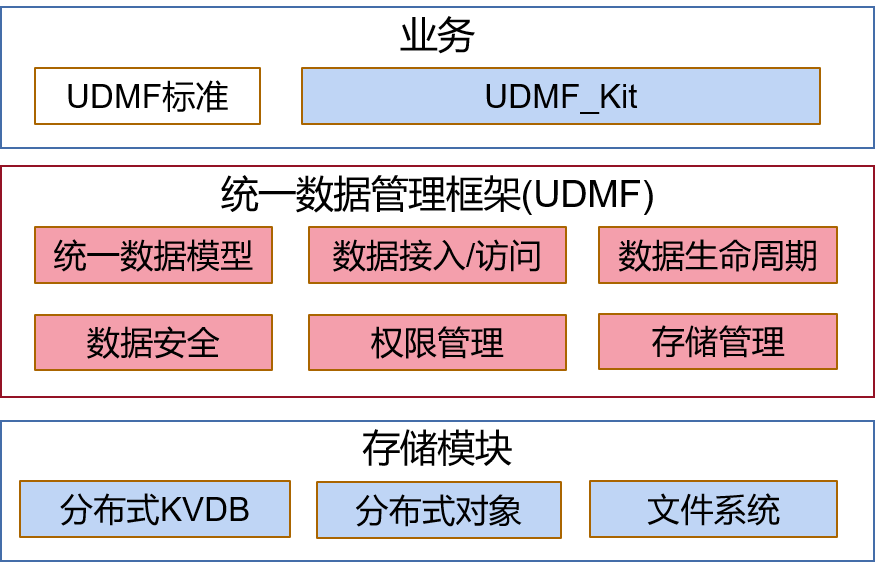

# 跨设备跨应用标准化数据通道概述

## 简介

依据OpenHarmony构建“面向全场景、全连接、全智能时代的分布式操作系统”的愿景，人与数字世界的交互将发生巨大的变化。传统的用户在单设备以应用为中心的交互方式，远远达不到万物互联全场景的体验要求，主要原因有以下几点：
1） 硬件设备是有边界的，用户在多个设备之间的交互体验是割裂的；
2） 服务以应用为载体，既无法打破应用边界，更无法打破设备间的边界；
3） 用户与服务过程中产生的数据被孤立在应用内、设备内，数据也是有边界的；
从数据管理角度出发，随着OpenHarmony中数据跨应用、跨设备流转场景和需求的不断增加，流转过程中会存在数据协同通道繁杂、数据协同标准不一致、数据协同安全策略不一致、应用适配复杂度高、开发工作量增多等诸多痛点问题。统一数据管理框架（Unified Data Management Framework, UDMF）旨在定义数据跨应用、跨设备以及跨平台过程中的各项标准，提供统一的标准化通道，从而打破OpenHarmony中数据交互的应用边界与设备边界，为用户提供全新的分布式数据体验。

## 架构介绍
UDMF提供统一的OpenHarmony数据语言和标准化的数据接入与读取通路。

**统一的OpenHarmony数据语言：** 构建OpenHarmony数据跨应用/设备交互的标准定义，降低应用/业务数据交互成本，促进数据生态建设。
**标准化的数据接入与读取通路：** 提供安全、标准化的数据通路，降低业务跨应用跨设备数据交互的成本。

UDMF的整体架构如图1所示，业务层对外提供标准化的数据定义和数据接入与读取的业务接口。统一数据管理框架层提供标准化数据定义和数据接入与读取的具体实现，同时负责管理数据的生命周期、安全性、权限和存储。存储模块层负责数据的具体保存，可以使用分布式KVDB、分布式数据对象和文件系统进行数据存储。

**图1** UDMF架构图

### 标准化数据定义

UDMF提供了标准化的数据定义，统一定义了以下几种不同的数据类型。

**基础数据类型：** File、Text等，能够进行跨应用、跨设备、跨平台流转。File、Text数据类型可见图2和图3，它们可以具有继承关系和层次结构，衍生出更多的具体子类型。

**图2** UDMF File数据类型示意图

**图3** UDMF Text数据类型示意图

**系统相关数据类型（System-Defined Type, SDT）:**与具体的平台/操作系统绑定，如Form（UI卡片信息）、AppItem（App描述信息）、PixelMap（缩略图格式）等，该类数据可以实现系统/平台内的跨应用与跨设备流转，如图4所示。
**图4** UDMF SDT数据类型示意图

**应用自定义数据类型（App-Defined Type, ADT）：**单个应用自己定义的数据，该类数据可以实现应用内的跨平台与跨设备流转，如图5所示为例，应用可自定义三角形类型。
**图5** UDMF ADT数据类型示意图

### 标准化数据通路

UDMF定义了标准化的数据接入与读取通路，为各种业务场景（如跨应用跨设备数据拖拽）提供了跨应用跨设备的数据接入与读取通路，通路中的数据URI定义为：udmf://intension/bundleName/groupName/guid，其中各组成部分的含义分别为：
**udmf:** 协议名，表示使用UDMF提供的数据通路；
**intension:** 通道分类，例如Drag(拖拽数据)，SuperHub(中转站)等；
**bundleName:** 数据来源应用的包名称；
**groupName:** 分组名称，支持批量数据分组管理；
**guid:** 系统生成的数据id，全局唯一性。

## 约束限制

- UDMF中每条数据记录大小不超过2MB。
- UDMF支持批量数据记录的分组管理，每个分组最多支持512条数据，整体大小不超过4MB。
