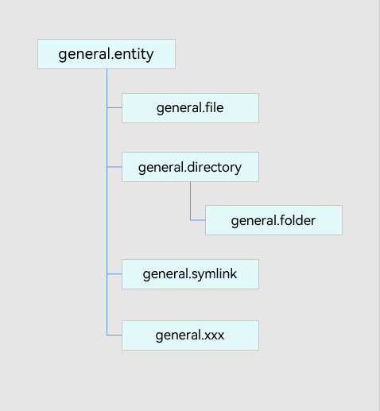
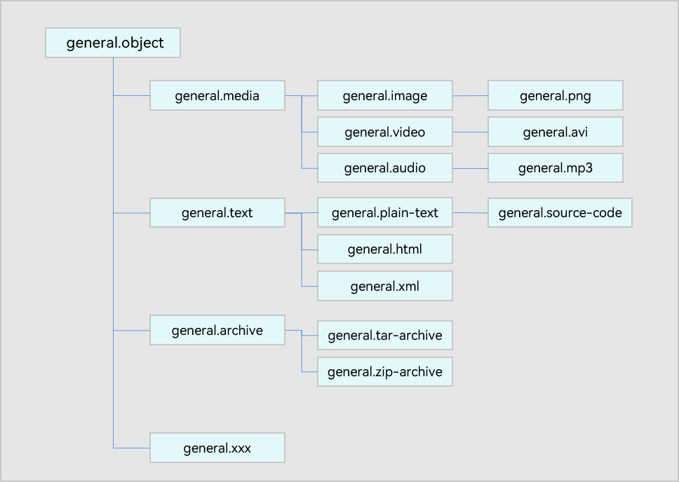

# 标准化数据类型


## 场景介绍

标准化数据类型（Uniform Type Descriptor，简称UTD）用于解决系统中的类型模糊问题，即针对同一种数据类型，存在不同的类型描述方式：MIME Type、文件扩展名等。例如描述jpg/jpeg类型图片时，可以使用image/jpeg、.jpg、.jpeg或image/picture等方式进行描述。

当相关类型的数据进行跨应用、跨设备传输时，目标端应用/设备需要进行多方面的适配，才能够对数据内容进行相关处理，且存在无法识别的情况。

标准化数据类型分为[预置数据类型](#预置数据类型)和[应用自定义数据类型](#应用自定义数据类型)。并且支持从其他类型体系，如文件名后缀和MIME type转换为UTD标准类型。

针对标准化数据类型，典型的应用场景有：文件管理中的图片预览、系统分享等。

## 标准化数据类型的设计和分类原则

### 标准化数据类型按层级结构构建

基于MIME Type或文件后缀名进行类型区分，存在另一个不足：即扁平化的数据类型定义。

扁平/松散的类型定义难以描述不同类型间的兼容与继承关系，且在实际使用过程中，会增加应用处理数据类型时的开发复杂度。例如搜索场景，用户从精确地搜索动物相关的任意类型图片，进一步扩展到动物相关的任意图片、视频或音频资源。为了满足上述场景，我们需要在定义数据类型时，支持类型层级结构。

构建标准类型的层级结构，定义层级结构中的类型归属关系，能够帮助系统、应用实现数据类型的分层、分类管理。当用户进行数据分享或拖拽时，如果数据中同时包含图片、视频、音频等内容，系统/应用可以根据层级按需对分享内容进行整理，如分享了几张图片、几条视频或几个媒体资源文件等。

### 标准化数据类型的分类原则

UTD中定义的标准化数据类型在设计原则上按物理和逻辑分为两类。OpenHarmony中预置了常用的标准化数据类型，详见[UTD预置列表](./uniform-data-type-list.md)。

- **按物理分类**的根节点为general.entity，用于描述类型的物理属性，比如文件、目录等，具体可见图1。

- **按逻辑分类**的根节点为general.object，用于描述类型的功能性特征，如图片、网页等，具体可见图2。

按照此分类原则，可以从两个维度对数据类型进行描述。如描述图片时，可以是一个图片对象，同时也可以是一个文件。

并非所有的格式都具有两个维度，如general.calendar，更多的注重calendar对象的功能性描述。

**图1** 物理标准化数据类型示意图



**图2** 逻辑标准化数据类型示意图



## 标准化数据类型的定义

标准化数据类型包含了标准化数据类型的标识ID、归属类型关系、简要描述等信息，具体可见[TypeDescriptor属性](../reference/apis-arkdata/js-apis-data-uniformTypeDescriptor.md#属性)，每个类型定义具体包含以下内容：

+ **typeId：** 定义标准化数据类型的ID，该ID具有唯一性。
+ **belongingToTypes：** 定义标准化数据类型的归属关系，即该标准化数据类型归属于哪个更高层级的类型，允许存在一个标准化数据类型归属于多个类型的情况。
+ **description：** 标准化数据类型的简要说明。
+ **referenceURL：** 标准化数据类型的参考链接URL，用于描述类型的详细信息。
+ **iconFile：** 标准化数据类型的默认图标文件路径，可能为空字符串（即没有默认图标），应用可以自行决定是否使用该默认图标。
+ **filenameExtensions：**  标准化数据类型所关联的文件名后缀列表。
+ **mimeTypes：** 标准化数据类型所关联的多用途互联网邮件扩展类型列表。

## 预置数据类型

基于常用的数据类型，预先定义了一部分标准数据类型描述符，即预置数据类型。如用于描述音频文件的“general.audio”，描述视频文件的“general.video”，更多预置数据类型参考[UTD预置列表](./uniform-data-type-list.md)。


## 应用自定义数据类型

由于预置标准数据类型无法穷举所有数据类型，在业务跨应用、跨设备交互过程中，会涉及到一些应用独有的数据类型，因此支持应用声明自定义数据类型。

应用自定义的数据类型可继承已有的标准类型，例如业务自定义的图片类型可以使用“com.company.x-image”作为自定义数据类型的标识。

开发者可以将自定义数据类型注册到系统中，这样其他业务在需要时可以引用，从而实现生态内各应用自定义数据类型的共享与统一。

### 工作原理

基于标准类型的层级结构，业务声明自己支持的数据类型标识符时，需要声明该类型标识符的层级逻辑，例如业务自定义图片类型UTD标识符“com.company.x-image”，并归属到general.image类中。UTD会检验自定义类型标识符，确保归属关系中不出现环状结构。

应用安装时，UTD会读取应用中自定义的数据类型进行安装。校验自定义类型数据符合约束条件后，应用自定义数据类型将被安装到设备中。应用启动后能正常读取到应用自定义的数据类型。如果引用其他应用定义的自定义数据类型，需要在应用开发时一并写入自定义数据类型配置文件中。

### 约束限制

针对自定义的类型描述各字段，有以下相关要求和限制：

+ **TypeId：** 定义标准化数据类型的ID，该ID具有唯一性，由应用bundleName + 具体类型名组成，不可缺省，允许包含数字、大小写字母、-和.。

+ **BelongingToTypes：** 定义标准化数据类型的归属关系，即该标准化数据类型归属于哪个更高层级的类型，所属类型可以为多个，但是必须为已存在的数据类型（标准化数据类型预置类型或其他新增自定义数据类型），不能为应用自定义类型本身，不能为空，且与现有标准化数据类型、其他新增自定义数据类型不能形成环形依赖结构。

+ **FilenameExtensions：** 应用自定义标准化数据类型所关联的文件后缀。可以缺省；可以为多个，每个后缀为以.开头且长度不超过127的字符串。

+ **MIMETypes：** 应用自定义标准化数据类型所关联的web消息数据类型。可以缺省；可以为多个，每个类型为长度不超过127的字符串。

+ **Description：** 应用自定义标准化数据类型的简要说明。可以缺省；填写时，长度为不超过255的字符串。

+ **ReferenceURL：** 应用自定义标准化数据类型的参考链接URL，用于描述类型的详细信息。可以缺省；填写时，长度为不超过255的字符串。


### 开发步骤

下面以新增媒体类文件类型场景为例，说明如何自定义UTD标准化数据类型。

1. 当前应用在entry\src\main\resources\rawfile\arkdata\utd\目录下新增utd.json5文件。

2. 在当前应用的utd.json5配置文件内新增所需的自定义数据类型。
   ```json
   {
        "UniformDataTypeDeclarations": [
            {
                "TypeId": "com.example.myFirstHap.image",
                "BelongingToTypes": ["general.image"],
                "FilenameExtensions": [".myImage", ".khImage"],
                "MIMETypes": ["application/myImage", "application/khImage"],
                "Description": "My Image.",
                "ReferenceURL": ""
            },
            {
                "TypeId": "com.example.myFirstHap.audio",
                "BelongingToTypes": ["general.audio"],
                "FilenameExtensions": [".myAudio", ".khAudio"],
                "MIMETypes": ["application/myAudio", "application/khAudio"],
                "Description": "My audio.",
                "ReferenceURL": ""
            },
            {
                "TypeId": "com.example.myFirstHap.video",
                "BelongingToTypes": ["general.video"],
                "FilenameExtensions": [".myVideo", ".khVideo"],
                "MIMETypes": ["application/myVideo", "application/khVideo"],
                "Description": "My video.",
                "ReferenceURL": ""
            }
        ]
   }
   ```

3. 如果其他应用要直接使用当前应用内的自定义数据类型，需要在其应用的entry\src\main\resources\rawfile\arkdata\utd\目录下新增utd.json5文件。

   然后在utd.json5配置文件中进行以下声明：

   ```json
   {
       "ReferenceUniformDataTypeDeclarations": [
            {
                "TypeId": "com.example.myFirstHap.image",
                "BelongingToTypes": ["general.image"],
                "FilenameExtensions": [".myImage", ".khImage"],
                "MIMETypes": ["application/myImage", "application/khImage"],
                "Description": "My Image.",
                "ReferenceURL": ""
            }
       ]
   }
   ```

4. 其他应用也可以在DevEco Studio中创建utd.json5模板，在模板中引用当前应用内的自定义数据类型之后，基于已引用的自定义数据类型进行自定义。同时，DevEco Studio还会对配置文件中的字段进行格式校验，utd.json5配置文件示例如下：

   ```json
   {
       "UniformDataTypeDeclarations": [
           {
               "TypeId": "com.example.mySecondHap.image",
               "BelongingToTypes": ["com.example.myFirstHap.image"],
               "FilenameExtensions": [".myImageEx", ".khImageEx"],
               "MIMETypes": ["application/my-ImageEx", "application/khImageEx"],
               "Description": "My Image extension.",
               "ReferenceURL": ""
           }
       ]
   }
   ```

## 接口说明

以下是UTD常用接口说明，对于预置数据类型和应用自定义数据类型同样适用，更多接口和详细说明，请见[ @ohos.data.uniformTypeDescriptor (标准化数据定义与描述)](../reference/apis-arkdata/js-apis-data-uniformTypeDescriptor.md)。

| 接口名称                                                     | 描述                                                         |
| ------------------------------------------------------------ | ------------------------------------------------------------ |
| UniformDataType                                              | 标准化数据类型的枚举定义。此处不再展开列举各枚举。 |
| belongsTo(type: string): boolean                             | 判断当前标准化数据类型是否归属于指定的标准化数据类型。       |
| isLowerLevelType(type: string): boolean                      | 判断当前标准化数据类型是否是指定标准化数据类型的低层级类型。 |
| isHigherLevelType(type: string): boolean                     | 判断当前标准化数据类型是否是指定标准化数据类型的高层级类型。 |
| getUniformDataTypeByFilenameExtension(filenameExtension: string, belongsTo?: string): string | 根据给定的文件后缀名和所归属的标准化数据类型查询标准化数据类型ID，若有多个符合条件的标准化数据类型ID，则返回第一个。 |
| getUniformDataTypeByMIMEType(mimeType: string, belongsTo?: string): string | 根据给定的MIME类型和所归属的标准化数据类型查询标准化数据类型ID，若有多个符合条件的标准化数据类型ID，则返回第一个。 |
| getUniformDataTypesByFilenameExtension(filenameExtension: string, belongsTo?: string): Array\<string> | 根据给定的文件后缀名和所归属的标准化数据类型查询标准化数据类型ID列表。 |
| getUniformDataTypesByMIMEType(mimeType: string, belongsTo?: string): Array\<string> | 根据给定的MIME类型和所归属的标准化数据类型查询标准化数据类型ID列表。 |

## 如何查询媒体类文件归属类型

下面以媒体类文件的归属类型查询场景为例，说明如何使用UTD。

1. 导入uniformTypeDescriptor模块。
2. 可根据 “.mp3” 文件扩展名查询对应UTD数据类型，并查询对应UTD数据类型的具体属性。
3. 可根据 “audio/mp3” MIMEType查询对应UTD数据类型，并查询对应UTD数据类型的具体属性。
4. 比较上述步骤查询的数据类型，确认类型是否相等。
5. 根据上述步骤中查询到的标准数据类型“general.mp3”与表示音频数据的已知标准数据类型“general.audio”做比较查询，确认是否存在归属关系。

```ts
// 1.导入模块
import { uniformTypeDescriptor } from '@kit.ArkData';

try {
  // 2.可根据 “.mp3” 文件后缀查询对应UTD数据类型，并查询对应UTD数据类型的具体属性
  let fileExtention = '.mp3';
  let typeId1 = uniformTypeDescriptor.getUniformDataTypeByFilenameExtension(fileExtention);
  let typeObj1 = uniformTypeDescriptor.getTypeDescriptor(typeId1);
  console.info('typeId:' + typeObj1.typeId);
  console.info('belongingToTypes:' + typeObj1.belongingToTypes);
  console.info('description:' + typeObj1.description);
  console.info('referenceURL:' + typeObj1.referenceURL);
  console.info('filenameExtensions:' + typeObj1.filenameExtensions);
  console.info('mimeTypes:' + typeObj1.mimeTypes);


  // 3.可根据 “audio/mp3” MIMEType查询对应UTD数据类型，并查询对应UTD数据类型的具体属性。
  let mineType = 'audio/mp3';
  let typeId2 = uniformTypeDescriptor.getUniformDataTypeByMIMEType(mineType);
  let typeObj2 = uniformTypeDescriptor.getTypeDescriptor(typeId2);
  console.info('typeId:' + typeObj2.typeId);
  console.info('belongingToTypes:' + typeObj2.belongingToTypes);
  console.info('description:' + typeObj2.description);
  console.info('filenameExtensions:' + typeObj2.filenameExtensions);
  console.info('mimeTypes:' + typeObj2.mimeTypes);


  // 4.将数据类型进行比较，确认是否同一种数据类型
  if (typeObj1 != null && typeObj2 != null) {
    let ret = typeObj1.equals(typeObj2);
    console.info('typeObj1 equals typeObj2, ret:' + ret);
  }

  // 5.将查询到的标准数据类型“general.mp3”与表示音频数据的已知标准数据类型“general.audio”做比较查询，确认是否存在归属关系。
  if (typeObj1 != null) {
    let ret = typeObj1.belongsTo('general.audio');
    console.info('belongsTo, ret:' + ret);
    let mediaTypeObj = uniformTypeDescriptor.getTypeDescriptor('general.media');
    ret = mediaTypeObj.isHigherLevelType('general.audio'); // 确认是否存在归属关系
    console.info('isHigherLevelType, ret:' + ret);
  }
} catch (err) {
  console.error('err message:' + err.message + ', err code:' + err.code);
}
```

## 如何通过文件后缀获取对应的MIMEType列表

下面以通过“.ts”文件后缀获取对应的MIMEType列表为例，说明如何通过文件后缀获取对应的MIMEType列表。

1. 导入uniformTypeDescriptor模块。
2. 可根据 “.ts” 文件后缀查询对应UTD数据类型。
3. 根据UTD数据类型查询对应的MIMEType列表。

```ts
// 1.导入模块
import { uniformTypeDescriptor } from '@kit.ArkData';
try {
  // 2.可根据 “.ts” 文件后缀查询对应UTD数据类型。
  let fileExtention = '.ts';
  let typeIds = uniformTypeDescriptor.getUniformDataTypesByFilenameExtension(fileExtention);
  for (let typeId of typeIds) {
    // 3.根据UTD数据类型查询对应的MIMEType列表。
    let typeObj = uniformTypeDescriptor.getTypeDescriptor(typeId);
    let mimeTypes = typeObj.mimeTypes;
    console.info('mimeTypes:' + mimeTypes);
  }
} catch (err) {
  console.error('err message:' + err.message + ', err code:' + err.code);
}
```
## 如何通过MIMEType获取对应的后缀列表

下面以通过“text/plain”MIMEType获取对应文件后缀列表为例，说明如何通过MIMEType获取对应的后缀列表。

1. 导入uniformTypeDescriptor模块。
2. 可根据 “text/plain” MIMEType查询对应UTD数据类型。
3. 根据UTD数据类型查询对应的MIMEType列表。

```ts
// 1.导入模块
import { uniformTypeDescriptor } from '@kit.ArkData';
try {
  // 2.可根据 “text/plain” MIMEType查询对应UTD数据类型。
  let mineType = 'text/plain';
  let typeIds = uniformTypeDescriptor.getUniformDataTypesByMIMEType(mineType);
  for (let typeId of typeIds) {
    // 3. 根据UTD数据类型查询对应的MIMEType列表
    let typeObj = uniformTypeDescriptor.getTypeDescriptor(typeId);
    let filenameExtensions = typeObj.filenameExtensions;
    console.info('filenameExtensions:' + filenameExtensions);
  }
} catch (err) {
  console.error('err message:' + err.message + ', err code:' + err.code);
}
```

## 相关实例

针对标准化数据定义的开发，有以下相关实例可供参考：

- [标准化数据定义与描述（ArkTS）（API11）](https://gitee.com/openharmony/applications_app_samples/tree/master/code/BasicFeature/DataManagement/UDMF/UniformTypeDescriptor/UTDType)
