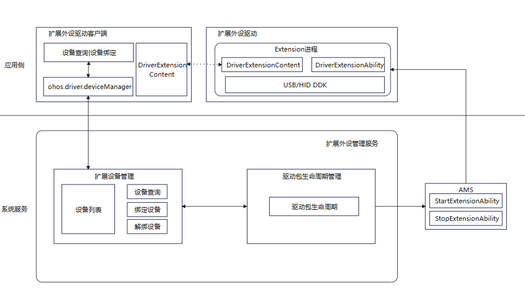
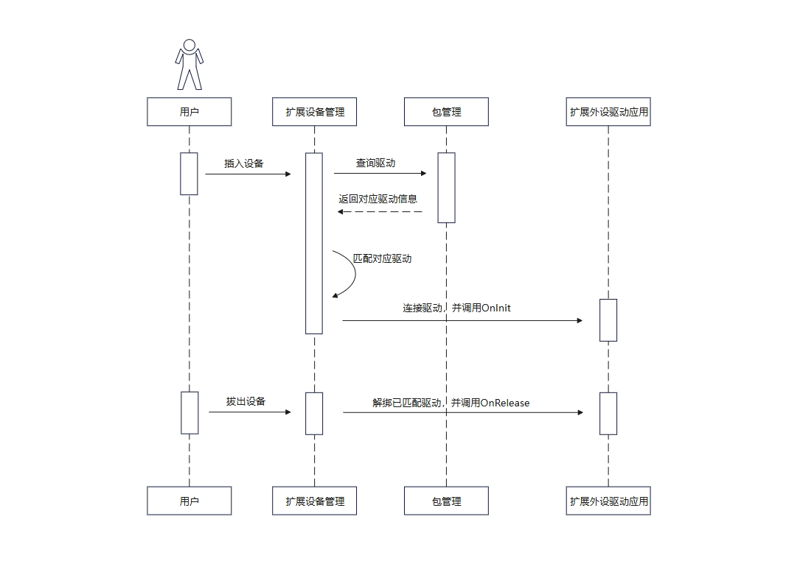
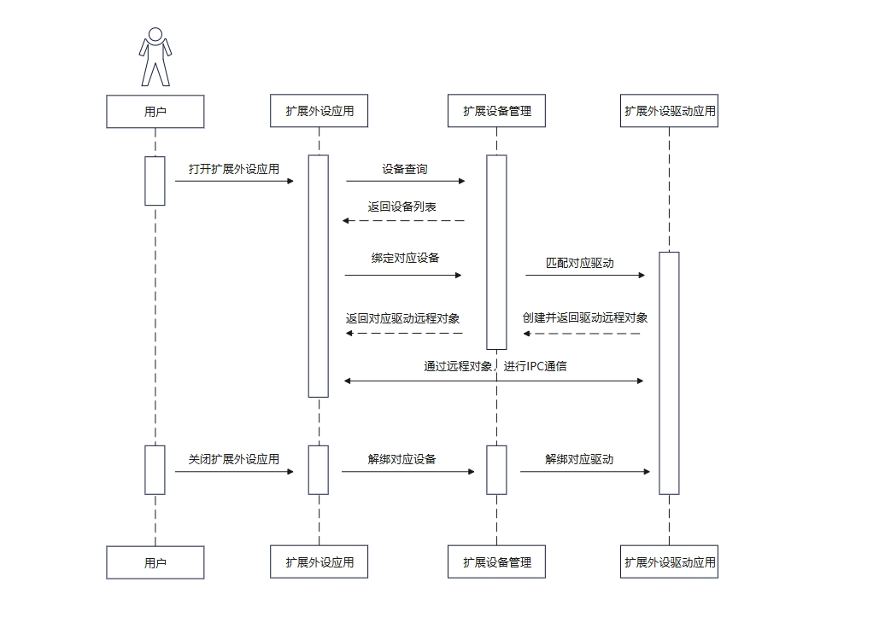

# Driver Development Kit简介

Driver Development Kit（驱动开发套件）为外设驱动开发者提供高效、安全、丰富的扩展外设驱动开发解决方案ArkTs-API和C-API，支持外设驱动开发者为消费者带来外设即插即用的极致体验。

## 使用场景

支持开发者高效、安全开发专业外设或扩展外设增强能力：

1. 面向专业专用办公外设驱动开发场景。

   例如：银行柜台、企业办公、医疗检测等领域专业专用外设，如：高拍仪、身份证扫描仪、指纹识别仪、血氧血糖监测设备。

2. 面向非标外设扩展增强能力开放场景。

   例如：厂商私有非标HID外设增强能力开放场景，如：手写板快捷键定制、压感/绘图区域设置、扩展增强能力设置、鼠标灯光效果设置、鼠标扩展按键定制、DPI及X/Y轴等高阶能力设置。

## 亮点特征

- 支持开发者开发外设配件的高阶功能，满足消费者高阶使用场景诉求。

- 扩展驱动框架支持扩展外设驱动生命周期管理，面向扩展设备应用提供扩展外设查询绑定能力接口。

## 基本概念

- 扩展外设驱动客户端：查询驱动并绑定驱动，自定义驱动与设备之间的通信方式以及数据处理方式等，即[带UI界面基础驱动](externaldevice-guidelines.md)。
- 扩展外设驱动：基于DDK能力开发的专业专用扩展外设驱动或扩展外设增强驱动，即[无UI界面基础驱动](driverextensionability.md)。
- 扩展外设管理服务（External Device Manager）：扩展设备管理，驱动包全生命周期管理等。
- BMS（Bundle Manager Service）：包管理服务，在OpenHarmony上主要负责应用的安装、卸载和数据管理。
- AMS（Ability Manager Service） ：元能力管理服务，用于拉起和关闭扩展驱动能力DriverExtensionAbility。

## 实现原理

HDF扩展驱动框架为扩展外设驱动开发，提供稳定统一的外设驱动开发接口，支撑用户态扩展外设驱动开发者基于DDK能力开发用户态扩展外设驱动。

扩展外设管理服务作为用户态扩展外设管理的核心服务，实现对扩展外部设备和扩展外设驱动的生命周期管理，同时面向扩展设备应用开发提供标准ArkTS API接口，支持扩展外设查询、绑定及解绑能力接口。

### 扩展外设驱动架构

  **图1** 扩展外设驱动原理图  

### 运作流程

用户插入外设时，外设与驱动的匹配流程如图2所示。

**图2** 非标外设与对应扩展外设驱动应用匹配的时序图

用户使用扩展外设驱动客户端时，扩展外设驱动客户端与扩展外设驱动的绑定流程如图3所示。

**图3** 扩展外设驱动客户端与扩展外设驱动绑定的时序图

## 约束与限制

调用Driver Development Kit提供的ArkTs-API或者C-API，开发者需要申请指定权限，才能使用相关接口。

所需权限如下：

| API 类型 | DDK类型 | 权限名称 |
| --------- | --------- | --------- |
| ArkTs-API | 不涉及 | ohos.permission.ACCESS_EXTENSIONAL_DEVICE_DRIVER |
| C-API     | USB DDK | ohos.permission.ACCESS_DDK_USB |
| C-API     | HID DDK | ohos.permission.ACCESS_DDK_HID |
| C-API     | USB Serial DDK | ohos.permission.ACCESS_DDK_USB_SERIAL |
| C-API     | SCSI Peripheral DDK | ohos.permission.ACCESS_DDK_SCSI_PERIPHERAL |

## 关联模块

在扩展外设驱动开发过程中，需要使用到其他关联模块的部分能力，来协助驱动开发。

| 名称 | 作用 | 
| --------- | --------- |
| PerformanceAnalysisKit | 引入{hilog}用于日志打印。| 
| BasicServicesKit       | 引入{BusinessError}用于捕获错误信息。 |
| IPCKit                 | 引入{rpc}用于驱动与客户端IPC（Inter-Process Communication）通信。|
| AbilityKit             | 引入{want}用于生命周期管理。|
