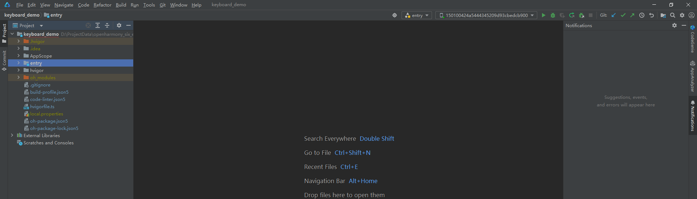

# 环境准备

## 开发工具及配置

DevEco Studio作为驱动开发工具，是进行驱动开发的必备条件之一，我们可以使用该工具进行开发、调试、打包等操作。请下载安装该工具，并参考DevEco Studio使用指南中的创建工程及运行进行基本的操作验证，保证DevEco Studio可正常运行。

请[下载安装](https://developer.huawei.com/consumer/cn/download/)该工具，并参考[DevEco Studio使用指南](https://developer.huawei.com/consumer/cn/doc/harmonyos-guides/ide-tools-overview)中的[创建工程及运行](https://developer.huawei.com/consumer/cn/doc/harmonyos-guides/ide-create-new-project)进行基本的操作验证，保证DevEco Studio可正常运行。

## SDK版本配置

扩展外设管理模块提供的ArkTs接口，所需SDK版本为API10及以上版本才可使用，更新SDK的具体操作可参见[更新指南](../../tools/openharmony_sdk_upgrade_assistant.md)。

基于DDK能力开发专业专用扩展外设驱动或扩展外设增强驱动时，对SDK版本的要求如下：

| NDK接口          | SDK版本    |
|----------------|----------|
| USB DDK        | API10及以上 |
| HID DDK        | API11及以上 |
| USB Serial DDK | API18及以上 |
| SCSI Peripheral DDK  | API18及以上 |

## 检验环境是否搭建成功

检查DevEco Studio是否已连接上OpenHarmony设备。

## HDC配置

HDC（HarmonyOS Device Connector）是为开发人员提供的用于调试的命令行工具，通过该工具可以在Windows/Linux/Mac系统上与真实设备或者模拟器进行交互，详细参考[HDC配置](https://developer.huawei.com/consumer/cn/doc/harmonyos-guides/hdc)。

**注意：** “配置环境变量hdc_server_port”和“全局环境变量”为必须操作。

## 开发设备
<!--RP1-->
- 当前开发调试及验证，以RK3568作为开发设备进行说明。关于RK3568的编译、烧录操作等方法，可参考[快速入门](../../../device-dev/quick-start/quickstart-pkg-3568-burn.md)。<!--RP1End-->
- 开发扩展外设驱动客户端和扩展外设驱动时，需要一个外接USB设备进行调试，**当前仅支持USB总线的外接设备**。
- 需要知道外接USB设备的ProductId和VendorId，用于定义驱动以及IPC通信。