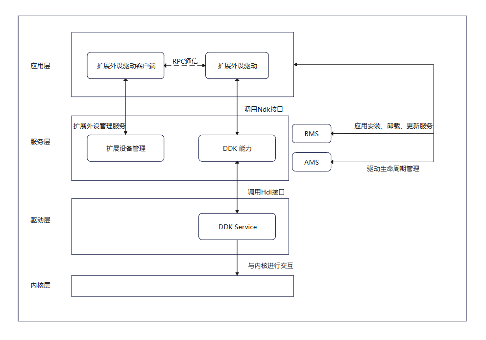

# 开发适用USB协议的设备驱动

## 简介

USB DDK（USB Driver Develop Kit）是为开发者提供的USB驱动程序开发套件，支持开发者基于用户态，在应用层开发USB设备驱动。提供了一系列主机侧访问设备的接口，包括主机侧打开和关闭接口、管道同步异步读写通信、控制传输、中断传输等。

凡是采用USB总线，通过USB协议传输数据的设备都可以使用USB DDK开发设备驱动。特别是内核标准驱动不支持的扩展外设，可以通过USB DDK开发的扩展外设驱动应用实现其独特的设备能力。

### 基本概念

在进行USB DDK开发前，开发者应了解以下基本概念：

- **USB**

  USB（Universal Serial Bus，通用串行总线）是一种广泛使用的接口技术，用于连接计算机与各种外部设备，如键盘、鼠标、打印机、存储设备、智能手机等。USB 的设计目标是提供一种标准化、高效且易于使用的连接方式，以替代传统的串行和并行接口。

- **DDK**

  DDK（Driver Develop Kit）是OpenHarmony基于扩展外设框架，为开发者提供的驱动应用开发的工具包，可针对非标USB串口设备，开发对应的驱动。

### 实现原理

非标外设应用通过扩展外设管理服务获取USB设备的ID，通过RPC将ID和要操作的动作下发给USB驱动应用，USB驱动应用通过调用USB DDK接口可获取设备描述符，配置描述符，以及发送控制传输，中断传输等请求，DDK接口使用HDI服务将指令下发至内核驱动，内核驱动使用指令与设备通信。

**图1** USB DDK调用原理



## 约束与限制

* USB DDK开放API支持USB接口非标外设扩展驱动开发场景。

* USB DDK开放API仅允许DriverExtensionAbilit生命周期内使用。

* 使用USB DDK开放API需要在module.json5中声明匹配的ACL权限，例如ohos.permission.ACCESS_DDK_USB。

## 环境搭建

请参考[环境准备](environmental-preparation.md)完成开发前的准备工作。

## 开发指导

### 接口说明

| 名称 | 描述 |
| -------- | -------- |
| OH_Usb_Init(void) | 初始化DDK。 |
| OH_Usb_Release(void) | 释放DDK。 |
| OH_Usb_GetDeviceDescriptor(uint64_t deviceId, struct UsbDeviceDescriptor *desc) | 获取设备描述符。 |
| OH_Usb_GetConfigDescriptor(uint64_t deviceId, uint8_t configIndex, struct UsbDdkConfigDescriptor **const config) | 获取配置描述符。请在描述符使用完后使用OH_Usb_FreeConfigDescriptor()释放描述符，否则会造成内存泄露。 |
| OH_Usb_FreeConfigDescriptor(const struct UsbDdkConfigDescriptor *const config) | 释放配置描述符，请在描述符使用完后释放描述符，否则会造成内存泄露。 |
| OH_Usb_ClaimInterface(uint64_t deviceId, uint8_t interfaceIndex, uint64_t *interfaceHandle) | 声明接口。 |
| OH_Usb_SelectInterfaceSetting(uint64_t interfaceHandle, uint8_t settingIndex) | 激活接口的备用设置。 |
| OH_Usb_GetCurrentInterfaceSetting(uint64_t interfaceHandle, uint8_t \*settingIndex) | 获取接口当前激活的备用设置。 |
| OH_Usb_SendControlReadRequest(uint64_t interfaceHandle, const struct UsbControlRequestSetup \*setup, uint32_t timeout, uint8_t \*data, uint32_t \*dataLen) | 发送控制读请求，该接口为同步接口。 |
| OH_Usb_SendControlWriteRequest(uint64_t interfaceHandle, const struct UsbControlRequestSetup \*setup, uint32_t, const uint8_t \*data, uint32_t dataLen) | 发送控制写请求，该接口为同步接口。 |
| OH_Usb_ReleaseInterface(uint64_t interfaceHandle) | 释放接口。 |
| OH_Usb_SendPipeRequest(const struct UsbRequestPipe *pipe, UsbDeviceMemMap *devMmap) | 发送管道请求，该接口为同步接口。中断传输和批量传输都使用该接口发送请求。 |
| OH_Usb_CreateDeviceMemMap(uint64_t deviceId, size_t size, UsbDeviceMemMap **devMmap) | 创建缓冲区。请在缓冲区使用完后，调用OH_Usb_DestroyDeviceMemMap()销毁缓冲区，否则会造成资源泄露。 |
| OH_Usb_DestroyDeviceMemMap(UsbDeviceMemMap *devMmap) | 销毁缓冲区。请在缓冲区使用完后及时销毁缓冲区，否则会造成资源泄露。 |
| OH_Usb_GetDevices(struct Usb_DeviceArray *devices) | 获取USB设备ID列表。请保证传入的指针参数是有效的，申请设备的数量不要超过128个，在使用完结构之后，释放成员内存，否则造成资源泄露。获取到的USB设备ID，已通过驱动配置信息中的vid进行筛选过滤。 |

详细的接口说明请参考[USB DDK](../../reference/apis-driverdevelopment-kit/_usb_ddk.md)。

### 开发步骤

以下步骤描述了如何使用 **USB DDK**开发USB驱动：

**添加动态链接库**

CMakeLists.txt中添加以下lib。
```txt
libusb_ndk.z.so
```

**头文件**
```c++
#include <usb/usb_ddk_api.h>
#include <usb/usb_ddk_types.h>
```

1. 获取设备描述符。

    使用 **usb_ddk_api.h** 的 **OH_Usb_Init** 接口初始化DDK，并使用 **OH_Usb_GetDeviceDescriptor**获取到设备描述符。

    ```c++
    // 初始化USB DDK
    OH_Usb_Init();
    struct UsbDeviceDescriptor devDesc;
    uint64_t deviceId = 0;
    // 获取设备描述符
    OH_Usb_GetDeviceDescriptor(deviceId, &devDesc);
    ```

2. 获取配置描述符及声明接口。
    
    使用 **usb_ddk_api.h** 的 **OH_Usb_GetConfigDescriptor** 接口获取配置描述符 **config**，并使用 OH_Usb_ClaimInterface 声明"认领"接口。

    ```c++
    struct UsbDdkConfigDescriptor *config = nullptr;
    // 获取配置描述符
    OH_Usb_GetConfigDescriptor(deviceId, 1, &config);
    // 根据配置描述符,找到所需要通信的interfaceIndex
    uint8_t interfaceIndex = 0;
    // 声明接口
    uint64_t interfaceHandle = 0;
    OH_Usb_ClaimInterface(deviceId, interfaceIndex, &interfaceHandle);
    // 释放配置描述符
    OH_Usb_FreeConfigDescriptor(config);
    ```
3. 获取当前激活接口的备用设置及激活备用设置。

    使用 **usb_ddk_api.h** 的 **OH_Usb_GetCurrentInterfaceSetting** 获取备用设置，并使用 **OH_Usb_SelectInterfaceSetting** 激活备用设置。

    ```c++
    uint8_t settingIndex = 0;
    // 接口获取备用设置
    OH_Usb_GetCurrentInterfaceSetting(interfaceHandle, &settingIndex);

    // 激活备用设置
    OH_Usb_SelectInterfaceSetting(interfaceHandle, &settingIndex);
    ```
4. 发送控制读请求、发送控制写请求。

    使用 **usb_ddk_api.h** 的**OH_Usb_SendControlReadRequest**发送控制读请求，或者使用**OH_Usb_SendControlWriteRequest**发送控制写请求。

    ```c++
        // 超时时间，设置为1s;
    uint32_t timeout = 1000;

    struct UsbControlRequestSetup setupRead;
    setupRead.bmRequestType	= 0x80;
    setupRead.bRequest = 0x08;
    setupRead.wValue = 0;
    setupRead.wIndex = 0;
    setupRead.wLength = 0x01;
    uint8_t dataRead[256] = {0};
    uint32_t dataReadLen = 256;
    // 发送控制读请求
    OH_Usb_SendControlReadRequest(interfaceHandle, &setupRead, timeout, dataRead, &dataReadLen);

    struct UsbControlRequestSetup setupWrite;
    setupWrite.bmRequestType = 0;
    setupWrite.bRequest = 0x09;
    setupWrite.wValue = 1;
    setupWrite.wIndex = 0;
    setupWrite.wLength = 0;
    uint8_t dataWrite[256] = {0};
    uint32_t dataWriteLen = 256;
    // 发送控制写请求
    OH_Usb_SendControlWriteRequest(interfaceHandle, &setupWrite, timeout, dataWrite, &dataWriteLen);
    ```

5. 创建内存映射缓冲区及发送请求。

    使用 **usb_ddk_api.h** 的**OH_Usb_CreateDeviceMemMap**接口创建内存映射缓冲区**devMmap**，并使用**OH_Usb_SendPipeRequest**发送请求。

    ```c++
    struct UsbDeviceMemMap *devMmap = nullptr;
    // 创建用于存放数据的缓冲区
    size_t bufferLen = 10;
    OH_Usb_CreateDeviceMemMap(deviceId, bufferLen, &devMmap);
    struct UsbRequestPipe pipe;
    pipe.interfaceHandle = interfaceHandle;
    // 根据配置描述符找到所要通信的端点
    pipe.endpoint = 128;
    pipe.timeout = UINT32_MAX;
    // 发送请求
    OH_Usb_SendPipeRequest(&pipe, devMmap);
    ```

6. 释放资源。

    在所有请求处理完毕，程序退出前，使用 **usb_ddk_api.h** 的 **OH_Usb_DestroyDeviceMemMap** 接口销毁缓冲区。使用**OH_Usb_ReleaseInterface**释放接口。使用**OH_Usb_Release**释放USB DDK。

    ```c++
    // 销毁缓冲区
    OH_Usb_DestroyDeviceMemMap(devMmap);
    // 释放接口
    OH_Usb_ReleaseInterface(interfaceHandle);
    // 释放USB DDK
    OH_Usb_Release();
    ```
7. （独立步骤，可选）获取可识别的USB设备列表。

    驱动拉起后调用**OH_Usb_GetDevices**接口获取驱动配置信息中匹配vid（vid是设备厂商的vendor id，在驱动应用里面配置，表示驱动适配哪些设备，查询到的设备ID都需要通过vid进行过滤）的设备ID，以供后续应用开发使用。

    ```c++
    OH_Usb_Init();
    constexpr size_t MAX_USB_DEVICE_NUM = 128;
    struct Usb_DeviceArray deviceArray;
    deviceArray.deviceIds = new uint64_t[MAX_USB_DEVICE_NUM];
    // 获取设备列表
    OH_Usb_GetDevices(&deviceArray);
    ```
