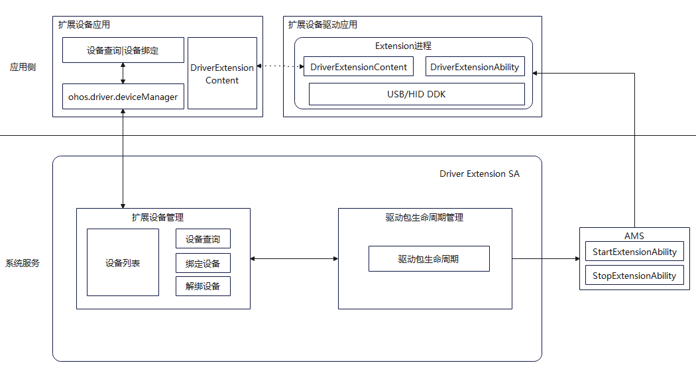

# Driver Development kit简介
Driver Development kit为开发者提供高效、安全、便捷的外设扩展驱动开发解决方案，为消费者带来即插即用的极致体验。

1. 支持开发者开发外设配件的高阶功能，满足消费者高阶使用场景诉求。

2. 扩展驱动框架支持外设扩展驱动生命周期管理，面向北向扩展设备应用提供扩展外设查询绑定能力接口。

## 使用场景
支持开发者高效、安全开发专业外设或外设扩展增强能力：

1. 面向专业专用办公外设驱动开发场景。

   例如：银行柜台、企业办公、医疗检测等领域专业专用外设，如：高拍仪、身份证扫描仪、指纹识别仪、血氧血糖监测设备。

2. 面向非标外设扩展增强能力开放场景。

   例如：厂商私有非标HID外设增强能力开放场景，如：手写板快捷键定制、压感/绘图区域设置、扩展增强能力设置、鼠标灯光效果设置、鼠标扩展按键定制、DPI及X/Y轴等高阶能力设置。

## 框架原理

HDF扩展驱动框架为外设扩展驱动开发提供稳定统一的外设驱动开发接口（HDF-DDK），支撑用户态外设扩展驱动开发者基于HDF-DDK开发用户态外设扩展驱动。

扩展外设管理服务作为用户态扩展外设管理的核心服务，实现对扩展外设和外设扩展驱动的生命周期管理，同时面向北向扩展设备应用开发提供标准ArkTS API接口支持扩展外设查询、绑定及解绑能力接口。

  **图1** 扩展外设驱动原理图  

- 扩展外设应用：查询驱动并绑定驱动，自定义驱动与设备之间特殊设置。
- 外设扩展驱动（应用）：借助外设驱动开发接口（HDF-DDK）开发的专业专用外设扩展驱动或外设扩展增强驱动。
- 扩展外设管理服务（Driver Extension SA）：扩展设备管理，驱动包全生命周期管理等。