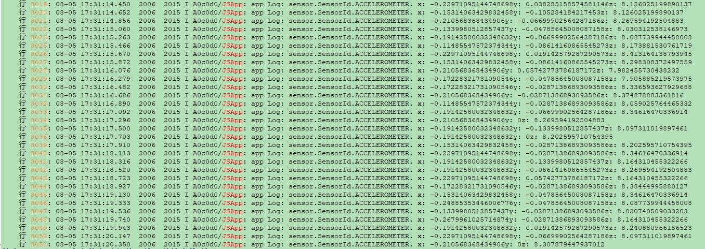
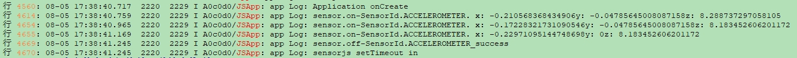
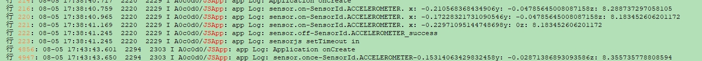

# 传感器开发指导


## 场景介绍

当设备需要获取传感器数据时，可以使用sensor模块，例如：通过订阅方向传感器数据感知用户设备当前的朝向，通过订阅计步传感器数据统计用户的步数等。

详细的接口介绍请参考[Sensor接口](../reference/apis/js-apis-sensor.md)。


## 接口说明

| 模块 | 接口名 | 描述 |
| -------- | -------- | -------- |
| ohos.sensor | sensor.on(sensorId, callback:AsyncCallback&lt;Response&gt;): void | 持续监听传感器数据变化 |
| ohos.sensor | sensor.once(sensorId, callback:AsyncCallback&lt;Response&gt;): void | 获取一次传感器数据变化 |
| ohos.sensor | sensor.off(sensorId, callback?:AsyncCallback&lt;void&gt;): void | 注销传感器数据的监听 |


## 开发步骤

1. 获取设备上传感器的数据前，需要检查是否已经配置请求相应的权限。 <br>
     系统提供的传感器权限有：
   - ohos.permission.ACCELEROMETER

   - ohos.permission.GYROSCOPE

   - ohos.permission.ACTIVITY_MOTION

   - ohos.permission.READ_HEALTH_DATA

   具体配置方式请参考[权限申请声明](../security/accesstoken-guidelines.md)。
   
2. 以下场景以加速度传感器ACCELEROMETER为例。展示持续监听传感器接口的调用结果。
  
   ```js
   import sensor from "@ohos.sensor";
   sensor.on(sensor.SensorId.ACCELEROMETER, function(data){
      console.info("Data obtained successfully. x: " + data.x + "y: " + data.y + "z: " + data.z);// 获取数据成功
   });
   ```
   
   
   

3. 注销传感器数据监听。
  
   ```js
   import sensor from "@ohos.sensor";
   sensor.off(sensor.SensorId.ACCELEROMETER);
   ```
   
   
   

4. 获取一次传感器数据变化。
  
   ```js
   import sensor from "@ohos.sensor";
   sensor.once(sensor.SensorId.ACCELEROMETER, function(data) {
      console.info("Data obtained successfully. x: " + data.x + "y: " + data.y + "z: " + data.z);// 获取数据成功
   });
   ```
   
   
   

   若接口调用不成功，建议使用try/catch语句捕获代码中可能出现的错误信息。例如：

    ```js
   import sensor from "@ohos.sensor";
    try {
      sensor.once(sensor.SensorId.ACCELEROMETER, function(data) {
          console.info("Data obtained successfully. x: " + data.x + "y: " + data.y + "z: " + data.z);// 获取数据成功
      });
    } catch (error) {
      console.error("Get sensor data error. data:" + error.data, " msg:", error.message);
    }
    ```
## 相关实例

针对传感器开发，有以下相关实例可供参考：

- [`Sensor`：传感器（ArkTS）（API8）](https://gitee.com/openharmony/applications_app_samples/tree/master/device/Sensor)