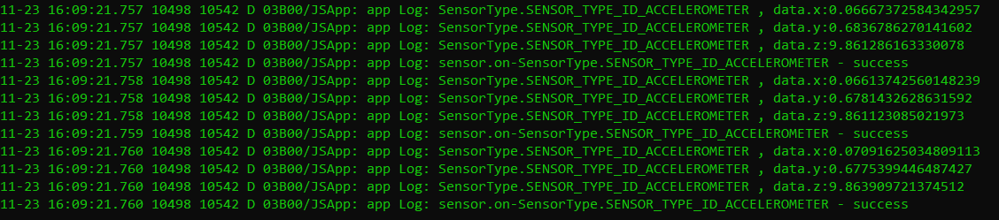
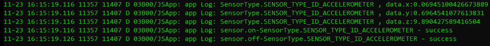

# 传感器开发指导


## 场景介绍

- 通过指南针传感器数据，感知用户设备当前的朝向，从而达到为用户指明方向的目的。

- 通过接近光传感器数据，感知距离遮挡物的距离，使设备能够自动亮灭屏，达到防误触目的。

- 通过气压计传感器数据，准确的判断设备当前所处的海拔。

- 通过环境光传感器数据，设备能够实现背光自动调节。

- 通过霍尔传感器数据，设备实现皮套功能等。

- 通过心率传感器数据，感知用户当前的心率。

- 通过计步传感器数据，可以统计用户的步数。

- 通过佩戴检测传感器，可以检测用户是否佩戴。


## 接口说明

| 模块 | 接口名 | 描述 |
| -------- | -------- | -------- |
| ohos.sensor | sensor.on(sensorType, callback:AsyncCallback&lt;Response&gt;): void | 持续监听传感器数据变化 |
| ohos.sensor | sensor.once(sensorType, callback:AsyncCallback&lt;Response&gt;): void | 获取一次传感器数据变化 |
| ohos.sensor | sensor.off(sensorType, callback:AsyncCallback&lt;void&gt;): void | 注销传感器数据的监听 |


## 开发步骤

1. 获取设备上传感器的数据，需要在“config.json”里面进行配置请求权限。具体如下：
  
   ```
   "reqPermissions": [
      {
        "name": "ohos.permission.ACCELEROMETER",
        "reason": "",
        "usedScene": {
          "ability": [
            "sensor.index.MainAbility",
            ".MainAbility"
          ],
          "when": "inuse"
        }
      },
      {
        "name": "ohos.permission.GYROSCOPE",
        "reason": "",
        "usedScene": {
          "ability": [
            "sensor.index.MainAbility",
            ".MainAbility"
          ],
          "when": "inuse"
        }
      },
      {
        "name": "ohos.permission.ACTIVITY_MOTION",
        "reason": "ACTIVITY_MOTION_TEST",
        "usedScene": {
          "ability": [
            "sensor.index.MainAbility",
            ".MainAbility"
          ],
          "when": "inuse"
        }
      },
      {
        "name": "ohos.permission.READ_HEALTH_DATA",
        "reason": "HEALTH_DATA_TEST",
        "usedScene": {
          "ability": [
            "sensor.index.MainAbility",
            ".MainAbility"
          ],
          "when": "inuse"
        }
      }
    ]
   ```
   
2. 持续监听传感器数据变化。
  
   ```
   import sensor from "@ohos.sensor"
   sensor.on(sensor.sensorType.SENSOR_TYPE_ACCELEROMETER,function(data){
          console.info("Subscription succeeded. data = " + data);//调用成功，打印对应传感器的数据
     }
   );
   ```
   
   以SensorType为SENSOR_TYPE_ID_ACCELEROMETER为例展示运行结果，持续监听传感器接口的结果如下图所示：
   
   

3. 注销传感器数据监听。
  
   ```
   import sensor from "@ohos.sensor"
   sensor.off(sensor.sensorType.SENSOR_TYPE_ACCELEROMETER,function() {
       console.info("Succeeded in unsubscribing from acceleration sensor data.");//注销成功，返回打印结果
     }
   );
   ```
   
   以SensorType为SENSOR_TYPE_ID_ACCELEROMETER为例展示运行结果，注销传感器成功结果如下图所示：
   
   

4. 获取一次传感器数据变化。
  
   ```
   import sensor from "@ohos.sensor"
   sensor.once(sensor.sensorType.SENSOR_TYPE_ACCELEROMETER,function(data) {
           console.info("Data obtained successfully. data=" + data);//获取数据成功，打印对应传感器的数据
     }
   );
   ```
   
   以SensorType为SENSOR_TYPE_ID_ACCELEROMETER为例展示运行结果，获取数据成功日志如下图所示：
   
   

   若接口调用不成功，建议使用try/catch语句捕获代码中可能出现的错误信息。例如：

    ```
    try {
      sensor.once(sensor.sensorType.SENSOR_TYPE_ACCELEROMETER,function(data) {
          console.info("Data obtained successfully. data=" + data);//获取数据成功，打印对应传感器的数据
      });
    } catch (error) {
      console.error(error);
    }
    ```
## 相关实例

针对传感器开发，有以下相关实例可供参考：

- [`Sensor`：传感器（eTS）（API8）](https://gitee.com/openharmony/app_samples/tree/master/device/Sensor)